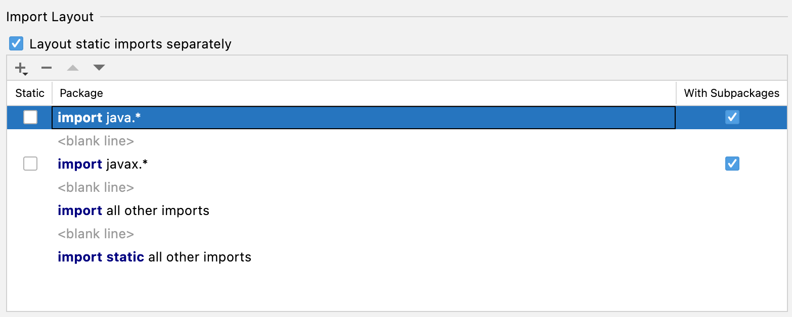

# IntelliJ

## Basic Setup

## Code Style

### Java Imports

#### Never Use Wildcard Imports

We want imports to be explicit and complete. For this reason, we avoid wildcard imports such as 

```import java.util.*;```

Go to _Preferences → Editor → Code Style → Java_ and select the tab _Imports_ in the content area.

Check the field _Use single class import_ and set the _Class count to use import with '*'_ to 9999.
Also set _Names count to use static import with '*'_ to 9999:

{ class="lightbox lightbox-xl" title="No IntelliJ Wildcard Imports" }

If we now tell IntelliJ to
_Optimize Imports_, IntelliJ will never replace imports of classes from the same package
with a wildcard.

#### Import Layout

We want all Java source files to have sorted imports such that **java** imports appear on top, 
followed by **javax** classes and all other classes.

Go to _Preferences → Editor → Code Style → Java_ and select the tab _Imports_ in the content area.

Scroll down to _Import Layout_. Use the up and down arrows to arrange the imports, resulting in
the following layout:

{ class="lightbox lightbox-xl" title="IntelliJ Import Layout" }

With this setting, imports of the **java** packages are on top, followed by the **javax** classes and all 
other classes.
