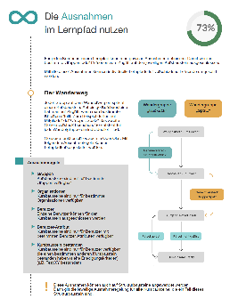

# Tips and tricks for authors

We use the Material theme for MkDocs. For a complete reference and inspiration please consult:

:fontawesome-regular-hand-point-right: [Material for MkDocs Reference](https://squidfunk.github.io/mkdocs-material/reference/) :fontawesome-regular-hand-point-left:

The following are a list of things we use commonly: 

## Admonitions
!!! tip
    This is an admonition

See the list of [supported types / icons and styles](https://squidfunk.github.io/mkdocs-material/reference/admonitions/#supported-types)

### Details

Details are the same as admonitions but expandable / collapsable. Use Just use ??? for initially collapsed and ???+ for initially opened details. Use the same image classes as with the admonitions

??? info
    Also available as collapsable items. Just use ??? instead of !!!

See [the pymdown extension page](https://facelessuser.github.io/pymdown-extensions/extensions/details/) to learn how this works in detail. 

***

## Links

Links to other pages from the manual are written as relative links to the corresponding Markdown file. Make sure you reference the correct language! Just review other pages, you will find many examples. 

=== "Markup"
		[External link to frentix.com](https://www.frentix.com)

		[Internal link to the group section](../../manual_user/groups/Using_Group_Tools.md)

=== "Output"	
	[External link to frentix.com](https://www.frentix.com)

	[Internal link to the group section](../../manual_user/groups/Using_Group_Tools.md)

### In-Page references Just use

Add `{: #anchor-example}` to any title element to create an anchor that can be referenced by other pages or in an external link. Make sure you use the same anchor name for all languages of the same page. 
 
=== "Markup"
		[Link to the tables section in this page](#tables)
	
		[Link to the courses section in a different page](../../manual_user/groups/Group_Administration.md#courses) 

=== "Output"	
	[Link to the tables section in this page](#tables)

	[Link to the courses section in a different page](../../manual_user/groups/Group_Administration.md#courses) 
 
 
### Downloads

Downloadable files such as PDF can be written as standard Markdown link. Some JS code will automatically add a target to open the file in a new window instead of replacing the current page. 
Supported types are `pdf, odt, xlsx, docx`.

If the download is represented with an image, the image tag can be embedded into the link tag. This is a bit cumbersome, but works well. See the example below

=== "Markup"
		[{ class="thumbnail-xl border"} whitepaper_learning_path_courses_en_final.pdf](assets/whitepaper_learning_path_courses_en_final.pdf)

=== "Output"	
	[{ class="thumbnail-xl border"} whitepaper_learning_path_courses_en_final.pdf](assets/whitepaper_learning_path_courses_en_final.pdf)

***

## Images

Image styles and css classes can be added to the image markup like this: 

=== "Markup"
		{ width=100px align=right class="border shadow" }

=== "Output"
	{ width=100px align=right class="border shadow" }

!!! important
	The following notation to add special parameters to images is extremely sensitive to whitespace! Make sure
		1. between the image markup und the left curly bracket is **no space**
		2. after the left opening curly bracket and before the closing right curly bracket there is **one space** 
	Otherwise the image styles will not be applied. 

### Width and alignment

Add `{ align=left }` or `{ align=right }` to format images left or right of text. More on this [here](https://squidfunk.github.io/mkdocs-material/reference/images/)

Add `{ width=200px}` for a custom size. This can also be combiend like this: `{ align=left width=200px }`. Use custom width only if needed, if possible use the [standard sizes](#sizes) using the predefined CSS classes. 

### Sizes

There are some predefined image sizes that can be applied by assigning CSS classes. Use technique preferably over manually adding width or height: 

| CSS class | Description | Example |
| --------- | ----------- | ------- |
| `size16` | shrink to match 16x16px | { class=size16 } |
| `size24` | shrink to match 24x24px | { class=size24 } |
| `size32` | shrink to match 32x32px | { class=size32 } |
| `size48` | shrink to match 48x48px | { class=size48 } |
| `size64` | shrink to match 64x64px | { class=size64 } |
| `thumbnail-sm` | shrink to fit 150x100px | { class=thumbnail-sm } |
| `thumbnail` | shrink to fit 250x150px | { class=thumbnail } |
| `thumbnail-lg` | shrink to fit 300x200px | { class=thumbnail-lg } |
| `thumbnail-xl` | shrink to fit 400x300px | { class=thumbnail-xl } |

### Styles

The following box styles are available

| CSS class | Description | Example |
| --------- | ----------- | ------- |
| `shadow` | image with shadow | { class="size64 shadow" } |
| `border` | image with border | { class="size64 border" } |

### Captions and figures

Images can be converted to figures with captions by adding an image title attribute with `title="some caption here`. See the example below:

=== "Markup"
		{ class=thumbnail-xl title="A great OpenOlat screenshot" }

=== "Output"	
	{ class=thumbnail-xl title="Keep smiling :-)" }

!!! info
	Note that the **alt text** is an accessibility feature to describe the content of the image for users who can not see the picture while the **title / caption** is an additional text that conceptually explains or gives more insights about the meaning of the image. 

### Lightbox

Use the `lightbox` CSS class to enable the lightbox on an image. This makes the image clickable and enlargable. It is useful to use this in combination with the thumbnail styles: 

=== "Markup"
		{ width=30px align=right class="thumbnail lightbox" }

=== "Output"	
	{ class="thumbnail lightbox" }

***

## Tables {: #tables}

Tables are cumbersome and error prone: 
- Tables need a header row and a separator in the second line
- A row must be on one line, no line breaks allowed
- cells can contain images, code block, foot notes etc, it is trial-and-error

See the [manual](https://squidfunk.github.io/mkdocs-material/reference/data-tables/) for more info.

=== "Markup"
		| CSS class | Description | Example |
		| --------- | ----------- | ------- |
		| `shadow` | image with shadow | { class="size64 shadow" } |
		| `border` | image with border | { class="size64 border" } |
	
=== "Output"
	| CSS class | Description | Example |
	| --------- | ----------- | ------- |
	| `shadow` | image with shadow | { class="size64 shadow" } |
	| `border` | image with border | { class="size64 border" } |
	

As an example have a look at the table in the OpenOlat [group section](../../../manual_user/groups/Using_Group_Tools/)