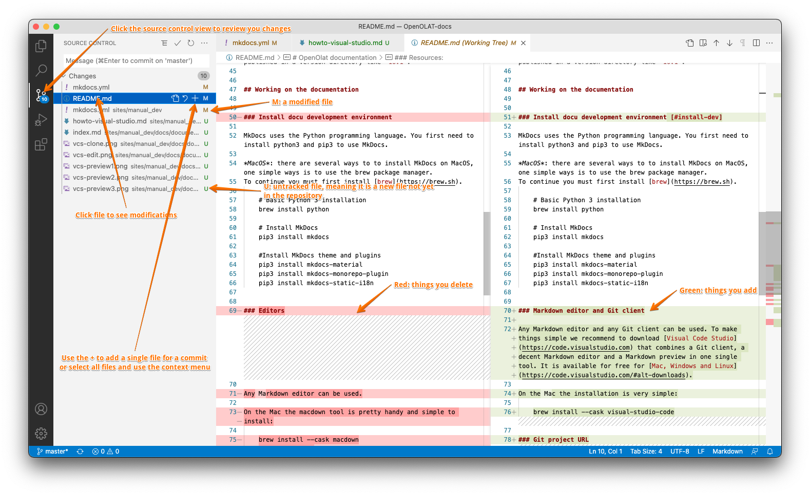

# Working with Visual Studio Code

## Setup

Follow the steps below to checkout and work on the OpenOlat documentation using Visual Studio Code for non-techies. To learn more about the structure and how to test and compile the documentation please refere to [documentation README](index.md).

Make sure you [installed the development environment](index.md#install-dev-envir) first. 

### 1) Install Visual Code Studio 

Download and install the software from the [Visual Code Studio website](https://code.visualstudio.com). It is available for free for [Mac, Windows and Linux](https://code.visualstudio.com/#alt-downloads).

On the Mac the installation is very simple:

	brew install --cask visual-studio-code

### 2) Clone the OpenOlat-docs repository

The public repository is available at the following Git URL: 

	https://github.com/OpenOLAT/OpenOLAT-docs.git

{ class="thumbnail-xl lightbox" title="Clone the OpenOlat-docs Repository" }

!!! note
	The repository at GitHub is a _read-only_ repository. If you are frentix staff and want to modify the repo, please ask for our interal Git Repo. Ask the Sys-Admin staff how to generate an SSH key to access the repository. 

## Modifying pages

### 1) Open a page for editing

Use the project explorer to find the page you want to edit. 

{ class="thumbnail-xl lightbox" title="The VCS project explorer" }

!!! tip
	It is best to edit the different language versions at the same time. Additional languages of pages have the same page name and the language code in the file ending. E.g. `index.md` for the English page and `index.de.md` for the German version. 

### 2) Open a local preview

There are two ways of using the Visual Studio Code preview feature: 
1. 	Side-by-Side
2. 	In separate tab

Choose which fits better to your workflow / screen size

#### Preview Side-by-Side

{ class="thumbnail-xl lightbox" }

{ class="thumbnail-xl lightbox" title="The side-by-side preview helps writing Markdown for novices" }

#### Preview in separate tab

{ class="thumbnail-xl lightbox" title="Use the preview in a separate window if you have a small screen" }

## Push changes to the repository

### 1) Review changes before pushing

#### Pull changes from the server

It is important to always pull changes from the server before you start the 

{ class="thumbnail-xl lightbox" title="Pulling remote changes to your local repository" }

!!! important
	Please, always pull before you stage, commit or push stuff. This is important to reduce the problems of conflicts. 

#### Review the changes you made

Review every file you changed. Always. You can always go back to the editor or [revert](#revert) your changes. 

{ class="thumbnail-xl lightbox" title="Review your changes before you submit" }

!!! attention
	Carefully review all your changes and test them with `python3 -m mkdocs serve` with your browser before you commit and push your changes! You need write permissions on the repository for beeing able to push. 

### 2) Stage and commit your changes

Next step is to prepare your canges for the repository. This is done by staging and then commiting the changes to your local repository clone. At this point everything is still local on your computer and not on the server. 

#### Stage 

{ class="thumbnail-xl lightbox" title="Almost done, staging you changes prepares for the commit" }

#### Commit

Next is to commit the staged changes to you local repository

{ class="thumbnail-xl lightbox" }

{ class="thumbnail-xl lightbox" title="Committing changes to your local repository" }

!!! hint
	Add a meaningfull message that helps other team members to understand the scope of your change. If the change is about an OpenOlat issue, add the issue to the message. Example: 
	`OO-5897 Adding more screnshots to Visual-Studio-Code howto`

### 3) Sync and push the changes to the server

You are ready to go now. One last step is to sync and push your changes. 

{ class="thumbnail-xl lightbox" title="Pushing your changes will send the changes to the server so everybody else can pull them to their local repository" }

### Help: I have a conflict!

Ask your tech staff for help to fix this. 

### Help: Revert and go back {: #revert}

You can always revert your changes and go back to the last version from the server

{ class="thumbnail-xl lightbox" title="Reverting changes that you don't want to push to the server" }