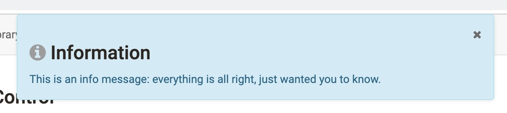
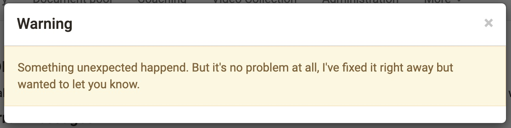
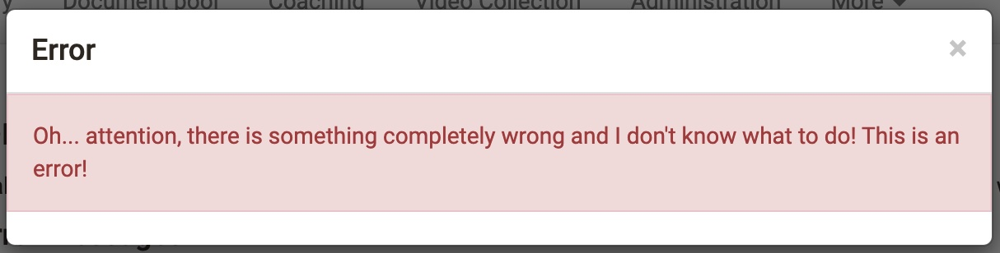
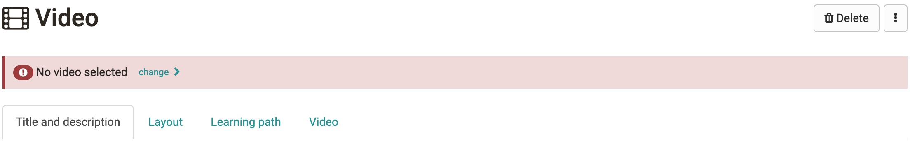

# Notification

An Notification is a system generated, contextual, and timely message to a user that ,in most cases, results from their action.

Structure

1. Container: Wraps the content.
2. Icon: Supports the variant meaning.
    * error icon for error and danger Notifications.
    * warning icon for the warning Notification.
    * info icon for information Notification.
    * checkmark icon for success Notification.
8. Title (optional): Conveys what event triggered the Notification.
9. Dismissal (optional): Permanently removes the Notification for a user.
10. Message: Text content indicating the purpose and potential next steps.

## Types

* Info Message
* Warning Message

* Error Message

## Variants

### Inline Notifications

Inline Notifications are info messages, who we want the user to read, before taking an action. Today they are not dismissible in general.

### Actionable Notifications

## Guidelines / Usage

### When to use

Advise the user that they should be aware of, or address something related to their current context.
Reaffirm to the user that an done action has been successful.
Educate the user about new or unused feature, or information related to their current context.

### When _not_ to use

If you are immediately confirming a user's action while they remain in the same view, use a form confirmation instead.
For a message at an instance level message from an admin to all users, use a maintenance message.

### Placement

**Global level**
Impacts the entire experience, is full-width, and is placed directly below the main navigation bar. 

**Page level**
Appears at the top of a page, directly below the navigation bar and above the breadcrumbs, and restricted to the content container width which can be either fixed or fluid, depending on user’s preference.

**In Page**
Within a section of the page when the message is specific to that content for example that learning ressource.

