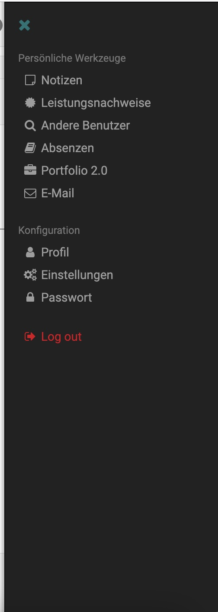

# Navigation

## Main Menu / Top Menu

The top menu refers to the top horizontal navigation. The items in the top menu include a list of pages that allow you to view global content throughout OpenOLAT. For Example Courses, groups, authoring, quality management.

## right Sidebar

{class="thumbnail-xl"}

Only visible as personal menu with links to personal tools and to the profile and settings. It's also only possible to log out here.

## secondary Menu / Segmented menu

Secondary navigation, if we need to further seperate content. Used heavily in groups and courses and in the coaching and authoring side.

### Toolbar nav

Show the sub-pages mostly used in setting. It's a contextual nav, depending wich ressource you open.

### left side nav / menu tree

{class="thumbnail-xl"}

The left side nav refers to the navigation that is contextual to each type of content in OpenOlat (e.g. learning ressource, course, group, administration ).
#### Options

- Drag
- Drop
- Drop sibling
- Expand selected root
- Icons (Yes/No)
- Decorator Options

#### learning path

The learning path nav is a left side navigation with additional features.

#### Options

- visibility (yes/no)
- Learning ressource icons (yes/No)
- show Path (yes/no)
