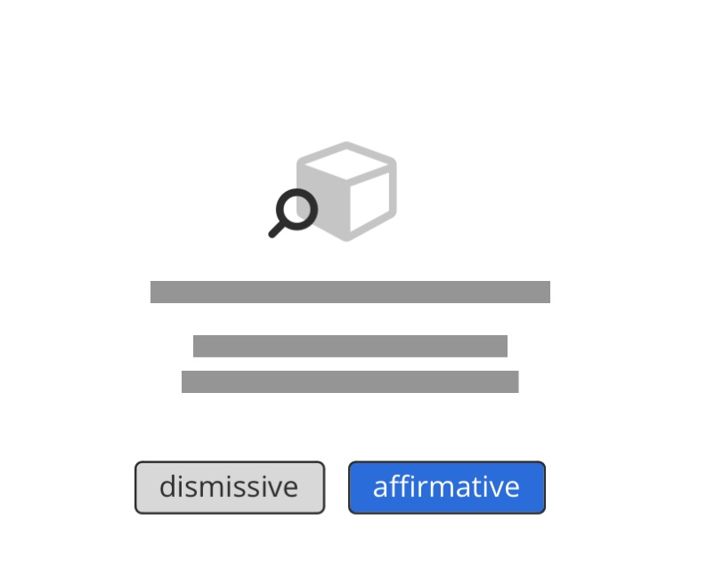

# Button

_Todo_

- [x] Added Guidelines and Ghost butten
- [ ] add accessiblity guidelines

---

Buttons are clickable elements that are used to trigger actions. They communicate calls to action to the user and allow users to interact with pages in a variety of ways.

## Variants

### Primary button

The Primary button is for all the action of high emphasis, as Save / primary action of the wizard etc.

### Secondary button / Default button

The secondary button has more emphasis then a ghost button. Mostly used for secondary important actions beside a primary button to highlight a hierarchy.

### Ghost button

Ghost button is an text with a "invinsible" background, that is visible on hover or on select, when clicking on mobile.

**normal state:**
Link in primary color.

**hover state:** shows the background of the primary color in 80% opacity.

**disabled state:** grey disabled.

### Text Button / Link

Currently the Text Button functions as unobtrusive Idea for a place, where alot of functions are already there and has the least importance.

## Structure

Buttons can have various sizes.
XS / S / SM / M / L

## Guidelines / Usage

### When to use

A button (`<button>`) element is used to indicate an action.

### When not to use

If you are directing a user to a new location, consider using an anchor (`<a>`) element, which can also be styled like a button when actions and destinations are present in the same set of controls.

Do not use buttons as navigational elements. Instead, use links when the desired action is to take the user to a new page.

### Types

Use categories to bring varying action emphasis that guide the user when performing tasks.

| Button type    | Use case|
|--------------|-----------
|Primary Button | Most important action on the page/section. A layout should contain a single primary button that makes it clear that other buttons have less importance in the hierarchy. |
| Default Button / Secondary | Default Button for all other actions, that are available or less important than the primary |
| Ghost Button | For the tertiary actions, who are less important or could stick out to much. |

### Alignment

Buttons can be aligned left, right, or center depending on the context.

| Alignment| Use case| Sample Picture |
|----------|----------|--------------|
| *Left alignment*     | In page content and forms where the content is typically unconstrained other than by the normal OO Grid. In these instances an F-pattern (top to bottom and left to right in a horizontal movement) is common for reading flow, and buttons align with other content on the page like headings, lists, input labels, and form labels. |  |
| *Right alignment*     | In fixed containers like and dialogs, flows that continue in a progressive direction, actions with a global impact, and toolbars. In these instances a Z-pattern (top to bottom and left to right with a diagonal, scanning movement) is common for reading flow. In these instances a user may be taking a progressive action, like affirming a modal, or an action upon a section, like formatting text in a comment. |  |
| *centered*    | used for Emtpystates or  when the content has the only available action on the screen.  | |

### Order

{ class="thumbnail-xl" }

When using multiple buttons, the position of the primary action is the most important part. Primary actions are mostly affirmative actions:
An affirmative action is something that helps the user fullfill his task (for example, Save or Delete), while a dismissive action takes a user back (for example, Cancel).

{ class="thumbnail-xl" }
To sum up, a primary button will be left-aligned and positioned to the left of the secondary/tertiary button.
Execption is the ellipsis button, its placed at the beneath the primary button.

### Accessibility

