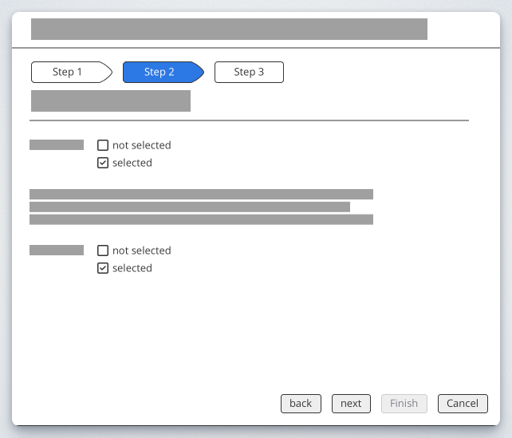

# Button

Buttons are clickable elements that are used to trigger actions. They communicate calls to action to the user and allow users to interact with pages in a variety of ways.

## Variants

Standard Button / Only Icon Button / Button with leading icon / Button with trailing icon 

## Emphasis / Importance

### Primary button

The Primary button is for all the action of high emphasis, as Save / primary action of the wizard etc.

### Secondary button / Default button

The secondary button has more emphasis then a ghost button. Mostly used for secondary important actions beside a primary button to highlight a hierarchy.

### Ghost button

Ghost button is an text with a "invinsible" background, that is visible on hover or on select, when clicking on mobile.

### Text Button / Link

Currently the Text Button functions as unobtrusive Idea for a place, where alot of functions are already there and has the least importance.

## Structure

Buttons can have various sizes.
XS / S / SM / M / L

## Additional information

Buttons may have additional information that the user needs to know before clicking on the action. These information is displayed above the button. The background is in a light color and the information starts with an icon.

{ class="thumbnail-xl" }

## Guidelines / Usage

### When to use

A button (`<button>`) element is used to indicate an action.

### When not to use

If you are directing a user to a new location, consider using an anchor (`<a>`) element, which can also be styled like a button when actions and destinations are present in the same set of controls.

Do not use buttons as navigational elements. Instead, use links when the desired action is to take the user to a new page.

### Types

Use categories to bring varying action emphasis that guide the user when performing tasks.

| Button type    | Use case|
|--------------|-----------
|Primary Button | Most important action on the page/section. A layout should contain a single primary button that makes it clear that other buttons have less importance in the hierarchy. |
| Default Button / Secondary | Default Button for all other actions, that are available or less important than the primary |
| Ghost Button | For the tertiary actions, who are less important or could stick out to much. |

### Alignment

Buttons can be aligned left, right, or center depending on the context.

| Alignment| Use case| Sample Picture |
|----------|----------|--------------|
| *Left alignment*     | In page content and forms where the content is typically unconstrained other than by the normal OO Grid.   | 
|*Left alignment*  |And also in Dialogs with forms|  |
| *Wizard*     | In Dialog flows / Wizards, thatcontinue in a progressive direction  |  |
| *Right alignment*     | In fixed dialogs flows, where there's no form element |  |
| *centered*    | used for Emtpystates or  when the content has the only available action on the screen.  |[Link to the Empty state declaration](empty_state.md) |

### Order

A primary button will be left-aligned and positioned to the left of the secondary/tertiary button.

{ class="thumbnail-xl" }