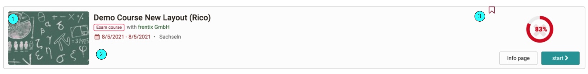
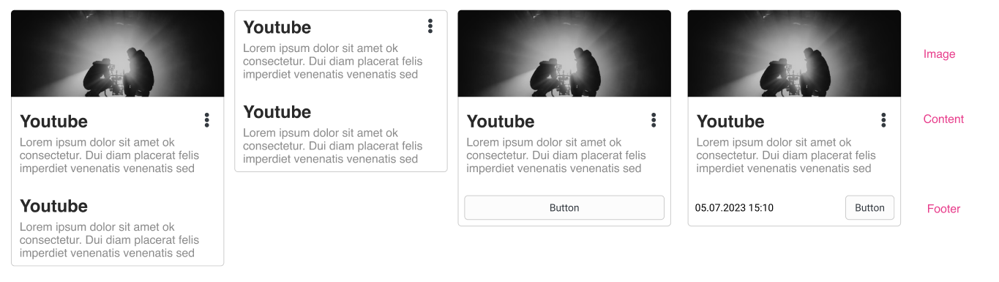
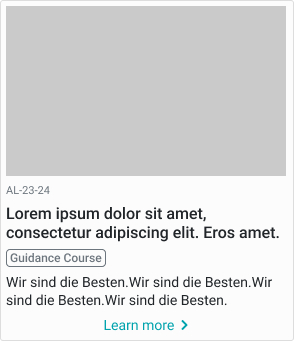
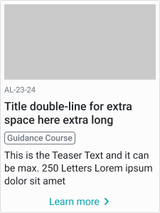
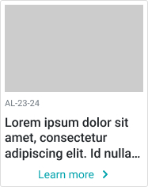
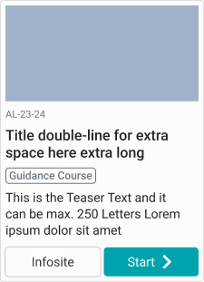
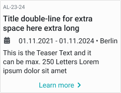

# Card

_Todo_

- [ ] elaborate on guidelines
- [ ] add accessiblity guidelines

## Variants

There are two different variants for the cards: normal (horizontal) and a compact (vertical).

### Card list (horizontal)

These cards work well on larger screens or for enriched view of a table list.

Example is the course card as horizontal list card.



1. **Course Image:** Absolute size of max. 240x120px. Gets shrinked when not enought space is available.
2. **Course Information:** Space for course information. All Information gets displayed in vertical order.
3. **Progress and Actions:** Space for Course Progress, if booked. Also the 2 action buttons are here.


### Card compact (vertical)

These Cards are found in badges / media center / catalog.

#### Shematic example of a card



 desktop | tablet | mobile
 :------: | :-----:| :-------:
  |   | |
 with 2 buttons | without image | 
  | 


## Classes
This is just an entrypoint, not an complete list.

**Course Card /List Card**
```CSS
.o_coursetable.o_rendertype_custom .o_table_row .o_repo_entry_list_item {

}
```

**Compact Cards:**

``` Css
%o_card,
.o_card {
	&:hover {
	}
}
```

## General Guidelines

### Behaviour at different screen sizes

The cards have a fixed width set in percentage.

#### Mobile, smaller than
Should span the whole device width.

### When to use

Display a single, concise group of content within a set of similar, related content. For example a list of courses, different groups.

### When _not_ to use

If we need a high information density or you need to compare data, the table view is a better choice.

### Alignment

Except for Buttons and the personal learning progress the content is right aligned.

