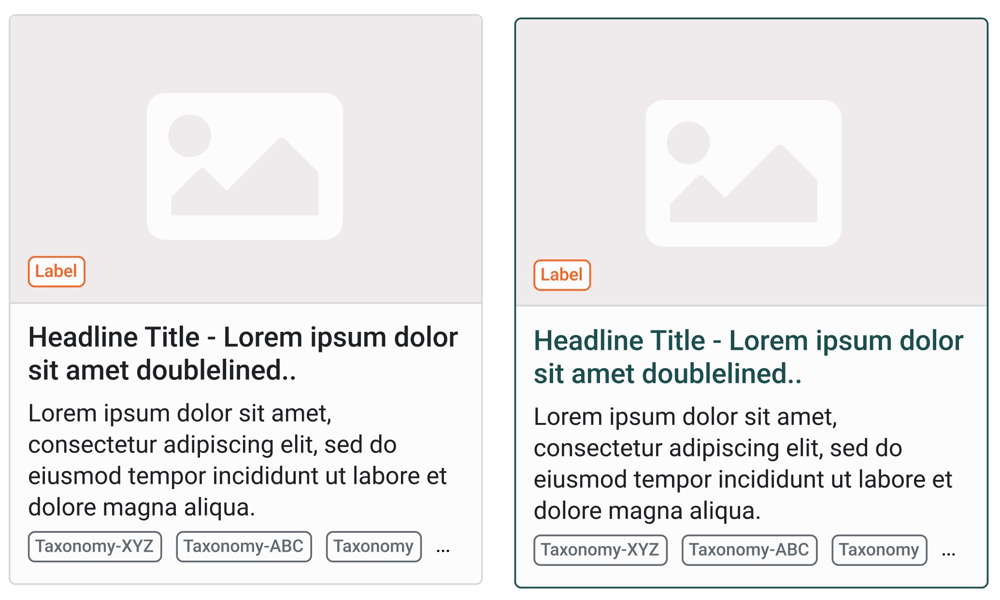
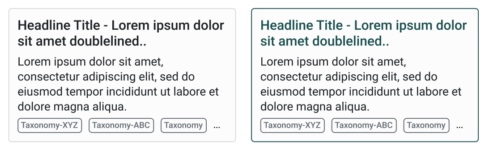

# Compact Card

Compact card with image

Compact card text only

## Structure / Anatomy

* image (optional) - the width of the card
* headline: always h3, changes on hover to primary color.
* border: changes on hover to primary color
* tags at the bottom (optional)

## Guidelines / Usage
Use the compact card as rich view as contrary to the traditional table-view to emphasis media.
