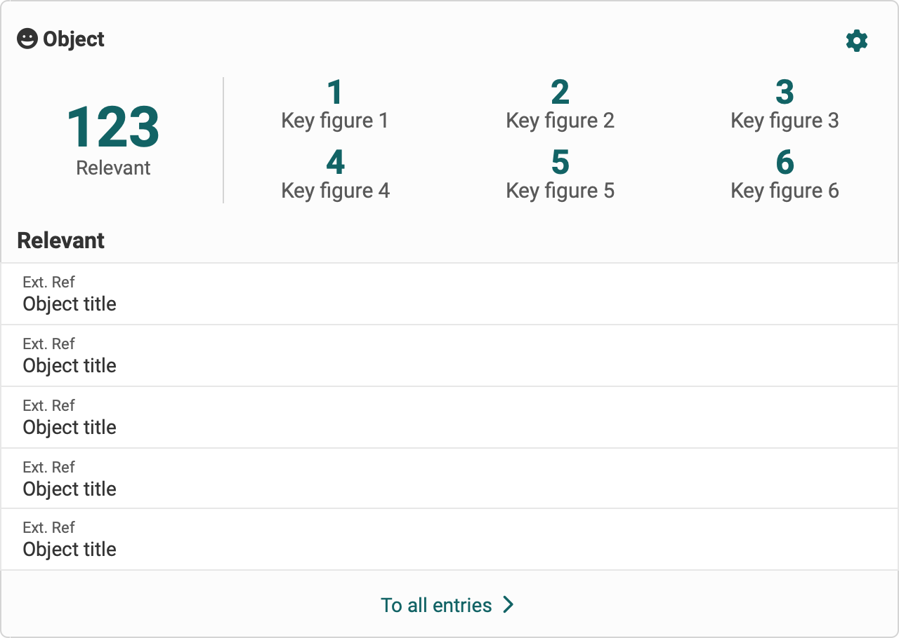
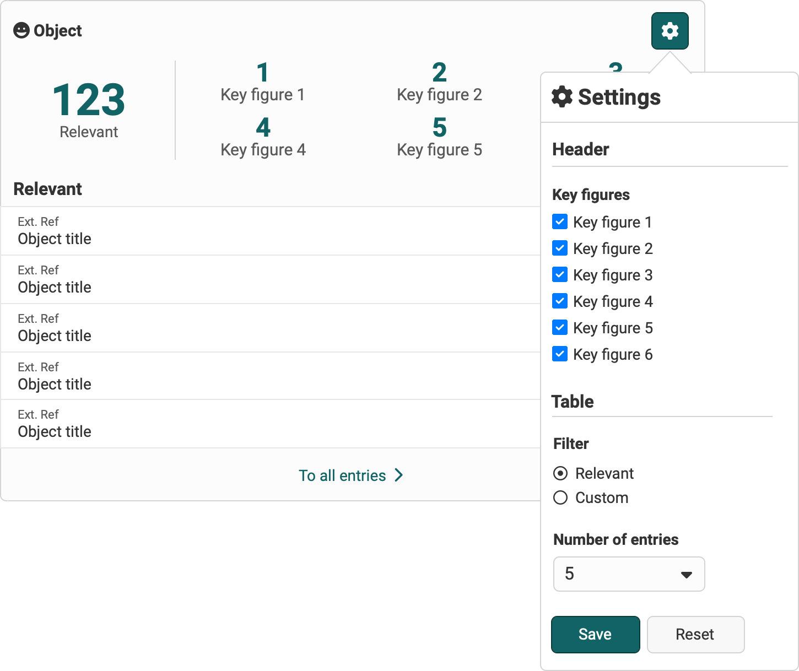
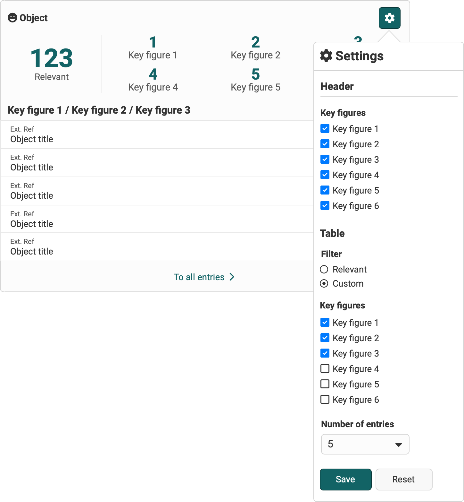

# Dashboard widgets

## Table widget

The table widget represents any object that is displayed in table form.

### Header

The header displays the key figures for the object. The key figures refer to the respective predefined filters. A difference is made between
* Main key feature: Corresponds to the relevant filter
* Key features (1-6): Corresponds to a specific pre-definded filter

### Table

The table displays entries of the object. The data is displayed as a table with separate columns or as a list.

{ class="shadow lightbox" }

### Configuration (Settings)

The key figures can be shown/hidden in the header. The filter and the number of entries can be configured in the table.

The “Relevant” filter is the default configuration for the filter. This can be customized for each user. The filter can be configured individually based on the key figures.

{ class="shadow lightbox" }
{ class="shadow lightbox" }