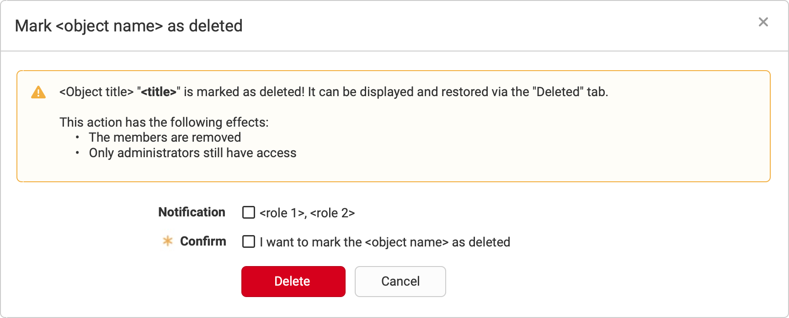
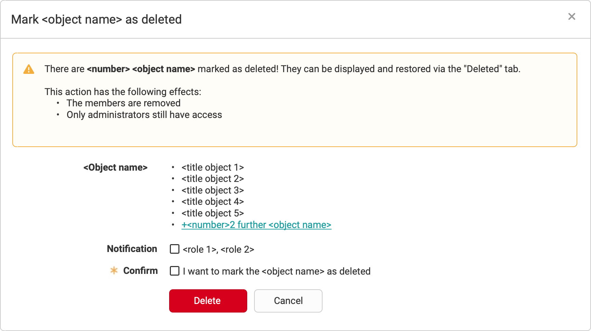
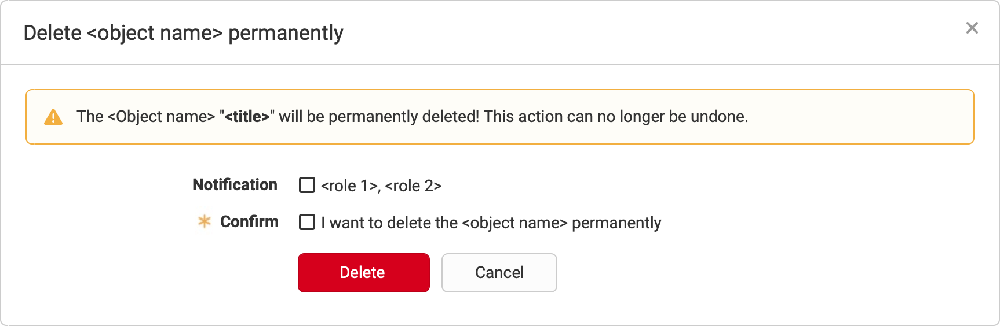
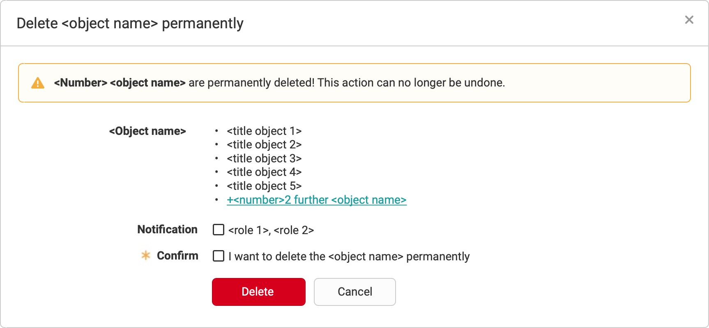

# Delete object

## Mark as deleted

### Single action

1. **Warning**
	1. **Message** Standard text.
	2. **Effects** List with effects of the action (optional).
2. **Notification** List with users who are notified (optional).
3. **Confirm** Confirmation by the user(optional).

### Bulk action

1. **Warning**
	1. **Message** Standard text.
	2. **Effects** List with effects of the action (optional).
2. **Affected objects** List with all objects that are affected.
3. **Notification** List with users who are notified (optional).
4. **Confirm** Confirmation by the user (optional).

## Delete permantly

### Single action

1. **Warning** Standard text.
2. **Notification** List with users who are notified.
3. **Confirm** Confirmation by the user.

### Bulk action

1. **Warning** Standard text.
2. **Affected objects** List with all objects that are affected.
3. **Notification** List with users who are notified.
4. **Confirm** Confirmation by the user.