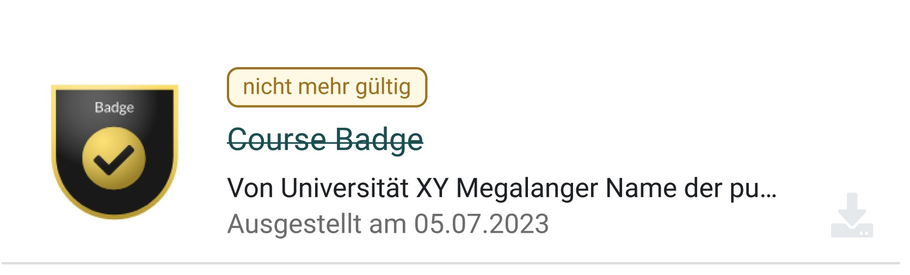
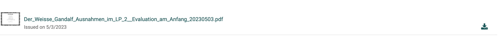

# Achievement Card 



## Components

1. **Preview Image:** Absolute size of max. 240x120px. Gets shrinked when not enought space is available.
2. **Details:** Space for course information. All Information gets displayed in vertical order.
3. **Status:** Space for Course Progress, if booked. Also the 2 action buttons are here.

## Variants

### Certificates



## Classes

General Classes: type for the image , actions for all the buttons, meta for the description and meta information.

``` Css
.o_achievement_card {
    .o_achievement_type {}
    .o_achievement_meta {}
    .o_achievement_actions {}
}
```

For the badge 3-columns add class:

``` CSS
.o_badge_multi .o_achievement_card {}
```