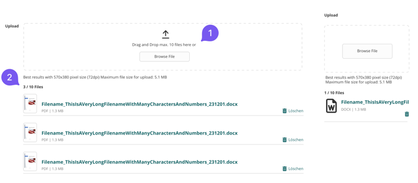
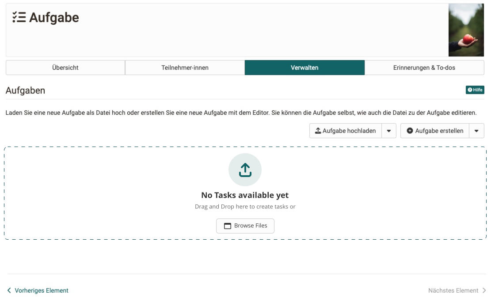

# File Upload

File Uploads are drag and drop zones for users to upload their files or pictures to folders or respective locations.

1. **Upload Prompt**: Upload Icon, Intro Text and Browse File Action
2. **File** in multi-upload oder after the single file is uploaded, show the files in the file-list.

## Single File Upload

When you uploaded a single file, its represented in the file list and deletable via action.

## Multi File Upload

When uploading or dragging multiple file to the upload zone, the file list is shown below the drop zone.

1. **File count** shows the maximal files in the dropzone text.
2.  **File list status** Shows already uploaded and max files.
   

## Upload Empty State

File tables, where only display files, can use an special empty state to indicate, that dropping a file onto the table is possible.

