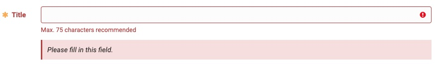

# Form

A form is for capturing and submitting user input.

**Structure**

1. Labels: To inform users what the corresponding input fields mean.
2. Input fields: For Information, that can be entered through a variety of different input fields ranging from text fields, checkboxes, and many other types.
3. Helper Bomb: Provides assistance on how to fill out a field. The Helper Bomb is optional.
4. Placeholder text: Hints at what goes into a field. Placeholder text is optional.
5. Submit: Allows the user to submit a form.
6. Validation: Ensures the data submitted by the user conforms to acceptable parameters.

## Form elements

Forms may include a variety of elements. By default all information in forms is required unless stated otherwise with "(optional)" added to the label of the corresponding element.

These form elements can be placed in the flexiForm:

### Input elements

* Text Input, Text Area, Formatted text area
* Checkbox, Checkbox groups
* Pulldown
* Dropdown
* Switch
* Radio Button, Radio button Cards
* File Upload
* Date Picker
* Button

### Layout elements

* Form legend title
* Form Section
* Form Fieldset

## Variants

### Multistep Forms / Wizard

Can be used in n modal.

## Validation

## Guidelines / Usage

* Keep it short. 
* 
