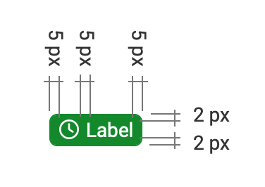
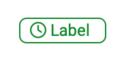

# Labels & Tags

## Labels
There are two types of labels:

* Normal
* Light

### Normal: Characteristic

* Color filled

{ class="shadow lightbox" }

| Element                |  Font-weight | Size          |
|------------------------|--------------|---------------|
| Text                   |  Normal      | Standard 14px |

### Light: Characteristic

* Color inverted

{ class="shadow lightbox" }

| Element                |  Font-weight | Size |
|------------------------|--------------|------|
| Text                   |  Normal      | 85%  |

### General Guidelines

#### When to use

#### Normal
Used in detail pages.

#### Light
Used in tables or on pages, where more than one object use the same label.

### Classes

**Label normal:**

```CSS
.o_labeled{

}
```

**Label light:**
```CSS
.o_labeled_light{

}
```

## Tags