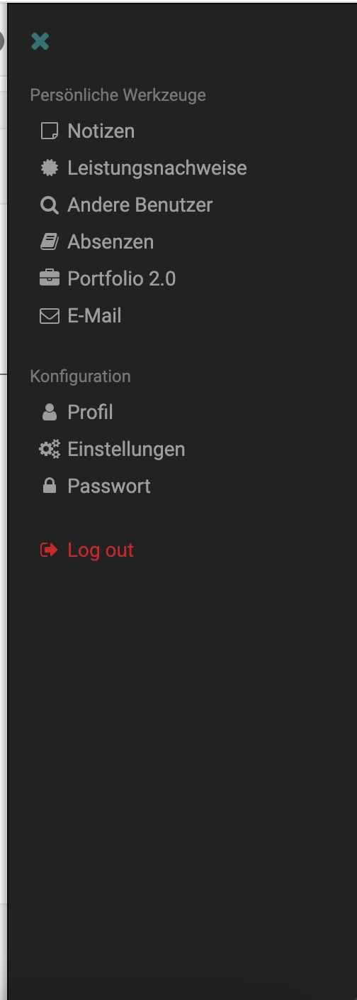
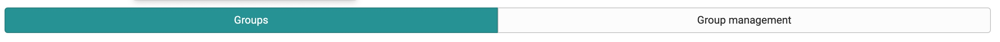
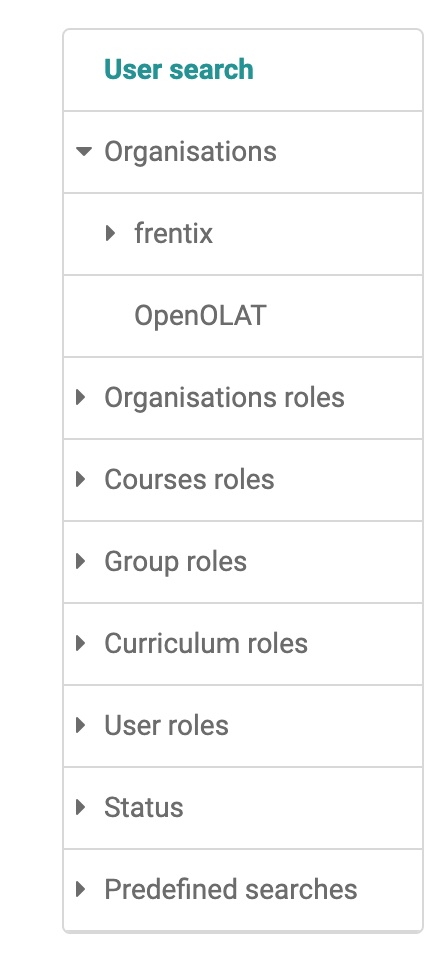

# Menu

For more general navigation Patterns, visit the manual page [Design Patterns](../ux/patterns.md).

## Main Menu / Top Menu

The top menu refers to the top horizontal navigation. The items in the top menu include a list of pages that allow you to view global content throughout OpenOLAT. For Example Courses, groups, authoring, quality management.

## right Sidebar

{class="thumbnail-xl"}

Only visible as personal menu with links to personal tools and to the profile and settings. It's also only possible to log out here.

## secondary Menu / Segmented menu

Secondary navigation, if we need to further seperate content. Used heavily in groups and courses and in the coaching and authoring side.

### Toolbar nav

Show the sub-pages mostly used in setting. It's a contextual nav, depending wich ressource you open.

### left side nav / menu tree

{class="thumbnail-xl"}

The left side nav refers to the navigation that is contextual to each type of content in OpenOlat (e.g. learning ressource, course, group, administration ).

#### Options

- Drag
- Drop
- Drop sibling
- Expand selected root
- Icons (Yes/No)
- Decorator Options

### learning path menu tree

The learning path nav is a custom menu tree with a custom skin. All the menu tree options plus he shows participants learning progress (resolved/not resolved course elements) in status icons and a path.

#### Options

- visibility (yes/no)
- Learning ressource icons (yes/No)
- show Path (yes/no)

### Menu Button

There are two different types of menu buttons. Both can contain items with submenus.

#### Regular Menu Button

When the user activates the button, the menu opens. This is the default type.

#### Split Menu Button

The split menu button is separated into two areas: the text label and the icon. The separator between them signals that the two areas result in different actions. The user can either trigger the action, by clicking on the text label or click on the arrow opens the menu. 

The split button groups a variety of actions and commands. The most used action is displayed as the text label.