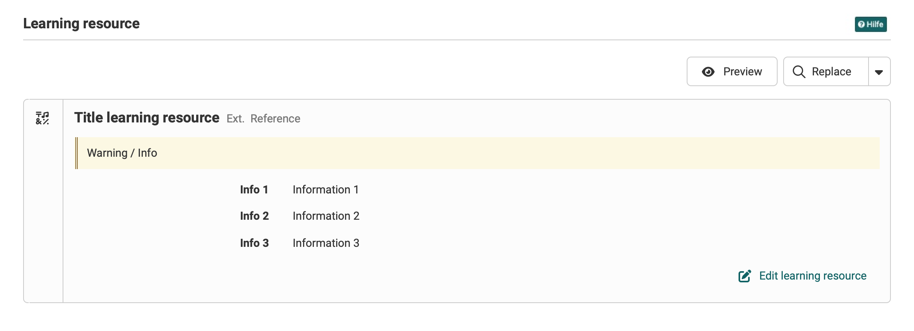

# Object integration

## Resources in course element
This component is used for the integration of learning resources in course elements.

{ class="shadow lightbox" }

Possible actions in the course element

* Preview: Shows the resource inthe preview
* Replace: Replace the current resource
* Create: Create a new resource
* Import: Import a resource

Learning resource action

* Edit learning resource

Used in

* Test
* Single page
* Video task

## Other Objects
This component can also used to integration any objects into elements.

{ class="shadow lightbox" }

Used in

* Offers: Course settings -> Share