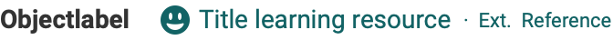
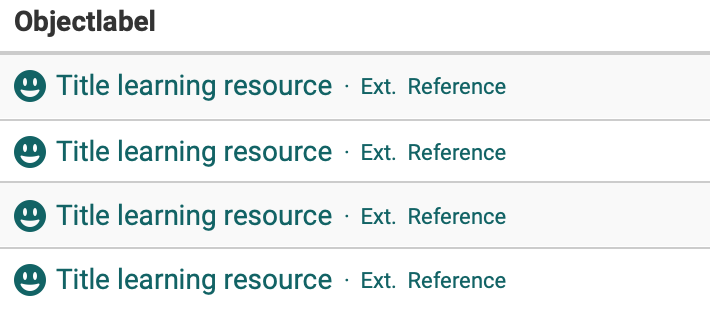

# Object representation

## Learning resources

| Context | Representation                                                                                              | Elements                                                    |
| ------- | ----------------------------------------------------------------------------------------------------------- | ----------------------------------------------------------- |
| Title   |                                                                           | - Icon - Title - Middle dot - Reference            |
| Form    |                                                                             | - Icon - Title - Middle dot - Reference            |
| Table   | :material-alert: 2 seperate columns preferred (sorting/filtering)   | - Icon (optional) - Title - Middle dot - Reference | 