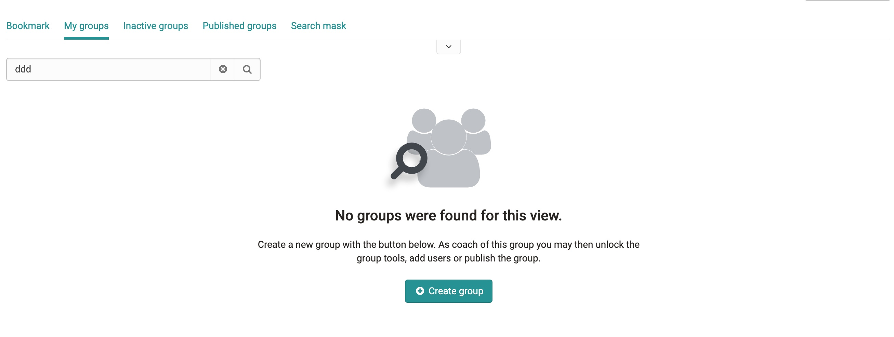

# Design Patterns

Design Patterns are high level not bound to specific components and are best practice solutions for how a user achieves a goal
  
---

## Empty States in OO

Empty states are moments in an app where there is no data to display to the user.

1. **Image**: A non-interactive image that relates to the situation (optional).
2. **Title**: A short and concise explanation. Should be in positive statement.
3. **Copy / Paragraph** Explain clearly the next action to populate the empty space OR explain why the space is empty and include the next actions or steps to get results. For Example, explaining that you can create groups here in this screen.
4. **Primary Action (optional)** The primary call to action referenced in the copy above.

### When to use

Empty states always appear in the otherwise empty space, in the context of the data that’s missing. They can occur anywhere your app can display data, including but not limited to dashboards and tables.
