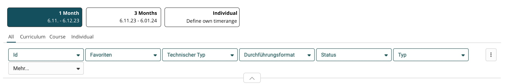
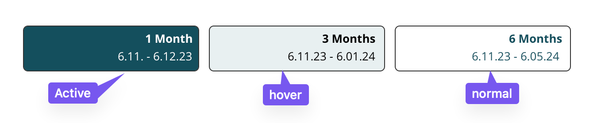
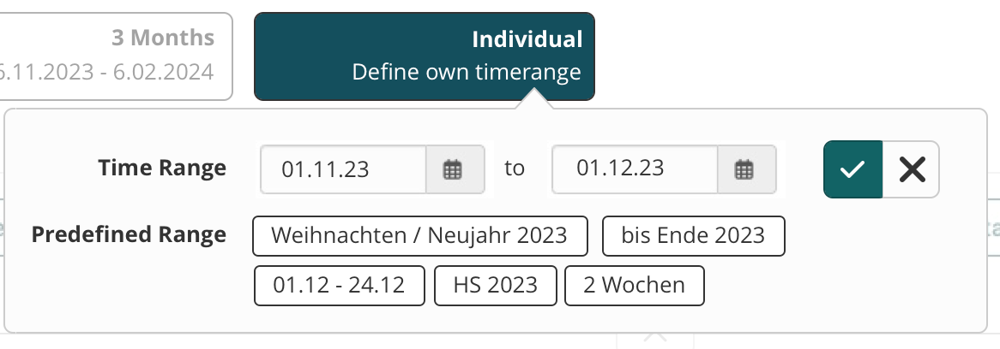

# Scope (chooser)

Scope is an additional filter for the [fxtable](/.../.../manual_dev/ux/table.md), that controls the predefined filters below it. The Scope is not changeable in the sub filters, for example time range defined by the scope cannot be larger below.

It can have 1 - n different Scope filter., the optimum is 3-6. It's always right aligned.

Scope needs to be defined, so that the user can understand the rules at the first glance.

## Functionality

  * Headline Label: bold, right aligned
  * secondary label: normal, right aligned

### Variant

#### General - All Scope

* contains All results of the table.

#### QM - Individual Scope

* instead of "All Scope"
* clickable with popover
* changes text on popover selection.

## Classes
This is just an entrypoint, not an complete list.

### Behaviour at different screen sizes

- Individual Scope filters, wrap onto a new row, if not enough space is available.
- max. width of 250 px. less, if more items are present.

#### Tablet
 - max width of 200px.

#### Mobile
- arranged vertically with width set to 100%.

_Todo_

- [ ] add accessiblity guidelines