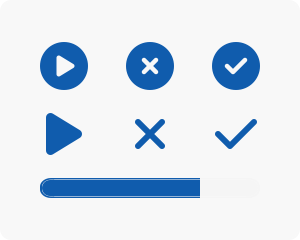
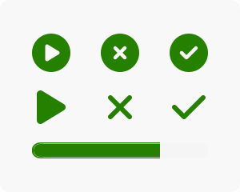
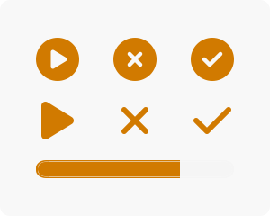

# Status

## Label types

### Regular

### Light

### Mega

## Characteristics

### Neutral

Range of application

1. Waiting state
2. Draft
3. Security / Confidentiality
4. Neutral
5. Stable states

Ampel logic: No action needed

| Type      | Font      | Background | Border    | Label                                                             |
| --------- | --------- | ---------- | --------- | ----------------------------------------------------------------- |
| Full      | #FFFFFF | #146DCC  | #105CAD | { class="thumbnail-sm" }  |
| Light     | #105CAD | #FFFFFF  | #105CAD | { class="thumbnail-sm" }      |
| Mega      | #105CAD | #cde3f9  | #105CAD | { class="thumbnail" }           |
| Base      | #105CAD | -          | -         | { class="thumbnail" } | 

| Component  | Context               | icon                       | State       | Range of application |
| ---------- | --------------------- | -------------------------- | ----------- | -------------------- |
| Course     |                       | :fontawesome-solid-pencil: | Preparation | 2.                   |
| Course     | Assessment mode       | :fontawesome-solid-clock:  | Scheduled   | 1.                   |
| Course     | Assessment inspection | :fontawesome-solid-clock:  | Scheduled   | 1.                   |
| Catalog    | Offer period          | :fontawesome-solid-clock:  | Planned     | 1.                   |
| Curriculum | Curriculum element	 | :fontawesome-solid-pencil: |	Preparation | 2.                   |

### Success

Range of application

1. Ready for use / Everything in order / Normal operation
2. Available
3. Success / Completed
4. Correct
5. Approval / Release
6. Active connection

Ampel logic: No dangers or safety concerns 

| Type      | Font      | Background | Border    | Label                                                                |
| --------- | --------- | ---------- | --------- | -------------------------------------------------------------------- |
| Regular   | #FFFFFF | #37AD00  | #298500 | { class="thumbnail-sm" }   |
| Light     | #298500 | #FFFFFF  | #298500 | { class="thumbnail-sm" }       |
| Mega      | #298500 | #C4E6B8  | #298500 | { class="thumbnail" }            |
| Base      | #298500 | -          | -         | { class="thumbnail" } | 

| Component      | Context               | icon                               | State       | Range of application |
| -------------- | --------------------- | ---------------------------------- | ----------- | -------------------- |
| Course         |                       | :fontawesome-solid-check:          | Published   | 2.                   |
| Course         | Assessment mode       | :fontawesome-solid-spinner:        | In progress | 1.                   |
| Course         | Assessment inspection | :fontawesome-solid-check:          | Carried out | 3.                   |
| Catalog        |                       | :fontawesome-solid-cart-shopping:  | Bookable    | 2.                   |
| Catalog        | Offer period          | :fontawesome-solid-hourglass-half: | Ongoing     | 1.                   |
| Curriculum     | Curriculum element    | :fontawesome-solid-check:          | Confirmed   | 4.                   |
| Curriculum     | Curriculum element    | :fontawesome-solid-check:          | Active      | 1.                   |
| Curriculum     | Membership            | :fontawesome-solid-circle-check:   | Active      | 1.                   |
| Payment module | Billing address       | :fontawesome-solid-check:          | Active      | 1.                   |
| Test           | Question              | :fontawesome-solid-circle-check:   | Answered    | 1.                   |

### Warning

Range of application

1. Warning / Caution
2. Check required
3. Reduced performance / Limitations
4. Intermediate state

Ampel logic: Attention required

| Type    | Font      | Background | Border    |  Label                                                              |
| ------- | --------- | ---------- | --------- | ------------------------------------------------------------------- |
| Full    | #574000 | #fbd774  | #fcca46 | { class="thumbnail-sm" } |
| Light   | #574000 | #FFFFFF  | #fcca46 | { class="thumbnail-sm" }     |
| Mega    | #574000 | #fbe6a7  | #fbe6a7 | { class="thumbnail" }          |

| Component  | Context               | icon                                     | State            | Range of application |
| ---------- | --------------------- | ---------------------------------------- | ---------------- | -------------------- |
| Course     |                       | :fontawesome-regular-star:               | Review           | 2./4.                |
| Course     | Assessment mode       | :fontawesome-solid-hourglass-half:       | Preparation time | 3./4.                |
| Course     | Assessment inspection | :fontawesome-solid-user-slash:           | No-show          | -                    |
| Catalog    |                       | :fontawesome-solid-triangle-exclamation: | Fully booked     | 2.                   |
| Curriculum | Curriculum element    | :fontawesome-solid-hourglass-half:       | Provisional      | 4.                   |
| Curriculum | Membership            | :fontawesome-solid-hourglass-half:       | Pending          | 4.                   |

### Critical

Range of application

1. Increased warning level / Urgent attention required
2. Limited functionality / Severe restrictions
3. Transition to a critical state

Ampel logic: Increased warning, intervention urgently required, but not yet critical.

| Type      | Font      | Background | Border    | Label                                                                 |
| --------- | --------- | ---------- | --------- | --------------------------------------------------------------------- |
| Full      | #663C00 | #F4AC47  | #D17A00 | { class="thumbnail-sm" }  |
| Light     | #D17A00 | #FFFFFF  | #D17A00 | { class="thumbnail-sm" }      |
| Mega      | #663B00 | #FFDAA6  | #D17A00 | { class="thumbnail" }           |
| Base      | #D17A00 | -          | -         | { class="thumbnail" } |   

| Object  | Context               | icon                             | State        | Range of application |
| ------- | --------------------- | -------------------------------- | ------------ | -------------------- |
| Course  | Assessment inspection | :fontawesome-solid-spinner:      | In progress  | -                    |
| Course  | Membership            | :fontawesome-solid-circle-xmark: | Declined     | 3.                   |
| Test    | Question              | :fontawesome-solid-circle-play:  | Not answered | 1.                   |

### Danger

Range of application
1. Flagged as deleted
2. Wrong

Ampel logic: Danger and critical, intervention required

| Type    | Font      | Background | Border    | Label                                                          |
| ------- | --------- | ---------- | --------- | -------------------------------------------------------------- |
| Regular | #FFFFFF | #b30018  | #a80016 | { class="thumbnail-sm" } |
| Light   | #b30018 | #FFFFFF  | #a80016 | { class="thumbnail-sm" }     |
| Mega    | #b30018 | #ffc9bd  | #ffc9bd | { class="thumbnail" }          |

### Finised

Range of application

1. Completed processes but available
2. Read-only / Limitations 

| Type    | Font      | Background | Border    | Label |
| ------- | --------- | ---------- | --------- | ------------------------------------------------------------------ |
| Full    | #FFFFFF | #804A33  | #6D3F2C | { class="thumbnail-sm" } |
| Light   | #804A33 | #FFFFFF  | #6D3F2C | { class="thumbnail-sm" }     |
| Mega    | #804A33 | #E7D2BC  | #E7D2BC | { class="thumbnail" }          |

| Object     | Context               | icon                             | State     | Range of application |
| ---------- | --------------------- | -------------------------------- | --------- | -------------------- |
| Course     |                       | :fontawesome-solid-ban:          | Finished  | 1./2.                |
| Course     | Assessment mode       | :fontawesome-solid-ban:          | Follow-up | 1./2.                |
| Course     | Assessment inspection | :fontawesome-solid-circle-xmark: | Cancelled | -                    |
| Curriculum | Curriculum element    | :fontawesome-solid-ban:          | Finished  | 1./2.                |

### Inactive

Range of application

1. Deactivated status / offline
2. Completed processes
3. Currently not available

Ampel logic: Inactive or not relevant

| Type    | Font      | Background | Border    | Label                                                            |
| ------- | --------- | ---------- | --------- | -----------------------------------------------------------------|
| Full    | #FFFFFF | #595959  | #454545 | { class="thumbnail-sm" } |
| Light   | #595959 | #FFFFFF  | #454545 | { class="thumbnail-sm" }     |
| Mega    | #342c24 | #F6F6F6  | #F6F6F6 | { class="thumbnail" }          |

| Object         | Context               | icon                             | State              | Range of application |  
| -------------- | --------------------- | -------------------------------- | ------------------ | -------------------- |
| Course         | Assessment mode       | :fontawesome-solid-circle-minus: | End                | 2.                   |
| Course         | Assessment inspection | :fontawesome-solid-ban:          | Withdrawn          | 2.                   |
| Catalog        |                       | :fontawesome-solid-eye-slash:    | Not available      | 3.                   |
| Catalog        | Offer period          | :fontawesome-solid-ban:          | Ended              | 2./3.                |
| Curriculum     | Curriculum element    | :fontawesome-solid-circle-xmark: | Cancelled          | 2./3.                |
| Curriculum     | Membership            | :fontawesome-solid-circle-xmark: | Cancelled          | 2./3.                |
| Curriculum     | Membership            | :fontawesome-solid-circle-xmark: | Cancelled with fee | 2./3.                |
| Curriculum     | Membership            | :fontawesome-solid-circle-xmark: | Removed            | 2./3.                |
| Payment module | Billing address       | :fontawesome-solid-ban:          | Inctive            | 1.                   |

## By object
### Global Status

| Status  | Color |
| ------- | ----- | 
| Note    |       |
| Info    |       |
| Warning |       |
| Error   |       |

#### Object Status (Life Cycle)

| Status          | Color |
| --------------- | ----- | 
| Active          |       |
| Inactive        |       |
| Deleted (Trash) |       |

### User

#### User Status

| Status                   | Color |
| ------------------------ | ----- | 
| active                   |       |
| active and not deletable |       |
| pending                  |       |
| inactive                 |       |
| Login denied             |       |

#### User Chat Status

| Status                | Color |
| --------------------- | ----- | 
| available             |       |
| please do not disturb |       |
| not available         |       |

### Learning Ressource

#### LR Publish Status

| Status           | Color |
| ---------------- | ----- | 
| Preparation      |       |
| Review           |       |
| Access for coach |       |
| Published        |       |
| Finished         |       |

#### LR Success status colors

| Status     | Color |
| ---------- | ----- |
| Passed     |       |
| not passed |       |
| undefined  |       |

#### LR Release status

| Status       | Color |
| ------------ | ----- |
| released     |       |
| not released |       |

### Course Element

#### Course element status / LR Learning-path progress

| Status       | Color |
| ------------ | ----- |
| not ready |       |
| not started |       |
| started |       |
| to review |       |
| assessed |       |

#### Course element visited status

| Status       | Color |
| ------------ | ----- |
| visited |       |
| partly visited |       |
| not visited |       |

### e-portfolio

#### Pages status

| Status       | Color |
| ------------ | ----- |
| draft |       |
| published |       |
* in revision |       |
* closed |       |
* deleted |       |

#### Sections status

| Status       | Color |
| ------------ | ----- |
| assignment |       |
| not started |       |
| in progress |       |
| closed |       |

### Quality Management

#### Datenerhebungen

| Status       | Color |
| ------------ | ----- |
| Preparation |       |
| Prepared |       |
| Durchführung |       |
| Abgeschlossen |       |

### Question Bank

#### Question status

| Status       | Color |
| ------------ | ----- |
| draft |       |
| review |       |
| revision |       |
| final |       |
| end of life |       |

### Curriculum

#### Curriculum element status

| Status       | Color |
| ------------ | ----- |
| active |       |
| inactive |       |
| deleted |       |

### Lection

#### Lection block status

| Status       | Color |
| ------------ | ----- |
| aktiv |       |
| autoerledigt |       |
| erledigt |       |

#### Lection Participant status

| Status       | Color |
| ------------ | ----- |
| anwesend |       |
| entschuldigt |       |
| unentschuldligt |       |

### Coaching Tool

#### Grading assignments

| Status       | Color |
| ------------ | ----- |
| unassigned |       |
| open |       |
| first reminder |       |
| second reminder |       |
| deadline missed |       |
| closed (done) |       |

#### Corrector status

| Status       | Color |
| ------------ | ----- |
| active |       |
| inactive |       |
| removed |       |