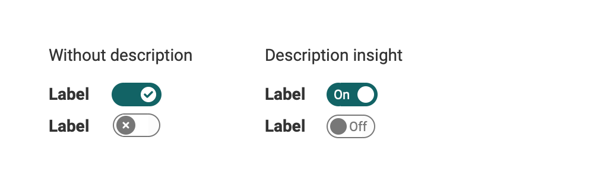

# Switch & Sliders

## Switch
This component is a digital on/off switche. It prompts users to choose between two mutually exclusive options and always has a default value. Switches should provide instant results an give the users the freedom to control their preferences as needed (eg. light on/of).

### Variants

* Without description
* With description insight

{ class="shadow lightbox" }

### Deliver immediate results
Toggle switches should take immediate effect and should not require the user to click Save or Submit to apply the new state.

### Uses 

* Activate / Deactive functions
* Learning path: Enable exceptions

## Slider
-- Todo --