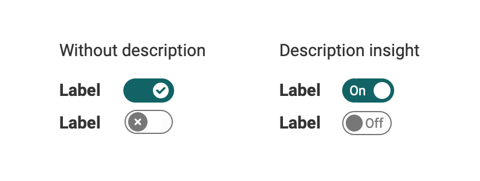
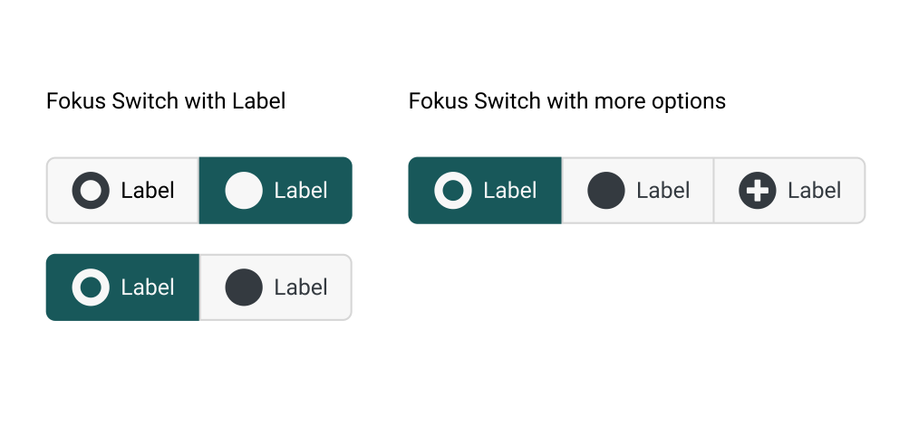

# Switch & Sliders

## Switch
This component is a digital on/off switch. It prompts users to choose between two mutually exclusive options and always has a default value. Switches should provide instant results and give the users the freedom to control their preferences as needed (eg. light on/off).

### Variants

* Without description
* With description insight

{ class="shadow lightbox" }

### Deliver immediate results
Switches should take immediate effect and should not require the user to click Save or Submit to apply the new state.

### Uses

* Activate / Deactive functions
* Learning path: Enable exceptions

## (small) Fokus Switch
This component has an active and passive state. It prompts the user to choose between two or more different options.

{ class="shadow lightbox" }

### Uses

* Show different views on tables
* Fokused views or all views.

## Slider
-- Todo --″