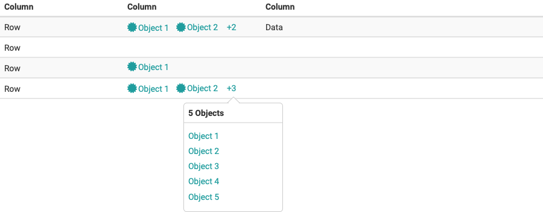
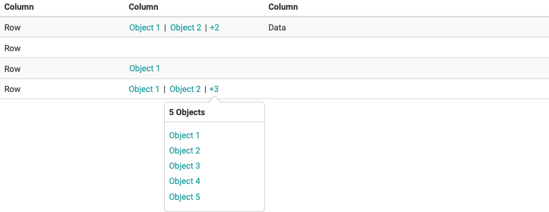
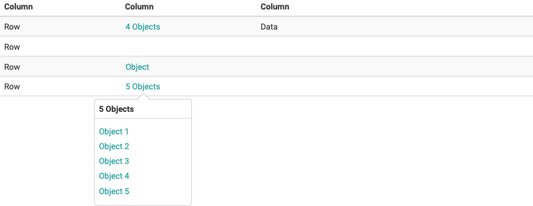
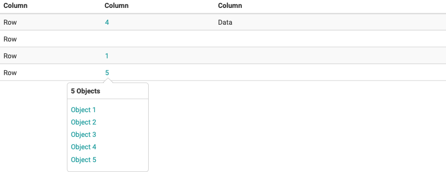

# Table
Use the table to display the information in rows and columns. Tables can contain text and images as well as actions and other components. 

## Base
Table in his basic form contains a columns and rows and a header row. 

## Add Sorting
Columns can be sorted in ascending or descending order. Sorting controls are located below the filter and above the header row. Sorting has two states, sorted-up or sorted-down besides the column to be sorted after. The icon indicates the current sorted state.

## Add Pagination
Pagination is used for splitting up table data into several pages, with a control for navigating to the next or previous page. You can also set the numbers of rows.To optimize Loading Times, it's advised to use pagination in a table with more than 200 results.

## Allow edit of table rows
You can allow the edition of specific table collumns of the table.

## Allow Select/multi select
You can allow no selection of the table rows, enable selection of table rows and allow for multi selection.

## Add Empty State
Specify the Empty State with a specialized message and add an icon picture or primary actions. [Find more here (empty state)](patterns.md)

## Add Display Modes

### Table view
Original Table view for compact viewing of Information.

### Card view
An enriched view of the provided items. Only used for the course list at the moment. [Find more here (card)](card.md)

### Add Search and Results 
Contains the table search, result row and the table configurations. The bulk actions can also be found in this location when multiple rows are selected and replace the search & options.

### Add Filters
The filter itself consists of either a dropdown or an input field in which matching categories are grouped. You can select one or more filters according to the category.

#### Filter row
Contains the predefined filters in filter groups, as well as buttons for adding/resetting/deleting filters. . Contains only as many filters as there is space. Breaks if there are more than one filter. The filter row can be collapsed/expanded with the new Collabsible element to save space.
If it is collapsed, the "remove active filters" link at the top will indicate that I still have active filters set by myself.

#### Filtertabs

 **Desktop**

Are tab views that specifically contain the filters that have been set. There are filters that are provided by the system and filters that I can add myself. If I add my own filter, it will be attached to the filter group on the right.

**Mobile**

On mobile or with more filter tabs than the browser window allows, the filter line changes to a scrollable slider with overscroll indicator.

## Objects in columns
Columns containing objects can be displayed as follows:

* Listing objects
* Numbers of objects

### Listing objects

{ class="shadow lightbox" }

{ class="shadow lightbox" }

### Number of objects

{ class="shadow lightbox" }

{ class="shadow lightbox" }