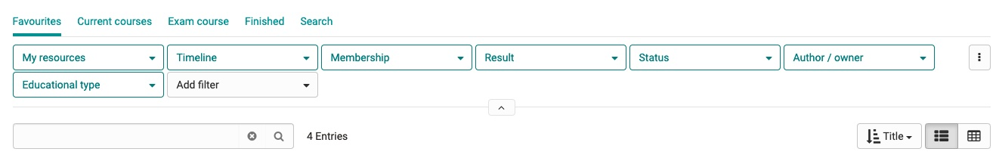

# Tabelle
## Base

Table in his basic form contains a columns and rows and a header row.


## Filter

=== "General Table Filter"

  

=== "Code"

    ``` c++
    #include <iostream>

    int main(void) {
      std::cout << "Hello world!" << std::endl;
      return 0;
    }
    ```


### Add Search and Results 
Contains the table search, result row and the table configurations. The bulk actions can also be found in this location when multiple rows are selected and replace the search & options.

### Add Filters
The filter itself consists of either a dropdown or an input field in which matching categories are grouped. You can select one or more filters according to the category.

#### Filter row
Contains the predefined filters in filter groups, as well as buttons for adding/resetting/deleting filters. . Contains only as many filters as there is space. Breaks if there are more than one filter. The filter row can be collapsed/expanded with the new Collabsible element to save space.
If it is collapsed, the "remove active filters" link at the top will indicate that I still have active filters set by myself.

#### Filtertabs
 *Desktop*
Are tab views that specifically contain the filters that have been set. There are filters that are provided by the system and filters that I can add myself. If I add my own filter, it will be attached to the filter group on the right.
*Mobile*
On mobile or with more filter tabs than the browser window allows, the filter line changes to a scrollable slider with overscroll indicator.


=== "Image"

  { align=left }

=== "Code"

    ``` c++
    #include <iostream>

    int main(void) {
      std::cout << "Hello world!" << std::endl;
      return 0;
    }
    ```

