# Wie binde ich einen OpenOlat-Kurs in Moodle ein? {: #LTI_integrate_course_into_moodle}

??? abstract "Ziel und Inhalt dieser Anleitung"

    Sie haben einen Kurs in OpenOlat erstellt und möchten diesen ausserhalb Ihres OpenOlat auf einer Moodle-Plattform anbieten? 
    Die folgende Anleitung zeigt Ihnen das Vorgehen Schritt für Schritt.

??? abstract "Zielgruppe"

    [x] Autor:innen [ ] Betreuer:innen  [ ] Teilnehmer:innen

    [ ] Anfänger:innen [x] Fortgeschrittene  [x] Expert:innen

??? abstract "Erwartete Vorkenntnisse"

    * Administrationshandbuch: [LTI 1.3 Integrationen im Überblick >](../../manual_admin/administration/LTI_Integrations.de.md)
    * Administrationshandbuch: [LTI - Externe Plattformen >](../../manual_admin/administration/LTI_External_platforms.de.md)
    * Benutzerhandbuch: [LTI-Zugang zu einem Kurs konfigurieren >](../../manual_user/learningresources/LTI_Share_courses.de.md)

---

Zur Anzeige eines OpenOlat-Kurses auf einer anderen Plattform, in der nachstehenden Anleitung ist das Moodle, wird eine Verbindung nach dem Standard LTI 1.3 (Learning Tools Interoperability) hergestellt. 

Damit die Benutzer:innen der Moodle-Plattform von ihrem System aus auf den OpenOlat-Kurs zugreifen können, müssen die beiden Plattformen miteinander kommunizieren und auf Seite OpenOlat muss der Kurs (und nur dieser Kurs) für diesen Zugriff von aussen freigegeben werden.

## Voraussetzungen {: #conditions}

Für die Konfiguration muss ein Administrator-Zugang in beiden Systemen gewährleistet sein. In OpenOlat öffnet die Rolle Systemadministrator:in die System-Administration, in der die externe Plattform erfasst wird. Wer die LTI-Freigabe eines Kurses vornehmen darf, legt die System-Administration im Tab "Konfiguration" unter `Administration > Externe Werkzeuge > LTI` fest. Vorzugsweise erfolgt die Konfiguration auf beiden Systemen gleichzeitig, da bestimmte Dialoge in beiden Systemen direkt aufeinanderfolgend zu konfigurieren sind.

[Zum Seitenanfang ^](#LTI_integrate_course_into_moodle)

---

## Ablauf der Konfiguration {: #config_process}

1. [Setup "External Tool" in Moodle](#setup_step1)
2. [Setup "Externe Plattform" in OpenOlat](#setup_step2)
3. [LTI-Freigabe des Kurses in OpenOlat](#setup_step3)
4. [Einbinden des externen Tools (=OpenOlat) im Moodle-Kurs](#setup_step4)
5. [Verbindungstest](#setup_step5)

## 1. Setup "External Tool" in Moodle  {: #setup_step1}

Die Administration der externen Tools in Moodle befindet sich unter folgendem Pfad: 
`Site administration > Plugins > External Tool > Manage Tools`

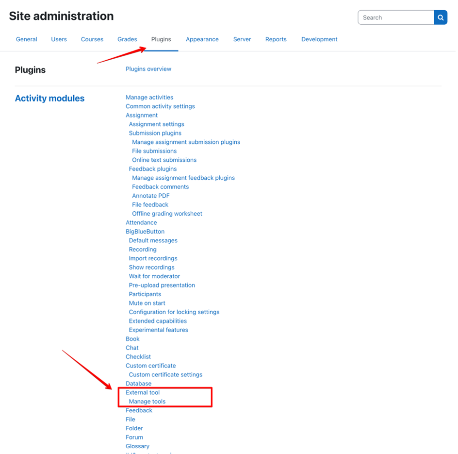{ class="shadow lightbox" title="Site administration in Moodle" }

Für die Konfiguration mit OpenOlat ist die Option "**configure a tool manually**" zu wählen.

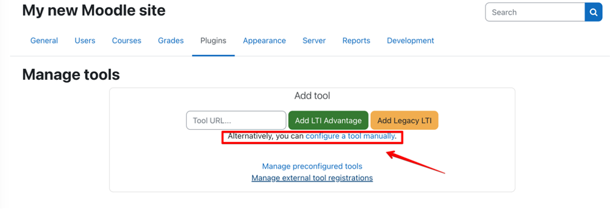{ class="shadow lightbox" title="Seite Manage tools in Moodle" }

Folgende Parameter sind als Mindestanforderung im Dialog zu definieren:

| Feld					| Bemerkung |
| --------------------- | ---------------------------------------------- |
| Tool name				| Frei definierbar |
| Tool URL				| Direkt-Link zu OpenOlat-Kurs.   Die URL hat folgendes Format: `https://<OpenOlat-URL>/auth/RepositoryEntry/<Kurs-ID>`  (Achten Sie darauf, dass kein / am Ende der URL eingefügt wird.) |
| LTI Version			| LTI 1.3 |
| Client ID				| Wird erst nach dem Speichern in dieser Maske ersichtlich |
| Public key type		| RSA key |
| Public key			| Wird in OpenOlat generiert, kann erst nachträglich eingetragen werden |
| Initiate Login URL	| Anmelde-URL, Format: `https://<OpenOlat-URL>/lti/login_initiation` |
| Redirection URL(s)	| Umleitungs-URL, Format: `https://<OpenOlat-URL>/lti/login` |
| Tool Configuration Usage| Show in activity chooser and as a preconfigured tool |
| Default Launch Container	| New window (OpenOlat unterstützt die Ausführung der Kurse nur in einem neuen Fenster.) |

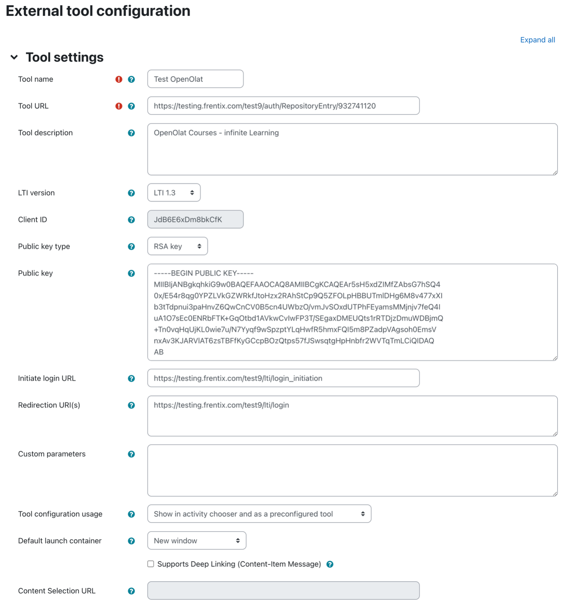{ class="shadow lightbox" title="Formular External tool configuration in Moodle" }

Nach dem Speichern können Sie weitere Details in der Übersicht über den Detail-Link im LTI-Tool abrufen. Die Details werden beim Setup der externen Plattform in OpenOlat benötigt:

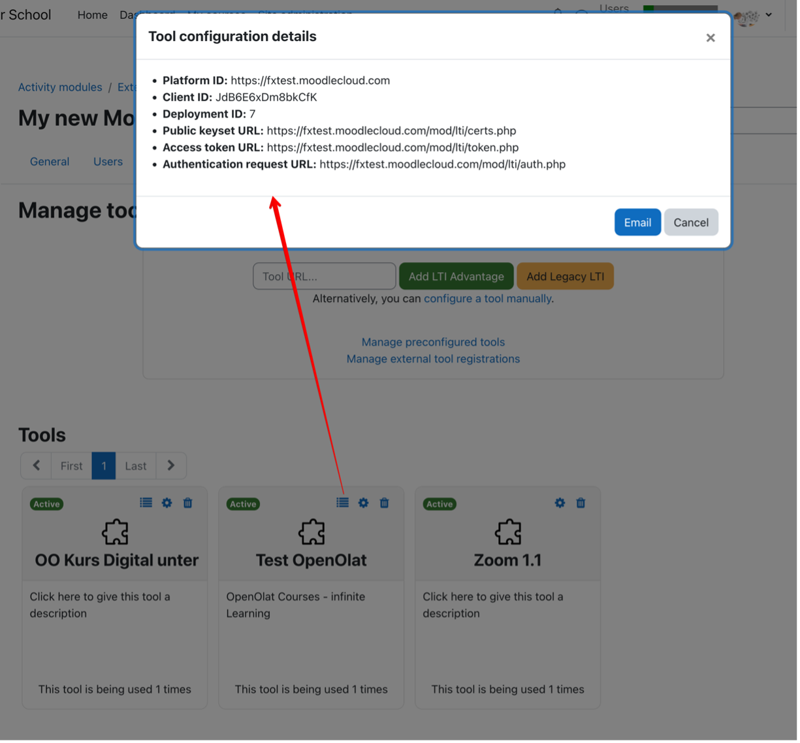{ class="shadow lightbox" title="Dialog Tool configuration details in Moodle" }

[Zum Seitenanfang ^](#LTI_integrate_course_into_moodle)

---

## 2. Setup "Externe Plattform" in OpenOlat {: #setup_step2}

Die Administration von LTI 1.3 befindet sich in der System-Administration von OpenOlat unter folgendem Pfad: 
`Administration > Externe Werkzeuge > LTI`

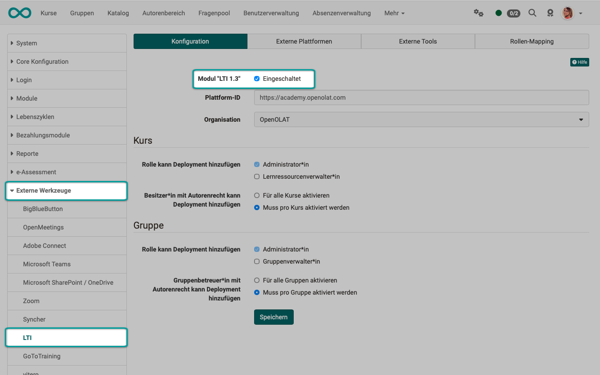{ class="shadow lightbox" title="Tab Konfiguration der LTI-Administration" }

Im Tab "Externe Plattformen" erfassen Sie die Moodle-Instanz mit dem Button "Neue externe Plattform":

| Feld					| Bemerkung |
| --------------------- | ---------------------------------------------- |
| Name				| Frei definierbar |
| Plattform-ID / Issuer	| URL zur Moodle-Instanz |
| Client-ID				| Client ID aus dem Dialog "Tool configuration details" in Moodle |
| Öffentlicher Schlüsseltyp | RSA-Schlüssel -> dieser Schlüssel wird anschliessend in der Tool-Konfiguration auf Moodle ergänzt |
| Authorization	 		| Aus Moodle: Authentication request URL |
| URL für Zugriffstoken	| Aus Moodle: Access token URL |
| URL des öffentlichen Schlüsselbundes | Aus Moodle: Public Keyset URL |

Tragen Sie nach Abschluss des Formulars den Öffentlichen Schlüssel auf Moodle in der Tool-Konfiguration ein.

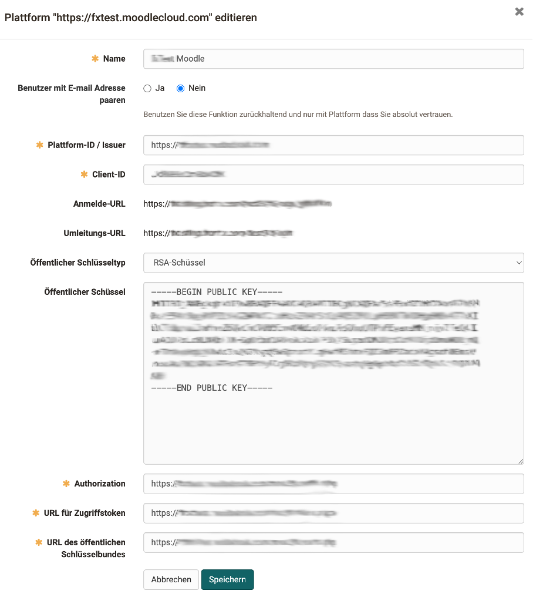{ class="shadow lightbox" title="Dialog Plattform editieren in OpenOlat" }

[Zum Seitenanfang ^](#LTI_integrate_course_into_moodle)

---

## 3. LTI-Freigabe des Kurses in OpenOlat {: #setup_step3}

Die Freigabe eines OpenOlat-Kurses (oder einer OpenOlat-Gruppe) erfolgt in den Einstellungen unter folgendem Pfad: 
`Kurs > Administration > Einstellungen > Tab "Freigabe" > Abschnitt "LTI 1.3 Zugangskonfiguration"`

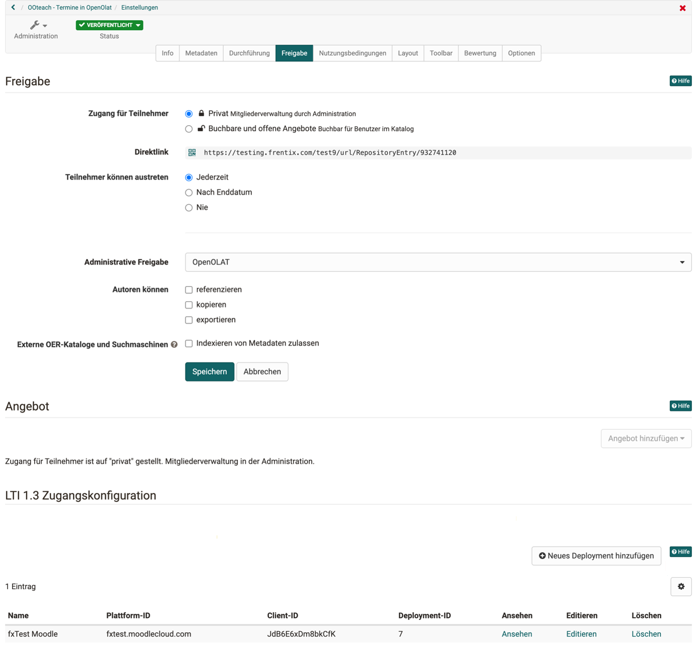{ class="shadow lightbox" title="Tab Freigabe der Kurseinstellungen" }

Ergänzen Sie mit dem Button "Neues Deployment hinzufügen" ein Deployment für den Kurs (oder die Gruppe):

| Feld					| Bemerkung |
| --------------------- | ---------------------------------------------- |
| Plattform				| Auswahl der konfigurierten Moodle-Instanz |
| Deployment-ID 		| Aus Moodle: Deployment ID aus dem Dialog "Tool configuration details". Dieselbe Deployment-ID darf in mehreren Kursen derselben Plattform stehen, im selben Kurs nur einmal. |
| Tool URL				| Von OpenOlat vorgegeben, nur lesbar. Die Tool URL des externen Tools in Moodle aus Schritt 1 muss mit dieser Adresse beginnen. |

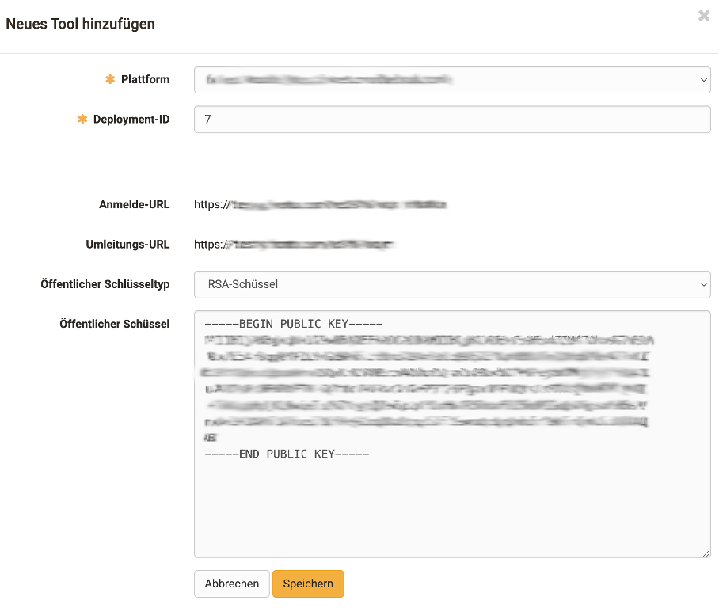{ class="shadow lightbox" title="Dialog Neues Tool hinzufügen in OpenOlat" }

Sollen mehrere OpenOlat-Kurse über dieselbe Deployment-ID erreichbar sein, geben Sie jeden Kurs einzeln frei. Mehr dazu im Benutzerhandbuch unter: 
[Eine Deployment-ID für mehrere Kurse >](../../manual_user/learningresources/LTI_Share_courses.de.md#deployment_id_several_courses)

Mehr zum Abschnitt LTI 1.3 Zugangskonfiguration finden Sie im Benutzerhandbuch unter: 
[Kurseinstellungen - Tab Freigabe >](../../manual_user/learningresources/Course_Settings_Share.de.md#section_LTI)

[Zum Seitenanfang ^](#LTI_integrate_course_into_moodle)

---

## 4. Einbinden des externen Tools (=OpenOlat) im Moodle-Kurs {: #setup_step4}

Im Moodle-Kurs kann nun das externe Tool (OpenOlat) eingefügt werden.

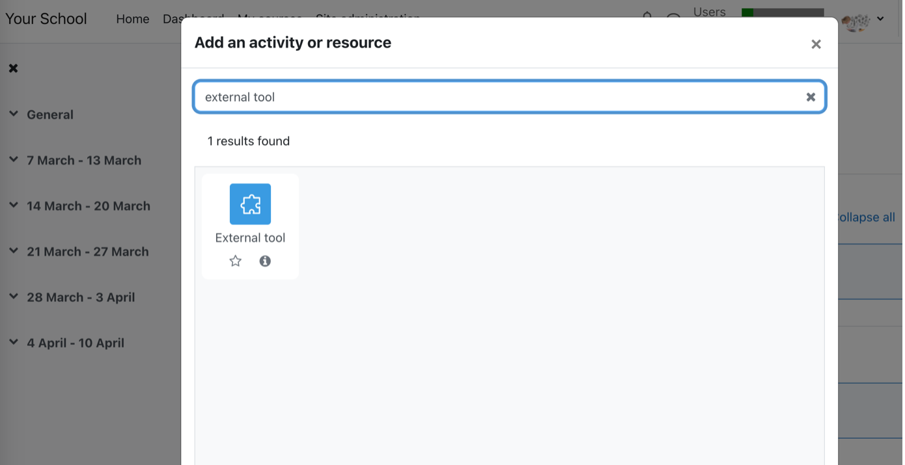{ class="shadow lightbox" title="Dialog Add an activity or resource in Moodle" }

Der konfigurierte OpenOlat-Kurs lässt sich hier im externen Tool auf Moodle als "preconfigured tool" auswählen.

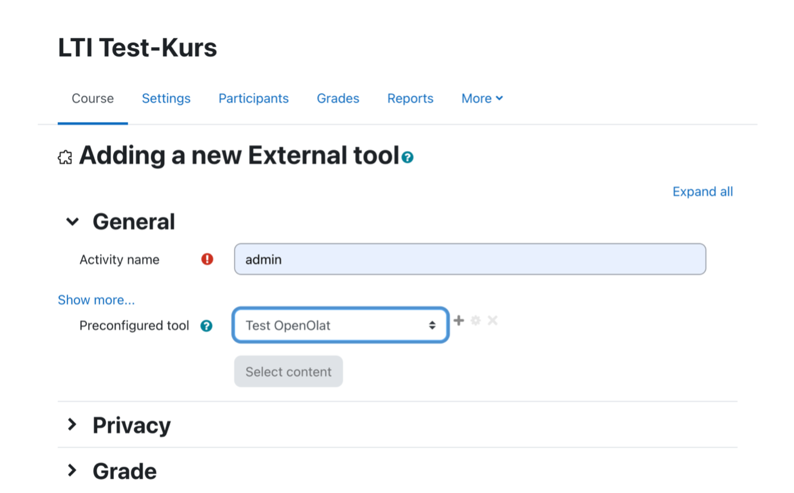{ class="shadow lightbox" title="Seite Adding a new External tool in Moodle" }

[Zum Seitenanfang ^](#LTI_integrate_course_into_moodle)

---

## 5. Verbindungstest {: #setup_step5}

Ob die Konfiguration geklappt hat, lässt sich mit einem einfachen Test-Aufruf prüfen.

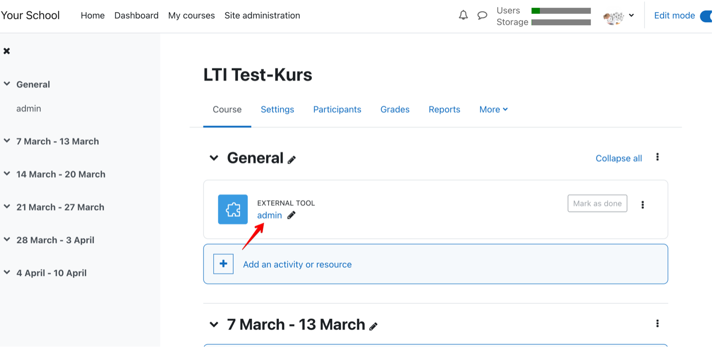{ class="shadow lightbox" title="Kursseite in Moodle" }

Der Link in Moodle sollte den gewünschten OpenOlat-Kurs in einem neuen Fenster öffnen.

!!! warning "Achtung"

    Wenn Sie schon in einem anderen Tab in OpenOlat eingeloggt sind, werden Sie dort ausgeloggt.

Im OpenOlat-Kurs können Sie den Test-Aufruf in der Mitgliederverwaltung verifizieren: Der LTI-Aufruf hat ein neues Konto angelegt und der Gruppe "LTI: Name der Plattform" hinzugefügt.

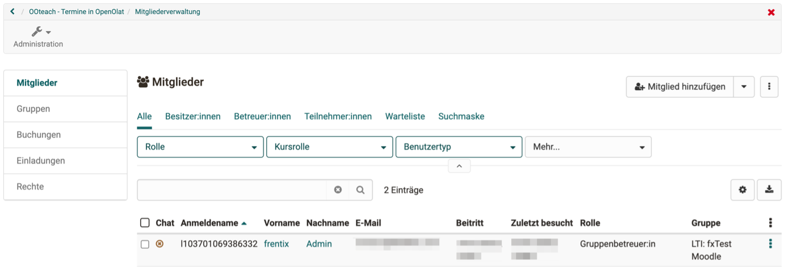{ class="shadow lightbox" title="Mitgliederverwaltung des Kurses" }

[Zum Seitenanfang ^](#LTI_integrate_course_into_moodle)

---

## Weiterführende Informationen {: #further_information}

**Auf dieser Seite erwähnt** 
[LTI 1.3 Integrationen >](../../manual_admin/administration/LTI_Integrations.de.md) 
[LTI - Externe Plattformen >](../../manual_admin/administration/LTI_External_platforms.de.md) 
[LTI Zugang zu einem Kurs konfigurieren >](../../manual_user/learningresources/LTI_Share_courses.de.md) 
[Kurseinstellungen - Tab Freigabe >](../../manual_user/learningresources/Course_Settings_Share.de.md)

**Weiterführend** 
[LTI-Zugang zu einer Gruppe konfigurieren >](../../manual_user/groups/LTI_Share_groups.de.md) 
[Kursbaustein "LTI-Seite" >](../../manual_user/learningresources/Course_Element_LTI_Page.de.md) 
[LTI - Externe Werkzeuge >](../../manual_admin/administration/LTI_External_tools.de.md) 
[LTI - Deep Linking >](../../manual_admin/administration/LTI_Deeplinking.de.md) 
[LTI - Rollen-Mapping >](../../manual_admin/administration/LTI_Role_Mapping.de.md)

[Zum Seitenanfang ^](#LTI_integrate_course_into_moodle)

