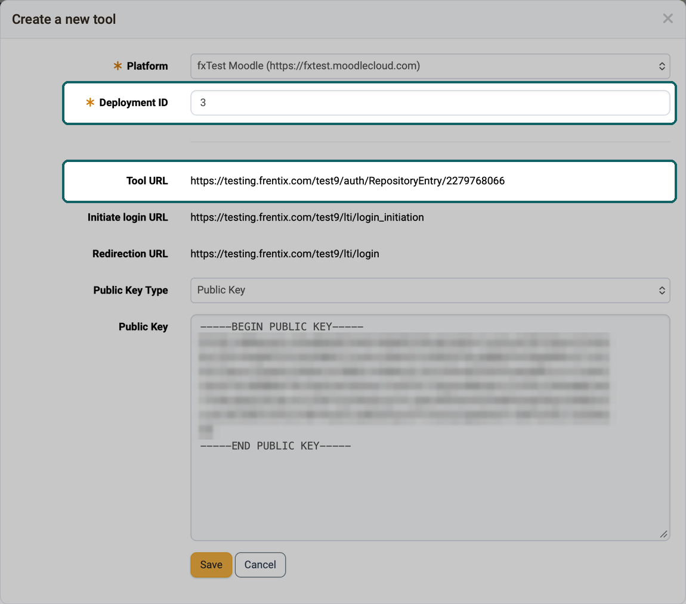

# How do I integrate an OpenOlat course into Moodle? {: #LTI_integrate_course_into_moodle}

??? abstract "Objectives and content of this instruction"

    You have created a course in OpenOlat and would like to offer it outside your OpenOlat on a Moodle platform? 
    The following instructions show you the procedure step by step.

??? abstract "Target group"

    [x] Authors [ ] Coaches  [ ] Participants

    [ ] Beginners [x] Advanced users  [x] Experts

??? abstract "Expected previous knowledge"

    * Administration manual: [LTI 1.3 Integrations >](../../manual_admin/administration/LTI_Integrations.md)
    * Administration manual: [LTI - External Platforms >](../../manual_admin/administration/LTI_External_platforms.md)
    * User manual: [Configure LTI access to a course >](../../manual_user/learningresources/LTI_Share_courses.md)

---

To display an OpenOlat course on another platform, in the following instructions this is Moodle, a connection is established according to the LTI 1.3 standard (Learning Tools Interoperability). 

So that the users of the Moodle platform can access the OpenOlat course from their system, the two platforms must communicate with each other, and on the OpenOlat side the course (and only this course) must be released for this external access.

## Requirements {: #conditions}

Administrator access must be ensured in both systems for the configuration. In OpenOlat, the System administrator role opens the system administration, where the external platform is entered. Who may release a course via LTI is defined by the system administration in the "Configuration" tab under `Administration > External tools > LTI`. Preferably, the configuration is done on both systems at the same time, since certain dialogs have to be configured in both systems in direct succession.

[To the top of the page ^](#LTI_integrate_course_into_moodle)

---

## Configuration procedure {: #config_process}

1. [Setup "External Tool" in Moodle](#setup_step1)
2. [Setup "External platform" in OpenOlat](#setup_step2)
3. [LTI release of the course in OpenOlat](#setup_step3)
4. [Embedding the external tool (=OpenOlat) in the Moodle course](#setup_step4)
5. [Connection test](#setup_step5)

## 1. Setup "External Tool" in Moodle  {: #setup_step1}

The administration of the external tools in Moodle is located under the following path: 
`Site administration > Plugins > External Tool > Manage Tools`

{ class="shadow lightbox" title="Site administration in Moodle" }

For the configuration with OpenOlat, the option "**configure a tool manually**" must be selected.

{ class="shadow lightbox" title="Manage tools page in Moodle" }

The following parameters must be defined in the dialog as minimum requirements:

| Field					| Comment |
| --------------------- | ---------------------------------------------- |
| Tool name				| Freely definable |
| Tool URL				| Direct link to the OpenOlat course.   The URL has the following format: `https://<OpenOlat-URL>/auth/RepositoryEntry/<Course-ID>`  (Make sure that no / is added at the end of the URL.) |
| LTI Version			| LTI 1.3 |
| Client ID				| Only becomes visible after saving in this form |
| Public key type		| RSA key |
| Public key			| Is generated in OpenOlat, can only be entered afterwards |
| Initiate Login URL	| Initiate login URL, format: `https://<OpenOlat-URL>/lti/login_initiation` |
| Redirection URL(s)	| Redirection URL, format: `https://<OpenOlat-URL>/lti/login` |
| Tool Configuration Usage| Show in activity chooser and as a preconfigured tool |
| Default Launch Container	| New window (OpenOlat only supports running the courses in a new window.) |

{ class="shadow lightbox" title="External tool configuration form in Moodle" }

After saving, you can call up further details in the overview via the details link in the LTI tool. The details are needed for the setup of the external platform in OpenOlat:

{ class="shadow lightbox" title="Tool configuration details dialog in Moodle" }

[To the top of the page ^](#LTI_integrate_course_into_moodle)

---

## 2. Setup "External platform" in OpenOlat {: #setup_step2}

The administration of LTI 1.3 is located in the system administration of OpenOlat under the following path: 
`Administration > External tools > LTI`

{ class="shadow lightbox" title="Configuration tab of the LTI administration" }

In the "External platforms" tab, enter the Moodle instance with the "Add external platform" button:

| Field					| Comment |
| --------------------- | ---------------------------------------------- |
| Name				| Freely definable |
| Platform ID / Issuer	| URL of the Moodle instance |
| Client ID				| Client ID from the "Tool configuration details" dialog in Moodle |
| Public Key Type | Public Key -> this key is then added to the tool configuration on Moodle |
| Authorization	 		| From Moodle: Authentication request URL |
| Token URI	| From Moodle: Access token URL |
| JWK-Set URI | From Moodle: Public Keyset URL |

After completing the form, enter the public key on Moodle in the tool configuration.

{ class="shadow lightbox" title="Edit platform dialog in OpenOlat" }

[To the top of the page ^](#LTI_integrate_course_into_moodle)

---

## 3. LTI release of the course in OpenOlat {: #setup_step3}

An OpenOlat course (or an OpenOlat group) is released in the settings under the following path: 
`Course > Administration > Settings > Tab "Share" > Section "LTI 1.3 access configuration"`

{ class="shadow lightbox" title="Share tab of the course settings" }

Add a deployment for the course (or the group) with the "Add deployment" button:

| Field					| Comment |
| --------------------- | ---------------------------------------------- |
| Platform				| Selection of the configured Moodle instance |
| Deployment ID 		| From Moodle: Deployment ID from the "Tool configuration details" dialog. The same deployment ID may be used in several courses of the same platform, but only once in the same course. |
| Tool URL				| Provided by OpenOlat, read-only. The Tool URL of the external tool in Moodle from step 1 must begin with this address. |
| Initiate login URL, Redirection URL | Provided by OpenOlat, read-only. The same addresses are entered in Moodle in step 1 under Initiate Login URL and Redirection URL(s). |
| Public Key | The public key of the selected platform, read-only. It is the same key as in the dialog of the external platform from step 2. "Public Key Type" switches the display between "Public Key" and "URL". |

{ class="shadow lightbox" title="Create a new tool dialog in OpenOlat · 2026.10.07" }

If several OpenOlat courses are to be reachable via the same deployment ID, share each course individually. More about this in the user manual under: 
[One deployment ID for several courses >](../../manual_user/learningresources/LTI_Share_courses.md#deployment_id_several_courses)

You can find more about the LTI 1.3 access configuration section in the user manual under: 
[Course settings - Tab Share >](../../manual_user/learningresources/Course_Settings_Share.md#section_LTI)

[To the top of the page ^](#LTI_integrate_course_into_moodle)

---

## 4. Embedding the external tool (=OpenOlat) in the Moodle course {: #setup_step4}

The external tool (OpenOlat) can now be inserted in the Moodle course.

{ class="shadow lightbox" title="Add an activity or resource dialog in Moodle" }

The configured OpenOlat course can be selected here in the external tool on Moodle as a "preconfigured tool".

{ class="shadow lightbox" title="Adding a new External tool page in Moodle" }

[To the top of the page ^](#LTI_integrate_course_into_moodle)

---

## 5. Connection test {: #setup_step5}

Whether the configuration has worked can be checked with a simple test call.

{ class="shadow lightbox" title="Course page in Moodle" }

The link in Moodle should open the desired OpenOlat course in a new window.

!!! warning "Attention"

    If you are already logged in to OpenOlat in another tab, you will be logged out there.

In the OpenOlat course, you can verify the test call in the members management: the LTI call has created a new account and added it to the group "LTI: name of the platform".

{ class="shadow lightbox" title="Members management of the course" }

[To the top of the page ^](#LTI_integrate_course_into_moodle)

---

## Further information {: #further_information}

**Mentioned on this page** 
[LTI 1.3 Integrations >](../../manual_admin/administration/LTI_Integrations.md) 
[LTI - External Platforms >](../../manual_admin/administration/LTI_External_platforms.md) 
[Configure LTI access to a course >](../../manual_user/learningresources/LTI_Share_courses.md) 
[Course settings - Tab Share >](../../manual_user/learningresources/Course_Settings_Share.md)

**Further reading** 
[Configure LTI access to a group >](../../manual_user/groups/LTI_Share_groups.md) 
[Course Element "LTI Page" >](../../manual_user/learningresources/Course_Element_LTI_Page.md) 
[LTI - External tools >](../../manual_admin/administration/LTI_External_tools.md) 
[LTI - Deep Linking >](../../manual_admin/administration/LTI_Deeplinking.md) 
[LTI - Role mapping >](../../manual_admin/administration/LTI_Role_Mapping.md)

[To the top of the page ^](#LTI_integrate_course_into_moodle)

