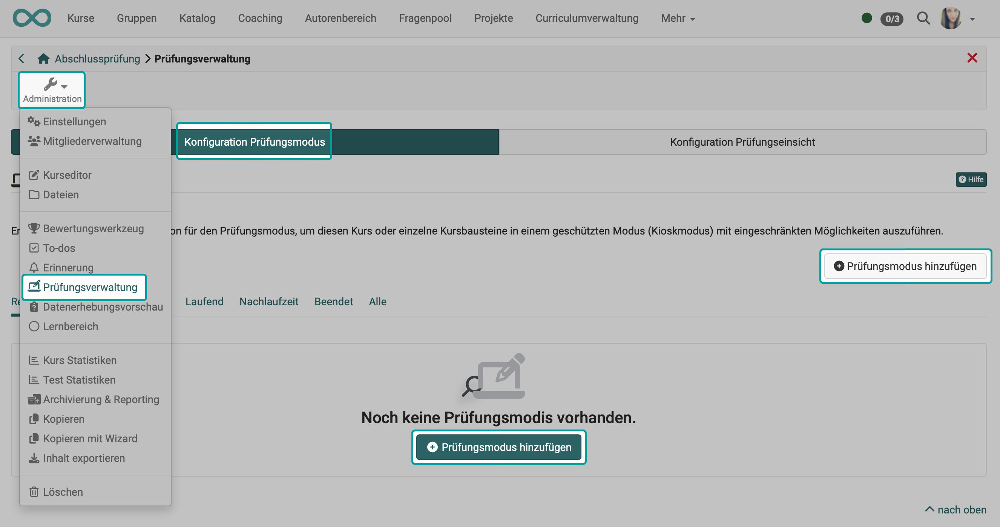
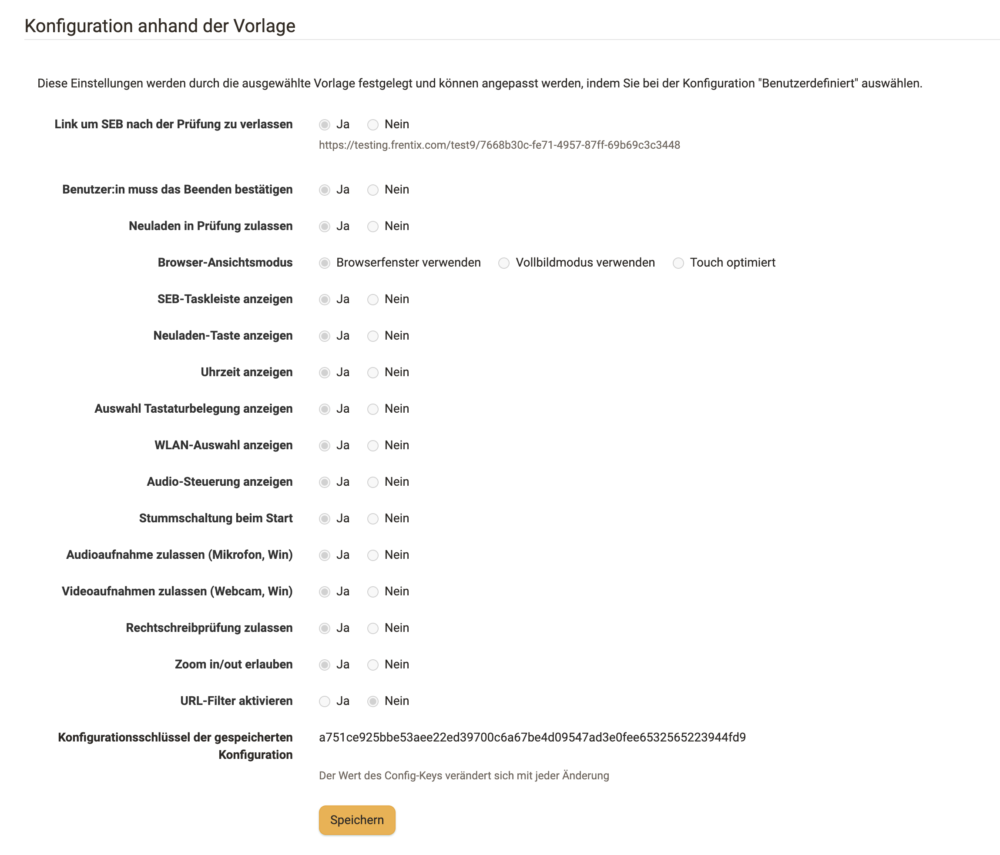
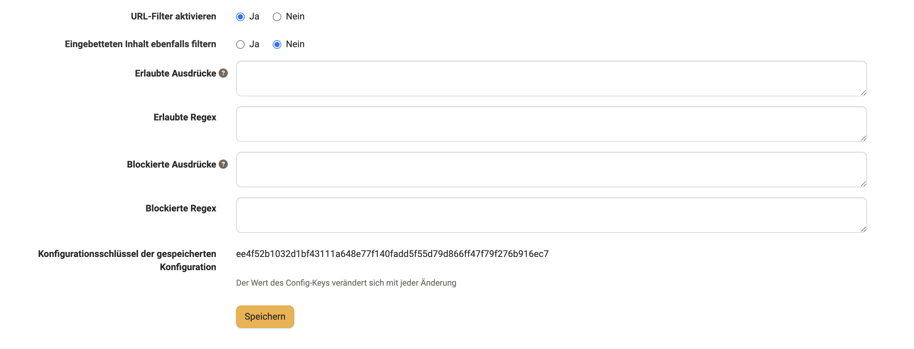
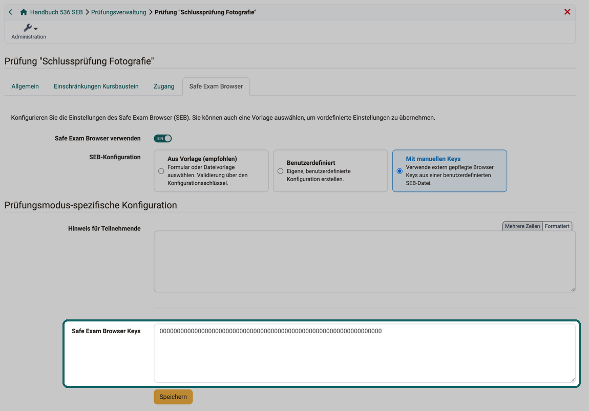
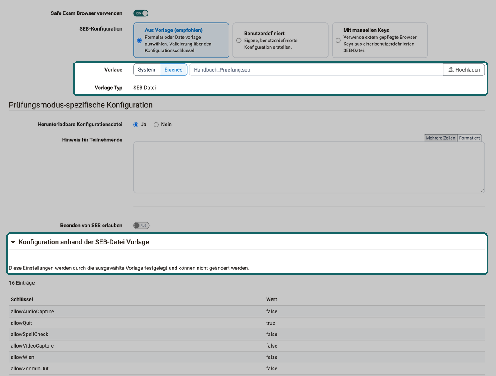
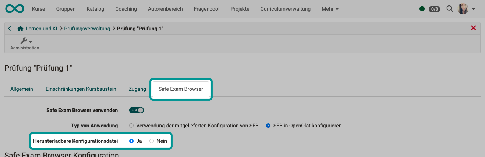
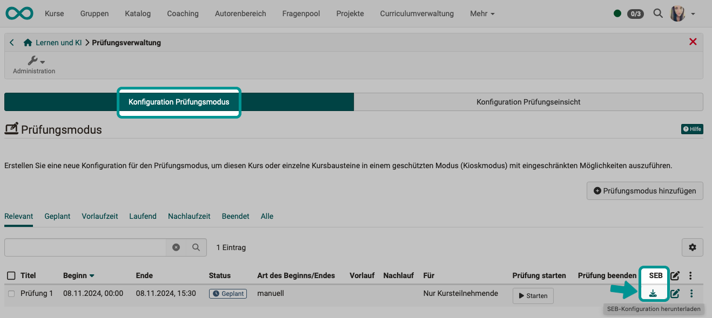
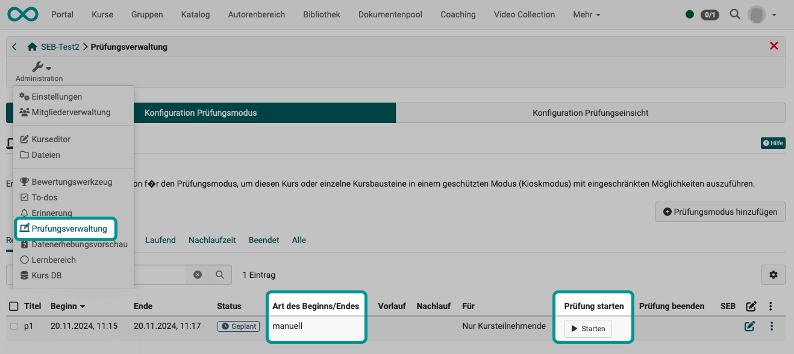
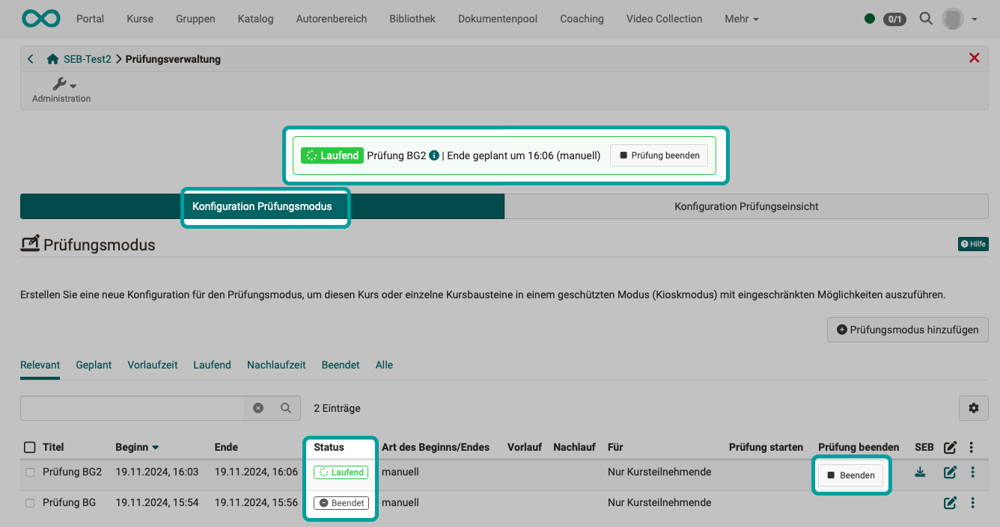

# Wie bereite ich eine Prüfung mit dem Safe Exam Browser (SEB) vor? {: #SEB}

??? abstract "Ziel und Inhalt dieser Anleitung"

    Sie haben bereits einen Kurs mit einem Test-Kursbaustein erstellt und wollen nun die Prüfung mit dem Safe Exam Browser durchführen. 
    Die folgende Anleitung zeigt Ihnen, wie Sie dabei den SEB verwenden.

??? abstract "Zielgruppe"

    [x] Autor:innen [x] Betreuer:innen  [ ] Teilnehmer:innen

    [ ] Anfänger:innen [x] Fortgeschrittene  [x] Expert:innen

??? abstract "Erwartete Vorkenntnisse"

    * ["Wie erstelle ich meinen ersten OpenOlat-Kurs?"](../my_first_course/my_first_course.de.md)
    * ["Wie gehe ich vor, wenn ich einen Test erstelle?"](../test_creation_procedure/test_creation_procedure.de.md)

---

## Der SEB - Was ist das? [:octicons-tag-16:{ title="ab Release 10.2 (OO-1349)" }](https://track.frentix.com/issue/OO-1349){:target="_blank"} {: #SEB_description}

Statt eine Online-Prüfung mit Browsern wie Edge, Firefox, Safari oder Chrome durchzuführen, kann zum Aufruf der OpenOlat-Online-Prüfung der [Safe Exam Browser](http://www.safeexambrowser.org) zur Pflicht gemacht werden. Dieser spezielle Browser ermöglicht es, dass während des Prüfungszeitraums die Möglichkeit andere Websites aufzurufen oder Funktionen wie Copy&Paste deaktiviert sind (Kioskmodus). Dadurch wird die Verwendung unerlaubter Quellen während einer Prüfung unterbunden. 

Unter `Kurs > Administration > Prüfungsverwaltung` kann ein [Prüfungsmodus](../../manual_user/learningresources/Assessment_mode.de.md) konfiguriert werden, der Bedingungen (Zeitfenster usw.) einer Prüfung festlegt. Im Rahmen eines [Prüfungsmodus](../../manual_user/learningresources/Assessment_mode.de.md) kann auch bestimmt werden, ob der SEB verwendet werden soll. Wird diese Option aktiviert, kann direkt dort in OpenOlat eine Konfiguration des SEB vorgenommen und eine Konfigurationsdatei zum Versand an die Teilnehmer:innen erzeugt werden. 

!!! info "Der SEB ist ein externes Tool"

    Der Safe Exam Browser wird nicht von der frentix GmbH entwickelt, deshalb können wir weder Garantien übernehmen noch direkt Einfluss auf die Funktionalität nehmen. Auch unser Support beschränkt sich auf die OpenOlat-seitigen Konfigurationsmöglichkeiten zum Aufruf dieses externen Tools.

[zum Seitenanfang ^](#SEB)

---

## Wie richte ich als OpenOlat Autor:in eine Prüfung mit dem SEB ein? {: #SEB_setup}

!!! tip "Voraussetzung: Vorkonfiguration durch die Administration"
    Bevor Sie den Safe Exam Browser in einem Prüfungsmodus verwenden können, muss die Administration den Prüfungsmodus systemweit einschalten. Damit Sie im Prüfungsmodus eine Vorlage aus dem System wählen können, legt die Administration zudem mindestens eine [SEB-Konfigurationsvorlage](../../manual_admin/administration/e-Assessment_AssessmentMgmt.de.md#tab_seb) an oder importiert eine `.seb`-Datei als Vorlage. Diese Vorkonfiguration steht nur Administrator:innen zur Verfügung. Als Autor:in wählen Sie anschliessend im Prüfungsmodus eine bereitgestellte Vorlage aus, laden eine eigene SEB-Datei hoch oder erstellen eine eigene Konfiguration (siehe [Schritt 4: Konfigurieren](#SEB_configuration)).

### Schritt 1: SEB installieren {: #SEB_installation} 

Die Installationsdatei finden Sie auf der [Web Site des Herstellers](http://www.safeexambrowser.org/download_de.html).

Fordern Sie auch alle Prüfungsteilnehmer:innen auf, den SEB auf ihrem Rechner zu installieren. Bzw. wenn für die Prüfung gesonderte Rechner zur Verfügung gestellt werden, bereiten Sie diese Rechner alle entsprechend vor.

!!! info "Hinweis"
    Von Administrator:innen kann festgelegt werden, dass mindestens eine bestimmte SEB-Version benutzt werden muss. 
    [Mehr dazu > ](../../manual_how-to/SEB_Admin/SEB_Admin.de.md#SEB_min_version)

[zum Seitenanfang ^](#SEB)

---

### Schritt 2: Prüfungsmodus erstellen {: #create_assessment_mode}

Als Autor:in des OpenOlat-Prüfungskurses erstellen Sie einen Prüfungsmodus unter  
`Kurs > Administration > Prüfungsverwaltung > Tab "Konfiguration Prüfungsmodus" > Button "Prüfungsmodus hinzufügen"`

{ class="shadow lightbox" title="Prüfungsverwaltung im Kurs" }

Arbeiten Sie im Kurs mit Terminen, können Sie stattdessen einen Termin als Prüfung markieren: im 3-Punkte-Menü des Termins mit "Als Prüfung markieren". Der Prüfungsmodus übernimmt dann Datum, Zeit und Teilnehmende aus dem Termin. Sein Dialog hat keine Tabs, und die Art der SEB-Konfiguration gibt die System-Administration für alle Kurse vor. Die Schritte 3 und 4 gelten für diesen Weg deshalb nicht: [Prüfungsmodus aus einem Termin](../../manual_user/learningresources/Assessment_mode.de.md#exam_from_event)

[zum Seitenanfang ^](#SEB)

---

### Schritt 3: SEB aktivieren {: #activate_SEB}

In einem Prüfungsmodus ist die Verwendung des SEB optional. Wird es gewünscht, aktivieren Sie diese Option unter 

`Kurs > Administration > Prüfungsverwaltung > Tab "Konfiguration Prüfungsmodus" > Modus auswählen/bearbeiten > Tab "Safe Exam Browser"`

{ class="shadow lightbox" title="Tab Safe Exam Browser im Dialog einer Prüfung" }

[zum Seitenanfang ^](#SEB)

---

### Schritt 4: Konfigurieren {: #SEB_configuration}
Sobald der SEB aktiviert wurde, werden die Konfigurationsoptionen angezeigt. Nachstehend sind die Optionen und ihre Auswirkungen auf die Teilnehmersicht kurz beschrieben.

Bei Konfiguration in OpenOlat gilt: 
Die vorgeschlagenen Einstellungen können in der OpenOlat-Systemadministration so gesetzt werden. Sie können also als Empfehlung Ihres/Ihrer Administrator:in zum Übernehmen betrachtet werden.

{ class="shadow lightbox" title="Tab Safe Exam Browser im Dialog einer Prüfung · 2026.10.02" }

#### SEB-Konfiguration {: #type_of_use}

Legen Sie fest, woher der SEB seine Einstellungen für diese Prüfung bezieht:

- **Aus Vorlage (empfohlen)**: Die Einstellungen kommen aus einer Vorlage der Administration oder aus einer eigenen SEB-Datei. Die Gültigkeit prüft OpenOlat über den Konfigurationsschlüssel.
- **Benutzerdefiniert**: Sie stellen die Einstellungen für diese Prüfung selbst zusammen. Vorbelegt sind die Werte der Standardvorlage, wenn diese ein Formular ist.
- **Mit manuellen Keys**: Sie verwenden eine eigene SEB-Datei, die ausserhalb von OpenOlat gepflegt wird, und tragen deren Safe Exam Browser Keys in OpenOlat ein. (Mehr dazu auf der [Web Site des Herstellers](http://www.safeexambrowser.org).) In diesem Fall erübrigen sich bis auf den Hinweistext die nachfolgend aufgelisteten Konfigurationsoptionen.

Vollständige `.seb-Konfigurationsdateien` lassen sich zudem in der Administration als Vorlage importieren, siehe [Prüfungsverwaltung](../../manual_admin/administration/e-Assessment_AssessmentMgmt.de.md#tab_seb).

!!! note "Hinweis"
    Der Import einer `.seb`-Datei als Vorlage für alle Kurse erfolgt im Administrationsbereich und steht nur Administrator:innen zur Verfügung. Eine SEB-Datei für eine einzelne Prüfung laden Sie als Autor:in bzw. Kursbesitzer:in selbst hoch, siehe [Vorlage](#template).

#### Vorlage {: #template}

Bei "Aus Vorlage (empfohlen)" wählen Sie mit zwei Schaltflächen die Quelle:

- **System**: Wählen Sie aus dem Dropdown eine der von der Administration bereitgestellten SEB-Konfigurationsvorlagen. Die als Standard markierte Vorlage ist vorausgewählt.
- **Eigenes**: Laden Sie mit "Hochladen" eine eigene, unverschlüsselte SEB-Datei hoch. OpenOlat zeigt deren Einstellungen schreibgeschützt an.

#### Vorlage Typ {: #configuration}

Zeigt, ob die Vorlage ein "Formular" oder eine "SEB-Datei" ist. Bei einem Formular steht daneben der Button "Kopie erstellen und anpassen". Er übernimmt die Werte der Vorlage in eine Konfiguration "Benutzerdefiniert", die Sie für diese Prüfung ändern können.

Die folgenden vier Felder stehen unter der Legende **"Prüfungsmodus-spezifische Konfiguration"** und gelten nur für diesen Prüfungsmodus. Bei einem Formular aus dem System übernimmt die Prüfung "Hinweis für Teilnehmende", "Beenden von SEB erlauben" und das Kennwort aus der Vorlage; ändern lässt sich dann nur "Herunterladbare Konfigurationsdatei". Bei einer SEB-Datei und bei "Benutzerdefiniert" speichert die Prüfung ihre eigenen Werte.

#### Herunterladbare Konfigurationsdatei {: #downloadable_config_file}

Wird hier "Ja" gewählt, kann die Konfigurationsdatei durch die Prüfungsteilnehmer:innen bei gestartetem Prüfungsmodus aus OpenOlat heruntergeladen werden. Auch Autor:innen können die Datei jederzeit herunterladen und an die Prüfungsteilnehmer:innen verschicken. Siehe [Schritt 6](#download_SEB_configfile).

Wird hier "Nein" gewählt, besteht die Downloadmöglichkeit für Teilnehmer:innen nicht mehr, für Autor:innen jedoch weiterhin, wie in [Schritt 6](#download_SEB_configfile) beschrieben.

#### Hinweis für Teilnehmende {: #information_for_participants}

Der hier eingegebene Hinweistext erscheint, sobald die Prüfungsteilnehmer:innen mit den SEB starten. Sie können hier z.B. nochmals auf die Prüfungsbedingungen und die Einschränkungen durch den SEB hinweisen.

#### Beenden von SEB erlauben {: #allow_exit}

Manche Prüfungsteilnehmer:innen sind teilweise früher fertig und können dann bis zum eingestellten Ende des Prüfungsmodus nicht auf OpenOlat oder andere Websites zugreifen.
Besteht keine Gefahr von Missbrauch (gegenseitiger Hilfe), kann den Prüfungsteilnehmer:innen das Beenden des SEB erlaubt werden, sobald sie ihre Prüfung abgegeben haben. In diesem Fall wird ein Quit-Button rechts unten auf dem Bildschirm angezeigt. Der Schalter ändert nur diese Einstellung, die übrigen Werte der Prüfung bleiben erhalten.

#### Beenden/Entsperren-Kennwort {: #password_for_quitting}

Dieses Eingabefeld wird als Konfigurationsmöglichkeit nur angezeigt, wenn das Beenden des SEB erlaubt wurde.
Klicken Prüfungsteilnehmer:innen den Quit-Button zum Beenden der Einschränkungen des SEB, werden sie zur Eingabe dieses Passworts aufgefordert.

Bei einer SEB-Datei überschreibt das Kennwort das Kennwort der Datei für diese Prüfung. Unter dem Feld steht dann der Hinweis "Überschreibt das Passwort der Vorlage. Der Config Key wird automatisch neu berechnet." Bei "Benutzerdefiniert" erscheint dieser Hinweis nicht.

Bei einer Prüfung in einem gemeinsamen Prüfungsraum kann dieses Passwort zum Beispiel die Prüfungsaufsicht jeweils denjenigen Personen bekannt geben, die den Prüfungsraum verlassen.

Die weiteren Felder stehen unter der Legende **"Konfiguration anhand der Vorlage"**. Sie sind durch die gewählte Vorlage vorbelegt und lassen sich anpassen, sobald Sie bei "SEB-Konfiguration" die Option «Benutzerdefiniert» wählen oder "Kopie erstellen und anpassen" klicken.

{ class="shadow lightbox" title="Legende Konfiguration anhand der Vorlage" }

#### Link um SEB nach der Prüfung zu verlassen {: #link_to_quit}

Wenn kein Quit-Button angezeigt werden soll, kann dieser Link innerhalb der Prüfung an geeigneter Stelle angegeben werden. Mit ihm können die Prüfungsteilnehmer:innen dann den Safe Exam Browser verlassen.

#### Benutzer:in muss das Beenden bestätigen {: #confirm_quitting}

Ist diese Option aktiviert, müssen alle Prüfungsteilnehmer:innen das Beenden der Prüfung nochmals bestätigen. Dies ist als Sicherheitsmassnahme vorgesehen, damit eine Prüfung nicht versehentlich beendet wird.

#### Neuladen in Prüfung zulassen {: #enable_reload}

Wird das erneute Laden der Website (Prüfungsseite) während der laufenden Prüfung zugelassen, erscheint bei den Prüfungsteilnehmer:innen rechts unten auf dem Bildschirm ein Button zum Neuladen.

#### Browser-Ansichtsmodus {: #browser_view_mode}

Wählen Sie einen der angegebenen Modi. Wenn keine weiteren Websites freigegeben wurden, empfiehlt sich der Vollbildmodus. Sollen die Prüfungsteilnehmer:innen auf bestimmte freigegebene Seiten zugreifen, kann die Verwendung von Browserfenstern sinnvoll sein.

#### SEB-Taskleiste anzeigen {: #show_tasklist}

Diese Option hat Einfluss auf einige andere Optionen. Wenn die Taskleiste nicht angezeigt wird, fehlen auch die Anzeigen für den Beenden-Button, Audio-Steuerung, Uhrzeit, Tastaturbelegung und WLAN-Auswahl.

#### Neuladen-Taste anzeigen {: #show_reload_button}

Ist das erneute Laden erlaubt, wird links oben ein Button zum Neuladen angezeigt. Bei "Nein" ist er ausgegraut und kann nicht verwendet werden.

#### Uhrzeit anzeigen {: #show_time_clock}

Ein hilfreiches Feature für die Prüfungsteilnehmer:innen, um die verbleibende Restzeit im Blick zu behalten.

#### Auswahl Tastaturbelegung anzeigen {: #show_keyboard_layout}

Es wird eine Auswahl für Tastaturbelegungen zum Sprachenwechsel angezeigt.

#### WLAN-Auswahl anzeigen {: #show_wlan_chooser}

Die Auswahl erreichbarer WLAN-Netze wird rechts unten in der Taskleiste angezeigt, wenn die Option auf "Ja" gesetzt ist.

#### Audio-Steuerung anzeigen {: #enable_audio_controls}

Die Audiosteuerung kann rechts unten in der Taskleiste angezeigt werden. Diese Option wird für Prüfungen mit Video oder Audio benötigt.

#### Stummschaltung beim Start {: #mute_on_startup}

Mit deaktivierter Audio-Steuerung verhindert diese Option das Verwenden von Audio Devices.

#### Audioaufnahme zulassen (Mikrofon, Win) {: #allow_audio_capture}

Es empfiehlt sich, diese Option nur zu aktivieren, wenn ausdrücklich Audioaufnahmen während der Prüfung erwünscht sind.

#### Videoaufnahmen zulassen (Webcam, Win) {: #allow_video_capture}

Es empfiehlt sich, diese Option nur zu aktivieren, wenn ausdrücklich Videoaufnahmen während der Prüfung erwünscht sind.

#### Rechtschreibprüfung zulassen {: #enable_spell_checking}

Je nach Prüfungsgegenstand kann die Rechtschreibprüfung (derzeit nur Englisch) deaktiviert oder verfügbar gemacht werden. Wenn die Option auf "Ja" gesetzt ist, werden falsch geschriebene Wörter rot unterstrichen.

#### Zoom in/out erlauben {: #allow_zoom}

Gründe für eine Unterdrückung des Zoom könnten z.B. sein, dass die Prüfungsteilnehmer:innen auf Bildmaterial durch Zoom unerwünscht Schrift lesen könnten. In der Regel sollte jedoch Zoom erlaubt sein, um (insbesondere bei BYOD - Bring your own device) eine gute Lesbarkeit zu gewährleisten. Gezoomt werden kann mit Strg + und Strg -, sowie im Menü oben rechts.

#### URL-Filter aktivieren {: #enable_url_filtering}

Ist der Filter aktiviert, werden alle Webseiten bis auf die Prüfung blockiert. Mit der Aktivierung werden weitere Optionen zur Konfiguration angezeigt. Dort können Sie genauer steuern, welche URLs während der Prüfung ausserdem noch aufgerufen werden dürfen.

{ class="shadow lightbox" title="Legende Konfiguration anhand der Vorlage" }

#### Eingebetteten Inhalt ebenfalls filtern {: #filter_embedded_content}

Wird diese Option gewählt, wird auch im Inhalt einer Seite geprüft, ob erlaubte/nicht erlaubte Ausdrücke enthalten sind und entsprechend ein Zugriff freigegeben oder blockiert.

#### Erlaubte Ausdrücke {: #expressions_allowed}

Die in dieser Positivliste angegebenen Ausdrücke dürfen von den Prüfungsteilnehmer:innen während aktivem Prüfungsmodus gesucht werden.

#### Erlaubte Regex {: #regex_allowed}

Regex sind "Regular Expressions" (= Platzhalter). Es kann in dieser Positivliste angegeben werden, welche Ausdrücke mit Platzhaltern von den Prüfungsteilnehmer:innen während aktivem Prüfungsmodus gesucht werden dürfen.

#### Blockierte Ausdrücke {: #expressions_blocked}

Hier angegebene Ausdrücke blockieren den Zugriff auf URLs und Dateinamen auf dem eigenen Rechner, die diese Ausdrücke enthalten.
Wenn die Option "Eingebetteten Inhalt ebenfalls filtern" gewählt ist, auch wenn sie in deren Inhalten gefunden werden.

#### Blockierte Regex {: #regex_blocked}

URLs mit den hier angegebenen Regex-Ausdrücken (Ausdrücken mit Platzhaltern) werden blockiert. Wird der eingebettete Inhalt ebenfalls gefiltert, werden auch solche Seiten blockiert.

#### Konfigurationsschlüssel der gespeicherten Konfiguration {: #config_key}

Wird die Konfigurationsdatei in OpenOlat erstellt, muss dieser Schlüssel nicht separat eingetragen werden. Lediglich wenn Sie eine Konfigurationsdatei selbst bearbeiten, wird er benötigt.

!!! tip "Wichtiger Hinweis"
    Bei jeder Änderung an der Konfigurationsdatei ändert sich der generierte Schlüssel. Sie sollten also nur den Schlüssel kopieren und verwenden, nachdem Sie **alle** Einstellungen vorgenommen haben.

Bei **«Mit manuellen Keys»** entfallen die obigen Konfigurationsoptionen; stattdessen erscheint das Feld **«Safe Exam Browser Keys»**, in das Sie die extern gepflegten Keys eintragen:

{ class="shadow lightbox" title="Tab Safe Exam Browser im Dialog einer Prüfung · 2026.10.02" }

Wird eine **SEB-Datei** verwendet, als Vorlage aus dem System oder als eigene Datei hochgeladen, erscheint stattdessen die Legende **«Konfiguration anhand der SEB-Datei Vorlage»**. Die dort gelisteten Einstellungen sind durch die Vorlage festgelegt und schreibgeschützt:

{ class="shadow lightbox" title="Legende Konfiguration anhand der SEB-Datei Vorlage · 2026.10.02" }

[zum Seitenanfang ^](#SEB)

---

### Schritt 5: Konfigurationsdatei erstellen {: #create_SEB_configfile}

Wählen Sie im Tab "Safe Exam Browser" die Option  **"Herunterladbare Konfigurationsdatei: Ja"**. 
Vergessen Sie nicht die Konfiguration zu speichern!

{ class="shadow lightbox" title="Tab Safe Exam Browser im Dialog einer Prüfung" }

[zum Seitenanfang ^](#SEB)

---

### Schritt 6: Konfigurationsdatei herunterladen {: #download_SEB_configfile}

Ist die Konfiguration abgeschlossen (Schritt 5), kehren Sie zum Exportieren der Konfigurationsdatei zurück zur vorherigen Ebene **"Prüfungsverwaltung"**, in der alle Prüfungsmodi aufgelistet sind.

Klicken Sie dort beim betreffenden Prüfungsmodus auf 
`Kurs > Administration > Prüfungsverwaltung > Tab "Konfiguration Prüfungsmodus" > Icon "Herunterladen"`

{ class="shadow lightbox" title="Tab Konfiguration Prüfungsmodus" }

Beispiel: SEBClientSettings.seb

[zum Seitenanfang ^](#SEB)

---

### Schritt 7: Konfigurationsdatei verschicken {: #distribute_SEB_configfile}

Damit die Prüfungsteilnehmer einen Test im SEB starten können, müssen Sie eine Konfigurationsdatei auf ihrem Rechner ausführen. (Beispiel: SEBClientSettings.seb) Die Datei kann den Prüfungsteilnehmern z.B. per Mail zugeschickt werden oder über eine Seite zum Download angeboten werden.

!!! tip "Hinweis zum Download"

    Speichern Sie die SEB-Konfigurationsdatei auf einer Seite, die nicht durch den Safe Exam Browser beschränkt wird, um auch während aktiviertem Prüfungsmodus jederzeit Zugriff zu ermöglichen. (Angabe einer erlaubten Download-Seite in der Konfiguration.)

!!! tip "Hinweis zu anderweitigem Prüfungsbetrug"

    Bedenken Sie: Der Safe Exam Browser schränkt nur die Nutzung des aktuellen Gerätes ein. Es kann jedoch auch Prüfungsbetrug durch Nutzung eines Smartphones, unerlaubte Unterlagen oder Austausch mit anderen Personen erfolgen.

[zum Seitenanfang ^](#SEB)

---

## Starten der Prüfung durch Betreuer:innen

Der Start und die Dauer der Prüfung wird durch die Angabe in der Konfiguration des [Prüfungsmodus](../../manual_user/learningresources/Assessment_mode.de.md) bestimmt. Wird ein manueller Start durch Betreuer:innen gewünscht, kann der Prüfungsmodus unter 
`Kurs > Administration > Prüfungsverwaltung > Tab "Konfiguration Prüfungsmodus"` 
durch Klicken auf den **Starten-Button** begonnen werden. 

{ class="shadow lightbox" title="Tab Konfiguration Prüfungsmodus" }

[zum Seitenanfang ^](#SEB)

---

## Wie starten Teilnehmer:innen eine OpenOlat-Prüfung mit dem SEB? {: #SEB_participants}

**Schritt 1: Installation des SEB** 
Der Safe Exam Browser muss im Voraus auf dem Gerät installiert werden. 
Die Installationsdatei finden Sie auf der [Website des Herstellers](http://www.safeexambrowser.org/download_de.html).

Um Schwierigkeiten zu erkennen, ist eine von den Betreuer:innen vorab organisierte Probeprüfung empfehlenswert. So kann vorab sicher gestellt werden, dass auf allen Rechnern der SEB installiert ist.

**Schritt 2: Erhalt der Konfigurationsdatei** 
Alle Prüfungsteilnehmer:innen müssen von den Betreuer:innen die Konfigurationsdatei erhalten (z.B. per Mail oder als Download).

**Schritt 3: Prüfungsstart durch Aufruf der Konfigurationsdatei** 
Durch Öffnen dieser Konfigurationsdatei starten Prüfungsteilnehmer:innen die Prüfung. Sobald die Konfigurationsdatei doppelt geklickt wird, öffnet sich der SEB und die übrigen Funktionen des Rechners werden eingeschränkt. 

!!! tip "Hinweis"

    Haben Sie Prüfungsteilnehmer:innen, die den SEB nicht installieren wollen, können Sie als Prüfungsleitung evtl. spezielle Prüfungscomputer verleihen. Um sicher zu gehen, weisen Sie darauf hin, dass sich die Prüfungsteilnehmer:innen proaktiv bei den Lehrenden melden sollten.

!!! tip "Bring your own device (BYOD)"

    Der SEB ermöglicht sichere Prüfungen auch auf privaten Rechnern der Prüfungsteilnehmer:innen. Voraussetzung ist, dass der Safe Exam Browser im Voraus auf dem Gerät installiert worden ist. Dann kann mit der verschickten Konfigurationsdatei der SEB auf verschiedenen BYOD-Geräten aufgerufen werden.

[zum Seitenanfang ^](#SEB)

---

## Wie kann ich als Betreuer:in eingreifen, während eine Prüfung mit dem SEB läuft? {: #SEB_intervention}

Grundsätzlich sollte bei laufendem Prüfungsmodus möglichst nicht mehr eingegriffen werden. Ist es aus zwingenden Gründen aber erforderlich, erfolgt der Eingriff über den [Prüfungsmodus](../../manual_user/learningresources/Assessment_mode.de.md).

!!! tip "Hinweis"

    Zur Kommunikation zwischen Betreuer:innen und Prüfungsteilnehmer:innen steht in OpenOlat ein spezieller Prüfungs-Chat zur Verfügung.

    Mehr zur Kommunikation während einer Prüfung erfahren Sie [hier.](../communication_during_exam/communication_during_exam.de.md)

[zum Seitenanfang ^](#SEB)

---

## Wie wird eine Prüfung mit dem SEB beendet? {: #SEB_exit}

Eine Online-Prüfung in OpenOlat kann  
a\) automatisch oder 
b) manuell 
beendet werden.

Wird die Prüfung **manuell** beendet, kann 
\- ein:e Betreuer:in den SEB für alle Prüfungsteilnehmer:innen gleichzeitig stoppen. 
oder
\- jede:r Prüfungsteilnehmer:in den SEB mit einem individuellen Exit-Link selbst stoppen.

### Prüfung automatisch beenden

Der SEB wird im Rahmen eines **Prüfungsmodus** in OpenOlat verwendet. Wird der Prüfungsmodus beendet, wird auch der SEB beendet.
Das automatische Beenden eines Prüfungsmodus wird konfiguriert unter  
`Kurs > Administration > Prüfungsverwaltung > Tab "Konfiguration Prüfungsmodus"`

### Prüfung manuell beenden (Prüfung gleichzeitig für alle Beenden, durch Betreuer:innen)

Es gilt auch hier: Wird der **Prüfungsmodus** durch den/die Betreuer:in beendet, wird auch der SEB beendet. Das manuelle Beenden eines laufenden Prüfungsmodus erfolgt durch Betreuer:innen unter 
`Kurs > Administration > Prüfungsverwaltung > Tab "Konfiguration Prüfungsmodus"`  
Sobald ein Prüfungsmodus aktiviert wurde, wird ein Button "Beenden" bzw "Prüfung beenden" angezeigt. Klicken Sie einen der beiden Buttons. Anschliessend wechselt der Status des Prüfungsmodus auf "Beendet".

{ class="shadow lightbox" title="Tab Konfiguration Prüfungsmodus" }

### Individuelles Beenden per Exit-Link

Wurde es entsprechend konfiguriert (siehe [Schritt 4](#SEB_configuration)), wird in der rechten unteren Ecke des SEB ein Quit-Button angezeigt. Klicken Prüfungsteilnehmer:innen auf diesem Link, werden Sie aufgefordert, das Passwort zum Verlassen einzugeben. Teilnehmer:innen können den Browser nur beenden, wenn Sie dieses Passwort haben. Als Betreuer:in können Sie das Passwort zum gegebenen Zeitpunkt verkünden. (Z.B. wenn Prüfungsteilnehmer:innen das Prüfungszimmer verlassen möchten.)

[zum Seitenanfang ^](#SEB)

---

## SEB während der Einsichtnahme in die Prüfungsergebnisse [:octicons-tag-16:{ title="ab Release 18.2 (OO-7425)" }](https://track.frentix.com/issue/OO-7425){:target="_blank"} {: #SEB_exam_inspection}

Durch Verwendung des SEB können alle anderen Aktivitäten auf dem Computer auch während der Einsichtnahme in die Prüfungsergebnisse gesperrt werden.

Sie aktivieren den SEB für eine Einsichtnahme im Ablaufschema der Prüfungseinsicht, nicht im Prüfungsmodus. Öffnen Sie dazu als Kursbesitzer:in `Kurs > Administration > Prüfungsverwaltung > Tab "Konfiguration Prüfungseinsicht"`, wählen Sie ein Ablaufschema und schalten Sie im Tab "Safe Exam Browser (SEB)" den Schalter **"Safe Exam Browser verwenden"** ein. Danach wählen Sie die SEB-Konfiguration und die Vorlage.

[zu den Details > ](../../manual_user/learningresources/Assessment_inspection.de.md#seb_tab) 
[zum Seitenanfang ^](#SEB)

---

## Checkliste {: #SEB_checklist}

- [x] Prüfungsteilnehmer:innen informiert, dass Verwendung des SEB Pflicht ist?
- [x] Download und Installation des Safe Exam Browsers auf allen Geräten der Teilnehmer:innen?
- [x] Kommunikation während der Prüfung vorher geklärt? (z.B. Verwendung des Prüfungs-Chats)
- [x] Ggf. Mitteilung des Passworts für Exit geregelt? (z.B. individuelle Bekanntgabe kurz vor Verlassen des Prüfungsraums)
- [x] Verfahren zum Beenden der Prüfung vorab geklärt?
- [x] Probeklausur durchgeführt? Mit allen Prüfungsteilnehmer:innen?
- [x] Prüfungsmodus konfiguriert?
- [x] SEB im Prüfungsmodus aktiviert?
- [x] SEB-Konfigurationsdatei erstellt?
- [x] SEB-Konfigurationsdatei verschickt?
- [x] Instruktion zum Beenden der Prüfung gegeben? 

[zum Seitenanfang ^](#SEB)

---

## Weiterführende Informationen {: #further_information}

**Auf dieser Seite erwähnt** 
[Wie erstelle ich meinen ersten OpenOlat-Kurs? >](../my_first_course/my_first_course.de.md) 
[Wie gehe ich vor, wenn ich einen Test erstelle? >](../test_creation_procedure/test_creation_procedure.de.md) 
[Website des Herstellers >](http://www.safeexambrowser.org) 
[Safe Exam Browser herunterladen >](http://www.safeexambrowser.org/download_de.html) 
[Prüfungsmodus >](../../manual_user/learningresources/Assessment_mode.de.md) 
[e-Assessment Administration: Prüfungsverwaltung >](../../manual_admin/administration/e-Assessment_AssessmentMgmt.de.md) 
[Wie richte ich als Administrator:in den Safe Exam Browser (SEB) systemweit ein? >](../SEB_Admin/SEB_Admin.de.md) 
[Kommunikation während einer Prüfung >](../communication_during_exam/communication_during_exam.de.md) 
[Prüfungsverwaltung: Prüfungseinsicht >](../../manual_user/learningresources/Assessment_inspection.de.md)

**Weiterführend** 
[Test Einstellungen - Administration >](../../manual_user/learningresources/Test_settings.de.md) 
[Bewertungswerkzeug - Übersicht >](../../manual_user/learningresources/Assessment_tool_overview.de.md)

[zum Seitenanfang ^](#SEB)

