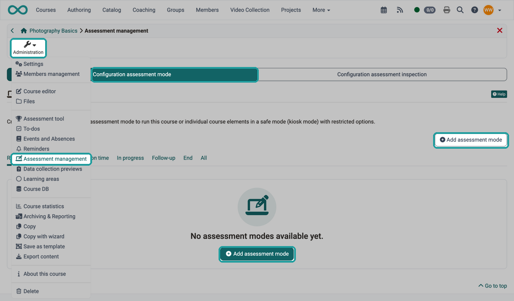
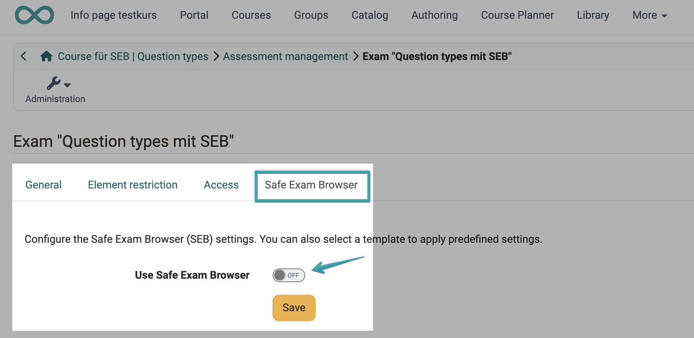
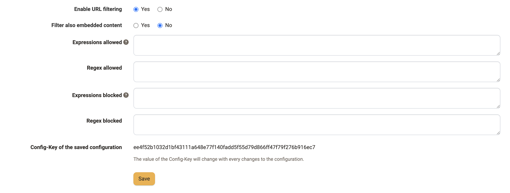
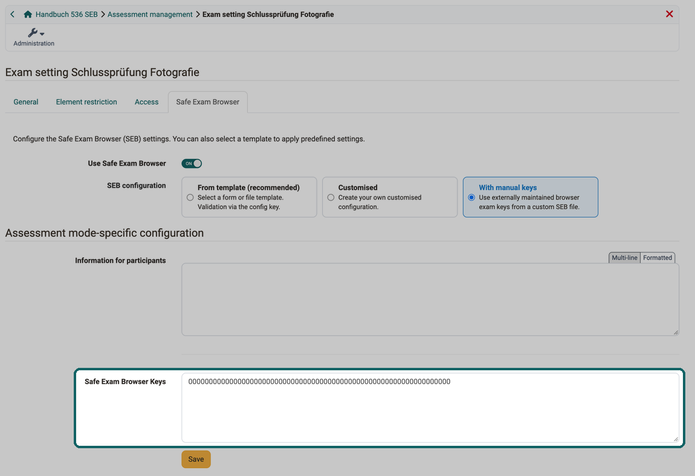
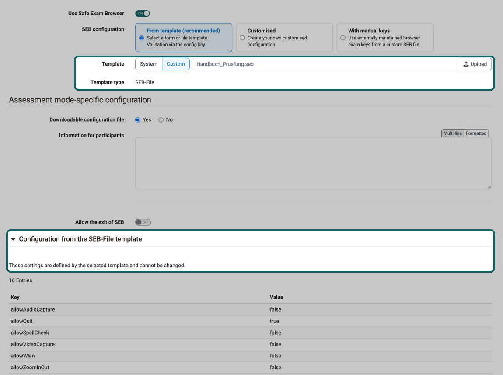
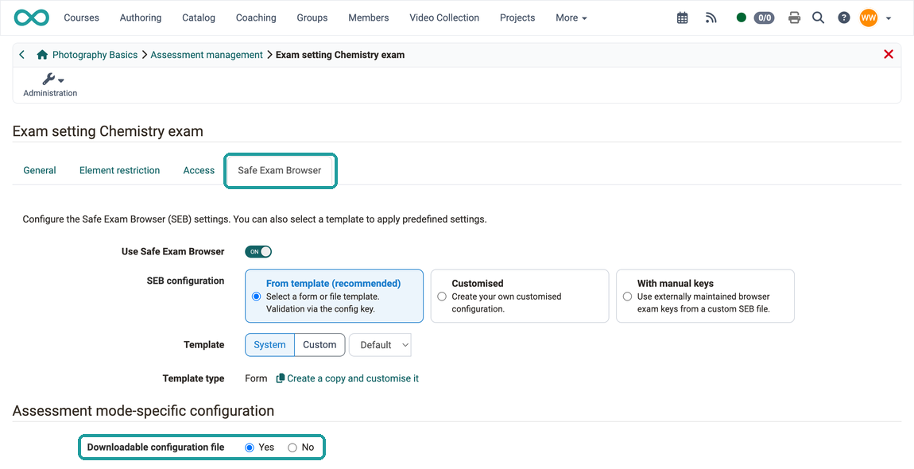
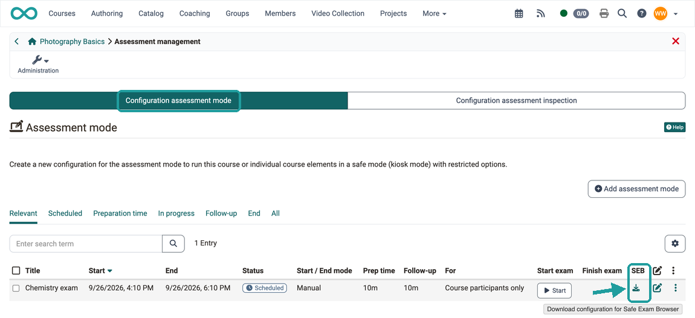
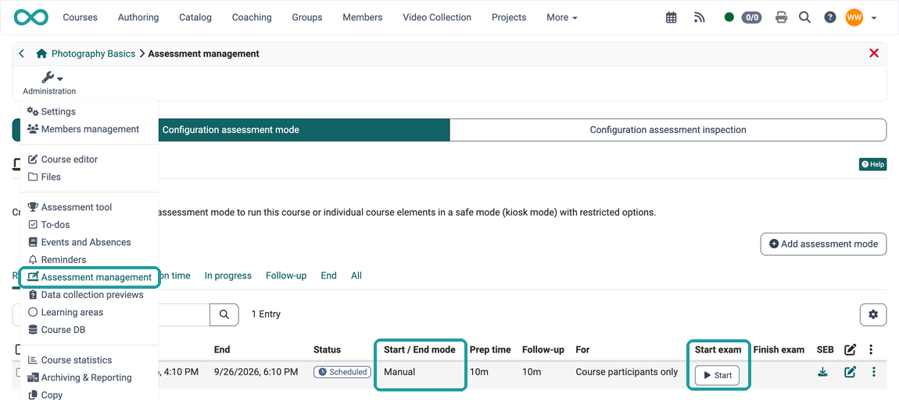
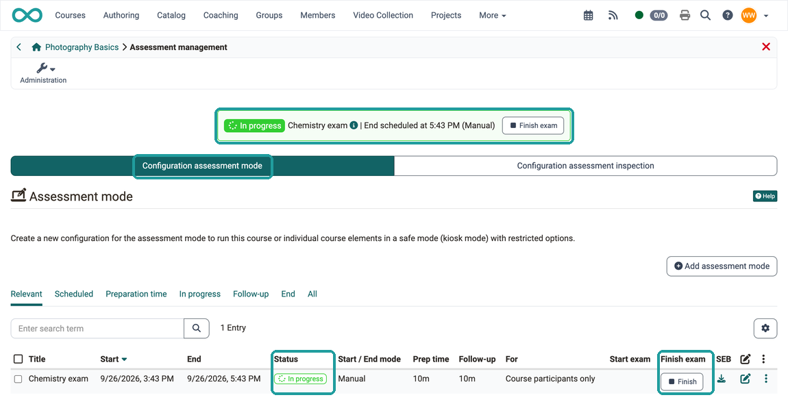

# How do I prepare an exam with the Safe Exam Browser (SEB)? {: #SEB}

??? abstract "Aim and content of these instructions"

    You have already created a course with a test course element and now want to take the exam with the Safe Exam Browser. 
    The following instructions show you how to use the SEB.

??? abstract "Target group"

    [x] Authors [x] Coaches [ ] Participants

    [ ] Beginners [x] Advanced users  [x] Experts

??? abstract "Expected previous knowledge"

    * ["How do I create my first OpenOlat course?"](../my_first_course/my_first_course.md)
    * ["How do I proceed when creating a test?"](../test_creation_procedure/test_creation_procedure.md)

---

## The SEB - What is it? [:octicons-tag-16:{ title="from Release 10.2 (OO-1349)" }](https://track.frentix.com/issue/OO-1349){:target="_blank"} {: #SEB_description}

Instead of performing an online exam with browsers such as Edge, Firefox, Safari or Chrome, the [Safe Exam Browser](http://www.safeexambrowser.org) can be made mandatory to call up the OpenOlat online exam. This special browser makes it possible to disable the ability to access other websites or functions such as copy & paste during the exam period (kiosk mode). This prevents the use of unauthorized sources during an exam. 

An [Assessment mode](../../manual_user/learningresources/Assessment_mode.md) can be configured under `Course > Administration > Assessment management`, which defines the conditions (time window etc.) of an exam. As part of an [Assessment mode](../../manual_user/learningresources/Assessment_mode.md), you can also determine whether the SEB should be used. If this option is activated, the SEB can be configured directly there in OpenOlat and a configuration file can be generated for sending to the participants. 

!!! info "The SEB is an external tool"

    The Safe Exam Browser is not developed by frentix GmbH, therefore we can neither guarantee nor directly influence its functionality. Our support is also limited to the OpenOlat-side configuration options for calling up this external tool.

[To the top of the page ^](#SEB)

---

## As an OpenOlat author, how do I set up an exam with the SEB? {: #SEB_setup}

!!! tip "Prerequisite: Pre-configuration by the administration"
    Before you can use the Safe Exam Browser in an assessment mode, the administration must enable the assessment mode system-wide. So that you can select a template from the system in the assessment mode, the administration also creates at least one [SEB configuration template](../../manual_admin/administration/e-Assessment_AssessmentMgmt.md#tab_seb) or imports a `.seb` file as a template. This pre-configuration is only available to administrators. As an author, you then select a provided template in the assessment mode, upload your own SEB-File or create your own configuration (see [Step 4: Configuration](#SEB_configuration)).

### Step 1: SEB installation {: #SEB_installation} 

The installation file can be found on the [Web site of the manufacturer](https://www.safeexambrowser.org/download_en.html).

Also ask all exam participants to install the SEB on their computer. Or, if separate computers are provided for the exam, prepare these computers accordingly.

!!! info "Note"
    Administrators can specify that at least a certain version of SEB must be used. 
    [See details > ](../../manual_how-to/SEB_Admin/SEB_Admin.md#SEB_min_version)

[To the top of the page ^](#SEB)

---

### Step 2: Create assessment mode {: #create_assessment_mode}

As author of the OpenOlat exam course, you create an assessment mode under  
`Course > Administration > Assessment management > Tab "Configuration assessment mode" > Button "Add assessment mode"`

{ class="shadow lightbox" title="Assessment management in the course" }

If you work with events in the course, you can mark an event as an exam instead: in the 3-dot menu of the event with "Mark as exam". The assessment mode then takes the date, time and participants from the event. Its dialog has no tabs, and the system administration defines the type of the SEB configuration for all courses. Steps 3 and 4 therefore do not apply to this route: [Assessment mode from an event](../../manual_user/learningresources/Assessment_mode.md#exam_from_event)

[To the top of the page ^](#SEB)

---

### Step 3: Activate SEB {: #activate_SEB}

The use of the SEB is optional in an assessment mode. If desired, activate this option under 

`Course > Administration > Assessment management > Tab "Configuration assessment mode" > Select/edit mode > Tab "Safe Exam Browser"`

{ class="shadow lightbox" title="Tab Safe Exam Browser in the exam dialog" }

[To the top of the page ^](#SEB)

---

### Step 4: Configuration {: #SEB_configuration}
As soon as the SEB has been activated, the configuration options are displayed. The options and their effects on the participants' view are briefly described below.

For configuration in OpenOlat applies: 
The suggested settings can be set in the OpenOlat system administration. They can therefore be regarded as a recommendation from your administrator to adopt them.

{ class="shadow lightbox" title="Tab Safe Exam Browser in the exam dialog · 2026.10.02" }

#### SEB configuration {: #type_of_use}

Define where the SEB takes its settings for this exam from:

- **From template (recommended)**: The settings come from a template of the administration or from your own SEB-File. OpenOlat checks the validity via the config key.
- **Customised**: You put together the settings for this exam yourself. They are prefilled with the values of the default template if this is a form.
- **With manual keys**: You use your own SEB-File that is maintained outside of OpenOlat and enter its Safe Exam Browser Keys in OpenOlat. (More about this on the [manufacturer's website](http://www.safeexambrowser.org).) In this case, apart from the information text, the configuration options listed below are unnecessary.

Complete `.seb configuration files` can also be imported as templates in the administration, see [Assessment management](../../manual_admin/administration/e-Assessment_AssessmentMgmt.md#tab_seb).

!!! note "Note"
    The import of a `.seb` file as a template for all courses takes place in the administration area and is only available to administrators. As an author or course owner, you upload a SEB-File for a single exam yourself, see [Template](#template).

#### Template {: #template}

With "From template (recommended)", you choose the source with two buttons:

- **System**: Select one of the SEB configuration templates provided by the administration from the dropdown. The template marked as default is preselected.
- **Custom**: Upload your own unencrypted SEB-File with "Upload". OpenOlat displays its settings read-only.

#### Template type {: #configuration}

Shows whether the template is a "Form" or a "SEB-File". For a form, the button "Create a copy and customise it" appears next to it. It takes the values of the template into a "Customised" configuration that you can change for this exam.

The following four fields are under the legend **"Assessment mode-specific configuration"** and only apply to this assessment mode. With a form from the system, the exam takes "Information for participants", "Allow the exit of SEB" and the password from the template; only "Downloadable configuration file" can be changed then. With a SEB-File and with "Customised", the exam saves its own values.

#### Downloadable configuration file {: #downloadable_config_file}

If "Yes" is selected here, the configuration file can be downloaded from OpenOlat by the exam participants when the assessment mode is started. Authors can also download the file at any time and send it to the exam participants. See [Step 6](#download_SEB_configfile).

If "No" is selected here, the download option is no longer available for participants, but is still available for authors, as described in [Step 6](#download_SEB_configfile).

#### Information for participants {: #information_for_participants}

The information text entered here appears as soon as the exam participants start the SEB. For example, you can point out the examination conditions and the restrictions imposed by the SEB again here.

#### Allow the exit of SEB {: #allow_exit}

Some exam participants finish earlier and are then unable to access OpenOlat or other websites until the end of the assessment mode.
If there is no risk of abuse (mutual assistance), exam participants can be allowed to exit the SEB as soon as they have submitted their exam. In this case, a Quit button is displayed at the bottom right of the screen. The switch only changes this setting, the other values of the exam remain unchanged.

#### Password for quitting {: #password_for_quitting}

This input field is only displayed as a configuration option if exiting the SEB has been permitted.
If exam participants click the Quit button to end the SEB restrictions, they will be prompted to enter this password.

With a SEB-File, the password overwrites the password of the file for this exam. The note "Overwrites the template's password. The config key is automatically recalculated." then appears below the field. With "Customised", this note does not appear.

In the case of an exam in a common examination room, for example, the exam invigilator can give this password to each person leaving the examination room.

The other fields are under the legend **"Configuration from the template"**. They are preset by the selected template and can be adjusted as soon as you select the option "Customised" for "SEB configuration" or click "Create a copy and customise it".

{ class="shadow lightbox" title="Legend Configuration from the template" }

#### Link to quit SEB after exam {: #link_to_quit}

If no Quit button is to be displayed, this link can be provided in a suitable place within the exam. Exam participants can then use it to exit the Safe Exam Browser.

#### Ask user to confirm quitting {: #confirm_quitting}

If this option is activated, all exam participants must confirm the end of the exam again. This is intended as a safety measure to ensure that an exam is not ended accidentally.

#### Enable reload in exam {: #enable_reload}

If the website (exam page) is allowed to be reloaded while the exam is running, a reload button will appear at the bottom right of the screen for the exam participants.

#### Browser view mode {: #browser_view_mode}

Select one of the specified modes. If no other websites have been shared, full screen mode is recommended. If the exam participants are to access certain shared pages, it may be useful to use browser windows.

#### Show SEB task-list {: #show_tasklist}

This option affects some other options. If the taskbar is not displayed, the displays for the exit button, audio control, time, keyboard layout and WLAN selection are also missing.

#### Show reload button {: #show_reload_button}

If reloading is permitted, a button for reloading is displayed at the top left. If "No" is selected, it is grayed out and cannot be used.

#### Show time clock {: #show_time_clock}

A helpful feature for exam participants to keep an eye on the remaining time.

#### Show keyboard layout {: #show_keyboard_layout}

A selection of keyboard layouts for changing languages is displayed.

#### Show WLAN chooser {: #show_wlan_chooser}

The selection of accessible WLAN networks is displayed at the bottom right of the taskbar if the option is set to "Yes".

#### Enable audio controls {: #enable_audio_controls}

The audio control can be displayed at the bottom right of the taskbar. This option is required for exams with video or audio.

#### Mute on startup {: #mute_on_startup}

If audio control is deactivated, this option prevents the use of audio devices.

#### Allow audio capture (microphone, Win) {: #allow_audio_capture}

It is recommended that you only activate this option if audio recordings are explicitly desired during the exam.

#### Allow video capture (webcam, Win) {: #allow_video_capture}

It is recommended that you only activate this option if video recordings are explicitly desired during the exam.

#### Enable spell checking {: #enable_spell_checking}

Depending on the subject of the exam, the spell check (currently only English) can be deactivated or made available. If the option is set to "Yes", misspelled words are underlined in red.

#### Allow browser zoom in/out {: #allow_zoom}

Reasons for suppressing the zoom could be, for example, that the exam participants could read unwanted writing on image material through zoom. As a rule, however, zoom should be allowed in order to ensure good readability (especially with BYOD - Bring your own device). You can zoom with Ctrl + and Ctrl -, as well as in the menu at the top right.

#### Enable URL filtering {: #enable_url_filtering}

If the filter is activated, all websites are blocked except for the exam. When activated, further configuration options are displayed. There you can control more precisely which URLs may also be accessed during the exam.

{ class="shadow lightbox" title="Legend Configuration from the template" }

#### Filter also embedded content {: #filter_embedded_content}

If this option is selected, the content of a page is also checked to see whether it contains permitted/not permitted expressions and access is enabled or blocked accordingly.

#### Expressions allowed {: #expressions_allowed}

The expressions specified in this positive list may be searched for by the exam participants during active assessment mode.

#### Regex allowed {: #regex_allowed}

Regex are "regular expressions" (= placeholders). This positive list can be used to specify which expressions with placeholders may be searched for by exam participants while the assessment mode is active.

#### Expressions blocked {: #expressions_blocked}

Expressions specified here block access to URLs and file names on your own computer that contain these expressions.
If the option "Filter also embedded content" is selected, also if they are found in their content.

#### Regex blocked {: #regex_blocked}

URLs with the regex expressions (expressions with placeholders) specified here are blocked. If the embedded content is also filtered, such pages are also blocked.

#### Config-Key of the saved configuration {: #config_key}

If the configuration file is created in OpenOlat, this key does not need to be entered separately. It is only required if you edit a configuration file yourself.

!!! tip "Important note"
    The generated key changes with every change to the configuration file. You should therefore only copy and use the key after you have made **all** the settings.

With **"With manual keys"**, the configuration options above are omitted; instead the field **"Safe Exam Browser Keys"** appears, where you enter the externally maintained keys:

{ class="shadow lightbox" title="Tab Safe Exam Browser in the exam dialog · 2026.10.02" }

If a **SEB-File** is used, as a template from the system or uploaded as your own file, the legend **"Configuration from the SEB-File template"** appears instead. The settings listed there are defined by the template and read-only:

{ class="shadow lightbox" title="Legend Configuration from the SEB-File template · 2026.10.02" }

[To the top of the page ^](#SEB)

---

### Step 5: Create configuration file {: #create_SEB_configfile}

In the "Safe Exam Browser" tab, select the option  **"Downloadable configuration file: Yes"**. 
Don't forget to save the configuration!

{ class="shadow lightbox" title="Tab Safe Exam Browser in the exam dialog" }

[To the top of the page ^](#SEB)

---

### Step 6: Download configuration file {: #download_SEB_configfile}

Once the configuration is complete (step 5), return to the previous level **"Assessment management"**, where all assessment modes are listed, to export the configuration file.

For the relevant assessment mode, click on 
`Course > Administration > Assessment management > Tab "Configuration assessment mode" > Icon "Download"`

{ class="shadow lightbox" title="Tab Configuration assessment mode" }

Example: SEBClientSettings.seb

[To the top of the page ^](#SEB)

---

### Step 7: Send configuration file {: #distribute_SEB_configfile}

In order for the exam participants to be able to start a test in the SEB, they must run a configuration file on their computer. (Example: SEBClientSettings.seb) The file can be sent to the exam participants by email, for example, or offered for download via a page.

!!! tip "Note for download"

    Save the SEB configuration file on a page that is not restricted by the Safe Exam Browser in order to allow access at any time, even when the assessment mode is activated. (Specify a permitted download page in the configuration.)

!!! tip "Note on other examination fraud"

    Please note: The Safe Exam Browser only restricts the use of the current device. However, exam fraud can also occur through the use of a smartphone, unauthorized documents or exchanges with other people.

[To the top of the page ^](#SEB)

---

## Starting the exam by coaches

The start and duration of the exam is determined by the specification in the configuration of the [Assessment mode](../../manual_user/learningresources/Assessment_mode.md). If a manual start by coaches is desired, the assessment mode can be started under 
`Course > Administration > Assessment management > Tab "Configuration assessment mode"` 
by clicking on the **Start button**. 

{ class="shadow lightbox" title="Tab Configuration assessment mode" }

[To the top of the page ^](#SEB)

---

## How do participants start an OpenOlat exam with the SEB? {: #SEB_participants}

**Step 1: Installation of the SEB** 
The Safe Exam Browser must be installed on the device in advance. 
The installation file can be found on the [manufacturer's website](http://www.safeexambrowser.org/download_en.html).

In order to identify difficulties, a trial exam organized by the coaches in advance is recommended. This ensures that the SEB is installed on all computers in advance.

**Step 2: Receiving the configuration file** 
All exam participants must receive the configuration file from the coaches (e.g. by email or as a download).

**Step 3: Start the exam by opening the configuration file** 
Exam participants start the exam by opening this configuration file. As soon as the configuration file is double-clicked, the SEB opens and the other functions of the computer are restricted. 

!!! tip "Note"

    If you have exam participants who do not want to install the SEB, you as the examiner may be able to lend them special exam computers. To be on the safe side, point out that exam participants should proactively contact the teachers.

!!! tip "Bring your own device (BYOD)"

    The SEB also enables secure exams on the exam participants' private computers. The prerequisite is that the Safe Exam Browser has been installed on the device in advance. The SEB can then be accessed on various BYOD devices using the sent configuration file.

[To the top of the page ^](#SEB)

---

## As a coach, how can I intervene while an exam with the SEB is in progress? {: #SEB_intervention}

As a general rule, you should not intervene while the assessment mode is running. However, if it is necessary for compelling reasons, the intervention is carried out via the [Assessment mode](../../manual_user/learningresources/Assessment_mode.md).

!!! tip "Note"

    A special exam chat is available in OpenOlat for communication between coaches and exam participants.

    You can find out more about communication during an exam [here.](../communication_during_exam/communication_during_exam.md)

[To the top of the page ^](#SEB)

---

## How is an exam with the SEB ended? {: #SEB_exit}

An online exam in OpenOlat can be ended  
a\) automatically or 
b) manually 

If the exam is ended **manually**, 
\- a coach can stop the SEB for all exam participants at the same time. 
or
\- each exam participant can stop the SEB themselves with an individual exit link.

### End exam automatically

The SEB is used as part of an **assessment mode** in OpenOlat. If the assessment mode is ended, the SEB is also ended.
The automatic end of an assessment mode is configured under  
`Course > Administration > Assessment management > Tab "Configuration assessment mode"`

### End exam manually (end the exam for all at the same time, by coaches)

This also applies here: If the **assessment mode** is ended by the coach, the SEB is also ended. The manual end of a running assessment mode is carried out by coaches under 
`Course > Administration > Assessment management > Tab "Configuration assessment mode"`  
As soon as an assessment mode has been activated, a "Finish" or "Finish exam" button is displayed. Click one of the two buttons. The status of the assessment mode then changes to "End".

{ class="shadow lightbox" title="Tab Configuration assessment mode" }

### Individual exit via exit link

If it has been configured accordingly (see [Step 4](#SEB_configuration)), a Quit button is displayed in the bottom right-hand corner of the SEB. If exam participants click on this link, they will be asked to enter the password to exit. Participants can only exit the browser if they have this password. As a coach, you can announce the password at the appropriate time. (E.g. when exam participants want to leave the examination room.)

[To the top of the page ^](#SEB)

---

## SEB during the inspection of the exam results [:octicons-tag-16:{ title="from Release 18.2 (OO-7425)" }](https://track.frentix.com/issue/OO-7425){:target="_blank"} {: #SEB_exam_inspection}

By using the SEB, all other activities on the computer can also be blocked while the exam results are being inspected.

You activate the SEB for an inspection in the inspection schedule of the assessment inspection, not in the assessment mode. To do this, open as a course owner `Course > Administration > Assessment management > Tab "Configuration assessment inspection"`, select an inspection schedule and switch on the toggle **"Use Safe Exam Browser"** in the tab "Safe Exam Browser (SEB)". Then select the SEB configuration and the template.

[See the details > ](../../manual_user/learningresources/Assessment_inspection.md#seb_tab) 
[To the top of the page ^](#SEB)

---

## Checklist {: #SEB_checklist}

- [x] Examinees informed that use of the SEB is mandatory?
- [x] Download and installation of the Safe Exam Browser on all participants' devices?
- [x] Communication during the exam clarified beforehand? (e.g. use of the exam chat)
- [x] Is communication of the password for exit regulated? (e.g. individual announcement shortly before leaving the examination room)
- [x] Procedure for ending the audit clarified in advance?
- [x] Mock exam conducted? With all exam participants?
- [x] Exam mode configured?
- [x] SEB activated in test mode?
- [x] SEB configuration file created?
- [x] SEB configuration file sent?
- [x] Instructions given to end the test? 

[To the top of the page ^](#SEB)

---

## Further information {: #further_information}

**Mentioned on this page** 
[How do I create my first OpenOlat course? >](../my_first_course/my_first_course.md) 
[How do I proceed when creating a test? >](../test_creation_procedure/test_creation_procedure.md) 
[Website of the manufacturer >](http://www.safeexambrowser.org) 
[Download the Safe Exam Browser >](https://www.safeexambrowser.org/download_en.html) 
[Assessment mode >](../../manual_user/learningresources/Assessment_mode.md) 
[e-Assessment Administration: Assessment management >](../../manual_admin/administration/e-Assessment_AssessmentMgmt.md) 
[As an administrator, how do I set up the Safe Exam Browser (SEB) system-wide? >](../SEB_Admin/SEB_Admin.md) 
[Communication during an exam >](../communication_during_exam/communication_during_exam.md) 
[Assessment management: assessment inspection >](../../manual_user/learningresources/Assessment_inspection.md)

**Further reading** 
[Test settings - Administration >](../../manual_user/learningresources/Test_settings.md) 
[Assessment tool - overview >](../../manual_user/learningresources/Assessment_tool_overview.md)

[To the top of the page ^](#SEB)
