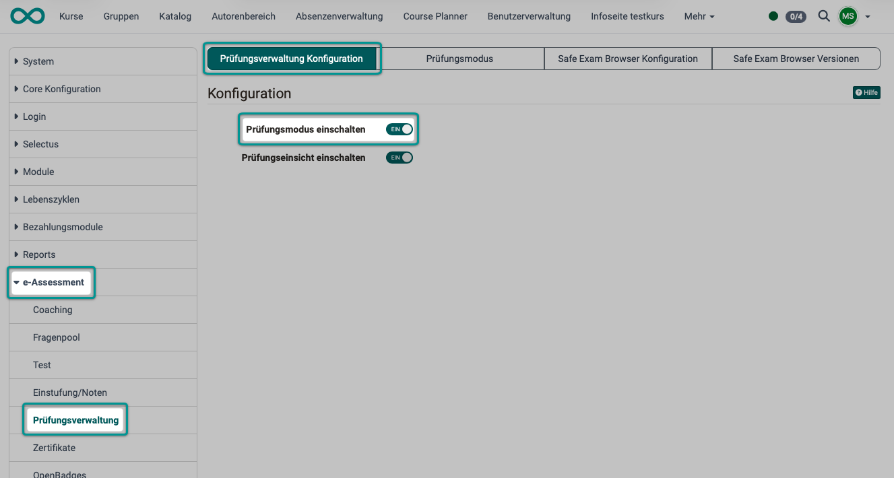
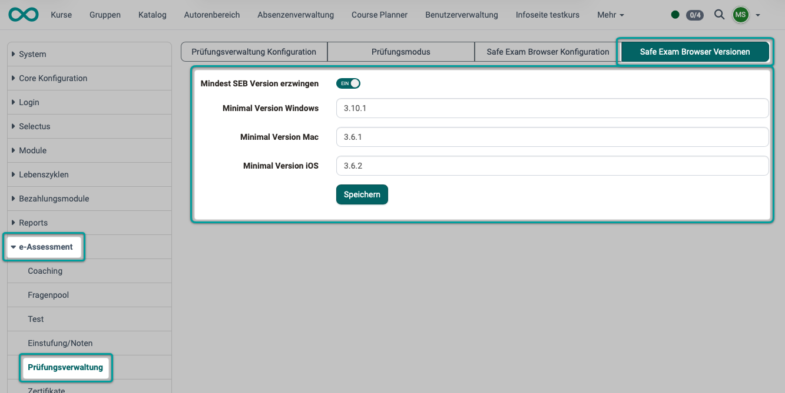
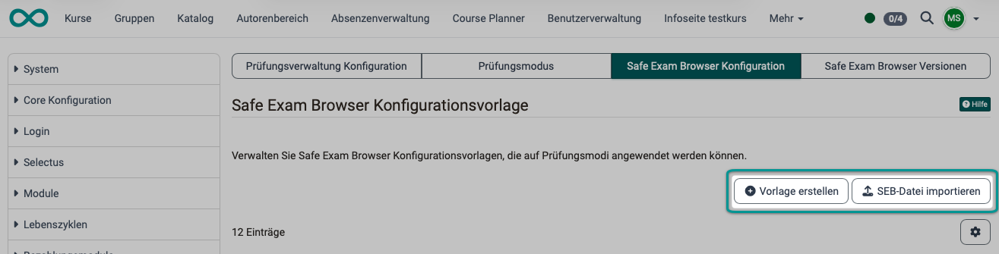
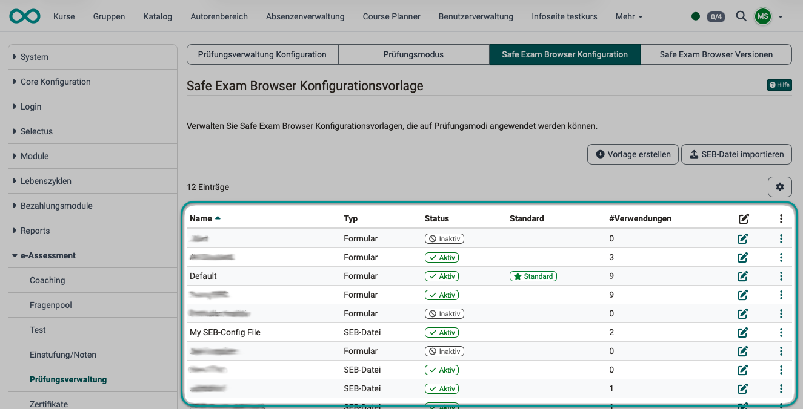

# Wie richte ich als Administrator:in den Safe Exam Browser (SEB) systemweit ein? {: #SEB_admin}

??? abstract "Ziel und Inhalt dieser Anleitung"

    Die folgende Anleitung zeigt Ihnen, wie Sie als Administrator:in den SEB einrichten.

??? abstract "Zielgruppe"

    [x] Autor:innen [ ] Betreuer:innen  [ ] Teilnehmer:innen [x] Administrator:innen

    [ ] Anfänger:innen [x] Fortgeschrittene  [x] Experten/Expertinnen

??? abstract "Erwartete Vorkenntnisse"

    * [Wie bereite ich eine Prüfung mit dem SEB vor? (für Autor:innen) >](../../manual_how-to/SEB/SEB.de.md)
  

---

## Der SEB - Was ist das? {: #SEB_description}

Statt eine Online-Prüfung mit Browsern wie Edge, Firefox, Safari oder Chrome durchzuführen, kann zum Aufruf der OpenOlat-Online-Prüfung der [Safe Exam Browser](http://www.safeexambrowser.org) zur Pflicht gemacht werden. Dieser spezielle Browser ermöglicht es, dass während des Prüfungszeitraums die Möglichkeit andere Websites aufzurufen oder Funktionen wie Copy&Paste deaktiviert sind (Kioskmodus). Dadurch wird die Verwendung unerlaubter Quellen während einer Prüfung unterbunden. 

In einem Kurs unter `Kurs-Administration > Prüfungsverwaltung` kann ein [Prüfungsmodus](../../manual_user/learningresources/Assessment_mode.de.md) konfiguriert werden, der Bedingungen (Zeitfenster usw.) einer Prüfung festlegt. Im Rahmen eines [Prüfungsmodus](../../manual_user/learningresources/Assessment_mode.de.md) kann auch bestimmt werden, ob der SEB verwendet werden soll. Wird diese Option aktiviert, kann direkt dort in OpenOlat eine Konfiguration des SEB vorgenommen und eine Konfigurationsdatei zum Versand an die Teilnehmer:innen erzeugt werden. 

!!! info "Der SEB ist ein externes Tool"

    Der Safe Exam Browser wird nicht von der frentix GmbH entwickelt, deshalb können wir weder Garantien übernehmen noch direkt Einfluss auf die Funktionalität nehmen. Auch unser Support beschränkt sich auf die OpenOlat-seitigen Konfigurationsmöglichkeiten zum Aufruf dieses externen Tools.

[zum Seitenanfang ^](#SEB_admin)

---

## Wo und wie richte ich als OpenOlat Administrator:in den SEB ein? {: #SEB_setup}

Bevor Autor:innen und Betreuer:innen den Safe Exam Browser in einem Prüfungsmodus verwenden können, muss die Administration den SEB in OpenOlat systemweit aktivieren.

Diese Vorkonfiguration kann nur mit Administrationsrechten (Rolle Systemadministrator:in) vorgenommen werden. 

Auch alle Rechner, auf denen Prüfungen mit dem SEB durchgeführt werden sollen, müssen den SEB installiert haben. Hier fällt Ihnen als Administrator:in ggf. eine beratende und unterstützende Aufgabe zu.

[zum Seitenanfang ^](#SEB_admin)

---

### Schritt 1: Evtl. SEB installieren {: #SEB_installation} 

!!! note "Hinweis"

    Es ist nicht zwingend erforderlich, dass Sie als Administrator:in selbst den Safe Exam Browser auf Ihrem Rechner installiert haben. Lediglich alle an einer Prüfung Beteiligten benötigen diesen Browser. Für Testzwecke und Beratung ist es jedoch eventuell hilfreich, wenn auch Sie als Administrator:in den SEB installiert haben. 

Für jedes Betriebssystem gibt es einen eigenen Safe Exam Browser (Windows, macOS, iOS).

Laden Sie den Browser auf der [Website des Herstellers (ETH Zürich)](http://www.safeexambrowser.org/) herunter und installieren Sie ihn.

!!! tip "Tipp"

    Achten Sie darauf, welche Version des SEB Sie installieren.
    Später kann in der Konfigurationsdatei eine bestimmte SEB-Version verlangt werden. Die Teilnehmer:innen müssen die entsprechende Safe Exam Browser-Version bei sich dann installiert haben.

[zum Seitenanfang ^](#SEB_admin)

---

### Schritt 2: Prüfungsmodus einschalten {: #activate_assessment_mode}

Der Safe Exam Browser wird immer im Rahmen eines Prüfungsmodus verwendet. Deshalb ist die Aktivierung des Prüfungsmodus Voraussetzung. Sie nehmen diese vor unter: 
**Administration > e-Assessment > Prüfungsverwaltung > Tab "Prüfungsverwaltung Konfiguration"**

{ class="shadow lightbox" }

[zum Seitenanfang ^](#SEB_admin)

---

### Schritt 3: Mindestversion des SEB festlegen {: #SEB_min_version} 

Als Administrator:in können Sie systemweit die Verwendung einer bestimmte Mindestversion des Safe Exam Browsers erzwingen. Prüfungsteilnehmende mit einer älteren SEB-Version werden dann nicht zugelassen.

Es kann pro Betriebssystem eine eigene Mindestversion festgelegt werden.

Die Einstellung nehmen Sie vor unter 
**Administration > e-Assessment > Prüfungsverwaltung > Tab "Safe Exam Browser Versionen"**

{ class="shadow lightbox" }

!!! note "Hinweis"

    Vom SEB werden in unregelmässigen Zeitabständen neue Versionen veröffentlich. Gelegentlich ergibt sich deshalb auch ein Nachbesserungsbedarf in OpenOlat, wenn Mindestversionen vorgeschrieben werden. Die Pflege der auf der OpenOlat-Instanz zulässigen SEB-Versionen nehmen Sie am gleichen Ort vor.

[zum Seitenanfang ^](#SEB_admin)

---

### Schritt 4: Abklärung, welche Bedingungen der SEB systemweit setzen soll {: #SEB_clarify_requirements} 

Informieren Sie sich auf der [Website des Herstellers (ETH Zürich)](http://www.safeexambrowser.org/) über die verfügbaren Funktionen und klären Sie die gewünschten Anforderungen mit den Personen ab, die für die Durchführung der Prüfungen verantwortlich sind.

[zum Seitenanfang ^](#SEB_admin)

---

### Schritt 5: Konfiguration vollständig manuell oder mit Vorlage? {: #SEB_config_process} 

Die Konfiguration des SEB kann gemacht werden

- vollständig manuell im Kurs (durch Autor:innen)
- mit Vorlage (bereitsgestellt durch Administrator:innen)

Klären Sie als Administrator:in mit den Prüfungsverantwortlichen ab, ob und welche Vorlagen benötigt werden.

[zum Seitenanfang ^](#SEB_admin)

---

### Schritt 6: SEB-Konfigurationsvorlage bereitstellen {: #SEB_config_file} 

Sollen Konfigurationsvorlagen verwendet werden (Abklärung Schritt 5) können nun die in Schritt 4 gemachten Abklärungen in verschiedenen Konfigurationsvorlagen beschrieben und abgelegt werden. Unter
**Administration > e-Assessment > Prüfungsverwaltung > Tab "Safe Exam Browser Konfiguration"** können Sie auf 2 Arten eine Konfigurationsvorlage bereitstellen:

- durch Erstellen einer Vorlage direkt in OpenOlat
- durch Import einer .seb-Datei

{ class="shadow lightbox" }

#### Variante 1:

Sie können eine neue SEB-Konfigurationsvorlage selbst direkt in OpenOlat anlegen. Wählen Sie dazu den Button "Vorlage erstellen".
Die einstellbaren Optionen finden Sie hier beschrieben: [SEB-Konfigurationsvorlage](../../manual_admin/administration/e-Assessment_AssessmentMgmt.de.md#tab_seb)

#### Variante 2: 

Alternativ können Sie auch eine unverschlüsselte .seb-Datei als Vorlage importieren.  
Öffnen Sie den SEB und erstellen/speichern/exportieren Sie dort die SEB Konfigruationsdatei.

#### Liste der Vorlagen

Alle erstellten oder importierten Konfigurationsvorlagen werden unter dem Tab "Safe Exam Browser Konfiguration" aufgelistet und können durch Admministrator:innen bearbeitet, aktiviert/deaktiviert oder als Standard gesetzt werden.

{ class="shadow lightbox" }

**Spalte Typ** 
Sie sehen in dieser Spalte, wie die Vorlage entstanden ist: 
Formular -> Diese Vorlage wurde direkt in OpenOlat erstellt (siehe Variante 1) 
SEB-Datei -> Diese Vorlage wurde importiert (Variante 2). 

**Spalte Status** 
Eine Konfigurationsvorlage kann entweder den Status "Aktiv" oder "Inaktiv" haben.

**Spalte "Standard** 
Dieser Spalte entnehmen Sie, welche Vorlagen Sie via 3-Punkte-Icon als Standard gesetzt haben.

**Spalte Verwendungen** 
Hier wird Ihnen angezeigt, wie oft eine Vorlage bereits von Autor:innen in Prüfungskursen verwendet wird. 

**Spalte Bearbeiten (Icon)** 
Der Klick auf eines der Bearbeiten-Icons öffnet das Popup-Fenster, in dem dei Konfigurationsoptionen seitesn OpenOlat angezeigt werden.

**3 Punkte** 
Der Klick auf ein 3-Punkte-Icon zeigt die Optionen

- Bearbeiten
- Als Standard setzen
- Deaktivieren

[zum Seitenanfang ^](#SEB_admin)

---

### Schritt 7: Evtl. Modul Termine / Absenzen aktivieren {: #SEB_module_events}

Für alle, die mit dem Modul "Termine und Absenzen" arbeiten: 
Der Prüfungsmodus und die SEB-Konfiguration können auch direkt auf einem Termin konfiguriert werden.
Die Vorgehensweise (für Autor:innen) ist analog zur Erstellung in "Kurs-Administration > Prüfungsverwaltung" der gleiche Vorgang in "Kurs-Administration > Termine".

Als Administrator:in nehmen Sie die grundsätzliche Aktivierung des Moduls Termin- und Absenzenverwaltung" vor unter: **Administration > Module > Termine/Absenzen > Tab Konfiguration > Abschnitt Konfiguration auf Kursebene**.

In diesem Tab kann danach auch festgelegt werden, ob der Safe Exam Browser mit manuellen Keys oder Keys in der SEB-Config benutzt werden soll. (Empfohlen werden Keys in der SEB-Config.)

!!! note "Hinweis"

    Der Umschalter im Modul Termine / Absenzen steuert ausschliesslich den Weg über einen Termin. Ein direkt angelegter Prüfungsmodus ignoriert ihn vollständig.

!!! note "Hinweis"

    In OpenOlat gibt es verschiedene Termine:  
    Ein Termin kann (z.B. in Projekten) mehrere zugeordnete Eigenschaften haben. 
    Daneben gibt es auch Termine, die lediglich Kalendereinträge sind.

[zum Seitenanfang ^](#SEB_admin)

---

## Support-Wissen für Administrator:innen {: #SEB_support} 

Als Administrator:in sollen Sie möglicherweise Fragen von Autor:innen beantworten. Deshalb sind nachstehend einige Prozesschritte beschrieben, die Sie als Administrator:in nicht selbst ausführen müssen, sondern die Autor:innen. Als Ansprechpartner:in und Expert:in für OpenOlat sollten Sie jedoch auch dieses Hintergrundwissen haben. Informieren Sie sich auch in der Anleitung für Autor:innen: 
[Wie bereite ich eine Prüfung mit dem SEB vor?](../../manual_how-to/SEB/SEB.de.md)

### (durch Kursbesitzer:in) Prüfungsmodus erstellen {: #create_assessment_mode}

Als Autor:in des OpenOlat-Prüfungskurses erstellen Sie einen Prüfungsmodus unter  
**Kurs-Administration > Prüfungsverwaltung > Tab "Konfiguration Prüfungsmodus" > Button "Prüfungsmodus hinzufügen"**

[zum Seitenanfang ^](#SEB)

---

### (durch Kursbesitzer:in) Erstellung der Konfigurationsdatei {: #create_config_file}

Autor:innen erstellen im Kurs (ggf. mit Hilfe der Konfigurationsvorlage) eine Konfigurationsdatei 
unter **Kurs-Administration > Prüfungsverwaltung > Tab "Konfiguration Prüfungsmodus" > Modus auswählen/bearbeiten > Tab "Safe Exam Browser"**

Siehe [Schritt 4: Konfiguration (für Kursbesitzer:innen) >](../../manual_how-to/SEB/SEB.de.md#SEB_configuration)

[zum Seitenanfang ^](#SEB_admin)

---

### (durch Kursbesitzer:in) Verteilung der Konfigurationsdatei an die Teilnehmer:innen {: #config_distribution}

**Variante 1: Herunterladen durch Teilnehmer:innen**  
Wird es von den Kursbsitzer:innen so konfiguriert, kann die Konfigurationsdatei durch die Prüfungsteilnehmer:innen bei gestartetem Prüfungsmodus aus OpenOlat heruntergeladen werden. 

**Variante 2: Herunterladen und verschicken durch Kursbesitzer:innen** 
Wird das Herunterladen durch die Teilnehmer:innen untersagt, besteht die Downloadmöglichkeit für Teilnehmer:innen nicht mehr, für Autor:innen jedoch weiterhin. Die Kursbesitzer:innen können die Konfigurationsdatei jederzeit herunterladen und sie an die Prüfungsteilnehmer:innen verschicken. 
Siehe [Schritt 6: Konfiguration herunterladen (für Kursbesitzer:innen) >](../../manual_how-to/SEB/SEB.de.md#download_SEB_configfile)

!!! note "Achtung"

    Immer wenn Änderungen an der Konfiguration vorgenommen werden, wird ein neuer Konfigurationskey erzeugt. Wird dieser mit der Konfigurationsdatei an die Prüfungsteilnehmenden verteilt, ist jedes mal die Konfigurationsdatei neu zu verteilen. Es ist also nicht ratsam, wenige Minuten vor der Prüfung noch die Konfiguration zu verändern. 

[zum Seitenanfang ^](#SEB_admin)

---

### Key {: #SEB_key} 

Damit nur der richtige abgeriegelte Browser auf die Prüfung zugreifen darf, braucht es einen Nachweis. Dieser Nachweis kann auf zwei Arten geliefert werden:

**Variante A – „SEB mit manuellen Keys":** 
Kursbesitzer:innen hinterlegen von Hand einen Schlüssel (Key). Das ist eine Art Passwort/Prüfsumme. Nur wer diesen Schlüssel kennt, kommt in die Prüfung. 

**Variante B – „SEB-Config (empfohlen)":** 
Eine Konfigurationsvorlage kann den Schlüssel auch mitbringen. Statt eines manuell hinterlegten Schlüssels wird ein Schlüssel benutzt, der in einer fertigen Konfigurationsvorlage enthalten ist. Das ist die von OpenOlat empfohlene, komfortablere Methode.

[Siehe Schritt 7 ^](#SEB_module_events)

[zum Seitenanfang ^](#SEB_admin)

---

### (durch Kursbetreuer:in) Eingriff während eine Prüfung mit dem SEB läuft {: #SEB_intervention}

Grundsätzlich sollte bei laufendem Prüfungsmodus möglichst nicht mehr eingegriffen werden. Ist es aus zwingenden Gründen aber erforderlich, erfolgt der Eingriff über den [Prüfungsmodus](../../manual_user/learningresources/Assessment_mode.de.md).

[zum Seitenanfang ^](#SEB_admin)

---

## Checkliste {: #SEB_checklist}

- [x] SEB von Hersteller-Website heruntergeladen?
- [x] Prüfungsmodus im e-Assessment aktiviert?
- [x] Abgeklärt, ob eine Mindestversion des SEB verwendet werden soll?
- [x] Sind die gewünschten Anforderungen (Möglichkeiten des SEB) mit den Prüfungsverantwortlichen abgeklärt?
- [x] Soll die Konfiguration vollständig manuell oder mit Vorlage erfolgen?
- [x] Kann/soll eine unverschlüsselte .seb-Datei als Vorlage importiert werden?
- [x] SEB-Konfigurationsvorlage erstellt?
- [x] Link zum Download (Installation) des SEB an Prüfungsverantwortliche kommuniziert? (Zur Weitergabe an die Teilnehmer:innen)
- [x] Durch Kursbesitzer:in Konfigurationsdatei zur Verteilung an die Teilnehmer:innen erstellt?
- [x] Wurden alle Prüfungsteilnehmer:innen aufgefordert, den SEB auf ihrem Rechner zu installieren?
- [x] Wenn für die Prüfung gesonderte Rechner zur Verfügung gestellt werden: Sind alle Rechner mit einem SEB ausgestattet?
- [x] Wird mit dem Modul "Termine und Absenzen" gearbeitet?
- [x] Wurde festgelegt werden, ob der Safe Exam Browser mit manuellen Keys oder Keys in der SEB-Config benutzt werden soll?

[zum Seitenanfang ^](#SEB_admin)

---

## Weiterführende Informationen {: #further_information}

[Website des Herstellers >](http://www.safeexambrowser.org) 
[Wie bereite ich eine Prüfung mit dem SEB vor? (für Autor:innen) >](../../manual_how-to/SEB/SEB.de.md) 
[Prüfungsmodus >](../../manual_user/learningresources/Assessment_mode.de.md) 
[Prüfungseinsicht > ](../../manual_user/learningresources/Assessment_inspection.de.md) 
[Prüfungsverwaltung (Admin) > ](../../manual_admin/administration/e-Assessment_AssessmentMgmt.de.md) 
[Prüfungsverwaltung durch Kursbesitzer:innen und Betreuer:innen > ](../../manual_user/learningresources/Assessment_Management.de.md) 
[Modul Termine und Absenzen >](../../manual_admin/administration/Modules_Events_and_Absences.de.md) 
[Konfiguration Termin- und Absenzenverwaltung im Kurs >](../../manual_user/learningresources/Course_Settings_Execution.de.md#config_event_and_absence_management) 

[zum Seitenanfang ^](#SEB_admin)
