# Wie erstelle ich eine Freitextfrage mit KI-Auswertung? {: #ai_essay}

??? abstract "Ziel und Inhalt dieser Anleitung"

    Sie möchten Lernenden eine offene Frage stellen und ihnen sofort eine Rückmeldung geben, ohne jede Antwort selbst zu lesen? 
    Die folgende Anleitung zeigt, wie Sie eine Freitextfrage anlegen, das Bewertungskit für die KI füllen und das Ergebnis vor dem Einsatz prüfen.

??? abstract "Zielgruppe"

    [x] Autor:innen [ ] Betreuer:innen  [ ] Teilnehmer:innen

    [ ] Anfänger:innen [x] Fortgeschrittene  [ ] Experten/Expertinnen

??? abstract "Erwartete Vorkenntnisse"

    * ["Wie erstelle ich meinen ersten OpenOlat-Kurs?"](../my_first_course/my_first_course.de.md)
    * [Kursbaustein Seite](../../manual_user/learningresources/Course_Element_Page.de.md)
    * [Content Editor](../../manual_user/basic_concepts/Content_Editor.de.md)

---

## Was die KI-Auswertung leistet {: #concept}

Eine Freitextfrage mit KI-Auswertung gibt Lernenden ein **formatives Feedback** zu ihrer eigenen Antwort. Die KI vergleicht die Antwort mit den Angaben, die Sie als Autor:in hinterlegen, und beschreibt, was gelungen ist und was fehlt.

Drei Punkte bestimmen den Einsatz:

* Das Feedback **vergibt keine Punkte**. Es dient der Selbsteinschätzung und ersetzt keine Bewertung durch die Kursbetreuung.
* Die Frage lebt im **Inhaltselement "Quiz"** des Content Editors, also auf einer Seite im Kursbaustein "Seite" oder im Media Center. In den Kursbausteinen "Test" und "Selbsttest" gibt es kein KI-Feedback.
* Lernende rufen das Feedback selbst ab und können ihre Antwort danach überarbeiten.

Für eine bewertete Prüfung nutzen Sie weiterhin den [Kursbaustein Test](../../manual_user/learningresources/Course_Element_Test.de.md) mit manueller Korrektur.

[Zum Seitenanfang ^](#ai_essay)

---

## Voraussetzungen prüfen {: #requirements}

Die Freitextfrage im Quiz erscheint nur, wenn die Administration die passende KI Funktion freigeschaltet hat.

1. Öffnen Sie als Administrator:in `Administration > Externe Werkzeuge > KI Modul`.
2. Wählen Sie den Tab **"KI-Funktionen"**.
3. Prüfen Sie die Funktion **"Essay Bewertung"**: Der Schalter "Funktion aktivieren" steht auf "EIN", ein KI Anbieter und ein Sprachmodell sind gewählt.
4. Für den Weg über den Import prüfen Sie zusätzlich die Funktion **"Essay Fragen Generator"**.

Zwei Grenzwerte dieser Funktion wirken direkt auf Lernende und Autor:innen:

| Feld | Standardwert | Wirkung |
|---|---|---|
| "Maximale Anzahl Eingabewörter" | 400 | Längere Antworten weist OpenOlat vor der Bewertung zurück. Die Meldung nennt den eingestellten Wert. |
| "Timeout (Sekunden)" | 600 | Dauert die Bewertung länger, bricht OpenOlat sie ab und meldet dies. |

Details zu diesen Feldern beschreibt [Externe Werkzeuge: KI Modul](../../manual_admin/administration/External_Tools_AI.de.md#ai_function_limits).

[Zum Seitenanfang ^](#ai_essay)

---

## Schritt 1: Quiz und Freitextfrage anlegen {: #create_question}

1. Fügen Sie im Kurseditor einen **Kursbaustein "Seite"** ein und öffnen Sie den Tab **"Seiteninhalt"**.
2. Klicken Sie auf **"Seite editieren"**.
3. Wählen Sie **"Inhalt hinzufügen"** und im Bereich "Wissen" das Element **"Quiz"**.
4. Klicken Sie im Quiz rechts oben auf **"Hinzufügen"** und wählen Sie **"Freitext"**.  
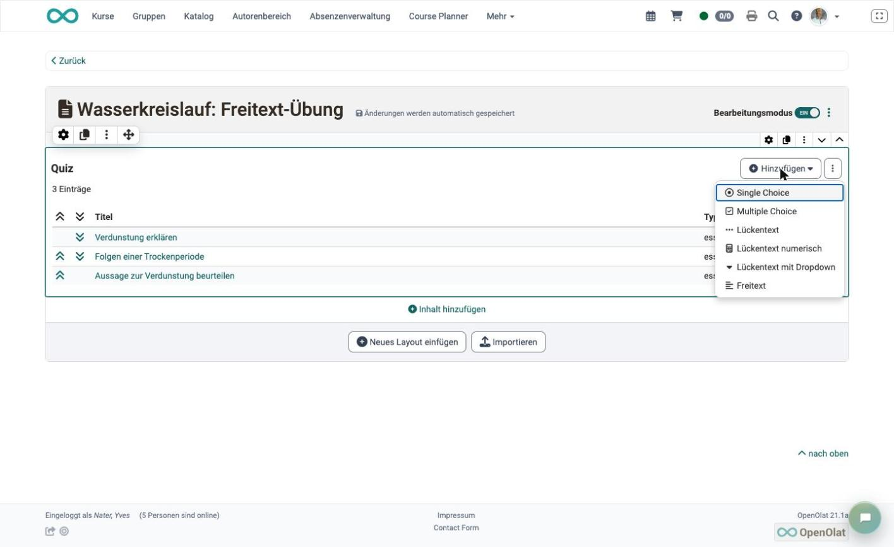{ class="shadow lightbox" }

5. Erfassen Sie im Tab "Freitext" den **Titel** und die **Frage**.
6. Legen Sie bei Bedarf **"Min Anzahl Wörter"** und **"Max Anzahl Wörter"** fest. Der Zähler unter dem Eingabefeld zeigt Lernenden ihren Stand und das Maximum.
7. Speichern Sie die Frage.

!!! info "Wichtig"

    Der Eintrag "Freitext" erscheint im Menü "Hinzufügen" nur, wenn die KI Funktion "Essay Bewertung" konfiguriert ist. Fehlt der Eintrag, prüfen Sie die Voraussetzungen im KI Modul.

[Zum Seitenanfang ^](#ai_essay)

---

## Schritt 2: Das Bewertungskit füllen {: #grading_kit}

Das Bewertungskit im Tab **"KI-Feedback"** legt fest, woran die KI die Antworten misst. Ohne diese Angaben kann die KI die Antwort nicht einordnen.

Fünf Angaben sind Pflicht und mit einem Stern markiert:

| Feld | Was hineingehört |
|---|---|
| "Lernziel" | Was die Lernenden mit der Antwort zeigen sollen, in einem Satz. |
| "Quelltext-Auszug" | Der Fachinhalt, auf dem die Frage beruht. Die KI nutzt ihn als Referenz. |
| "Musterantwort" | Die erwartete Antwort in der Länge und Sprache, die Sie von Lernenden erwarten. |
| "Bloom-Stufe" | Die kognitive Stufe der Frage: "Erinnern", "Verstehen", "Anwenden", "Analysieren", "Bewerten" oder "Erschaffen". |
| "Sprache (BCP-47)" | Die erwartete Antwortsprache, zum Beispiel `de` oder `en-US`. |

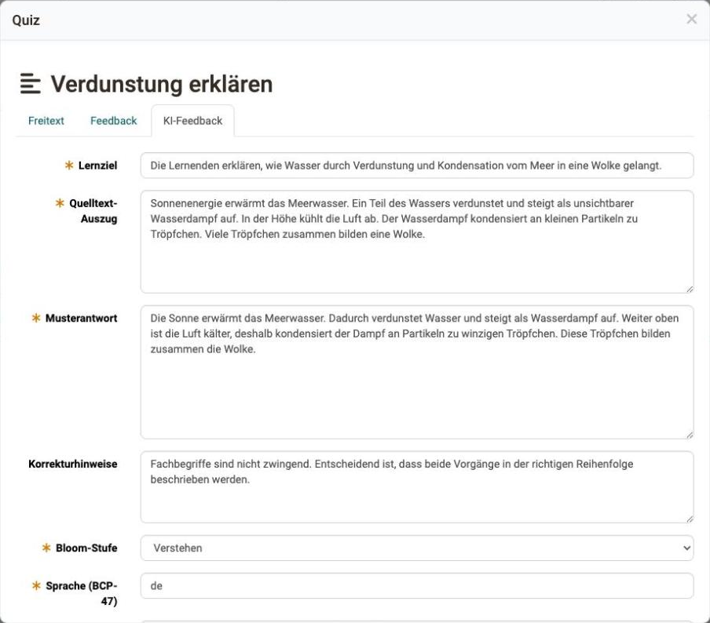{ class="shadow lightbox" }

Die übrigen Felder schärfen das Feedback:

* **"Korrekturhinweise"**: Regeln für die Beurteilung, etwa dass Fachbegriffe nicht zwingend sind.
* **"Schwierigkeitsgrad (1-5)"**: Der Anspruch, den die KI beim Beurteilen anlegt.
* **"Schlüsselpunkte"**: Die Kernaspekte, die eine gute Antwort abdeckt. Jeder Punkt erhält eine Beschreibung, ein Gewicht von 0.0 bis 1.0 und die Markierung "erforderlich". Sind Zeilen ausgefüllt, muss die Summe der Gewichte 1.0 ergeben.
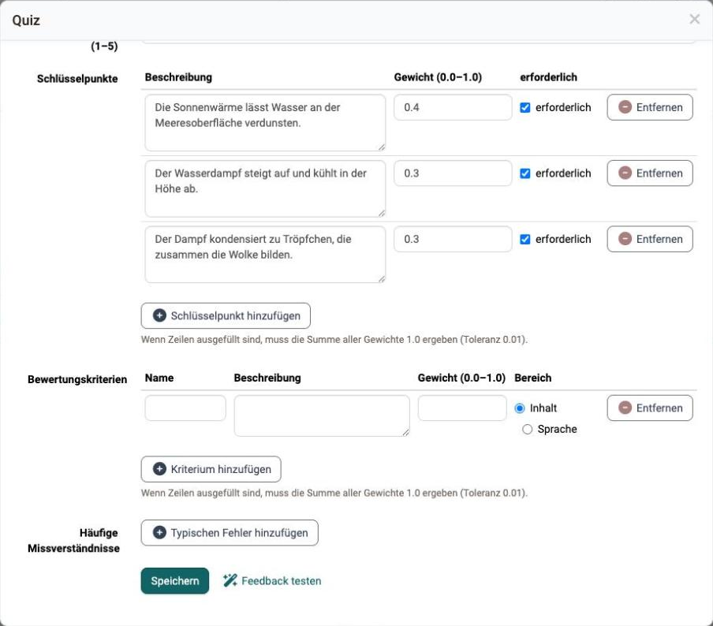{ class="shadow lightbox" }

* **"Bewertungskriterien"**: Benannte Kriterien mit Beschreibung, Gewicht und dem Bereich "Inhalt" oder "Sprache". Auch hier ergibt die Summe der Gewichte 1.0.
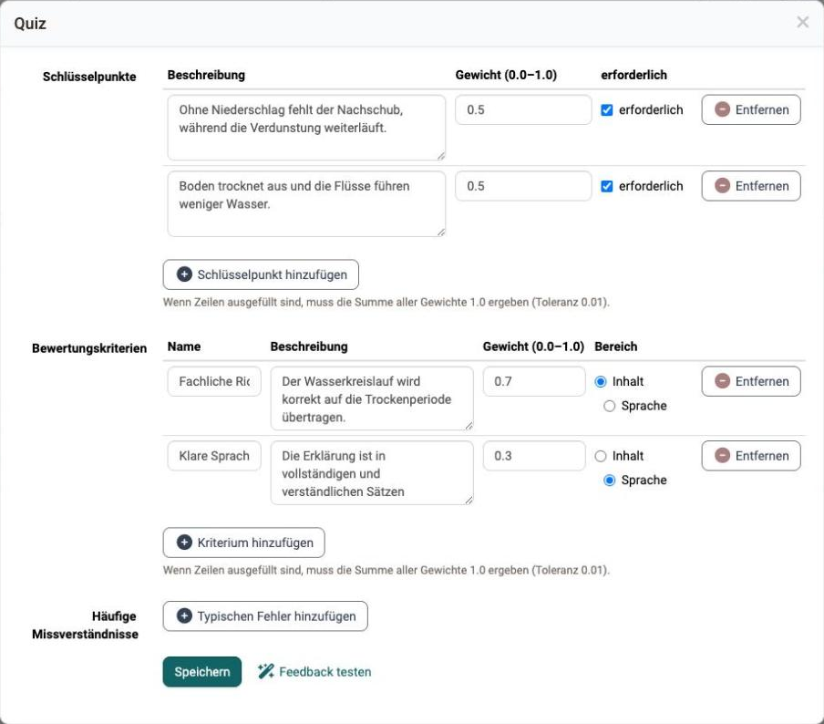{ class="shadow lightbox" }

* **"Häufige Missverständnisse"**: Typische Falsch-Annahmen. Die KI achtet gezielt darauf und spricht sie im Feedback an.
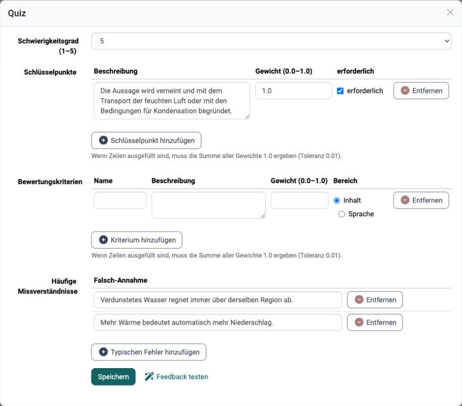{ class="shadow lightbox" }

[Zum Seitenanfang ^](#ai_essay)

---

## Schritt 3: Das Feedback testen {: #test_feedback}

Prüfen Sie das Bewertungskit, bevor Lernende die Frage sehen.

1. Klicken Sie im Tab "KI-Feedback" auf **"Feedback testen"**.
2. Geben Sie eine Beispielantwort ein, am besten eine bewusst unvollständige.
3. Klicken Sie auf **"Feedback generieren"**. Je nach Sprachmodell dauert die Auswertung einige Sekunden bis zu zwei Minuten.

Die Vorschau zeigt unter "Bewertungssignale", wie die KI die Antwort liest.

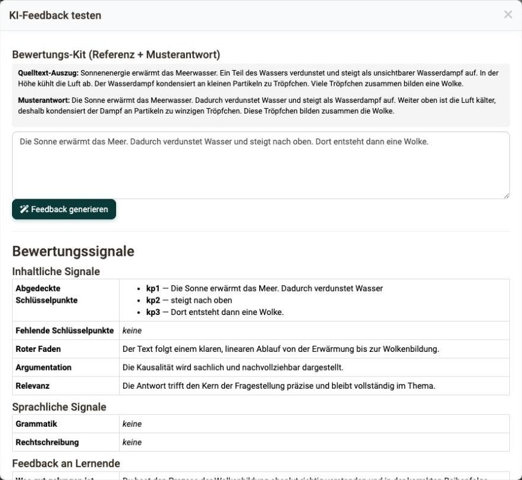{ class="shadow lightbox" }

* **"Inhaltliche Signale"**: abgedeckte und fehlende Schlüsselpunkte, dazu "Roter Faden", "Argumentation" und "Relevanz".
* **"Sprachliche Signale"**: "Grammatik" und "Rechtschreibung".
* **"Feedback an Lernende"**: der Text, den Lernende später sehen.
* **"Gesamt"**: "Gesamteinschätzung", "Geschätzter Erfüllungsgrad", "Themenverfehlung", "Verlässlichkeit" und "Feedback an die Betreuung".

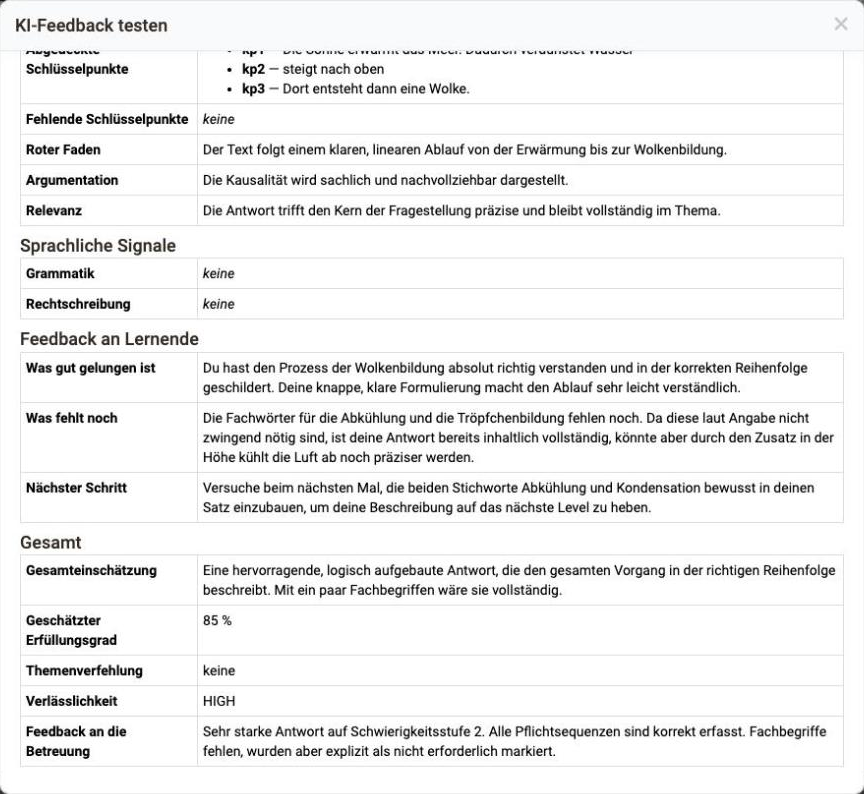{ class="shadow lightbox" }

Weicht das Feedback von Ihrer Erwartung ab, schärfen Sie die Musterantwort, die Schlüsselpunkte oder die Korrekturhinweise nach und testen Sie erneut.

[Zum Seitenanfang ^](#ai_essay)

---

## Drei Beispiele für Fragen und Kits {: #examples}

Die Angaben im Kit richten sich nach dem Anspruch der Frage. Drei Muster:

| Frage | Bloom-Stufe | Schwierigkeit | Schwerpunkt im Kit |
|---|---|---|---|
| "Erklären Sie in eigenen Worten, wie Wasser aus dem Meer in eine Wolke gelangt." | Verstehen | 2 | Drei Schlüsselpunkte mit den Gewichten 0.4, 0.3 und 0.3, enge Musterantwort |
| "In einer Region fällt drei Wochen lang kein Regen. Erklären Sie, welche Folgen für Boden und Flüsse zu erwarten sind." | Anwenden | 3 | Zwei Bewertungskriterien: "Fachliche Richtigkeit" im Bereich Inhalt mit 0.7, "Klare Sprache" im Bereich Sprache mit 0.3 |
| "Beurteilen Sie die Aussage: Mehr Verdunstung führt immer zu mehr Regen in derselben Region." | Bewerten | 5 | Ein Schlüsselpunkt mit Gewicht 1.0, dazu zwei häufige Missverständnisse und ein Wortlimit von 150 |

Je offener die Frage, desto wichtiger sind Korrekturhinweise und Missverständnisse. Bei einer Wissensfrage genügen Musterantwort und Schlüsselpunkte.

[Zum Seitenanfang ^](#ai_essay)

---

## Die Ansicht der Lernenden {: #learner_view}

1. Lernende starten das Quiz auf der Seite und beantworten die Freitextfrage im Eingabefeld. Der Zähler zeigt die Anzahl Wörter und das erlaubte Maximum.
2. Mit **"Überprüfen"** senden Sie die Antwort ab. Während die KI arbeitet, erscheint der Hinweis "Wartet auf KI-Korrektur". Dauert es länger, bittet OpenOlat darum, die Seite offen zu lassen.

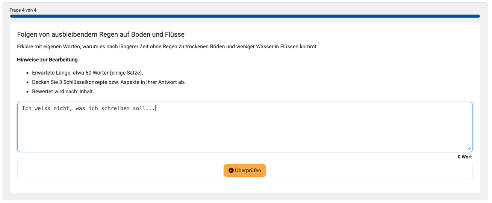{ class="shadow lightbox" }

3. Das Ergebnis erscheint im Block **"KI-Feedback"**.

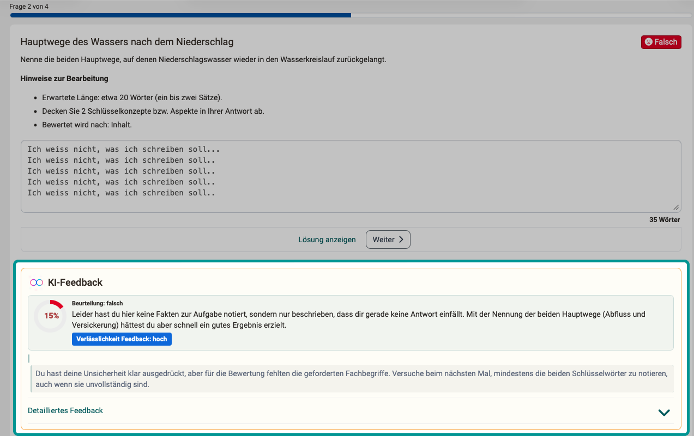{ class="shadow lightbox" }

Der Block beginnt mit der **"Beurteilung"** in fünf Stufen: "sehr gut", "gut", "mittelmässig", "ungenügend" und "falsch". Daneben steht die **"Verlässlichkeit Feedback"** mit "hoch", "mittel" oder "niedrig". Sie zeigt, wie sicher die KI ihre eigene Einschätzung einstuft.

Unter **"Detailliertes Feedback"** lassen sich weitere Abschnitte aufklappen: "Was gut gelungen ist", "Was fehlt noch" und "Nächster Schritt", dazu die abgedeckten und fehlenden Punkte sowie Rückmeldungen zu Grammatik und Rechtschreibung.

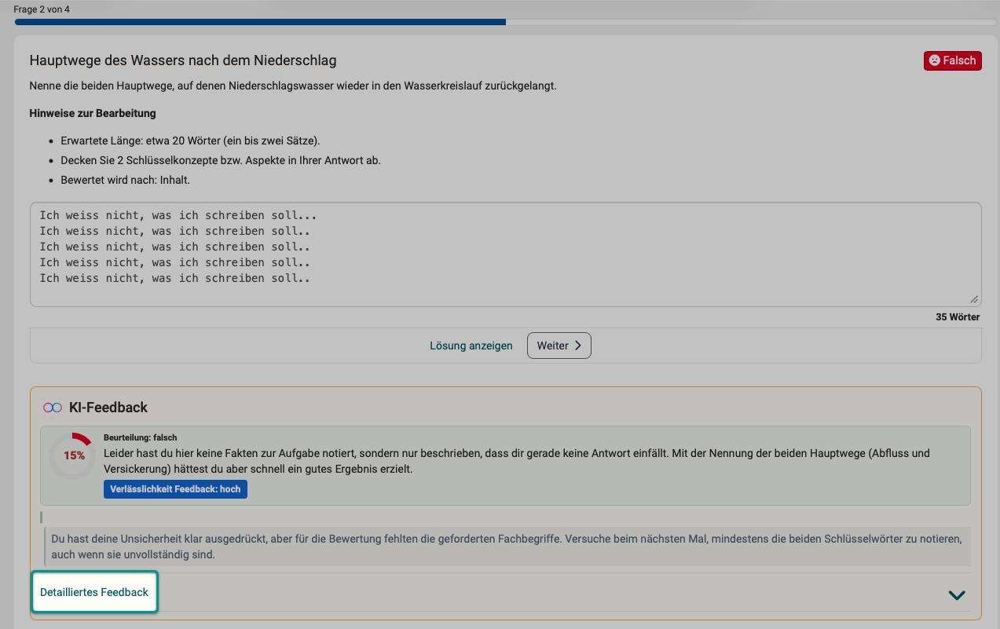{ class="shadow lightbox" }

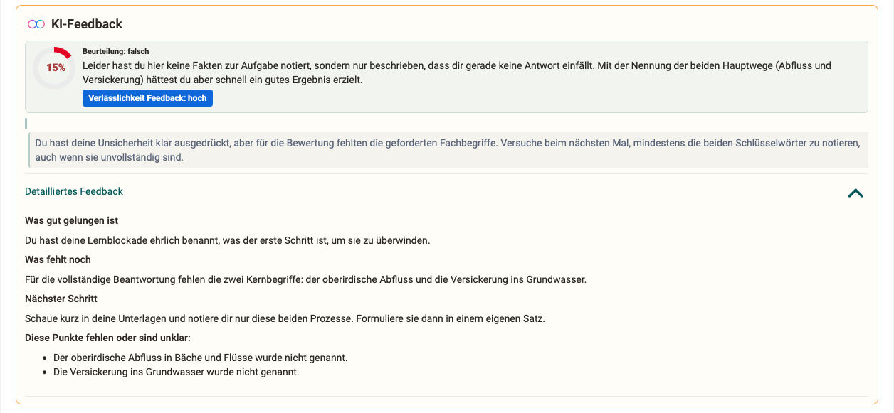{ class="shadow lightbox" }

[Zum Seitenanfang ^](#ai_essay)

---

## Fragen per Import erzeugen {: #import}

Statt die Frage von Hand zu schreiben, lassen Sie sie aus einem Fachtext erzeugen.

1. Klicken Sie im Content Editor auf **"Importieren"**.
2. Wählen Sie eine Markdown-, Text- oder Word-Datei, oder fügen Sie den Text direkt ein.
3. Aktivieren Sie den Schalter **"KI-generiertes Quiz hinzufügen"**.
4. Legen Sie im Feld **"Essay-Frage mit KI-Korrektur"** fest, wie viele Freitextfragen entstehen. Erlaubt sind bis zu fünf.
5. Wählen Sie die **Bloom-Stufen** und die **Zielschwierigkeit**, und erfassen Sie bei Bedarf **Lernziele**, ein Ziel pro Zeile.
6. Starten Sie den Import. Die Generierung läuft im Hintergrund und kann eine Minute dauern.

Die KI füllt das Bewertungskit der erzeugten Fragen vor. Prüfen Sie jede Frage inhaltlich und schärfen Sie das Kit im Tab "KI-Feedback" nach.

Denselben Weg gibt es im [Fragenpool](../../manual_user/area_modules/Question_Bank_Create_Questions.de.md#create_with_AI) über den Eintrag "KI Fragen". Dort erzeugte Fragen erhalten den Status "Review" und lassen sich anschliessend in ein Quiz übernehmen.

[Zum Seitenanfang ^](#ai_essay)

---

## Checkliste {: #checklist}

- [x] Ist im KI Modul die Funktion "Essay Bewertung" aktiv und mit einem Modell verbunden?
- [x] Erscheint im Quiz unter "Hinzufügen" der Eintrag "Freitext"?
- [x] Sind Lernziel, Quelltext-Auszug, Musterantwort, Bloom-Stufe und Sprache erfasst?
- [x] Ergeben die Gewichte der Schlüsselpunkte und der Bewertungskriterien je 1.0?
- [x] Wurde das Feedback mit einer Beispielantwort getestet?
- [x] Passt das erwartete Antwortmass zur Grenze für Eingabewörter im KI Modul?
- [x] Ist den Lernenden klar, dass das KI-Feedback keine Punkte vergibt?

---

## Weitere Informationen {: #further_information}

[Externe Werkzeuge: KI Modul >](../../manual_admin/administration/External_Tools_AI.de.md) 
[Content Editor >](../../manual_user/basic_concepts/Content_Editor.de.md) 
[Kursbaustein Seite >](../../manual_user/learningresources/Course_Element_Page.de.md) 
[Fragenpool: Fragen erstellen >](../../manual_user/area_modules/Question_Bank_Create_Questions.de.md) 
[Test Fragetypen >](../../manual_user/learningresources/Test_question_types.de.md) 
