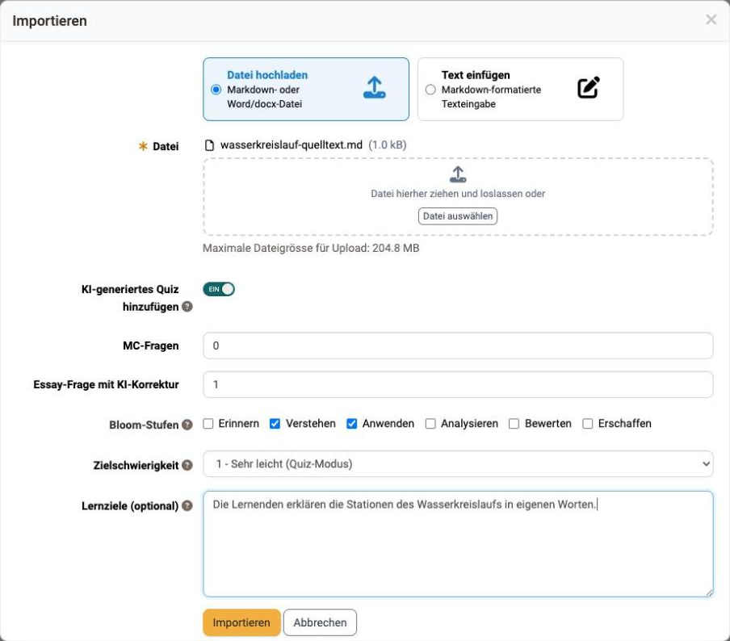

# How do I create an essay question with AI grading? {: #ai_essay}

??? abstract "Aim and content of these instructions"

    Do you want to ask learners an open-ended question and give them immediate feedback without reading every answer yourself? 
    The following instructions show how to create an essay question, fill in the grading kit for the AI and check the result before you put it to use.

??? abstract "Target group"

    [x] Authors [ ] Coaches  [ ] Participants

    [ ] Beginners [x] Amateurs  [ ] Experts

??? abstract "Expected previous knowledge"

    * ["How do I create my first OpenOlat course?"](../my_first_course/my_first_course.md)
    * [Course Element Page](../../manual_user/learningresources/Course_Element_Page.md)
    * [Content Editor](../../manual_user/basic_concepts/Content_Editor.md)

---

## What AI grading does {: #concept}

An essay question with AI grading gives learners **formative feedback** on their own answer. The AI compares the answer with the information you store as an author and describes what worked and what is missing.

Three points govern its use:

* The feedback **does not award any points**. It serves self-assessment and does not replace an assessment by the course coaches.
* The question lives in the **"Quiz" content element** of the Content Editor, that is, on a page in the "Page" course element or in the Media Center. The "Test" and "Self-test" course elements have no AI feedback.
* Learners request the feedback themselves and can revise their answer afterwards.

For a graded assessment, continue to use the [Test course element](../../manual_user/learningresources/Course_Element_Test.md) with manual correction.

[To the top of the page ^](#ai_essay)

---

## Checking the requirements {: #requirements}

The essay question in the Quiz only appears once the administration has enabled the matching AI feature.

1. As an administrator, open the system administration: `Administration > External tools > AI module`.
2. Select the **"AI features"** tab.
3. Check the **"Essay Grading"** feature: the "Enable feature" switch is set to "ON", and an AI provider and a language model are selected.
4. For the import route, also check the **"Essay Question Generator"** feature.

Two limits of this feature directly affect learners and authors:

| Field | Default value | Effect |
|---|---|---|
| "Maximum input words" | 400 | OpenOlat rejects longer answers before grading. The message states the configured value. |
| "Timeout (seconds)" | 600 | If grading takes longer, OpenOlat aborts it and reports this. |

For details on these fields, see [External tools: AI module](../../manual_admin/administration/External_Tools_AI.md#ai_function_limits).

[To the top of the page ^](#ai_essay)

---

## Step 1: Create a Quiz and essay question {: #create_question}

1. In the course editor, add a **"Page" course element** and open the **"Page content"** tab.
2. Click **"Edit page"**.
3. Select **"Add content"** and, in the "Knowledge" area, the **"Quiz"** element.
4. In the Quiz, click **"Add"** at the top right and select **"Essay"**.  
{ class="shadow lightbox" }

5. In the "Essay" tab, enter the **Title** and the **Question**.
6. If needed, set **"Min. words"** and **"Max. words"**. The counter below the input field shows learners their progress and the maximum.
7. Save the question.

!!! info "Important"

    The "Essay" entry only appears in the "Add" menu if the "Essay Grading" AI feature is configured. If the entry is missing, check the requirements in the AI module.

[To the top of the page ^](#ai_essay)

---

## Step 2: Fill in the grading kit {: #grading_kit}

The grading kit in the **"AI feedback"** tab defines what the AI measures the answers against. Without this information, the AI cannot classify the answer.

Five entries are mandatory and marked with an asterisk:

| Field | What goes in it |
|---|---|
| "Learning objective" | What learners should demonstrate with their answer, in one sentence. |
| "Reference excerpt" | The subject content the question is based on. The AI uses it as a reference. |
| "Model answer" | The expected answer in the length and language you expect from learners. |
| "Bloom level" | The cognitive level of the question: "Remember", "Understand", "Apply", "Analyse", "Evaluate" or "Create". |
| "Language (BCP-47)" | The expected answer language, for example `de` or `en-US`. |

{ class="shadow lightbox" }

The remaining fields sharpen the feedback:

* **"Grading hints"**: rules for the assessment, for example that technical terms are not mandatory.
* **"Difficulty (1–5)"**: the standard the AI applies when assessing.
* **"Key points"**: the core aspects a good answer covers. Each point gets a description, a weight from 0.0 to 1.0 and the "required" marker. If rows are filled in, the weights must sum to 1.0 (tolerance 0.01).
{ class="shadow lightbox" }

* **"Rubric criteria"**: named criteria with a description, weight and the scope "Content" or "Language". Here too the weights sum to 1.0.
{ class="shadow lightbox" }

* **"Common misconceptions"**: typical false assumptions. The AI watches for them specifically and addresses them in the feedback.
{ class="shadow lightbox" }

[To the top of the page ^](#ai_essay)

---

## Step 3: Test the feedback {: #test_feedback}

Check the grading kit before learners see the question.

1. In the "AI feedback" tab, click **"Test feedback"**.
2. Enter a sample answer, ideally a deliberately incomplete one.
3. Click **"Generate feedback"**. Depending on the language model, grading takes a few seconds up to two minutes.

Under "Grading signals", the preview shows how the AI reads the answer.

{ class="shadow lightbox" }

* **"Content signals"**: key points hit and missing, plus "Coherence", "Argument" and "Relevance".
* **"Language signals"**: "Grammar issues" and "Spelling issues".
* **"Feedback to student"**: the text learners see later.
* **"Overall"**: "Overall assessment", "Estimated score", "Off-topic flag", "Confidence" and "Feedback to coach".

{ class="shadow lightbox" }

If the feedback differs from your expectation, refine the model answer, the key points or the grading hints and test again.

[To the top of the page ^](#ai_essay)

---

## Three examples of questions and kits {: #examples}

The entries in the kit depend on the demands of the question. Three patterns:

| Question | Bloom level | Difficulty | Focus in the kit |
|---|---|---|---|
| "Explain in your own words how water gets from the sea into a cloud." | Understand | 2 | Three key points with the weights 0.4, 0.3 and 0.3, tight model answer |
| "No rain falls in a region for three weeks. Explain what consequences are to be expected for the soil and rivers." | Apply | 3 | Two rubric criteria: "Technical accuracy" in the Content scope with 0.7, "Clear language" in the Language scope with 0.3 |
| "Assess the statement: More evaporation always leads to more rain in the same region." | Evaluate | 5 | One key point with weight 1.0, plus two common misconceptions and a word limit of 150 |

The more open the question, the more important grading hints and misconceptions become. For a knowledge question, a model answer and key points are enough.

[To the top of the page ^](#ai_essay)

---

## The learner's view {: #learner_view}

1. Learners start the Quiz on the page and answer the essay question in the input field. Above the field, "Notes for your answer" state the expected length, the number of key concepts and the scopes the answer is graded by. The counter shows the number of words and the permitted maximum.
2. With **"Check"** they submit the answer. While the AI is working, the message "Waiting for AI correction" appears. If it takes longer, OpenOlat asks you to keep the page open.

{ class="shadow lightbox" }

3. The result appears in the **"AI feedback"** block.

{ class="shadow lightbox" }

The block begins with the **"Assessment"** in five levels: "very good", "good", "mediocre", "insufficient" and "wrong". Next to it is the **"Feedback reliability"** with "high", "medium" or "low". It shows how confident the AI is in its own assessment.

Under **"Detailed feedback"** further sections can be expanded: "What went well", "What is missing" and "Next step", plus the covered and missing points as well as feedback on grammar and spelling.

{ class="shadow lightbox" }

{ class="shadow lightbox" }

[To the top of the page ^](#ai_essay)

---

## Creating questions via import {: #import}

Instead of writing the question by hand, you can have it generated from a subject text.

1. In the Content Editor, click **"Import"**.
2. Select a Markdown, text or Word file, or paste the text directly.
3. Enable the **"Add AI generated Quiz"** switch.
4. In the **"Essay question with AI correction"** field, set how many essay questions are created. Up to five are allowed. The "MC question" field sets the number of multiple-choice questions and can stay at 0.
5. Select the **Bloom levels** and the **Target difficulty**, and enter **Learning objectives** if needed, one objective per line.  
{ class="shadow lightbox" }

6. Start the import. Generation runs in the background and may take a minute. OpenOlat appends the questions as a Quiz element at the end of the page.

The AI pre-fills the grading kit of the generated questions. Check each question for content and refine the kit in the "AI feedback" tab.

The same path exists in the [Question bank](../../manual_user/area_modules/Question_Bank_Create_Questions.md#create_with_AI) via the "AI questions" entry. Questions created there receive the status "Review" and can then be taken into a Quiz.

[To the top of the page ^](#ai_essay)

---

## Checklist {: #checklist}

- [x] Is the "Essay Grading" feature active in the AI module and connected to a model?
- [x] Does the "Essay" entry appear under "Add" in the Quiz?
- [x] Are the learning objective, reference excerpt, model answer, Bloom level and language filled in?
- [x] Do the weights of the key points and the rubric criteria each sum to 1.0?
- [x] Has the feedback been tested with a sample answer?
- [x] Does the expected answer length match the input-word limit in the AI module?
- [x] Is it clear to learners that the AI feedback does not award any points?

---

## Further information {: #further_information}

**Mentioned on this page** 
["How do I create my first OpenOlat course?" >](../my_first_course/my_first_course.md) 
[Course Element Page >](../../manual_user/learningresources/Course_Element_Page.md) 
[Content Editor >](../../manual_user/basic_concepts/Content_Editor.md) 
[Course Element Test >](../../manual_user/learningresources/Course_Element_Test.md) 
[External tools: AI module >](../../manual_admin/administration/External_Tools_AI.md) 
[Question bank: Create Questions >](../../manual_user/area_modules/Question_Bank_Create_Questions.md)

**Further reading** 
[Test question types >](../../manual_user/learningresources/Test_question_types.md) 
[AI features: Application map >](../../manual_user/area_modules/AI_Features_Map.md) 
[Question Bank Review Process >](../../manual_user/area_modules/Question_Bank_Review_Process.md)

[To the top of the page ^](#ai_essay)
