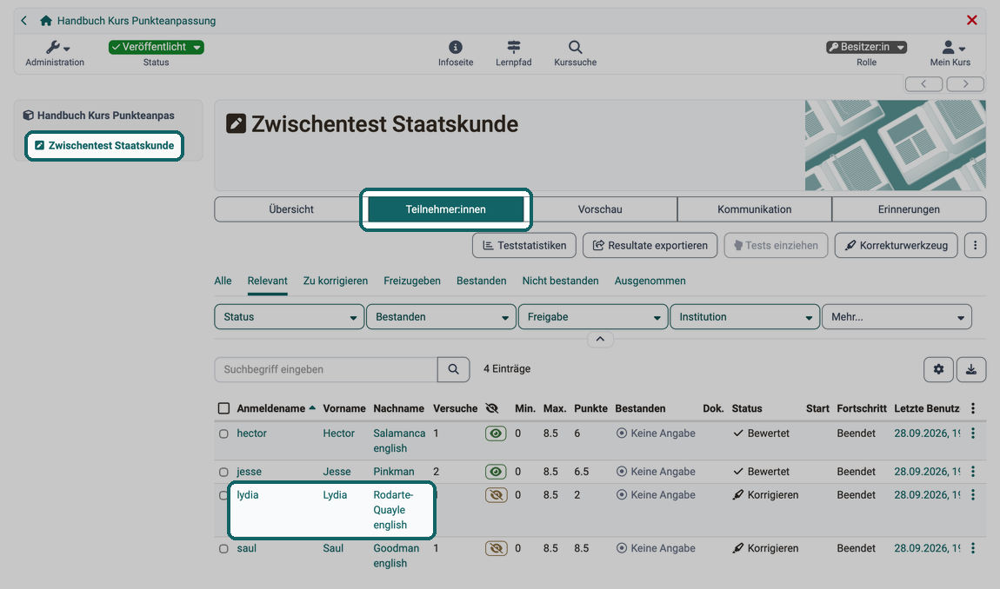
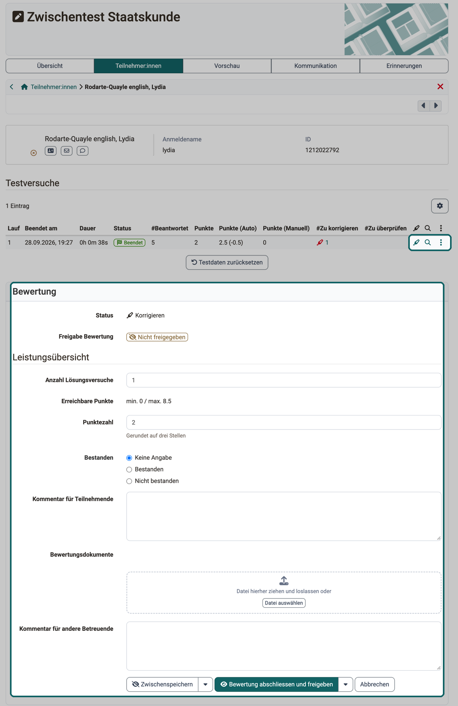
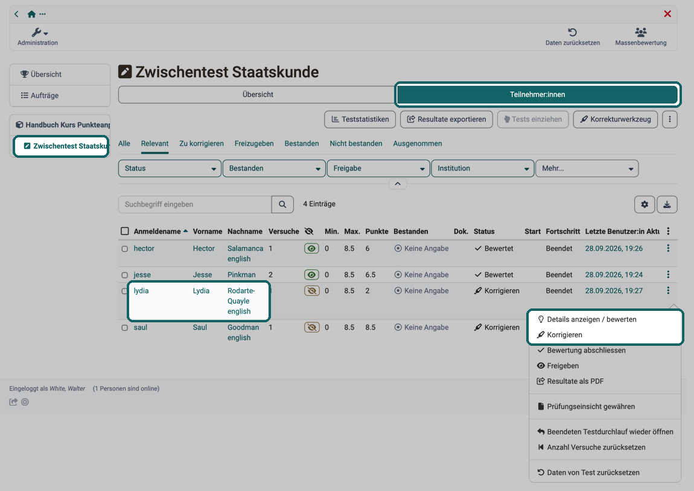
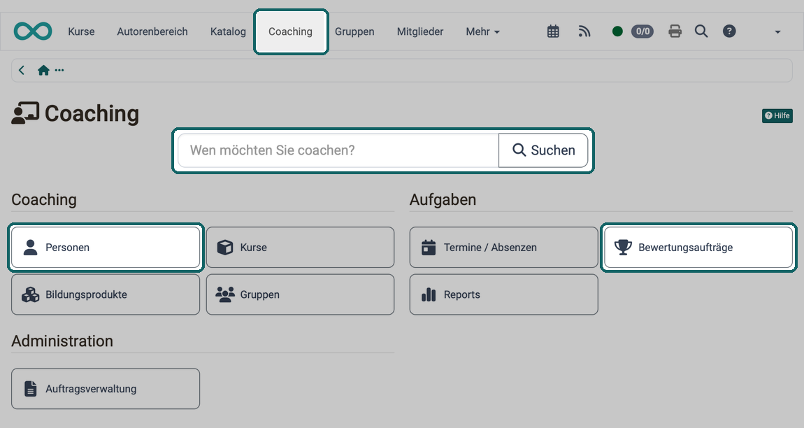
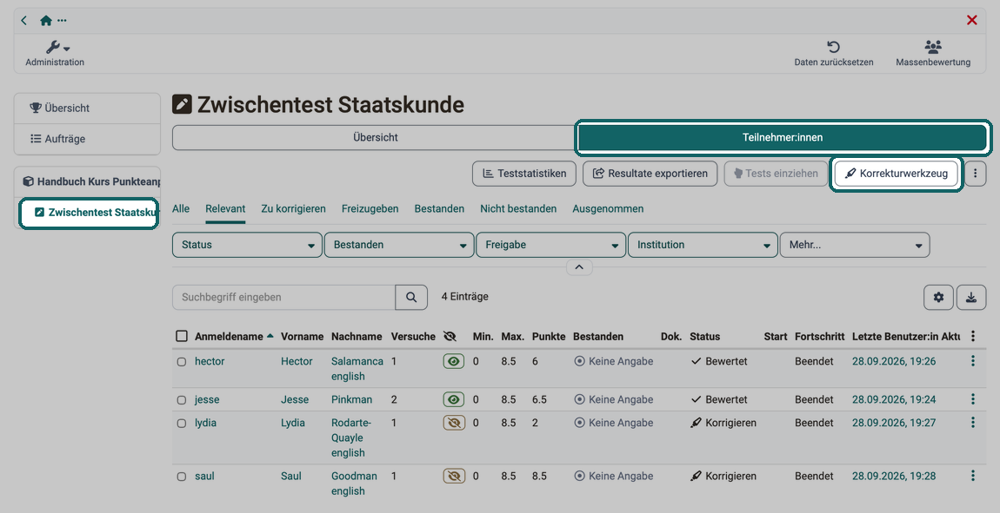
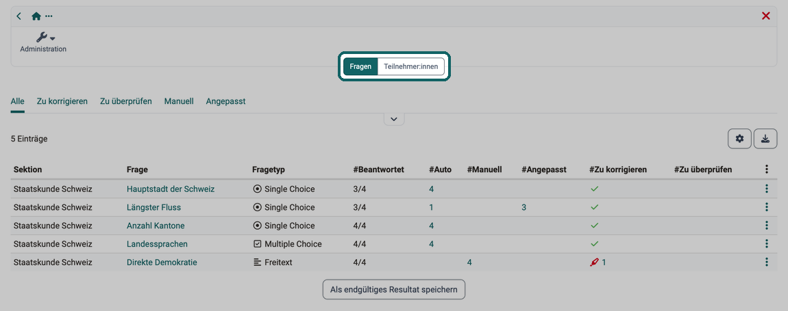
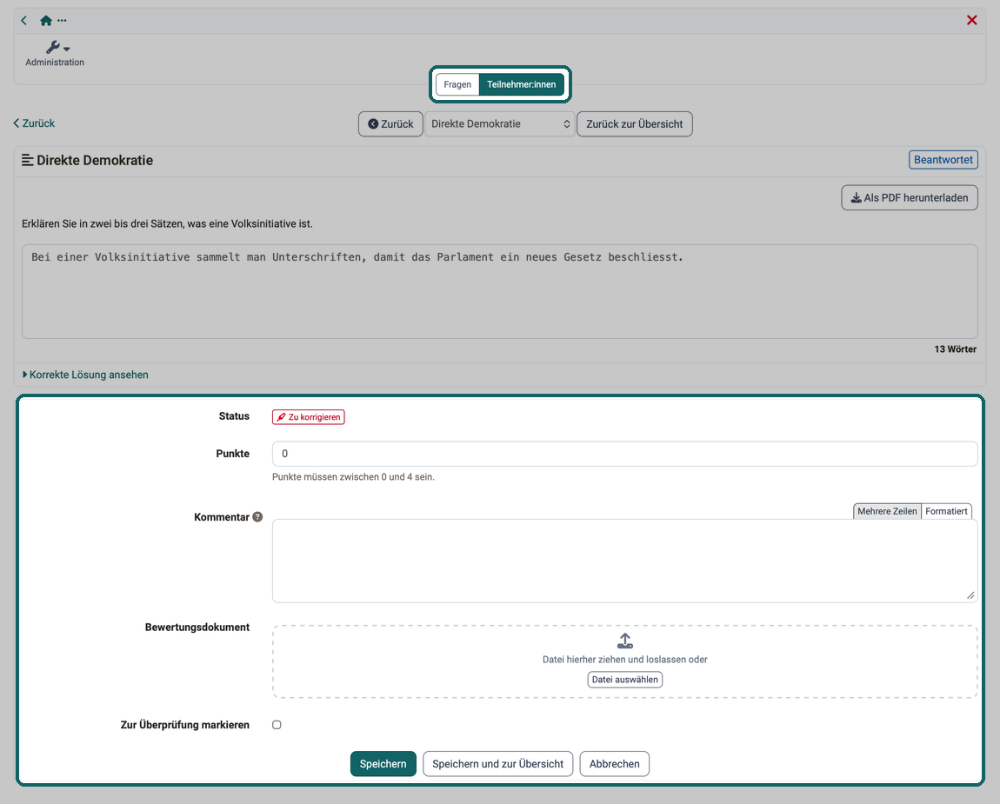
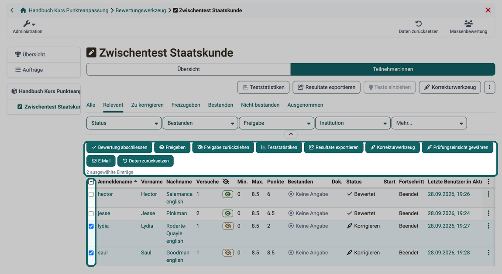

# Wie bewerte ich einen Test? {: #assessing_tests}

??? abstract "Ziel und Inhalt dieser Anleitung"

    Im Kurs gibt es einen Test-Kursbaustein, und die Teilnehmenden haben den Test bearbeitet. 
    Wie gehen Sie nun vor, um die Testergebnisse der Teilnehmenden einzusehen, manuell zu bewerten, zu kommentieren und abzuschliessen? Die folgende Anleitung zeigt es Ihnen.

??? abstract "Zielgruppe"

    [ ] Autor:innen [x] Betreuer:innen  [ ] Teilnehmer:innen

    [x] Anfänger:innen [x] Fortgeschrittene  [ ] Expert:innen

??? abstract "Erwartete Vorkenntnisse"

    * ["Wie erstelle ich meinen ersten OpenOlat-Kurs?"](../my_first_course/my_first_course.de.md)
    * ["Wie gehe ich vor, wenn ich einen Test erstelle?"](../test_creation_procedure/test_creation_procedure.de.md)
    * [Bewertungswerkzeug >](../../manual_user/learningresources/Assessment_tool_overview.de.md)

---

## Was bedeutet "einen Test bewerten"? {: #meaning}

In OpenOlat können Tests automatisch oder manuell ausgewertet werden.

**Automatisch bewertbare Fragen** (z. B. Single Choice, Multiple Choice) können direkt nach der Abgabe vom System ausgewertet werden. 
**Manuell zu bewertende Fragen** sind z. B. Freitext oder Zeichnen. Sie erfordern zwingend eine Bewertung durch Betreuer:innen. Aber auch bereits automatisch ausgewertete Fragen können nachbearbeitet werden.

Als Betreuer:in können Sie im **Bewertungswerkzeug**:

* Testergebnisse aller Teilnehmer:innen einsehen
* Einzelne Fragen manuell mit Punkten bewerten
* Gesamtpunktzahl und Bestanden-Status manuell überschreiben
* Kommentare für Teilnehmer:innen und andere Betreuer:innen hinterlassen
* Bewertungen einzeln oder per Sammelaktion abschliessen

[Zum Seitenanfang ^](#assessing_tests)

---

## Wie wird ein Bewertungsauftrag erstellt und vergeben? {: #assessment_order}

Ob für einen Test ein Bewertungsauftrag entsteht, entscheidet die Einstellung "Korrektur" am Kursbaustein Test: Wertet OpenOlat den Test automatisch aus, oder korrigiert eine Person ihn von Hand? 
Automatisch ausgewertete Tests brauchen keinen Bewertungsauftrag, OpenOlat zeigt das Resultat sofort. Für manuell korrigierte Tests erstellt OpenOlat einen Auftrag. Kursbesitzer:innen wählen die Variante unter:  `Kurs > Administration > Kurseditor > Kursbaustein Test wählen > Tab "Test-Konfiguration" > Abschnitt "Korrektur"`

Als Betreuer:in ohne Besitzrecht ändern Sie diese Einstellung nur, wenn Ihnen im Kurs das Recht "Kurseditor" erteilt wurde. Den Auftrag bearbeiten Sie, sobald OpenOlat ihn angelegt hat.

Soll manuell korrigiert werden? Sobald eine teilnehmende Person den Test abschliesst, erstellt OpenOlat einen Bewertungsauftrag. Wer ihn erhält, hängt von der gewählten Variante ab:

* **Manuell durch Kursbetreuer:in oder -besitzer:in**: Der Auftrag steht bei allen Betreuenden der Person und bei den Kursbesitzer:innen, unter `Coaching > Bewertungsaufträge > Tab "Offene Bewertungen"`. Eine Zuweisung an eine bestimmte Person gibt es bei dieser Variante nicht.
* **Manuell durch Korrektor:innen**: OpenOlat weist den Auftrag einer Person zu, die im Korrektur-Workflow der Lernressource Test eingetragen ist. Diese Variante steht zur Wahl, sobald die Besitzer:innen des Tests in der Lernressource Test den [Korrektur-Workflow](../../manual_user/learningresources/Test_settings.de.md#correction-workflow) eingeschaltet haben. Korrektor:innen brauchen keine Mitgliedschaft im Kurs. Sie finden den Auftrag als Korrekturauftrag unter `Coaching > Bewertungsaufträge > Tab "Korrekturaufträge"`.

Ist beim Abschluss keine Korrektor:in verfügbar, wartet der Korrekturauftrag mit dem Status "Nicht zugeordnet" unter `Coaching > Auftragsverwaltung > Tab "Korrekturaufträge"`. Dort weisen Besitzer:innen des Tests, Lernressourcenverwalter:innen oder Administrator:innen ihn einer Korrektor:in zu, und er erscheint in deren Tab "Korrekturaufträge".

Welche Einstellung welchen Tab im Coaching füllt, zeigt der Abschnitt [Bewertungsaufträge erstellen](../../manual_user/area_modules/Coaching_Assessment_Orders.de.md#create_assessment_orders).

[Zum Seitenanfang ^](#assessing_tests)

---

## Wie gelange ich zu meinen Bewertungsaufträgen (Tests)? {: #access}

Als Betreuer:in sehen Sie die Bewertungsaufträge der Personen, die Sie betreuen, als Kursbesitzer:in die Aufträge aller Teilnehmenden des Kurses. Als Korrektor:in sehen Sie die Korrekturaufträge, die Ihnen zugewiesen sind.

Ein Test wird jeweils mit einem Bewertungsformular bewertet. Um es aufzurufen, gibt es 3 Einstiegspunkte:

### 1. Einstieg direkt im Kursbaustein {: #access_course_element}

Wer als Betreuer:in angemeldet ist, sieht beim Klick auf einen Test-Kursbaustein nicht den Test (wie die Teilnehmer:innen), sondern eine Übersicht zum Bearbeitungsstatus der betreuten Teilnehmer:innen für diesen Kursbaustein. Von dort führen zwei Klicks zum Bewertungsformular einer Person:

{ class="shadow lightbox" title="Tab Teilnehmer:innen im Kursbaustein Test · 2026.10.02" }

* **Kursbaustein**: Wählen Sie im Kursmenü den Test-Kursbaustein.
* **Tab "Teilnehmer:innen"**: Hier erhalten Sie die Liste der betreuten Teilnehmer:innen mit dem Bearbeitungsstatus dieses Kursbausteins. Klicken Sie auf den Namen einer Person.
* **Bewertungsformular**: Sie gelangen zum Bewertungsformular des gesamten Tests für diese Person.

{ class="shadow lightbox" title="Bewertungsformular einer Person im Kursbaustein Test · 2026.10.02" }

Über dem Bewertungsformular listet OpenOlat unter "Testversuche" alle bisherigen Testversuche der Person auf. Kursbesitzer:innen finden darunter zusätzlich den Button "Testdaten zurücksetzen".

Im **Bewertungsformular des gesamten Tests** bewerten Sie den Gesamttest. Sie können

* Punkte vergeben oder bereits automatisch vergebene Punkte überschreiben
* "Bestanden" oder "Nicht bestanden" vergeben
* Kommentare für die Teilnehmer:in ergänzen
* Bewertungsdokumente hinzufügen
* Kommentare für andere Betreuende hinterlegen

Mit "Zwischenspeichern" sichern Sie einen Zwischenstand. Abgeschlossen wird die Bewertung mit "Bewertung abschliessen und freigeben" oder mit "Bewertung abschliessen", je nachdem, ob sie freigegeben werden soll. Dürfen Sie Bewertungen freigeben, bietet der Pfeil neben beiden Buttons die Variante mit oder ohne Freigabe an.

In der Zeile des aktuellen Testversuchs stehen drei Symbole:

* **Korrigieren**: öffnet die Fragen dieses Testversuchs. Jede Einzelfrage bewerten Sie in ihrem **Bewertungsformular der Einzelfrage**. Es ist dieselbe Ansicht wie im [Korrekturwerkzeug](#correction_tool) nach Auswahl einer Person.
* **Resultate anzeigen**: zeigt die Resultate des Testversuchs.
* **Weitere Aktionen**: öffnet ein Menü, unter anderem mit "Resultate als PDF", "Formatiertes Log", "Logdatei exportieren" und "Annullieren". Mit den Log-Dateien vollziehen Sie den Verlauf des Testversuchs nach.

Wurde eine Bewertung abgeschlossen, ändern sich die angebotenen Buttons. Sie können dann

* die Bewertung mit "Bewertung wieder eröffnen" erneut bearbeiten
* die Bewertung mit "Freigeben" freigeben oder die Freigabe mit "Freigabe zurückziehen" wieder zurückziehen, je nachdem, ob sie freigegeben ist

[Zum Seitenanfang ^](#assessing_tests)

---

### 2. Einstieg durch Aufruf des Bewertungswerkzeuges {: #access_assessment_tool}

Das Bewertungswerkzeug wird aufgerufen via 
`Kurs > Administration > Bewertungswerkzeug`

Die nun folgenden Schritte sind die gleichen wie beim Einstieg direkt im Kursbaustein (siehe [vorangehender Abschnitt](#access_course_element)). Im Bewertungswerkzeug werden links alle bewertbaren Kursbausteine des ganzen Kurses angezeigt. Wählen Sie den relevanten Test-Kursbaustein, den Tab "Teilnehmer:innen" und dort den Namen einer Person.

Am Ende jeder Zeile öffnet das Symbol "Weitere Aktionen" ein Menü. Mit "Details anzeigen / bewerten" öffnen Sie das Bewertungsformular der Person, mit "Korrigieren" die Korrektur ihres Testversuchs. Je nach Status der Bewertung bietet das Menü weitere Einträge, etwa "Bewertung abschliessen", "Freigeben", "Resultate als PDF" oder "Anzahl Versuche zurücksetzen".

{ class="shadow lightbox" title="Menü Weitere Aktionen im Tab Teilnehmer:innen des Bewertungswerkzeugs · 2026.10.02" }

[Zum Seitenanfang ^](#assessing_tests)

---

### 3. Einstieg über den Bereich Coaching {: #access_coaching_tool}

Wird Ihnen in der **Hauptnavigation der Bereich "Coaching"** angezeigt, können Sie auch darüber zur Bewertung des Test-Kursbausteins gelangen.

Der Bereich **Coaching** zeigt **kursübergreifend** anstehende Bewertungsaufträge an.
Sie können von der Startseite des Bereichs Coaching auf mehreren Wegen zu Ihrer Bewertungsaufgabe gelangen: über das Suchfeld "Wen möchten Sie coachen?" eine bestimmte Person suchen, über die Kachel "Personen" die betreuten Personen öffnen oder über die Kachel "Bewertungsaufträge" die anstehenden Aufträge anzeigen.

Die darauf folgenden Schritte entsprechen dann wieder denen, wie beim Einstieg direkt im Kursbaustein (siehe [vorangehender Abschnitt](#access_course_element)).

Welche Einstellung welchen Tab im Bereich Coaching füllt, steht im Abschnitt [Bewertungsaufträge erstellen](../../manual_user/area_modules/Coaching_Assessment_Orders.de.md#create_assessment_orders).

{ class="shadow lightbox" title="Startseite des Bereichs Coaching · 2026.10.02" }

[Zum Seitenanfang ^](#assessing_tests)

---

## Automatische und manuelle Bewertung {: #automatic-manually}

Die meisten Fragetypen können automatisch bewertet werden (z.B. Single Choice, Multiple Choice).
Wird automatisch bewertet, können Sie die automatische Bewertung so übernehmen oder sie manuell mit einer eigenen (manuellen Bewertung) übersteuern.

Daneben gibt es Fragetypen, die zwingend manuell bewertet werden müssen, weil sie nicht automatisch auswertbar sind (z.B. das Freitext-Eingabefeld).

Ob automatisch oder grundsätzlich alles manuell korrigiert und bewertet werden soll, legen die Besitzer:innen des Kurses im Kurseditor am Kursbaustein Test fest: 
`Kurs > Administration > Kurseditor > Kursbaustein Test > Tab "Test-Konfiguration" > Abschnitt "Korrektur"` 
Was die drei Varianten bewirken, steht auf der Seite [Tests auf Kursebene](../../manual_user/learningresources/Tests_at_course_level.de.md#correction).

[Zum Seitenanfang ^](#assessing_tests)

---

## Das Bewertungsformular {: #assessment_form}

**Pro Frage** eines Tests gibt es für jede:n Kursteilnehmer:in in OpenOlat ein Bewertungsformular.

Ausserdem gibt es ein Bewertungsformular für den **gesamten Test-Kursbaustein**. 
Siehe [Einstieg direkt im Kursbaustein](#access_course_element)

Dort können Sie

* kurze Feedbacks geben (Kommentar für Teilnehmende)
* Punkte vergeben
* bestanden/nicht bestanden definieren
* die Freigabe der Resultate für Lernende einstellen
* Kommentare für andere Betreuende hinterlassen
* Bewertungsdokumente verteilen
* eine Bewertung abschliessen

[Zum Seitenanfang ^](#assessing_tests)

---

## Das Korrekturwerkzeug {: #correction_tool}

In OpenOlat wird unterschieden zwischen **Bewertungswerkzeug** und **Korrekturwerkzeug**. 
Mit Hilfe des Korrektur-Workflows können Sie persönliche Korrekturaufträge generieren und diese definierten Korrektor:innen zuweisen. Die Korrektur über das Bewertungswerkzeug ist dann nicht mehr möglich.

Mit dem **Bewertungswerkzeug** können verschiedene **bewertbare Kursbausteine** bewertet werden:

* Checkliste
* Bewertung
* Portfolioaufgabe
* Kursbaustein "Struktur", sowie der gesamte Kurs
* Kursbaustein "Teilnehmer:innen Ordner"
* Integrierte externe Bausteine wie SCORM
* Aufgabe und Gruppenaufgabe
* Tests

Für **Tests** ist zusätzlich ein **Korrekturwerkzeug** verfügbar, in dem die Tests auch **fragenweise** korrigiert werden können. Sie gelangen z.B. über das Bewertungswerkzeug dorthin.

`Kurs > Administration > Bewertungswerkzeug > Kursbaustein wählen > Tab "Teilnehmer:innen" > Button "Korrekturwerkzeug"`

{ class="shadow lightbox" title="Tab Teilnehmer:innen im Bewertungswerkzeug · 2026.10.02" }

Den Button "Korrekturwerkzeug" zeigt OpenOlat, wenn am Kursbaustein die Korrektur "Manuell durch Kursbetreuer:in oder -besitzer:in" eingestellt ist oder wenn der Test Fragen enthält, die manuell korrigiert werden müssen. Bei der Variante "Manuell durch Korrektor:innen" fehlt der Button: Die Korrektur läuft dann über die Korrekturaufträge.

Sind bereits Bewertungen abgeschlossen, öffnet der Button zuerst den Dialog "Abgeschlossene Bewertungen wieder öffnen". Mit "Bewertung wiederöffnen" öffnen Sie die abgeschlossenen Bewertungen für eine erneute Korrektur, mit "Korrektur nur sehen" sehen Sie die Korrektur, ohne etwas zu ändern.

Es kann damit auf 2 Arten korrigiert werden:

1. Eine bestimmte **Frage auswählen** und diese Frage bei allen Teilnehmenden korrigieren.
2. Einen **Teilnehmenden auswählen** und dann nacheinander alle Fragen dieses Teilnehmenden korrigieren, bevor Sie zum nächsten Teilnehmenden wechseln.

Den Weg wählen Sie mit dem Umschalter "Fragen" oder "Teilnehmer:innen". Die Fragenliste zeigt je Frage, wie viele Antworten automatisch oder manuell korrigiert sind und wie viele noch zu korrigieren oder zu überprüfen sind. Die Tabs "Zu korrigieren", "Zu überprüfen", "Manuell" und "Angepasst" filtern die Liste. Mit "Als endgültiges Resultat speichern" schliessen Sie die Bewertungen ab.

{ class="shadow lightbox" title="Fragenliste im Korrekturwerkzeug · 2026.10.02" }

Im Bewertungsformular der Einzelfrage vergeben Sie die Punkte, schreiben einen Kommentar, laden ein Bewertungsdokument hoch oder setzen "Zur Überprüfung markieren". Bei automatisch bewerteten Fragen ändern Sie die vergebenen Punkte mit "Punkte überschreiben".

{ class="shadow lightbox" title="Bewertungsformular einer Einzelfrage im Korrekturwerkzeug · 2026.10.02" }

Ob das Korrekturwerkzeug die Namen der Teilnehmenden zeigt oder stattdessen die "Teilnehmendenkennung", legen Administrator:innen in der System-Administration fest: `Administration > e-Assessment > Test > Tab "Korrektur"`. Voreingestellt ist die anonyme Anzeige mit der Teilnehmendenkennung. Mehr dazu: [e-Assessment Administration: Test](../../manual_admin/administration/e-Assessment_Test.de.md#tab_correction)

Es ist möglich, Tests in OpenOlat auch anonym korrigieren zu lassen. Mehr darüber erfahren Sie im How-to [Wie macht man in OpenOlat eine anonyme Test-Korrektur? >](../../manual_how-to/assessing_tests_anonymously/assessing_tests_anonymously.de.md)

[Zum Seitenanfang ^](#assessing_tests)

---

## Bewertungssysteme {: #rating_systems}

Standardmässig wird in OpenOlat jede Frage mit Punkten bewertet.

Die Punkte je Frage werden zur Punktesumme des Kursbausteins addiert.

Ist am Kursbaustein die Option "Bewertung mit Einstufung/Noten" eingeschaltet, rechnet eine Bewertungsskala die Punktesumme um in

* Noten (Details sind konfigurierbar, z.B. 1-6 oder 6-1)
* Begriffe zur Bewertung (z.B. "sehr gut", "gut", usw. oder A1, B1, usw. für Sprachniveaus)
* Grafische Bewertung (z.B. verschiedene Emojis)

Welches Bewertungssystem gilt, legen die Kursbesitzer:innen im Kurseditor fest. Bewertende Personen können die Einstellung nicht ändern. 
[Mehr dazu >](../../manual_user/learningresources/Assessment_translate_points_in_grades.de.md)

[Zum Seitenanfang ^](#assessing_tests)

---

## Sammelaktionen: Mehrere Teilnehmer:innen gleichzeitig bearbeiten {: #bulk_action}

Das Bewertungswerkzeug bietet **Sammelaktionen**, um den Status mehrerer Teilnehmer:innen auf einmal zu setzen, ohne jede Person einzeln zu öffnen.

* Selektieren Sie in der Teilnehmer:innenliste die **Checkboxen** der gewünschten Personen in der ersten Spalte. Wenn Sie die Checkbox in der Kopfzeile selektieren, werden alle Checkboxen dieser Spalte selektiert.
* Sobald mindestens eine Person ausgewählt ist, erscheinen mehrere Buttons für Sammelaktionen oberhalb der Tabelle.
* Wählen Sie eine der Aktionen.

Welche Sammelaktionen erscheinen, hängt von der Konfiguration des Kursbausteins und von Ihren Rechten ab. Bei einem Test sind es zum Beispiel "Bewertung abschliessen", "Freigeben", "Freigabe zurückziehen", "Teststatistiken", "Resultate exportieren", "Korrekturwerkzeug", "Prüfungseinsicht gewähren", "E-Mail" und "Daten zurücksetzen".

{ class="shadow lightbox" title="Sammelaktionen im Tab Teilnehmer:innen des Bewertungswerkzeugs · 2026.10.02" }

[Zum Seitenanfang ^](#assessing_tests)

---

## Checkliste {: #checklist}

- [x] Wurde der Test von allen Kursteilnehmer:innen bearbeitet?
- [x] Ist der späteste erlaubte Bearbeitungszeitpunkt bereits überschritten?
- [x] Ist klar, wer die Testergebnisse bewertet?
- [x] Soll eine Person korrigieren, die nicht Mitglied des Kurses ist?
- [x] Sollen Korrekturaufträge vergeben werden?
- [x] Wurde der Test so konfiguriert, dass er automatisch bewertet wird oder soll er manuell bewertet werden?
- [x] Enthält der Test ausschliesslich Fragen, die automatisch ausgewertet werden können?

[Zum Seitenanfang ^](#assessing_tests)

---

## Weiterführende Informationen {: #further_information}

**Auf dieser Seite erwähnt** 
[Wie erstelle ich meinen ersten OpenOlat-Kurs? >](../my_first_course/my_first_course.de.md) 
[Wie gehe ich vor, wenn ich einen Test erstelle? >](../test_creation_procedure/test_creation_procedure.de.md) 
[Bewertungswerkzeug - Übersicht >](../../manual_user/learningresources/Assessment_tool_overview.de.md) 
[Test Einstellungen - Administration >](../../manual_user/learningresources/Test_settings.de.md) 
[Coaching - Bewertungsaufträge >](../../manual_user/area_modules/Coaching_Assessment_Orders.de.md) 
[Tests auf Kursebene >](../../manual_user/learningresources/Tests_at_course_level.de.md) 
[e-Assessment Administration: Test >](../../manual_admin/administration/e-Assessment_Test.de.md) 
[Wie macht man in OpenOlat eine anonyme Test-Korrektur? >](../../manual_how-to/assessing_tests_anonymously/assessing_tests_anonymously.de.md) 
[Einstufung/Noten >](../../manual_user/learningresources/Assessment_translate_points_in_grades.de.md)

**Weiterführend** 
[Bewertungswerkzeug: Tab Teilnehmer:innen >](../../manual_user/learningresources/Assessment_tool_tab_Users.de.md) 
[Lernende bewerten >](../../manual_user/learningresources/Assessment_of_learners.de.md) 
[Bewertung von Kursbausteinen >](../../manual_user/learningresources/Assessment_of_course_modules.de.md) 
[Tests erstellen >](../../manual_user/learningresources/Test.de.md) 
[Test konfigurieren >](../../manual_user/learningresources/Configure_tests.de.md) 
[Tests bewerten >](../../manual_user/learningresources/Assessing_tests.de.md) 
[Das Bewertungsformular >](../../manual_user/learningresources/The_assessment_form.de.md) 
[Bewertungswerkzeug - Daten zurücksetzen >](../../manual_user/learningresources/Assessment_tool_reset_data.de.md)

**youtube** 
:octicons-device-camera-video-24: **Video-Einführung**: [Überblick Testing](<https://www.youtube.com/embed/fkqH41-8CaI>){:target="_blank"} 
:octicons-device-camera-video-24: **Video-Einführung**: [Wie funktionieren Tests in OpenOlat?](<https://www.youtube.com/embed/M0p3UKaEOlg>){:target="_blank"}

[Zum Seitenanfang ^](#assessing_tests)
