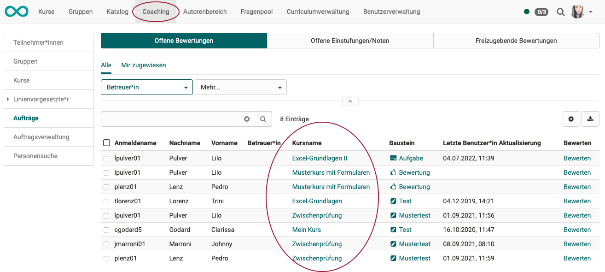

# Wie bewerte ich einen Test?

!!! info ""

    **Ziel und Inhalt dieser Anleitung**

    Sie haben bereits einen Kurs mit einem Test-Kursbaustein erstellt. 
    Sie haben den Kurs veröffentlicht und die Kursteilnehmer haben den Test bearbeitet. 
    Wie gehen Sie nun vor, um die Testergebnisse der Teilnehmer zu bewerten? Die folgende Anleitung zeigt es Ihnen. 

!!! info ""

     **Zielgruppe**

    [ ] Autor:innen [x] Betreuer:innen  [ ] Teilnehmer:innen

    [x] Anfänger:innen [x] Fortgeschrittene  [ ] Experten/Expertinnen
    

!!! info ""

    **Erwartete Vorkenntnisse**

    * [„Wie erstelle ich meinen ersten OpenOlat-Kurs?"](../my_first_course/my_first_course.de.md)
    * [„Wie gehe ich vor, wenn ich einen Test erstelle?"](../test_creation_procedure/test_creation_procedure.de.md)
    * Bewertungswerkzeug

 

---

## Wie gelange ich zur Bewertung eines Tests?

Ein Test wird jeweils mit einem Bewertungsformular bewertet. Um es aufzurufen, gibt 3 Einstiegspunkte:

### 1. Einstieg direkt im Kursbaustein

Wer als Betreuer:in angemeldet ist, sieht bei **Klick auf den Test-Kursbaustein** nicht den Test (wie die Teilnehmer), sondern eine Übersicht zum Bearbeitungsstatus der betreuten Teilnehmer:innen.

Im **Tab "Teilnehmer"** erhalten Sie die Liste der betreuten Teilnehmer mit Bearbeitungsstatus dieses Kursbausteins.

Nach **Wahl eines Teilnehmers** gelangen Sie zum Bewertungsformular des Gesamttests.

{ class="shadow lightbox" } 

Mit **Klick auf "Korrektur" in der Zeile des aktuellen Kursruns** erhalten Sie die Liste der Fragen dieses Tests und können jede Einzelfrage bewerten. (Zu jeder Frage gibt es ein Bewertungsformular.)

{ class="shadow lightbox" } 

!!! hint "Hinweis"

    Sollte der Link "Korrigieren" nicht angezeigt werden, müssen Sie möglicherweise diese Spalte noch anzeigen. Sie finden die Option unter dem Zahnrad-Icon.

    { float: right; width=300px class="shadow lightbox" } 

 

### 2. Einstieg durch Aufruf des Bewertungswerkzeuges

Das Bewertungswerkzeug wird aufgerrufen via 
**Kurs > Administration > Bewertungswerkzeug**

Im Bewertungswerkzeug werden alle bewertbaren Kursbausteine des ganzen Kurses angezeigt. Wählen Sie den relevanten Test-Kursbaustein. Sie erhalten die Übersicht zum Bearbeitungsstatus der betreuten Teilnehmer:innen.

{ class="shadow lightbox" } 

 

### 3. Einstieg über das Coachingtool

Wird Ihnen im **Menü der Kopfzeile die Option "Coachingtool"** angezeigt, können Sie auch darüber zur Bewertung des Test-Kursbausteins gelangen.

Das Bewertungswerkzeug listet alle bewertbaren Kursbausteine eines Kurses auf, also auch einen darin enthaltenen Test. Das Coachingtool zeigt dagegen **kursübergeifend** anstehende Bewertungsaufträge an.

* Offene Bewertungen
* Freizugebende Bewertungen
* Korrekturaufträge (auch wenn Sie eine Kurs-externe Person sind)

{ class="shadow lightbox" } 

 

---

## Automatische und manuelle Bewertung 

Viele Fragetypen können automatisch bewertet werden (z.B. Single Choice, Multiple Choice).
Wird automatisch bewertet, können Sie die automatische Bewertung so übernehmen oder manuell mit einer eigenen (manuellen Bewertung) übersteuern.

Daneben gibt es Fragetypen, die zwingend manuell bewertet werden müssen, weil sie nicht automatisch auswertbar sind (z.B. Freitext-Eingabefeld).

 

---

## Das Bewertungsformular

Pro Frage eines Tests gibt es für jeden Kursteilnehmer in OpenOlat ein Bewertungsformular.
Ausserdem gibt es ein Bewertungsformular für den gesamten Test-Kursbaustein.

Dort können Sie

* kurze Feedbacks geben (Kommentar für Teilnehmende)
* Punkte vergeben
* bestanden/nicht bestanden definieren 
* die Freigabe der Resultate für Lernende einstellen
* Kommentare für andere Betreuter hinterlassen
* Bewertungsdokumente verteilen
* eine Bewertung abschliessen

 

---

## Das Korrekturwerkzeug

Für Tests ist zusätzlich ein Korrekturwerkzeug verfügbar, in dem die Tests **fragenweise** korrigiert werden können. Sie gelangen über das Bewertungswerkzeug dorthin.

**Kurs wählen > Administration > Bewertungswerkzeug > Tab "Teilnehmer" > Button "Korrekturwerkzeug"**

Es kann damit auf 2 Arten korrigiert werden:

1. Eine bestimmte Frage auswählen und diese Frage bei allen Teilnehmern korrigieren.
2. Einen Teilnehmer auswählen und dann nacheinander alle Fragen dieses Teilnehmers korrigieren, bevor Sie zum nächsten Teilnehmer wechseln.

 

---

## Bewertungssysteme 

Standardmässig wird in OpenOlat jede Frage mit Punkten bewertet.

Die Punkte je Fragen werden zur Punktesumme des Kursbausteins addiert.

Die Endsumme der Punkte kann umgerechnet werden in

* Noten (Details sind konfigurierbar, z.B. 1-6 oder 6-1
* Begriffe zur Bewertung (z.B. "sehr gut", "gut", usw. oder A1, B1, usw. für Sprachniveaus)
* grafische Bewertung (z.B. verschiedene Smileys)

Ob und wie eine Umwandlung der Punkte stattfindet, wird vom Kursautor festgelegt und kann nicht von bewertenden Personen eingestellt werden.

 

---

## Links

:octicons-device-camera-video-24: **Video-Einführung**: [Überblick Testing](<https://www.youtube.com/embed/fkqH41-8CaI>){:target="_blank”}

:octicons-device-camera-video-24: **Video-Einführung**: [Wie funktionieren Tests in OpenOlat?](<https://www.youtube.com/embed/M0p3UKaEOlg>){:target="_blank”}

 

---

## Checkliste

- [x] Wurde der Test von allen Kursteilnehmer bearbeitet?
- [x] Ist der späteste erlaubte Bearbeitungszeitpunkt bereits überschritten?
- [x] Ist klar, wer die Testergebnisse bewertet?
- [x] Können alle Fragen automatisch korrigiert werden oder müssen einige zwingend manuell korrigert werden?
- [x] Sollen auch die automatisch korrigierten Fragen nochmals manuell kontrolliert werden?

