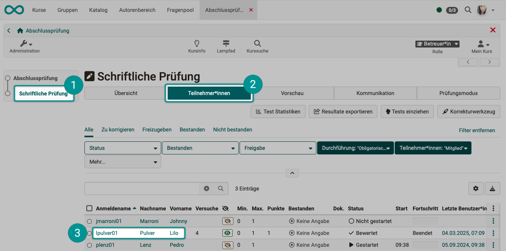
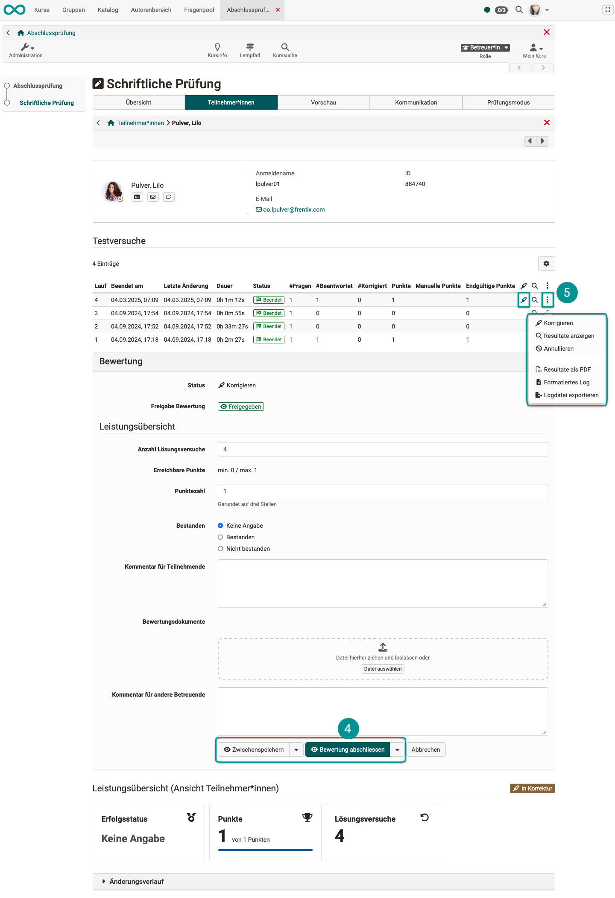
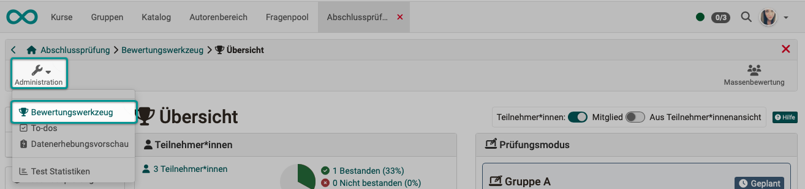
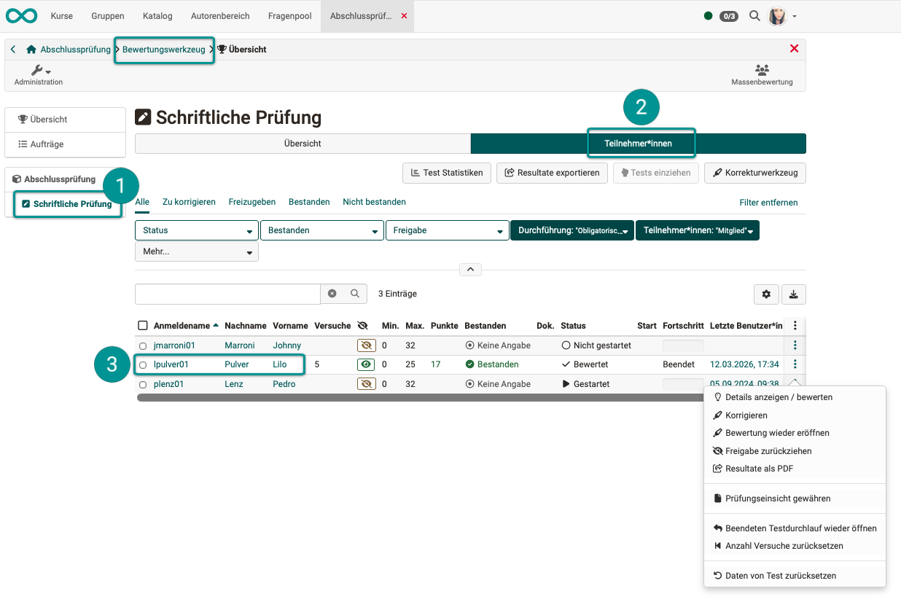
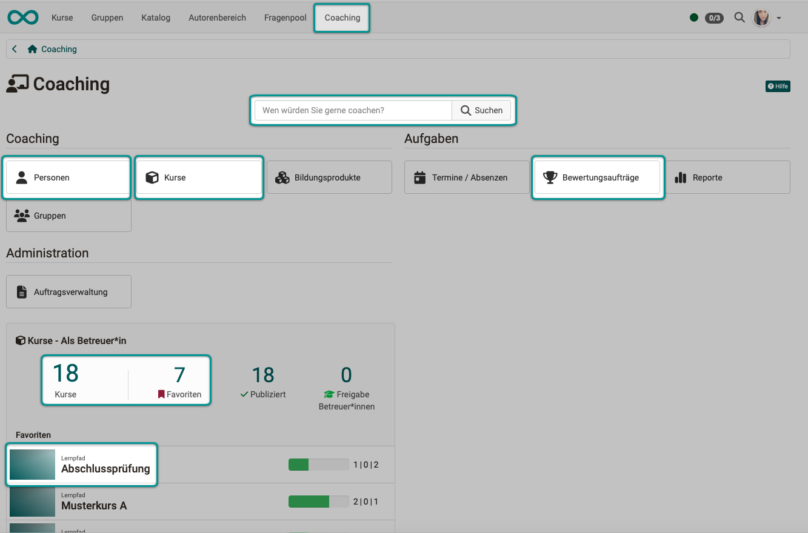
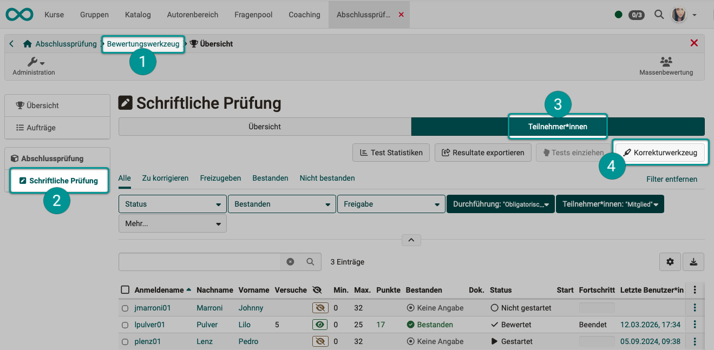
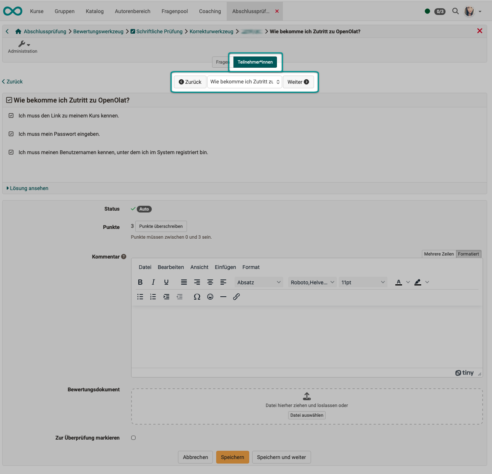
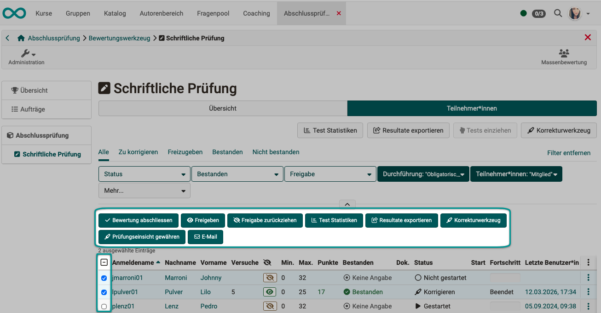

# How do I assess a test? {: #assessing_tests}

??? abstract "Objectives and content of this instruction"

    You have already created a course with a course element.  
    You have published the course and participants have taken the test.  
    How do you go about viewing, manually grading, commenting on, and finalizing the participants' test results? The following instructions will show you how.

??? abstract "Target group"

    [ ] Authors [x] Coaches  [ ] Participants

    [x] Beginners [x] Amateurs  [ ] Experts

??? abstract "Expected previous knowledge"

    * ["How do I create my first OpenOlat course?"](../my_first_course/my_first_course.md)
    * ["How do I proceed when creating a test?"](../test_creation_procedure/test_creation_procedure.md)
    * [Assessment tool >](../../manual_user/learningresources/Assessment_tool_overview.md)

---

## What does "assess a test" mean? {: #meaning}

It is possible to assess tests either automatically or manually in OpenOlat.

**Questions that can be assessed automatically** (e.g., single-choice, multiple-choice) can be assessed by the system immediately after submission. 
**Questions that require manual assessment** include, for example, open-ended text or drawing questions. These must be assessed by coaches. However, even questions that have already been automatically assessed can be reviewed.

As a coach, you can use the **assessment tool** to:

* View the test results of all participants
* Assess individual questions manually with points
* Manually override the total score and pass/fail status
* Leave comments for participants and other coaches
* Complete reviews individually or in a batch

[To the top of the page ^](#assessing_tests)

---

## How do I access the assessment of a test? {: #access}

Each test is graded using a grading form. There are three ways to access it:

### 1. Start directly in the course module {: #access_course_element}

{ class="shadow lightbox" }

 Users registered as coaches will not see the test (as participants do) when they **click on a test course module**, but rather an overview of the progress status of the participants they are coaching (with regard to the selected test course module).

 In the **"Participants" tab"**, you will find a list of the participants you are coaching, along with the processing status for this course module.

 After **selecting a participant**, you will be taken to the **assessment form** for the overall test.

{ class="shadow lightbox" }

 

In the **assessment form for the entire test**, you will find a list of all of the participant’s previous test attempts and can assess the entire test. You can also save your progress. You can:

* Assign points or overwrite points that have already been automatically assigned

* Assign a grade of "Pass" or "Fail"
* Add comments for the participant
* Add assessment documents
* Leave comments for other coaches

 Click the **correction icon** or the **three dots and then "Correct"** in the row of the current test attempt to open the **correction tool**. You will see a list of the questions in this test and can grade each individual question. (There is an **individual question grading form** for each question.) You can:

* view the results
* reverse a test attempt
* export the results of a participant as a pdf
* use log files to view the history of the test attempt 

If an assessment has been completed, the buttons to show change. You can then:

* Reopen the turned in assessment
* Share the assessment
* Revoke sharing the assessment

[To the top of the page ^](#assessing_tests)

---

### 2. Get started by opening the assessment tool {: #access_assessment_tool}

The assessment tool can be accessed via 
**Course > Administration > Assessment tool**

{ class="shadow lightbox" }

The steps that follow are the same as when accessing the course element directly (see [the previous section](#access_course_element)). In the grading tool, all gradable course elements for the entire course are displayed on the left. Select the relevant test course element, the "Participants" tab, etc.

Also note the options under the icon at the end of the line.

{ class="shadow lightbox" }

[To the top of the page ^](#assessing_tests)

---

### 3. Access through the coaching tool {: #access_coaching_tool}

If you see the **"Coaching Tool" option in the header menu**, you can also use it to assess the test course module.

The **coaching tool** displays upcoming assessment assignments **across all courses**.
From the Coaching Tool's overview page, you can access your assessment tasks via various links. For example, you can search for a specific person or view only the pending assessment tasks. 

The steps that follow are then the same as when you start directly in the course element (see [the previous section](#access_course_element)).

{ class="shadow lightbox" }

[To the top of the page ^](#assessing_tests)

---

## Automatic and manual assessment {: #automatic-manually}

Most question types can be graded automatically (e.g., single-choice, multiple-choice).
If the rating is generated automatically, you can accept the automatic rating or override it manually with your own rating.

In addition, there are question types that must be graded manually because they cannot be evaluated automatically (e.g., the free-text input field).

Whether corrections and grading should be done automatically or manually is determined by the test owners (creators) under 
**Course administration > Settings > Tab "Assessment" > Section "Correction"**

[To the top of the page ^](#assessing_tests)

---

## The assessment form {: #assessment_form}

**For each question** on a test, there is a grading form in OpenOlat for each course participant.

There is also an evaluation form for the **entire test course module**.  
See [1. Start directly in the course module, Step 3 ^](#access_course_element)

There you can:

* Provide brief feedback (comments for participants)
* Give points
* Define "Passed"/"Not passed"
* Define sharing results with students
* Leave comments for other coaches
* Distribute assessment documents
* Complete an assessment

[To the top of the page ^](#assessing_tests)

---

## The correction tool {: #correction_tool}

In OpenOlat, a distinction is made between **assessment tool** and **correction tool**. 
Using the correction workflow, you can generate individual correction requests and assign them to specific correctors. Corrections via the assessment tool are then no longer possible.

The **assessment tool** can be used to grade various **gradable course elements**:

* Checklist
* Assessment
* Portfolio task
* The "Structure" module, as well as the entire course
* Course module "Participant Folder"
* Integrated external components such as SCORM
* Task and group task
* Tests

For **tests**, a **correction tool** is also available, which allows you to grade tests **question by question**. You can access it, for example, via the assessment tool.

**Select course > Administration > Assessment tool > Select course element > Tab "Participant" > Button "Correction tool"**

{ class="shadow lightbox" }

There are two ways to correct this:

1. **Select a specific question** and grade that question for all participants.
2. **Select a participant** and then grade all of that participant’s questions one by one before moving on to the next participant.

{ class="shadow lightbox" }

{ class="shadow lightbox" }

It is also possible to have tests graded anonymously in OpenOlat. You can learn more about this in the how-to guide [How do you grade an anonymous test in OpenOlat? >](../../manual_how-to/assessing_tests_anonymously/assessing_tests_anonymously.md)

[To the top of the page ^](#assessing_tests)

---

## Grading systems {: #grading_systems}

By default, every question in OpenOlat is graded on a point system.

The points for each question are added to the total score for the course module.

The total number of points can be converted to

* Grades (details are configurable, e.g., 1–6 or 6–1)
* Grading terms (e.g., "excellent," "good," etc., or A1, B1, etc., for language proficiency levels)
* Visual rating (e.g., various emojis)

Whether and how points are converted is determined by the course author and cannot be configured by graders. 
[Find out more >](../../manual_user/learningresources/Assessment_translate_points_in_grades.md)

[To the top of the page ^](#assessing_tests)

---

## Bulk Actions: Edit Multiple Participants at Once {: #bulk_action}

The assessment tool offers **batch actions** to set the status of multiple participants at once without having to open each person's profile individually.

* In the participant list, select the **checkboxes** for the desired participants in the first column. If you select the checkbox in the header row, all checkboxes in that column will be selected.
* Once at least one person has been selected, several buttons for batch actions will appear above the table.
* Select one of the actions.

{ class="shadow lightbox" }

[To the top of the page ^](#assessing_tests)

---

## Checklist {: #checklist}

- [x] Did all course participants take the test?
- [x] Has the latest permitted editing time already passed?
- [x] Is it clear who evaluates the test results?
- [x] Should someone who isn't enrolled in the course be the one to correct it? 
- [x] Should proofreading jobs be assigned?
- [x] Was the test configured to be graded automatically, or should it be graded manually?
- [x] Does the test consist solely of questions that can be graded automatically?

[To the top of the page ^](#assessing_tests)

---

## Further information {: #further_information}

:octicons-device-camera-video-24: **Video introduction (German)**: [Overview Testing](<https://www.youtube.com/embed/fkqH41-8CaI>){:target="_blank”}

:octicons-device-camera-video-24: **Video introduction (German)**: [How do tests work in OpenOlat?](<https://www.youtube.com/embed/M0p3UKaEOlg>){:target="_blank”}

[Assessment tool - Overview >](../../manual_user/learningresources/Assessment_tool_overview.md) 
[Assessment tool - Tab Users >](../../manual_user/learningresources/Assessment_tool_tab_Users.md) 
[Assessment tool - Assessment of learners>](../../manual_user/learningresources/Assessment_of_learners.md) 
[Assessment of course modules >](../../manual_user/learningresources/Assessment_of_course_modules.md) 
[Create test >](../../manual_user/learningresources/Test.md) 
[Configure test >](../../manual_user/learningresources/Configure_tests.md) 
[Assess tests >](../../manual_user/learningresources/Assessing_tests.md) 
[The assessment form >](../../manual_user/learningresources/The_assessment_form.md) 
[Grading >](../../manual_user/learningresources/Assessment_translate_points_in_grades.md) 
[Reset data >](../../manual_user/learningresources/Assessment_tool_reset_data.md) 
[Correction workflow >](../../manual_user/learningresources/Test_settings.md#korrektur-workflow) 
[How do you grade an anonymous test in OpenOlat?  >](../../manual_how-to/assessing_tests_anonymously/assessing_tests_anonymously.md) 

[To the top of the page ^](#assessing_tests)
