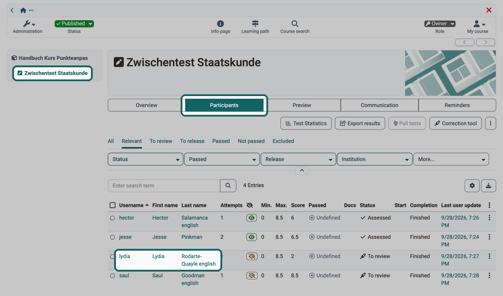
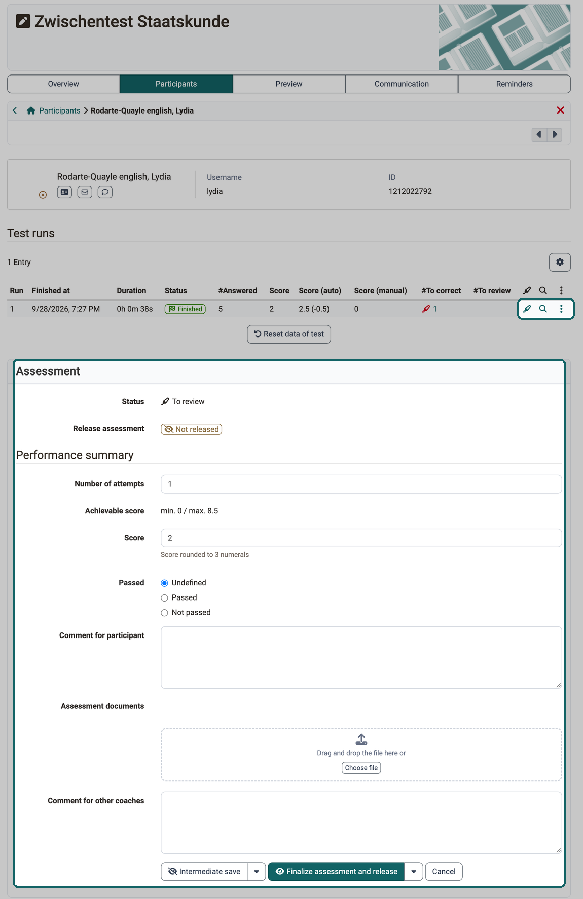
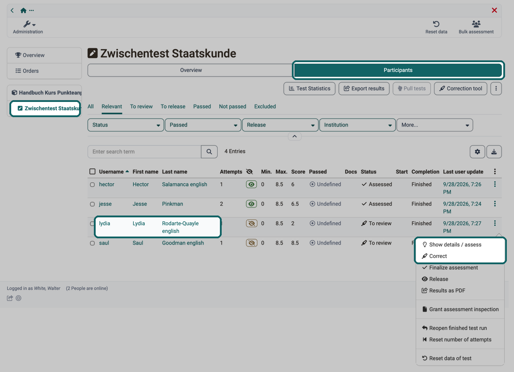
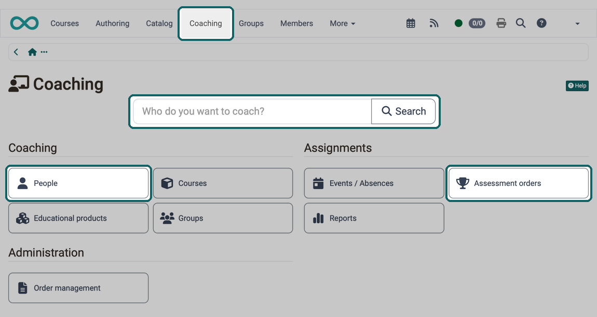
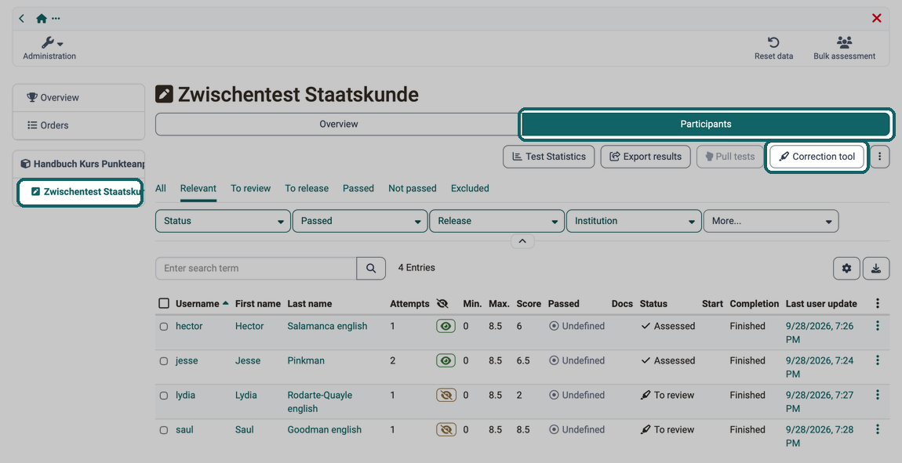
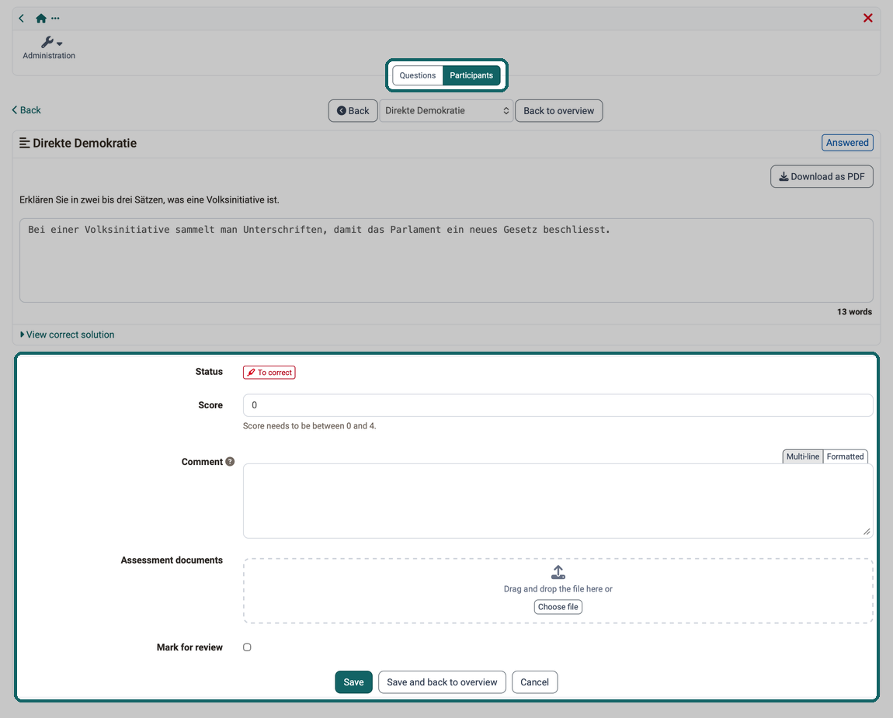
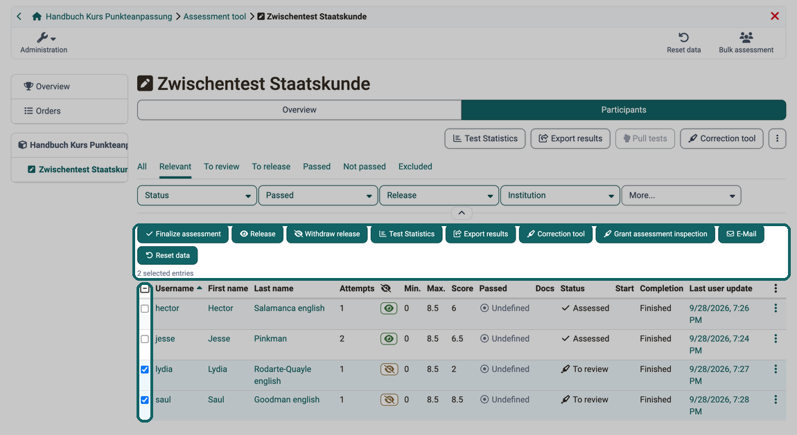

# How do I assess a test? {: #assessing_tests}

??? abstract "Objectives and content of this instruction"

    There is a test course element in the course, and the participants have taken the test. 
    How do you go about viewing, manually grading, commenting on, and finalizing the participants' test results? The following instructions will show you how.

??? abstract "Target group"

    [ ] Authors [x] Coaches  [ ] Participants

    [x] Beginners [x] Advanced users  [ ] Experts

??? abstract "Expected previous knowledge"

    * ["How do I create my first OpenOlat course?"](../my_first_course/my_first_course.md)
    * ["How do I proceed when creating a test?"](../test_creation_procedure/test_creation_procedure.md)
    * [Assessment tool >](../../manual_user/learningresources/Assessment_tool_overview.md)

---

## What does "assess a test" mean? {: #meaning}

It is possible to assess tests either automatically or manually in OpenOlat.

**Questions that can be assessed automatically** (e.g., single-choice, multiple-choice) can be assessed by the system immediately after submission. 
**Questions that require manual assessment** include, for example, open-ended text or drawing questions. These must be assessed by coaches. However, even questions that have already been automatically assessed can be reviewed.

As a coach, you can use the **assessment tool** to:

* View the test results of all participants
* Assess individual questions manually with points
* Manually override the total score and pass/fail status
* Leave comments for participants and other coaches
* Complete reviews individually or in a batch

[To the top of the page ^](#assessing_tests)

---

## How is an assessment order created and assigned? {: #assessment_order}

Whether an assessment order is created for a test depends on the setting "Correction" at the course element Test: does OpenOlat evaluate the test automatically, or does a person correct it by hand? 
Automatically evaluated tests need no assessment order, OpenOlat shows the result immediately. For manually corrected tests, OpenOlat creates an order. Course owners choose the variant under:  `Course > Administration > Course editor > Select course element Test > Tab "Test configuration" > Section "Correction"`

As a coach without ownership, you only change this setting if you have been granted the "Course editor" right in the course. You work on the order as soon as OpenOlat has created it.

Should the test be corrected manually? As soon as a participant completes the test, OpenOlat creates an assessment order. Who receives it depends on the selected variant:

* **Manual by course coach/owner**: The order is listed for all coaches of the person and for the course owners, under `Coaching > Assessment orders > Tab "Open reviews"`. With this variant, there is no assignment to a specific person.
* **Manual by correctors**: OpenOlat assigns the order to a person who is entered in the correction workflow of the learning resource Test. This variant is available as soon as the owners of the test have switched on the [correction workflow](../../manual_user/learningresources/Test_settings.md#correction-workflow) in the learning resource Test. Correctors do not need a membership in the course. They find the order as a grading assignment under `Coaching > Assessment orders > Tab "Grading assignments"`.

If no corrector is available at completion, the grading assignment waits with the status "Unassigned" under `Coaching > Order management > Tab "Grading assignments"`. There, owners of the test, learning resource managers or administrators assign it to a corrector, and it appears in that person's tab "Grading assignments".

The section [Creating assessment orders](../../manual_user/area_modules/Coaching_Assessment_Orders.md#create_assessment_orders) shows which setting fills which tab in the coaching.

[To the top of the page ^](#assessing_tests)

---

## How do I access my assessment orders (tests)? {: #access}

As a coach, you see the assessment orders of the people you coach, as a course owner the orders of all participants of the course. As a corrector, you see the grading assignments that are assigned to you.

Each test is assessed using an assessment form. There are three ways to access it:

### 1. Start directly in the course element {: #access_course_element}

Users registered as coaches will not see the test (as participants do) when they click on a test course element, but rather an overview of the progress status of the participants they are coaching for this course element. From there, two clicks take you to the assessment form of a person:

{ class="shadow lightbox" title="Tab Participants in the course element Test · 2026.10.02" }

* **Course element**: Select the test course element in the course menu.
* **Tab "Participants"**: Here you will find the list of the participants you are coaching, along with the processing status for this course element. Click the name of a person.
* **Assessment form**: You are taken to the assessment form of the entire test for this person.

{ class="shadow lightbox" title="Assessment form of a person in the course element Test · 2026.10.02" }

Above the assessment form, OpenOlat lists all previous test runs of the person under "Test runs". Course owners also find the button "Reset data of test" below them.

In the **assessment form for the entire test**, you assess the entire test. You can:

* Assign points or overwrite points that have already been automatically assigned
* Assign "Passed" or "Not passed"
* Add comments for the participant
* Add assessment documents
* Leave comments for other coaches

With "Intermediate save" you save an interim state. You finalize the assessment with "Finalize assessment and release" or with "Finalize assessment", depending on whether it is to be released. If you are allowed to release assessments, the arrow next to both buttons offers the variant with or without release.

The row of the current test run shows three icons:

* **Correct**: opens the questions of this test run. You grade each individual question in its **assessment form for the individual question**. This is the same view as in the [correction tool](#correction_tool) after selecting a person.
* **View results**: shows the results of the test run.
* **More actions**: opens a menu, among others with "Results as PDF", "Formatted Log", "Export log file" and "Invalidate". The log files let you trace the history of the test run.

If an assessment has been completed, the buttons shown change. You can then:

* edit the assessment again with "Reopen assessment"
* release the assessment with "Release" or withdraw the release with "Withdraw release", depending on whether it is released

[To the top of the page ^](#assessing_tests)

---

### 2. Get started by opening the assessment tool {: #access_assessment_tool}

The assessment tool can be accessed via 
`Course > Administration > Assessment tool`

The steps that follow are the same as when accessing the course element directly (see [the previous section](#access_course_element)). In the assessment tool, all assessable course elements of the entire course are displayed on the left. Select the relevant test course element, the "Participants" tab and there the name of a person.

At the end of each row, the icon "More actions" opens a menu. With "Show details / assess" you open the assessment form of the person, with "Correct" the correction of their test run. Depending on the status of the assessment, the menu offers further entries, such as "Finalize assessment", "Release", "Results as PDF" or "Reset number of attempts".

{ class="shadow lightbox" title="More actions menu in the tab Participants of the assessment tool · 2026.10.02" }

[To the top of the page ^](#assessing_tests)

---

### 3. Access through the Coaching site {: #access_coaching_tool}

If you see the **"Coaching" site in the main navigation**, you can also use it to assess the test course element.

The **Coaching** site displays pending assessment orders **across all courses**.
From the start page of the Coaching site, you can reach your assessment task in several ways: search for a specific person with the search field "Who do you want to coach?", open the people you coach with the tile "People", or display the pending orders with the tile "Assessment orders".

The steps that follow are then the same as when you start directly in the course element (see [the previous section](#access_course_element)).

Which setting fills which tab in the Coaching site is described in the section [Creating assessment orders](../../manual_user/area_modules/Coaching_Assessment_Orders.md#create_assessment_orders).

{ class="shadow lightbox" title="Start page of the Coaching site · 2026.10.02" }

[To the top of the page ^](#assessing_tests)

---

## Automatic and manual assessment {: #automatic-manually}

Most question types can be graded automatically (e.g., single-choice, multiple-choice).
If the rating is generated automatically, you can accept the automatic rating or override it manually with your own rating.

In addition, there are question types that must be graded manually because they cannot be evaluated automatically (e.g., the free-text input field).

Whether corrections and grading should be done automatically or manually is determined by the course owners in the course editor at the course element Test: 
`Course > Administration > Course editor > Course element Test > Tab "Test configuration" > Section "Correction"` 
What the three variants do is described on the page [Tests at course level](../../manual_user/learningresources/Tests_at_course_level.md#correction).

[To the top of the page ^](#assessing_tests)

---

## The assessment form {: #assessment_form}

**For each question** on a test, there is an assessment form in OpenOlat for each course participant.

There is also an assessment form for the **entire test course element**.  
See [Start directly in the course element](#access_course_element)

There you can:

* Provide brief feedback (comments for participants)
* Give points
* Define "Passed"/"Not passed"
* Define sharing results with students
* Leave comments for other coaches
* Distribute assessment documents
* Complete an assessment

[To the top of the page ^](#assessing_tests)

---

## The correction tool {: #correction_tool}

In OpenOlat, a distinction is made between **assessment tool** and **correction tool**. 
Using the correction workflow, you can generate individual grading assignments and assign them to specific correctors. Corrections via the assessment tool are then no longer possible.

The **assessment tool** can be used to assess various **assessable course elements**:

* Checklist
* Assessment
* Portfolio task
* Course element "Structure", as well as the entire course
* Course element "Participant Folder"
* Integrated external components such as SCORM
* Task and group task
* Tests

For **tests**, a **correction tool** is also available, which allows you to grade tests **question by question**. You can access it, for example, via the assessment tool.

`Course > Administration > Assessment tool > Select course element > Tab "Participants" > Button "Correction tool"`

{ class="shadow lightbox" title="Tab Participants in the assessment tool · 2026.10.02" }

OpenOlat shows the button "Correction tool" if the correction "Manual by course coach/owner" is set at the course element, or if the test contains questions that must be corrected manually. With the variant "Manual by correctors", the button is missing: the correction then runs via the grading assignments.

If assessments have already been finalized, the button first opens the dialog "Reopen closed assessments". With "Reopen assessment" you reopen the finalized assessments for a new correction, with "See correction read only" you see the correction without changing anything.

It allows two ways of correcting:

1. **Select a specific question** and grade that question for all participants.
2. **Select a participant** and then grade all of that participant’s questions one by one before moving on to the next participant.

You choose the way with the switch "Questions" or "Participants". The question list shows for each question how many answers are corrected automatically or manually and how many are still to correct or to review. The tabs "To correct", "To review", "Manual" and "Adjusted" filter the list. With "Save results as completed" you finalize the assessments.

{ class="shadow lightbox" title="Question list in the correction tool · 2026.10.02" }

In the assessment form for the individual question, you assign the points, write a comment, upload an assessment document or set "Mark for review". For automatically assessed questions, you change the assigned points with "Override score".

{ class="shadow lightbox" title="Assessment form of a single question in the correction tool · 2026.10.02" }

Whether the correction tool shows the names of the participants or the "Participant identifier" instead is set by administrators in the system administration: `Administration > e-Assessment > Test > Tab "Correction"`. The anonymous display with the participant identifier is preset. Find out more: [e-Assessment Administration: Test](../../manual_admin/administration/e-Assessment_Test.md#tab_correction)

It is also possible to have tests graded anonymously in OpenOlat. You can learn more about this in the how-to guide [How do I correct a test anonymously in OpenOlat? >](../../manual_how-to/assessing_tests_anonymously/assessing_tests_anonymously.md)

[To the top of the page ^](#assessing_tests)

---

## Rating systems {: #rating_systems}

By default, every question in OpenOlat is assessed with points.

The points for each question are added to the total score of the course element.

If the option "Levels/Grading" is switched on at the course element, a rating scale converts the total score into

* Grades (details are configurable, e.g., 1-6 or 6-1)
* Rating terms (e.g., "very good", "good", etc., or A1, B1, etc., for language levels)
* Graphical rating (e.g., various emojis)

Which rating system applies is set by the course owners in the course editor. People who assess cannot change the setting. 
[Find out more >](../../manual_user/learningresources/Assessment_translate_points_in_grades.md)

[To the top of the page ^](#assessing_tests)

---

## Bulk actions: edit multiple participants at once {: #bulk_action}

The assessment tool offers **bulk actions** to set the status of multiple participants at once without having to open each person's profile individually.

* In the participant list, select the **checkboxes** for the desired participants in the first column. If you select the checkbox in the header row, all checkboxes in that column will be selected.
* Once at least one person has been selected, several buttons for bulk actions will appear above the table.
* Select one of the actions.

Which bulk actions appear depends on the configuration of the course element and on your rights. For a test, they are for example "Finalize assessment", "Release", "Withdraw release", "Test Statistics", "Export results", "Correction tool", "Grant assessment inspection", "E-Mail" and "Reset data".

{ class="shadow lightbox" title="Bulk actions in the tab Participants of the assessment tool · 2026.10.02" }

[To the top of the page ^](#assessing_tests)

---

## Checklist {: #checklist}

- [x] Did all course participants take the test?
- [x] Has the latest permitted editing time already passed?
- [x] Is it clear who evaluates the test results?
- [x] Should someone who isn't enrolled in the course be the one to correct it?
- [x] Should grading assignments be issued?
- [x] Was the test configured to be graded automatically, or should it be graded manually?
- [x] Does the test consist solely of questions that can be graded automatically?

[To the top of the page ^](#assessing_tests)

---

## Further information {: #further_information}

**Mentioned on this page** 
[How do I create my first OpenOlat course? >](../my_first_course/my_first_course.md) 
[How do I proceed when I create a test? >](../test_creation_procedure/test_creation_procedure.md) 
[Assessment tool - overview >](../../manual_user/learningresources/Assessment_tool_overview.md) 
[Test settings - Administration >](../../manual_user/learningresources/Test_settings.md) 
[Coaching - Assessment Orders >](../../manual_user/area_modules/Coaching_Assessment_Orders.md) 
[Tests at course level >](../../manual_user/learningresources/Tests_at_course_level.md) 
[e-Assessment Administration: Test >](../../manual_admin/administration/e-Assessment_Test.md) 
[How do I correct a test anonymously in OpenOlat? >](../../manual_how-to/assessing_tests_anonymously/assessing_tests_anonymously.md) 
[Levels/Grading >](../../manual_user/learningresources/Assessment_translate_points_in_grades.md)

**Further reading** 
[Assessment tool: Tab Participants >](../../manual_user/learningresources/Assessment_tool_tab_Users.md) 
[Assessment of learners >](../../manual_user/learningresources/Assessment_of_learners.md) 
[Assessment of course modules >](../../manual_user/learningresources/Assessment_of_course_modules.md) 
[Creating Tests >](../../manual_user/learningresources/Test.md) 
[Configure tests >](../../manual_user/learningresources/Configure_tests.md) 
[Assessing tests >](../../manual_user/learningresources/Assessing_tests.md) 
[The assessment form >](../../manual_user/learningresources/The_assessment_form.md) 
[Assessment tool - reset data >](../../manual_user/learningresources/Assessment_tool_reset_data.md)

**youtube** 
:octicons-device-camera-video-24: **Video introduction (German)**: [Overview Testing](<https://www.youtube.com/embed/fkqH41-8CaI>){:target="_blank"} 
:octicons-device-camera-video-24: **Video introduction (German)**: [How do tests work in OpenOlat?](<https://www.youtube.com/embed/M0p3UKaEOlg>){:target="_blank"}

[To the top of the page ^](#assessing_tests)
