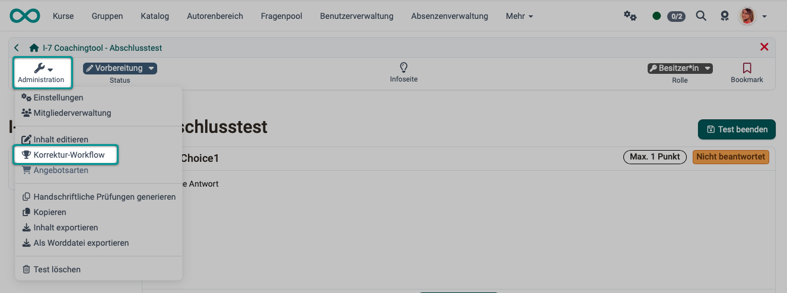
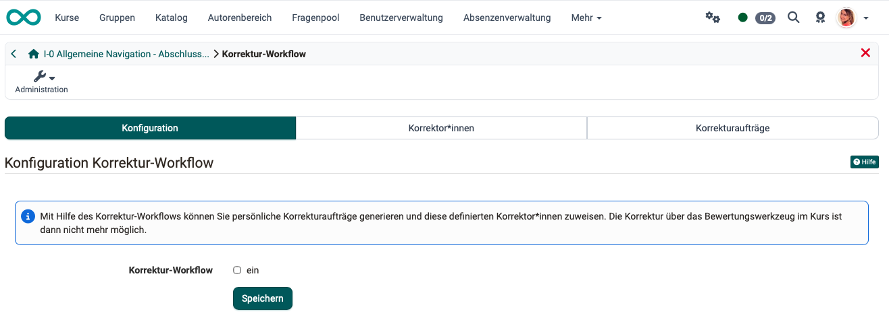
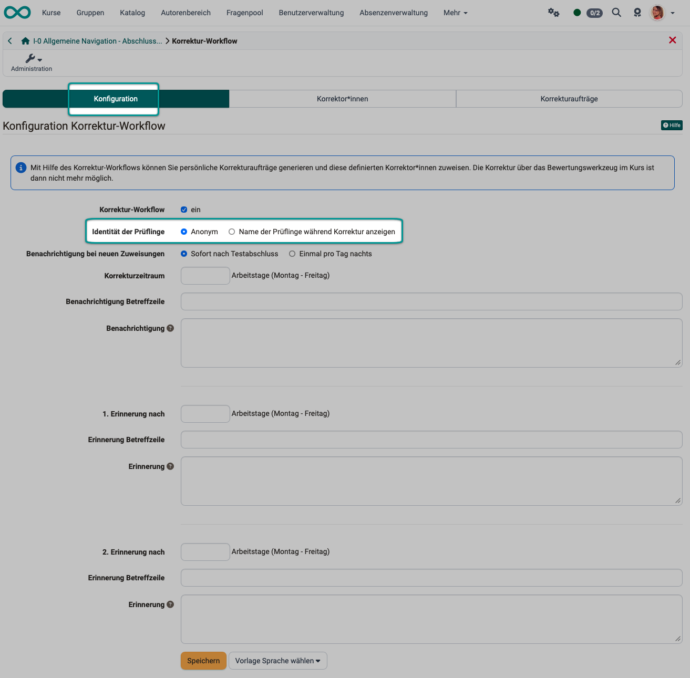
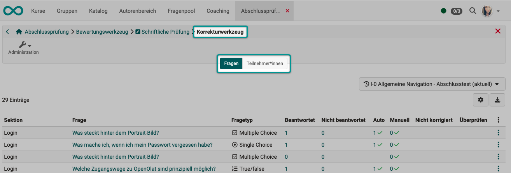

# Wie macht man in OpenOlat eine anonyme Test-Korrektur? {: #assessing_tests_anonymously}

??? abstract "Ziel und Inhalt dieser Anleitung"

    Diese Anleitung soll Kursbesitzer:inen zeigen, wie sie die Möglichkeit zur anonymen Korrektur in Test-Kursbausteinen einrichten können. Sowie Betreuer:innen/Korrektor:innen, wie sie eine anonyme Korrektur in OpenOlat durchführen.

??? abstract "Zielgruppe"

    [x] Autor:innen [x] Betreuer:innen  [ ] Teilnehmer:innen

    [ ] Anfänger:innen [x] Fortgeschrittene  [x] Expert:innen 

??? abstract "Erwartete Vorkenntnisse"

    * [Wie gehe ich vor, wenn ich einen Test erstelle? >](../../manual_how-to/test_creation_procedure/test_creation_procedure.de.md)
    * Sie kennen das Bewertungswerkzeug in OpenOlat.
    * Sie haben als Betreuer:in schon Tests in OpenOlat korrigiert.

---

## Warum anonyme Korrektur? {: #case_study}

Als Autor:in/Kursbesitzer:in haben Sie einen Kursbaustein "Test" in Ihren Kurs eingefügt. Sie möchten, dass Korrektor:innen während der Korrektur die Namen der Prüflinge nicht sehen, um eine möglichst unvoreingenommene Beurteilung zu erhalten.

Nachstehend finden Sie das Vorgehen beschrieben.

[zum Seitenanfang ^](#assessing_tests_anonymously)

---

## Anonyme Korrektur in OpenOlat einrichten {: #configuration}

Die anonyme Identität der Prüflinge ist eine Einstellung in der Test-Lernressource.  
Sie muss durch Kursbesitzer:innen bei der Erstellung des Kurses konfiguriert werden.

### Schritt 1

Wählen Sie die betroffene Test-Lernressource aus. Es gibt dazu 2 Wege:

- Sie können die Test-Lernressource direkt im Autorenbereich auswählen. 
- Oder Sie wählen im Kurseditor den Testkursbaustein und öffnen im Tab "Test-Konfiguration" die Test-Lernressource mit Klick auf "Lernressource bearbeiten".

### Schritt 2 

Öffnen Sie den **Korrektur-Workflow** unter **Administration**.

{ class="shadow lightbox" }

### Schritt 3

Im Tab **Konfiguration** können Sie den Korrektur-Workflow aktivieren.

{ class="shadow lightbox" }

### Schritt 4

Sobald der Korrektur-Workflow eingeschaltet ist, erscheinen die Optionen zur Konfiguration. Dort können Sie auch einstellen, ob die Identität der Prüflinge anonym bleiben oder angezeigt werden soll.

{ class="shadow lightbox" }

### Schritt 5

Vergessen Sie nicht die Konfiguration zu speichern.

### Schritt 6

Im Tab "Korrektor:innen" werden die Personen hinzugefügt, die einen Test bewerten sollen. Dabei ist es egal, welche Rolle die Person in OpenOlat besitzt. Auch Benutzer:innen, die sonst keine Betreuer:innen-Rolle haben, können als Korrektor:innen hinzugefügt werden. Über das Zahnrad können weitere Konfigurationen vorgenommen werden. Es kann z.B. Korrektor:innen kontaktiert, deaktiviert oder entfernt werden. sowie die jeweiligen Korrekturaufträge angezeigt werden.

screen

### Schritt 7

Im Tab "Korrekturaufträge" kann der Bearbeitungsstand der Korrekturaufträge der unterschiedlichen Korrektor:innen angezeigt und nach verschiedenen Kriterien gefiltert werden.

screen

[zum Seitenanfang ^](#assessing_tests_anonymously)

---

## Anonyme Korrektur durchführen {: #correction}

Wenn **Kursbesitzer:innen** einen Korrektur-Workflow einrichten, arbeiten sie an der Test-**Lernressource**. 
**Betreuer:innen** arbeiten dagegen im Kurs im **Test-Kursbaustein**, in dem die so konfigurierte Test-Lernressource eingebunden ist.

Sie gelangen z.B. über das Bewertungswerkzeug dorthin.

**Kurs wählen > Administration > Bewertungswerkzeug > Kursbaustein wählen > Tab "Teilnehmer" > Button "Korrekturwerkzeug"**

{ class="shadow lightbox" }

Es kann damit auf 2 Arten korrigiert werden:

1. Eine bestimmte **Frage auswählen** und diese Frage bei allen Teilnehmenden korrigieren.
2. Einen **Teilnehmenden auswählen** und dann nacheinander alle Fragen dieses Teilnehmenden korrigieren, bevor Sie zum nächsten Teilnehmenden wechseln.

{ class="shadow lightbox" }

{ class="shadow lightbox" }

Wurde die oben beschriebene Option "Anonym" ausgewählt, werden den Korrektor:innen statt der im Korrekturtool und Korrektur-Workflow keine Namen, sondern nur eine anonyme 7-stellige anonyme Kennung im Format ABC-DEF. (Seit OpenOlat 19.1.26 / 20.1.12, in vorhergehenden Versionen wurde statt der Kennung eine Zahl angezeigt.)

Diese Kennung bleibt konstant und wird an mehreren Stellen angezeigt. Korrektor:innen können so einzelne Teilnehmende über verschiedene Fragen hinweg konsistent identifizieren, ohne aber deren echte Identität zu kennen.

screen

!!! hint "Hinweis"

    Informationen zur kursübergreifenden Korrektur findet man im [Coaching Tool >](../../manual_user/area_modules/Coaching.de.md)

[zum Seitenanfang ^](#assessing_tests_anonymously)

---

## Checkliste {: #checklist}

- [x] Test-Lernressource: Korrektur-Workflow aktiviert?
- [x] Test-Lernressource: Korrektur-Workflow konfiguriert?
- [x] Test-Lernressource: Korrektur-Workflow > Tab Konfiguration > Option "anonym" gewählt?

[zum Seitenanfang ^](#assessing_tests_anonymously)

---

## Weitere Informationen {: #further_information}

[Wie gehe ich vor, wenn ich einen Test erstelle? >](../../manual_how-to/test_creation_procedure/test_creation_procedure.de.md) 
[Wie bewerte ich einen Test? >](../../manual_how-to/assessing_tests/assessing_tests.de.md) 

[zum Seitenanfang ^](#assessing_tests_anonymously)
