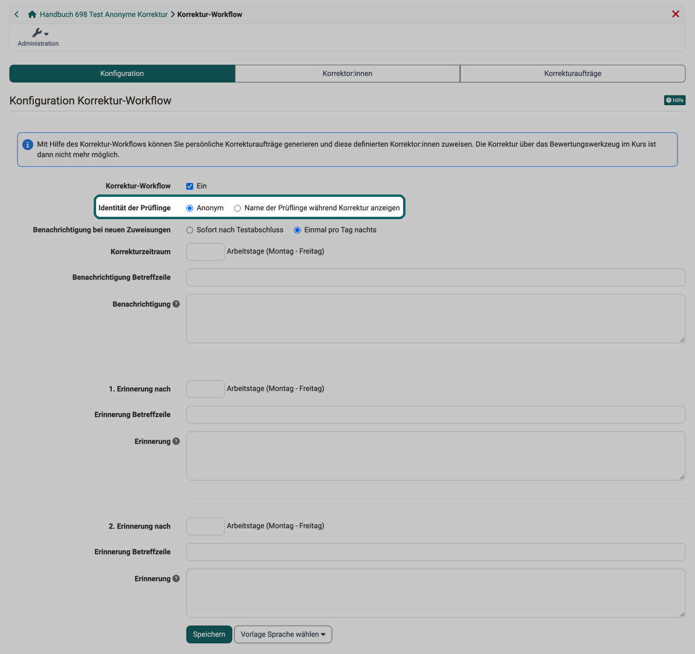
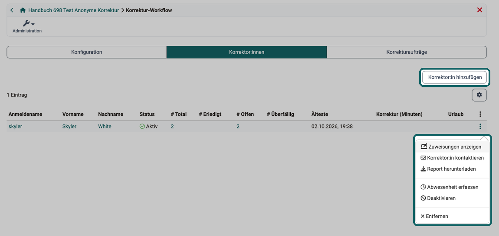
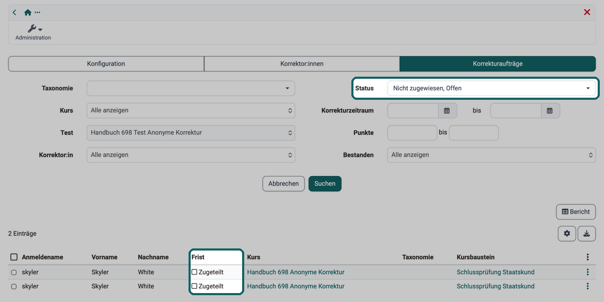
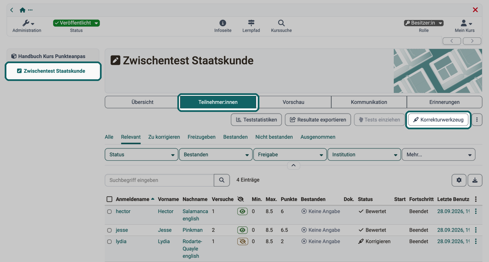
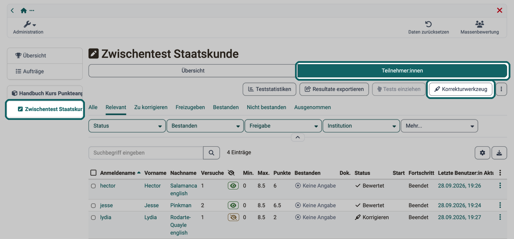
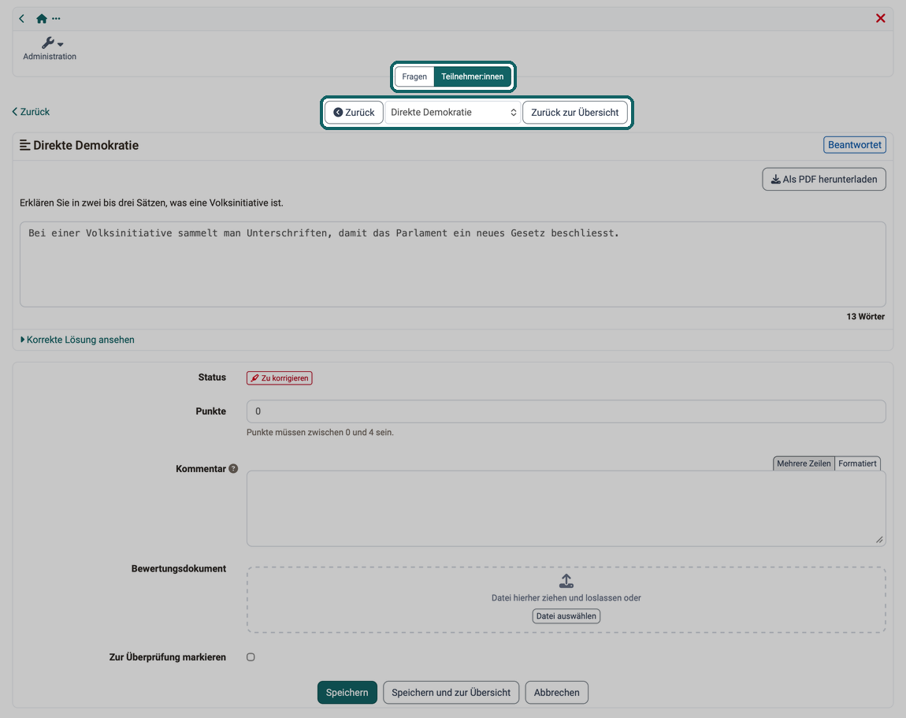
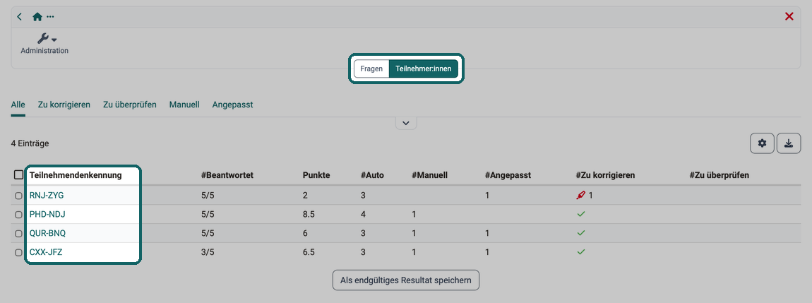
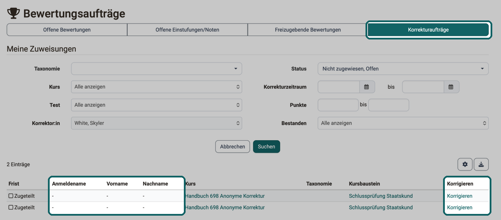
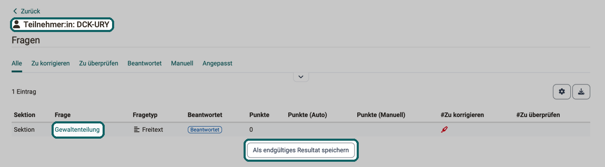
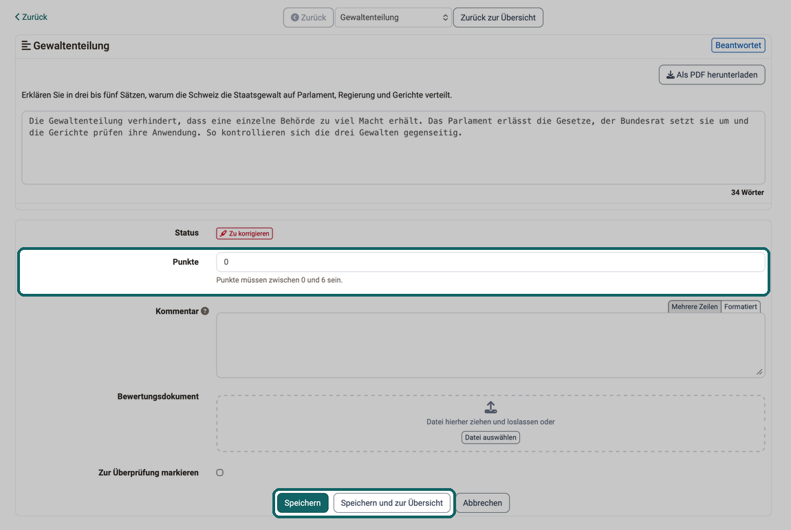

# Wie macht man in OpenOlat eine anonyme Test-Korrektur? {: #assessing_tests_anonymously}

??? abstract "Ziel und Inhalt dieser Anleitung"

    Diese Anleitung zeigt Besitzer:innen eines Tests, wie sie eine anonyme Korrektur einrichten. Betreuer:innen und Korrektor:innen zeigt sie, wie sie einen Test anonym korrigieren.

??? abstract "Zielgruppe"

    [x] Autor:innen [x] Betreuer:innen  [ ] Teilnehmer:innen

    [ ] Anfänger:innen [x] Fortgeschrittene  [x] Expert:innen

??? abstract "Erwartete Vorkenntnisse"

    * [Wie gehe ich vor, wenn ich einen Test erstelle? >](../../manual_how-to/test_creation_procedure/test_creation_procedure.de.md)
    * Sie kennen das Bewertungswerkzeug in OpenOlat.
    * Sie haben als Betreuer:in schon Tests in OpenOlat korrigiert.

---

## Warum anonyme Korrektur? {: #case_study}

Als Autor:in/Kursbesitzer:in haben Sie einen Kursbaustein "Test" in Ihren Kurs eingefügt. Sie möchten, dass Korrektor:innen während der Korrektur die Namen der Prüflinge nicht sehen, um eine möglichst unvoreingenommene Beurteilung zu erhalten.

OpenOlat kennt dafür zwei Wege. Welcher gilt, entscheidet die Einstellung "Korrektur" am Kursbaustein Test:

* "Manuell durch Korrektor:innen": Die Korrektor:innen aus dem Korrektur-Workflow der Test-Lernressource korrigieren ihre Korrekturaufträge im Coaching. Ob sie die Namen sehen, legen Besitzer:innen des Tests mit der Option "Anonym" im Korrektur-Workflow fest.
* "Manuell durch Kursbetreuer:in oder -besitzer:in": Betreuer:innen und Besitzer:innen des Kurses korrigieren im Korrekturwerkzeug des Kursbausteins. Ob das Korrekturwerkzeug Namen zeigt, legen Administrator:innen für die ganze OpenOlat-Instanz fest.

[zum Seitenanfang ^](#assessing_tests_anonymously)

---

## Anonyme Korrektur in OpenOlat einrichten {: #configuration}

Sollen Korrektor:innen einen Test anonym korrigieren, richten Besitzer:innen des Tests dafür den Korrektur-Workflow in der Test-Lernressource ein. Die Option "Anonym" bei "Identität der Prüflinge" gilt für alle Korrekturaufträge dieses Tests. Alle Einstellungen des Korrektur-Workflows beschreibt die Seite [Test Einstellungen - Administration](../../manual_user/learningresources/Test_settings.de.md#correction-workflow).

Damit Korrektor:innen ihre Aufträge im Coaching sehen, ist der Korrektur-Workflow zudem in der System-Administration eingeschaltet: `Administration > e-Assessment > Test > Tab "Korrektur-Workflow"`, Kontrollkästchen "Korrektur Workflow einschalten". Voreingestellt ist er eingeschaltet.

### Schritt 1

Wählen Sie die betroffene Test-Lernressource aus. Es gibt dazu 2 Wege:

- Sie können die Test-Lernressource direkt im Autorenbereich auswählen. 
- Oder Sie wählen im Kurseditor den Testkursbaustein und öffnen im Tab "Test-Konfiguration" die Test-Lernressource mit Klick auf "Lernressource bearbeiten".

### Schritt 2

Öffnen Sie in der Test-Lernressource den Korrektur-Workflow: 
`Test > Administration > Korrektur-Workflow`

### Schritt 3

Im Tab "Konfiguration" schalten Sie das Kontrollkästchen "Korrektur-Workflow" ein.

### Schritt 4

Sobald der Korrektur-Workflow eingeschaltet ist, erscheinen die weiteren Felder. Bei "Identität der Prüflinge" wählen Sie "Anonym" oder "Name der Prüflinge während Korrektur anzeigen". Mit "Anonym" sehen die Korrektor:innen in ihren Korrekturaufträgen keine Namen.

{ class="shadow lightbox" title="Tab Konfiguration im Korrektur-Workflow · 2026.10.02" }

Unter "Benachrichtigung bei neuen Zuweisungen" legen Sie fest, wann die Korrektor:innen von neuen Aufträgen erfahren: "Sofort nach Testabschluss" oder "Einmal pro Tag nachts". Die Felder "Korrekturzeitraum", "1. Erinnerung nach" und "2. Erinnerung nach" zählen in Arbeitstagen von Montag bis Freitag. Die 2. Erinnerung liegt nach der 1., der Korrekturzeitraum nach beiden.

Tragen Sie einen Korrekturzeitraum ein, sind "Benachrichtigung Betreffzeile" und "Benachrichtigung" Pflichtfelder. Dasselbe gilt für jede eingetragene Erinnerung mit ihren Feldern "Erinnerung Betreffzeile" und "Erinnerung". Mit "Vorlage Sprache wählen" setzen Sie vorbereitete Texte in einer Sprache Ihrer Wahl ein.

### Schritt 5

Speichern Sie die Konfiguration mit "Speichern".

### Schritt 6

Im Tab "Korrektor:innen" fügen Sie mit "Korrektor:in hinzufügen" die Personen hinzu, die diese Test-Lernressource korrigieren sollen. Dabei ist es egal, welche Rolle die Person in OpenOlat besitzt. Auch Benutzer:innen, die sonst keine Betreuer:innen-Rolle haben, können als Korrektor:innen hinzugefügt werden.

Am Ende jeder Zeile öffnet das Symbol "Weitere Aktionen" ein Menü mit "Zuweisungen anzeigen", "Korrektor:in kontaktieren", "Report herunterladen", "Abwesenheit erfassen", "Deaktivieren" und "Entfernen". Bei einer deaktivierten Person steht dort "Aktivieren" statt "Deaktivieren" und "Abwesenheit erfassen".

{ class="shadow lightbox" title="Tab Korrektor:innen im Korrektur-Workflow · 2026.10.02" }

### Schritt 7

Im Tab "Korrekturaufträge" sehen Sie den Bearbeitungsstand der Korrekturaufträge aller Korrektor:innen. Die Filter grenzen die Liste ein, etwa nach "Korrektor:in", "Status" oder "Korrekturzeitraum". Voreingestellt zeigt der Filter "Status" die Aufträge mit "Nicht zugewiesen" und "Offen". Die Spalte "Frist" zeigt den Stand eines Auftrags, etwa "Zugeteilt". Mit "Bericht" laden Sie den Stand der Korrekturaufträge als Excel-Datei herunter.

Ist für den Test die Option "Anonym" gesetzt, nennt die Liste nur die Korrektor:innen, nicht die geprüften Personen.

{ class="shadow lightbox" title="Tab Korrekturaufträge im Korrektur-Workflow · 2026.10.02" }

### Schritt 8

Prüfen Sie im Kurs die Einstellung "Korrektur" am Kursbaustein Test: 
`Kurs > Administration > Kurseditor > Kursbaustein Test wählen > Tab "Test-Konfiguration" > Abschnitt "Korrektur"`

Nur mit "Manuell durch Korrektor:innen" erstellt OpenOlat nach jedem abgeschlossenen Test einen Korrekturauftrag. Steht eine andere Option, weist der Kurseditor mit einem Hinweis darauf hin.

[zum Seitenanfang ^](#assessing_tests_anonymously)

---

## Anonyme Korrektur im Korrekturwerkzeug {: #correction}

Steht die Korrektur am Kursbaustein Test auf "Manuell durch Kursbetreuer:in oder -besitzer:in" oder enthält der Test Fragen, die eine Person korrigieren muss, korrigieren Betreuer:innen und Besitzer:innen des Kurses die Tests selbst. Sie arbeiten dazu im Kurs, im Kursbaustein Test, mit dem Korrekturwerkzeug. Bei "Manuell durch Korrektor:innen" zeigt der Kursbaustein keinen Button "Korrekturwerkzeug", die Korrektur läuft dann über die [Korrekturaufträge](#correction_by_correctors).

Ob das Korrekturwerkzeug die Namen der Teilnehmenden zeigt, legen Administrator:innen in der System-Administration für die ganze OpenOlat-Instanz fest: `Administration > e-Assessment > Test > Tab "Korrektur"`, Feld "Korrekturwerkzeug" mit der Option "Anonym". Voreingestellt ist die anonyme Anzeige. Die Option "Anonym" im Korrektur-Workflow der Test-Lernressource wirkt hier nicht. Mehr dazu: [e-Assessment Administration: Test](../../manual_admin/administration/e-Assessment_Test.de.md#tab_correction)

Das Korrekturwerkzeug öffnen Sie im Kursbaustein: 
`Kurs > Kursbaustein Test > Tab "Teilnehmer:innen" > Button "Korrekturwerkzeug"`

{ class="shadow lightbox" title="Tab Teilnehmer:innen im Kursbaustein Test · 2026.10.02" }

Alternativ gelangen Sie auch über das Bewertungswerkzeug zum Korrekturwerkzeug: 
`Kurs > Administration > Bewertungswerkzeug > Kursbaustein Test > Tab "Teilnehmer:innen" > Button "Korrekturwerkzeug"`

{ class="shadow lightbox" title="Kursbaustein Test im Bewertungswerkzeug · 2026.10.02" }

Sind bereits Bewertungen abgeschlossen, öffnet der Button zuerst den Dialog "Abgeschlossene Bewertungen wieder öffnen". Mit "Bewertung wiederöffnen" öffnen Sie die abgeschlossenen Bewertungen für eine erneute Korrektur, mit "Korrektur nur sehen" sehen Sie die Korrektur, ohne etwas zu ändern.

Im Korrekturwerkzeug wählen Sie mit dem Umschalter, wie Sie korrigieren:

1. **Fragen**: Sie wählen eine bestimmte Frage und korrigieren diese Frage bei allen Teilnehmenden.
2. **Teilnehmer:innen**: Sie wählen eine Person und korrigieren nacheinander alle Fragen dieser Person, bevor Sie zur nächsten Person wechseln. Nach der Wahl zeigt OpenOlat zuerst die Liste der Fragen dieser Person.

{ class="shadow lightbox" title="Ansicht Fragen im Korrekturwerkzeug · 2026.10.02" }

In der geöffneten Frage wechseln Sie mit "Zurück" und der Auswahlliste der Fragen zwischen den Fragen. Mit "Zurück zur Übersicht" kehren Sie zur Liste zurück. Darunter vergeben Sie im Bewertungsformular die Punkte.

{ class="shadow lightbox" title="Einzelfrage im Korrekturwerkzeug · 2026.10.02" }

Ist die anonyme Anzeige eingeschaltet, sehen Sie im Korrekturwerkzeug keine Namen. Die Spalte "Teilnehmendenkennung" zeigt stattdessen eine Kennung aus sechs Buchstaben im Format ABC-DEF. OpenOlat vergibt die Kennung je Person und Kursbaustein, sie bleibt gleich. So erkennen Sie dieselbe Person über verschiedene Fragen hinweg wieder, ohne ihren Namen zu kennen.

{ class="shadow lightbox" title="Ansicht Teilnehmer:innen im Korrekturwerkzeug · 2026.10.02" }

!!! note "Hinweis"

    Informationen zur **kursübergreifenden** Korrektur finden Sie im [Coaching Tool >](../../manual_user/area_modules/Coaching.de.md)

[zum Seitenanfang ^](#assessing_tests_anonymously)

---

## Korrektur durch Korrektor:innen {: #correction_by_correctors}

Sind Sie im Korrektur-Workflow eines Tests als Korrektor:in eingetragen, finden Sie die Tests, die Sie korrigieren sollen, als Korrekturaufträge im Coaching. Ist für den Test die Option "Anonym" gesetzt, korrigieren Sie, ohne die Namen der geprüften Personen zu sehen.

Ihre Aufträge öffnen Sie unter: 
`Coaching > Bewertungsaufträge > Tab "Korrekturaufträge"`

Sind Sie weder Betreuer:in noch Besitzer:in einer Lernressource, fehlen die übrigen Tabs. Die Liste "Meine Zuweisungen" steht dann direkt unter dem Titel "Bewertungsaufträge". Bei der Option "Anonym" zeigen die Spalten "Anmeldename", "Vorname" und "Nachname" der geprüften Person nur einen Strich. Mit "Korrigieren" öffnen Sie einen Auftrag.

{ class="shadow lightbox" title="Tab Korrekturaufträge unter Bewertungsaufträge · 2026.10.02" }

OpenOlat zeigt dann die Fragen der geprüften Person. Statt ihres Namens nennt der Titel ihre Kennung im Format ABC-DEF, zum Beispiel `Teilnehmer:in: DCK-URY`. Mit Klick auf eine Frage öffnen Sie die Antwort und das Bewertungsformular.

{ class="shadow lightbox" title="Fragen eines Korrekturauftrags · 2026.10.02" }

In der Frage tragen Sie die "Punkte" ein und ergänzen bei Bedarf einen "Kommentar" oder ein "Bewertungsdokument". Mit "Speichern" bleiben Sie in der Frage, mit "Speichern und weiter" wechseln Sie zur nächsten Frage, mit "Speichern und zur Übersicht" kehren Sie zur Liste der Fragen zurück. "Speichern und weiter" erscheint nur, wenn eine weitere Frage folgt.

{ class="shadow lightbox" title="Bewertungsformular einer Frage im Korrekturauftrag · 2026.10.02" }

Abgeschlossen ist der Auftrag erst in der Liste der Fragen: Mit "Als endgültiges Resultat speichern" und der Bestätigung im folgenden Dialog setzt OpenOlat den Korrekturauftrag auf erledigt.

Mehr zu den Korrekturaufträgen im Coaching: [Coaching - Bewertungsaufträge](../../manual_user/area_modules/Coaching_Assessment_Orders.de.md#tab_grading_assignments)

[zum Seitenanfang ^](#assessing_tests_anonymously)

---

## Checkliste {: #checklist}

- [x] Wurde der Korrektur-Workflow in der Test-Lernressource aktiviert?
- [x] Wurde entschieden, ob die Teilnehmer:innen den Korrektor:innen namentlich bekannt sein sollen oder nicht? 
    `Test > Administration > Korrektur-Workflow > Tab "Konfiguration"`
- [x] Wurde ein Korrekturzeitraum festgelegt? 
    `Test > Administration > Korrektur-Workflow > Tab "Konfiguration"`
- [x] Wurden die verschiedenen Benachrichtigungen an die Korrektor:innen konfiguriert? 
    `Test > Administration > Korrektur-Workflow > Tab "Konfiguration"`
- [x] Wurden alle Korrektor:innen bestimmt und hinzugefügt? 
    `Test > Administration > Korrektur-Workflow > Tab "Korrektor:innen"`
- [x] Steht die Korrektur am Kursbaustein Test auf "Manuell durch Korrektor:innen"? 
    `Kurs > Administration > Kurseditor > Kursbaustein Test wählen > Tab "Test-Konfiguration" > Abschnitt "Korrektur"`

[zum Seitenanfang ^](#assessing_tests_anonymously)

---

## Weiterführende Informationen {: #further_information}

[Wie gehe ich vor, wenn ich einen Test erstelle? >](../../manual_how-to/test_creation_procedure/test_creation_procedure.de.md) 
[Test Einstellungen - Administration >](../../manual_user/learningresources/Test_settings.de.md) 
[e-Assessment Administration: Test >](../../manual_admin/administration/e-Assessment_Test.de.md) 
[Coaching Tool >](../../manual_user/area_modules/Coaching.de.md) 
[Coaching - Bewertungsaufträge >](../../manual_user/area_modules/Coaching_Assessment_Orders.de.md) 
[Wie bewerte ich einen Test? >](../../manual_how-to/assessing_tests/assessing_tests.de.md) 
[Bewertungswerkzeug >](../../manual_user/learningresources/Assessment_tool_overview.de.md)

[zum Seitenanfang ^](#assessing_tests_anonymously)
