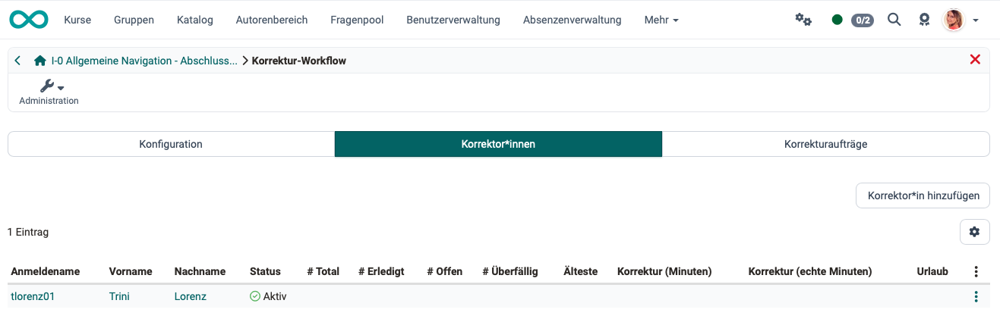
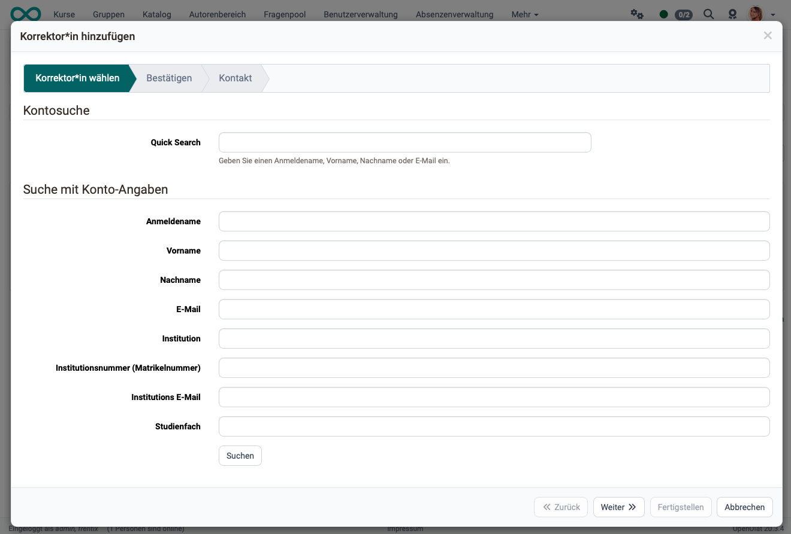
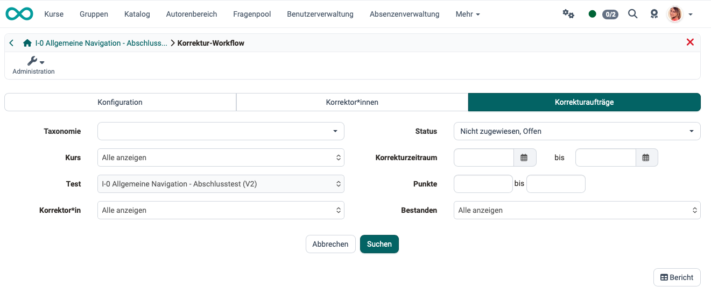
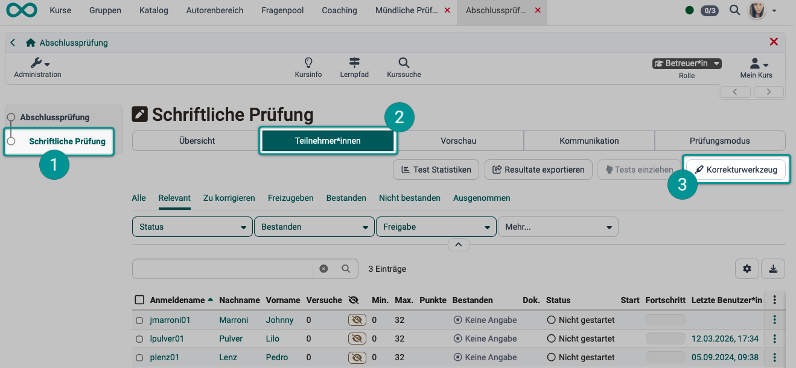
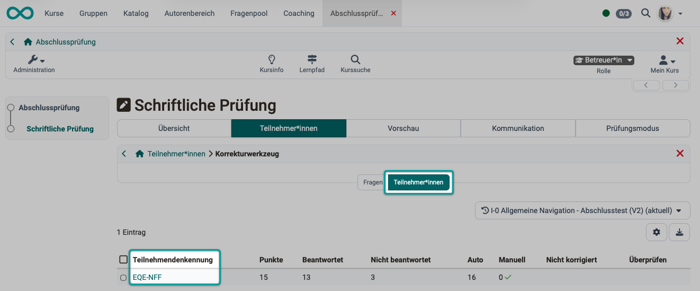

# How do you assess an anonymous test in OpenOlat? {: #assessing_tests_anonymously}

??? abstract "Objectives and content of this instruction"

    This guide is intended to show course owners how to set up anonymous grading in test modules. It also explains to instructors and graders how to conduct anonymous grading in OpenOlat.

??? abstract "Target group"

    [x] Authors [x] Coaches  [ ] Participants

    [ ] Beginners [x] Amateurs  [x] Experts

??? abstract "Expected previous knowledge"

    * [How do I proceed when creating a test? >](../../manual_how-to/test_creation_procedure/test_creation_procedure.md)
    * You are familiar with the assessment tool in OpenOlat.
    * As a tutor, you have already graded tests in OpenOlat.

---

## Why anonymous grading? {: #case_study}

As an author or course owner, you have added a "Test" course module to your course. You want graders to be unable to see the students' names while grading, in order to ensure the most unbiased assessment possible.

The procedure is described below.

[To the top of the page ^](#assessing_tests_anonymously)

---

## Setting up anonymous grading in OpenOlat {: #configuration}

The option to keep test takers anonymous is a setting in the test learning resource.  
It must be configured by the course owner when the course is created.

### Step 1

Select the relevant test learning resource. There are two ways to do this:

- You can select the test learning resource directly in the authoring area. 
- Or, in the course editor, select the test course block and open the test learning resource in the "Test Configuration" tab by clicking "Edit learning resource."

### Step 2

Open the **Proofreading Workflow** under **Administration**.

{ class="shadow lightbox" }

### Step 3

On the **Configuration** tab, you can enable the correction workflow.

{ class="shadow lightbox" }

### Step 4

Once the correction workflow is enabled, the configuration options will appear. There, you can also choose whether to keep the identities of the test subjects anonymous or to display them.

{ class="shadow lightbox" }

### Step 5

Don't forget to save the configuration.

### Step 6

In the "Corrector" tab, you can add the people who will grade this test learning resource. It doesn't matter what role the person has in OpenOlat. Even users who do not otherwise have a moderator role can be added as correctors. You can access additional settings via the gear icon. For example, you can contact, deactivate, or remove proofreaders, as well as view their respective proofreading assignments.

{ class="shadow lightbox" }

{ class="shadow lightbox" }

### Step 7

In the "Proofreading Assignments" tab, you can view the processing status of proofreading assignments assigned to different proofreaders and filter them by various criteria.

{ class="shadow lightbox" }

[To the top of the page ^](#assessing_tests_anonymously)

---

## Perform anonymous proofreading {: #correction}

When **course owners** set up a grading workflow, they work on the test **learning resource**. 
**Coaches**, on the other hand, work within the **test course module**, which incorporates the test learning resource configured in this way.

You can access the correction tool by going to:  
**Select course > Select course element > Tab "Participant" > Button "Correction tool"**

{ class="shadow lightbox" }

Alternatively, you can also access the correction tool via the grading tool: 
**Select course > Administration > Assessment tool > Select course element > Tab "Participant" > Button "Correction tool"**

{ class="shadow lightbox" }

The correction tool offers two ways to make corrections:

1. **Select a specific question** and grade that question for all participants.
2. **Select a participant** and then grade all of that participant’s questions one by one before moving on to the next participant.

{ class="shadow lightbox" }

{ class="shadow lightbox" }

If the "Anonymous" option described above is selected, proofreaders will not see names in the proofreading tool and proofreading workflow; instead, they will see only an anonymous 7-digit identifier in the format ABC-DEF. (Since OpenOlat 19.1.26 / 20.1.12; in previous versions, a number was displayed instead of the identifier.)

This identifier remains constant and is displayed in several places. This allows graders to consistently identify individual participants across different questions, while their true identities remain hidden.

**Example:**
{ class="shadow lightbox" }

!!! hint "Note"

    For information on **cross-course** grading, see also [Coaching Tool >](../../manual_user/area_modules/Coaching.md)

[To the top of the page ^](#assessing_tests_anonymously)

---

## Check list {: #checklist}

- [x] Has the grading workflow been enabled in the test learning resource?
- [x] Has a decision been made as to whether the graders should know the participants' names? 
    (Test learning resource: Correction Workflow > Tab Configuration)   
- [x] Has a correction period been set? 
    (Test Learning Resource: Grading Workflow > Configuration Tab)
- [x] Have the various notifications to the proofreaders been configured?
- [x] Have all proofreaders been selected and added? 
    (Test learning resource: Correction Workflow > Correctors Tab)

[To the top of the page ^](#assessing_tests_anonymously)

---

## Further information {: #further_information}

[How do I proceed when I create a test? >](../../manual_how-to/test_creation_procedure/test_creation_procedure.md) 
[How do I assess a test? >](../../manual_how-to/assessing_tests/assessing_tests.md) 
[Assessment Tool >](../../manual_user/learningresources/Assessment_tool_overview.md) 
[Coaching Tool >](../../manual_user/area_modules/Coaching.md) 

[To the top of the page ^](#assessing_tests_anonymously)
