# How do I correct a test anonymously in OpenOlat? {: #assessing_tests_anonymously}

??? abstract "Objectives and content of this instruction"

    This guide shows owners of a test how to set up an anonymous correction. It shows coaches and correctors how to correct a test anonymously.

??? abstract "Target group"

    [x] Authors [x] Coaches  [ ] Participants

    [ ] Beginners [x] Advanced users  [x] Experts

??? abstract "Expected previous knowledge"

    * [How do I proceed when I create a test? >](../../manual_how-to/test_creation_procedure/test_creation_procedure.md)
    * You are familiar with the assessment tool in OpenOlat.
    * As a coach, you have already corrected tests in OpenOlat.

---

## Why anonymous correction? {: #case_study}

As an author or course owner, you have added a "Test" course element to your course. You want correctors to be unable to see the names of the test takers during the correction, in order to ensure the most unbiased assessment possible.

OpenOlat offers two ways to do this. Which one applies depends on the "Correction" setting of the course element Test:

* "Manual by correctors": The correctors from the correction workflow of the test learning resource correct their grading assignments in Coaching. Whether they see the names is defined by the owners of the test with the "Anonymous" option in the correction workflow.
* "Manual by course coach/owner": Coaches and owners of the course correct in the correction tool of the course element. Whether the correction tool shows names is defined by administrators for the whole OpenOlat instance.

[To the top of the page ^](#assessing_tests_anonymously)

---

## Setting up anonymous correction in OpenOlat {: #configuration}

If correctors are to correct a test anonymously, the owners of the test set up the correction workflow in the test learning resource. The "Anonymous" option under "Identity of examinees" applies to all grading assignments of this test. All settings of the correction workflow are described on the page [Test settings - Administration](../../manual_user/learningresources/Test_settings.md#correction-workflow).

For correctors to see their assignments in Coaching, the correction workflow is also switched on in the system administration: `Administration > e-Assessment > Test > Tab "Correction workflow"`, checkbox "Enable correction workflow". It is switched on by default.

### Step 1

Select the relevant test learning resource. There are two ways to do this:

- You can select the test learning resource directly in the authoring area. 
- Or, in the course editor, select the course element Test and open the test learning resource in the "Test configuration" tab by clicking "Edit learning resource".

### Step 2

Open the correction workflow in the test learning resource: 
`Test > Administration > Correction workflow`

### Step 3

On the "Configuration" tab, switch on the "Correction workflow" checkbox.

### Step 4

Once the correction workflow is switched on, the further fields appear. Under "Identity of examinees", select "Anonymous" or "Reveal examinees name during grading". With "Anonymous", the correctors see no names in their grading assignments.

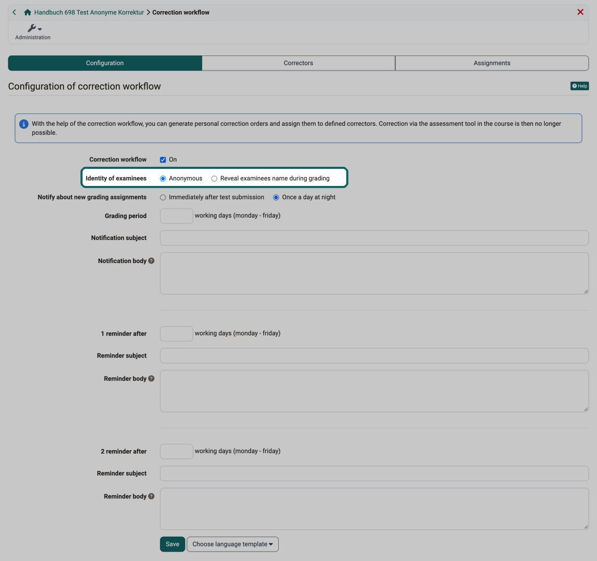{ class="shadow lightbox" title="Configuration tab in the correction workflow · 2026.10.02" }

Under "Notify about new grading assignments", you define when the correctors learn about new assignments: "Immediately after test submission" or "Once a day at night". The fields "Grading period", "1 reminder after" and "2 reminder after" count in working days from Monday to Friday. The second reminder comes after the first, the grading period after both.

If you enter a grading period, "Notification subject" and "Notification body" are mandatory fields. The same applies to every reminder you enter, with its fields "Reminder subject" and "Reminder body". With "Choose language template", you insert prepared texts in a language of your choice.

### Step 5

Save the configuration with "Save".

### Step 6

In the "Correctors" tab, you add the people who are to correct this test learning resource with "Add corrector". It doesn't matter what role the person has in OpenOlat. Even users who do not otherwise have a coach role can be added as correctors.

At the end of each row, the "More actions" icon opens a menu with "Show assignments", "Send e-mail", "Download report", "Set absence leave", "Deactivate" and "Remove". For a deactivated person, the menu shows "Activate" instead of "Deactivate" and "Set absence leave".

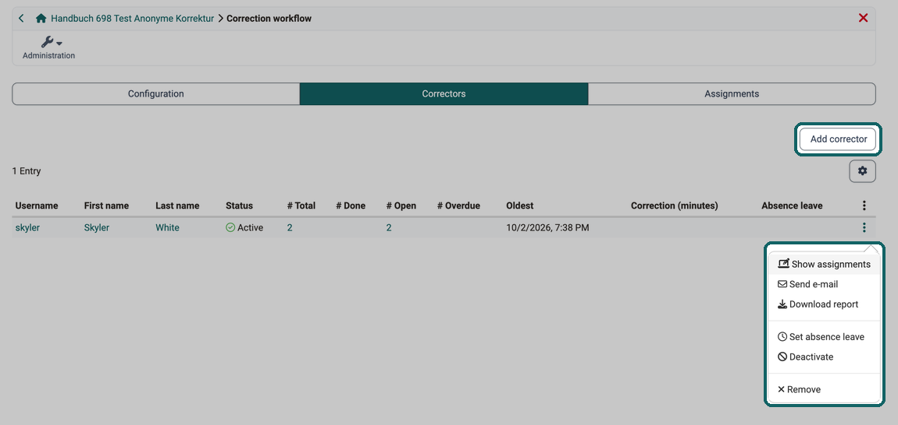{ class="shadow lightbox" title="Correctors tab in the correction workflow · 2026.10.02" }

### Step 7

In the "Assignments" tab, you see the processing status of the grading assignments of all correctors. The filters narrow down the list, for example by "Corrector", "Status / Deadline" or "Grading period". By default, the "Status / Deadline" filter shows the assignments with "Unassigned" and "Open". The "Deadline" column shows the state of an assignment, for example "Assigned". With "Report", you download the state of the grading assignments as an Excel file.

If the "Anonymous" option is set for the test, the list names only the correctors, not the assessed persons.

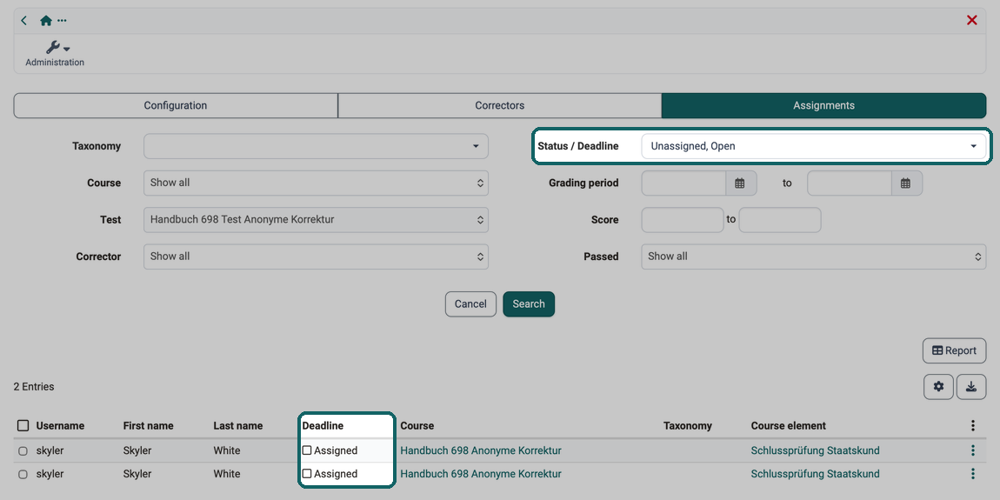{ class="shadow lightbox" title="Assignments tab in the correction workflow · 2026.10.02" }

### Step 8

Check the "Correction" setting of the course element Test in the course: 
`Course > Administration > Course editor > Select course element Test > Tab "Test configuration" > Section "Correction"`

Only with "Manual by correctors" does OpenOlat create a grading assignment after each completed test. If another option is selected, the course editor points this out with a warning.

[To the top of the page ^](#assessing_tests_anonymously)

---

## Anonymous correction in the correction tool {: #correction}

If the correction of the course element Test is set to "Manual by course coach/owner", or if the test contains questions that a person has to correct, coaches and owners of the course correct the tests themselves. They work in the course, in the course element Test, with the correction tool. With "Manual by correctors", the course element shows no "Correction tool" button, and the correction runs through the [grading assignments](#correction_by_correctors).

Whether the correction tool shows the names of the participants is defined by administrators in the system administration for the whole OpenOlat instance: `Administration > e-Assessment > Test > Tab "Correction"`, field "Correction tool" with the option "Anonymous". The anonymous display is preset. The "Anonymous" option in the correction workflow of the test learning resource has no effect here. Find out more: [e-Assessment Administration: Test](../../manual_admin/administration/e-Assessment_Test.md#tab_correction)

You open the correction tool in the course element: 
`Course > Course element Test > Tab "Participants" > Button "Correction tool"`

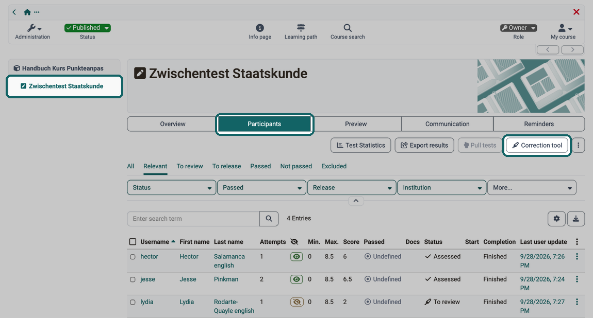{ class="shadow lightbox" title="Participants tab in the course element Test · 2026.10.02" }

Alternatively, you can also access the correction tool via the assessment tool: 
`Course > Administration > Assessment tool > Course element Test > Tab "Participants" > Button "Correction tool"`

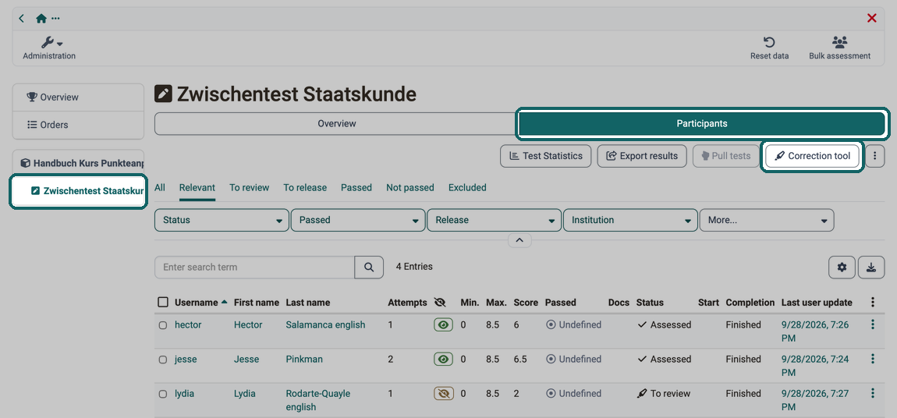{ class="shadow lightbox" title="Course element Test in the assessment tool · 2026.10.02" }

If assessments have already been finalized, the button first opens the dialog "Reopen closed assessments". With "Reopen assessment" you reopen the finalized assessments for a new correction, with "See correction read only" you see the correction without changing anything.

In the correction tool, you choose with the toggle how you correct:

1. **Questions**: You select a specific question and correct that question for all participants.
2. **Participants**: You select a person and correct all of that person's questions one by one before moving on to the next person. After the selection, OpenOlat first shows the list of questions of this person.

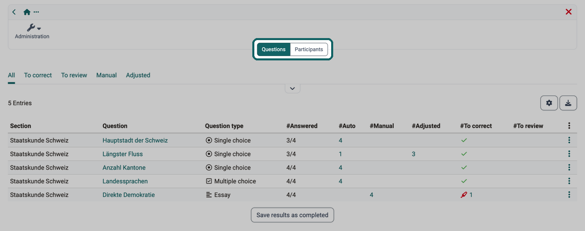{ class="shadow lightbox" title="Questions view in the correction tool · 2026.10.02" }

In the opened question, you switch between the questions with "Back" and the selection list of questions. With "Back to overview", you return to the list. Below, you award the points in the assessment form.

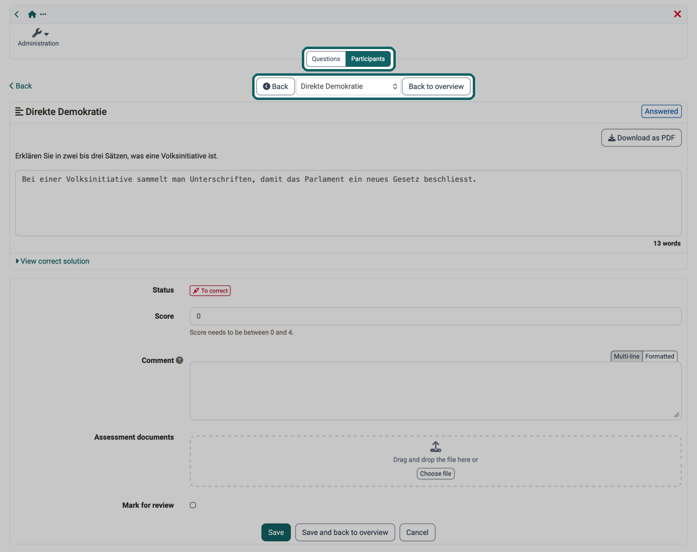{ class="shadow lightbox" title="Single question in the correction tool · 2026.10.02" }

If the anonymous display is switched on, you see no names in the correction tool. Instead, the "Participant identifier" column shows an identifier of six letters in the format ABC-DEF. OpenOlat assigns the identifier per person and course element, and it stays the same. This allows you to recognize the same person across different questions without knowing their name.

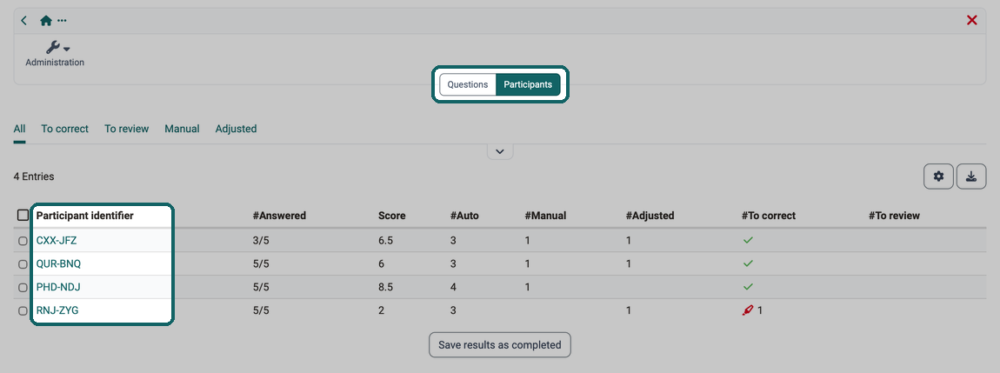{ class="shadow lightbox" title="Participants view in the correction tool · 2026.10.02" }

!!! note "Note"

    For information on **cross-course** correction, see also [Coaching Tool >](../../manual_user/area_modules/Coaching.md)

[To the top of the page ^](#assessing_tests_anonymously)

---

## Correction by correctors {: #correction_by_correctors}

If you are entered as a corrector in the correction workflow of a test, you find the tests you are to correct as grading assignments in Coaching. If the "Anonymous" option is set for the test, you correct without seeing the names of the assessed persons.

You open your assignments under: 
`Coaching > Assessment orders > Tab "Grading assignments"`

If you are neither a coach nor an owner of a learning resource, the other tabs are missing. The list "My grading assignments" then appears directly below the title "Assessment orders". With the "Anonymous" option, the columns "Username", "First name" and "Last name" of the assessed person show only a dash. With "Grade", you open an assignment.

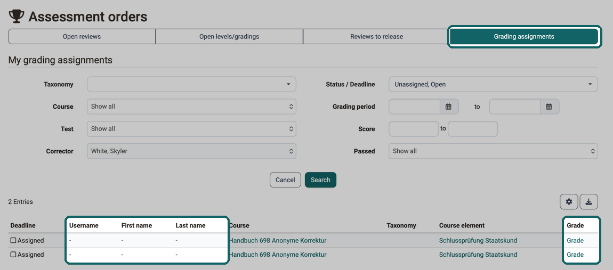{ class="shadow lightbox" title="Grading assignments tab under Assessment orders · 2026.10.02" }

OpenOlat then shows the questions of the assessed person. Instead of the name, the title shows the identifier in the format ABC-DEF, for example `Participant: DCK-URY`. Click a question to open the answer and the assessment form.

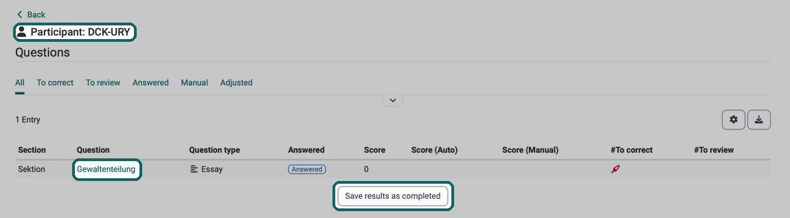{ class="shadow lightbox" title="Questions of a grading assignment · 2026.10.02" }

In the question, you enter the "Score" and add a "Comment" or "Assessment documents" if needed. With "Save", you stay in the question, with "Save and next" you move to the next question, with "Save and back to overview" you return to the list of questions. "Save and next" only appears if another question follows.

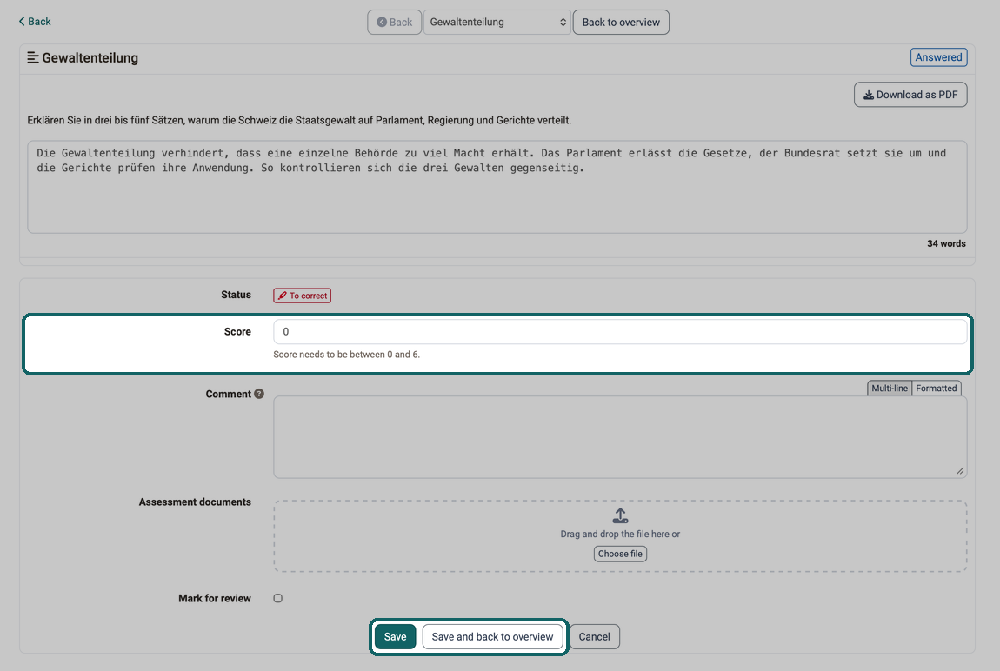{ class="shadow lightbox" title="Assessment form in the grading assignment · 2026.10.02" }

The assignment is only completed in the list of questions: With "Save results as completed" and the confirmation in the following dialog, OpenOlat sets the grading assignment to done.

Find out more about grading assignments in Coaching: [Coaching - Assessment Orders](../../manual_user/area_modules/Coaching_Assessment_Orders.md#tab_grading_assignments)

[To the top of the page ^](#assessing_tests_anonymously)

---

## Checklist {: #checklist}

- [x] Has the correction workflow been enabled in the test learning resource?
- [x] Has a decision been made as to whether the correctors should know the participants' names? 
    `Test > Administration > Correction workflow > Tab "Configuration"`
- [x] Has a grading period been set? 
    `Test > Administration > Correction workflow > Tab "Configuration"`
- [x] Have the various notifications to the correctors been configured? 
    `Test > Administration > Correction workflow > Tab "Configuration"`
- [x] Have all correctors been selected and added? 
    `Test > Administration > Correction workflow > Tab "Correctors"`
- [x] Is the correction of the course element Test set to "Manual by correctors"? 
    `Course > Administration > Course editor > Select course element Test > Tab "Test configuration" > Section "Correction"`

[To the top of the page ^](#assessing_tests_anonymously)

---

## Further information {: #further_information}

[How do I proceed when I create a test? >](../../manual_how-to/test_creation_procedure/test_creation_procedure.md) 
[Test settings - Administration >](../../manual_user/learningresources/Test_settings.md) 
[e-Assessment Administration: Test >](../../manual_admin/administration/e-Assessment_Test.md) 
[Coaching Tool >](../../manual_user/area_modules/Coaching.md) 
[Coaching - Assessment Orders >](../../manual_user/area_modules/Coaching_Assessment_Orders.md) 
[How do I assess a test? >](../../manual_how-to/assessing_tests/assessing_tests.md) 
[Assessment tool >](../../manual_user/learningresources/Assessment_tool_overview.md)

[To the top of the page ^](#assessing_tests_anonymously)
