# How do I correct a test anonymously in OpenOlat? {: #assessing_tests_anonymously}

??? abstract "Objectives and content of this instruction"

    This guide is intended to show owners of the test how to set up anonymous correction in test course elements. It also shows coaches and correctors how to carry out an anonymous correction in OpenOlat.

??? abstract "Target group"

    [x] Authors [x] Coaches  [ ] Participants

    [ ] Beginners [x] Amateurs  [x] Experts

??? abstract "Expected previous knowledge"

    * [How do I proceed when I create a test? >](../../manual_how-to/test_creation_procedure/test_creation_procedure.md)
    * You are familiar with the assessment tool in OpenOlat.
    * As a coach, you have already corrected tests in OpenOlat.

---

## Why anonymous correction? {: #case_study}

As an author or course owner, you have added a "Test" course element to your course. You want correctors to be unable to see the names of the test takers during the correction, in order to ensure the most unbiased assessment possible.

The procedure is described below.

[To the top of the page ^](#assessing_tests_anonymously)

---

## Setting up anonymous correction in OpenOlat {: #configuration}

The option to keep test takers anonymous is a setting in the test learning resource.  
It must be configured by the owners of the test.

### Step 1

Select the relevant test learning resource. There are two ways to do this:

- You can select the test learning resource directly in the authoring area. 
- Or, in the course editor, select the course element Test and open the test learning resource in the "Test configuration" tab by clicking "Edit learning resource".

### Step 2

Open the **Correction workflow** under **Administration**.

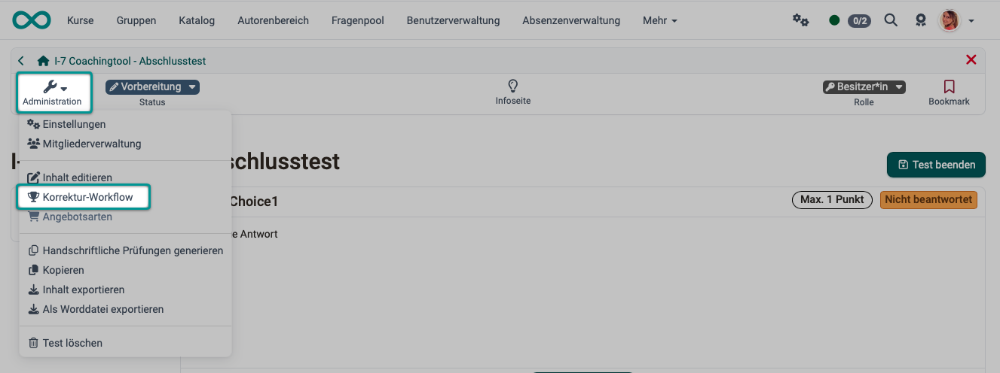{ class="shadow lightbox" }

### Step 3

On the **Configuration** tab, you can enable the correction workflow.

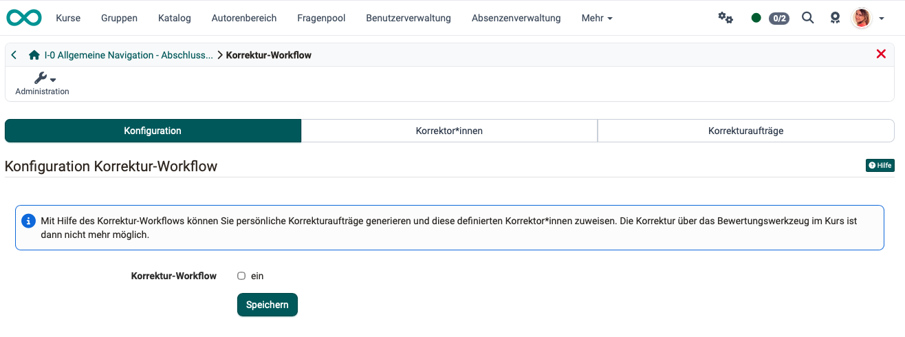{ class="shadow lightbox" }

### Step 4

Once the correction workflow is enabled, the configuration options will appear. There, you can also choose whether to keep the identities of the test takers anonymous or to display them.

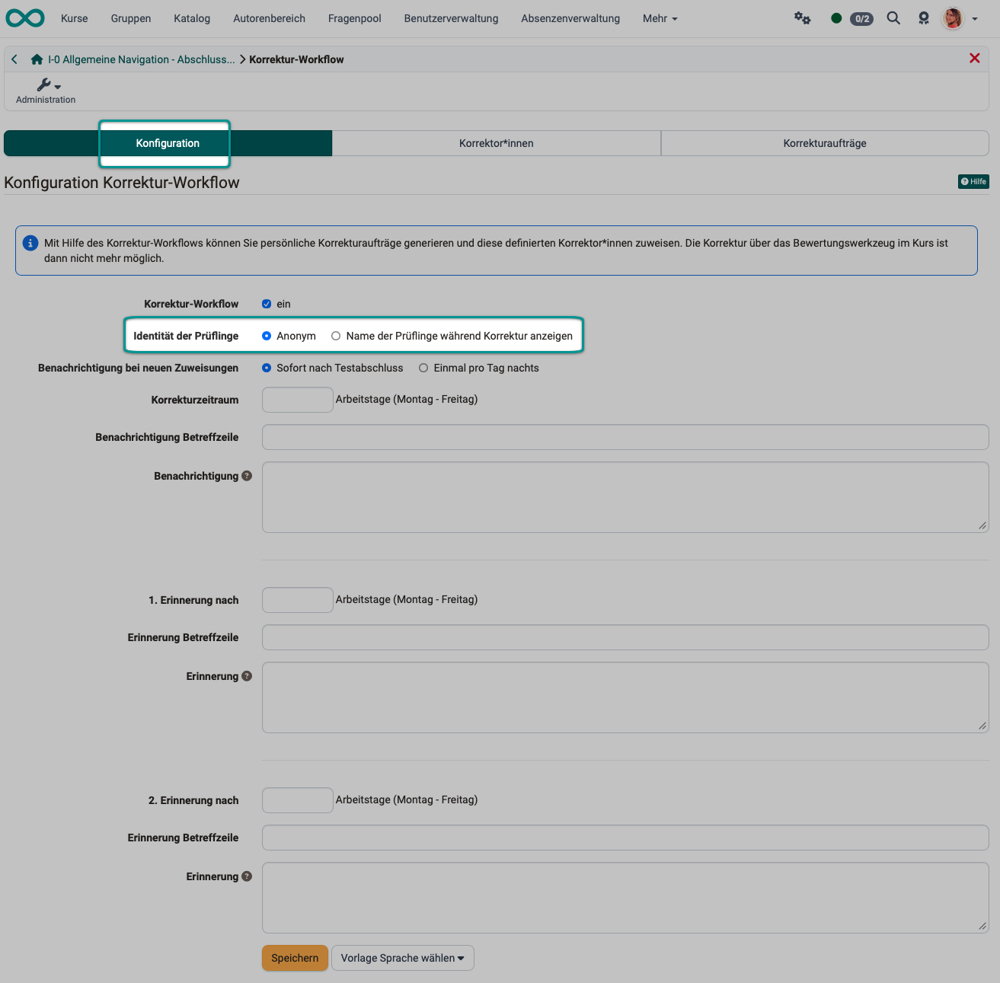{ class="shadow lightbox" }

### Step 5

Don't forget to save the configuration.

### Step 6

In the "Correctors" tab, you add the people who are to correct this test learning resource. It doesn't matter what role the person has in OpenOlat. Even users who do not otherwise have a coach role can be added as correctors. You can access additional settings via the gear icon. For example, you can contact, deactivate, or remove correctors, as well as view their respective grading assignments.

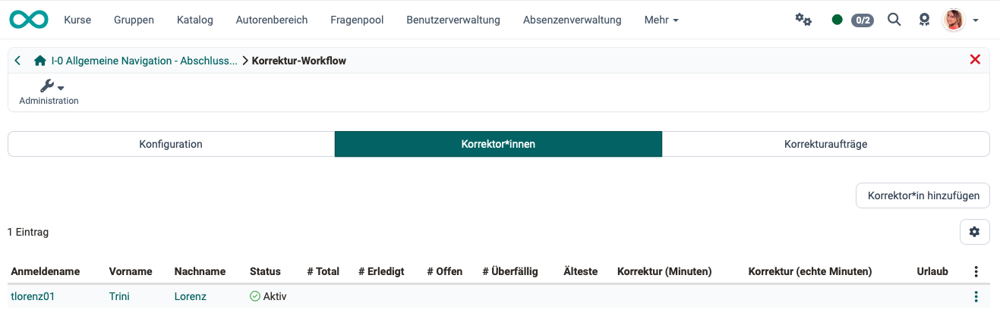{ class="shadow lightbox" }

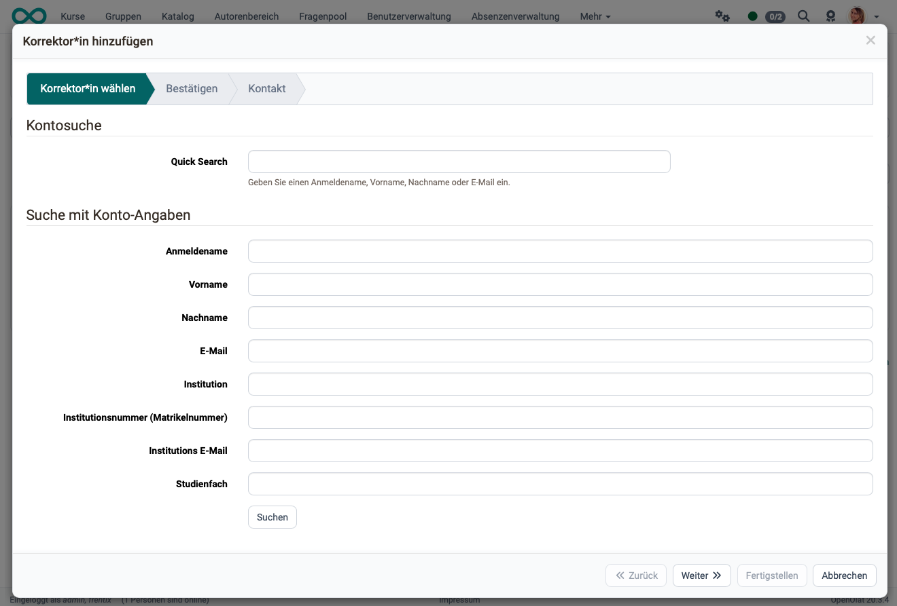{ class="shadow lightbox" }

### Step 7

In the "Assignments" tab, you can view the processing status of the grading assignments of the different correctors and filter them by various criteria.

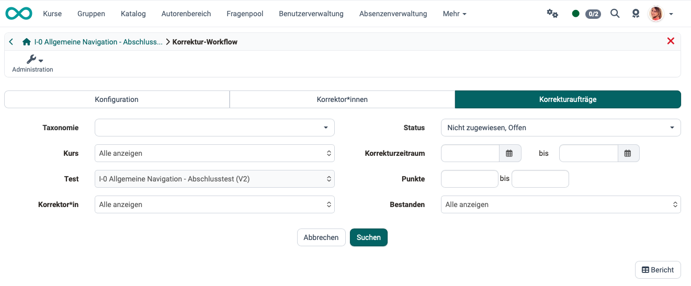{ class="shadow lightbox" }

[To the top of the page ^](#assessing_tests_anonymously)

---

## Carrying out an anonymous correction {: #correction}

When **owners of the test** set up a correction workflow, they work on the test **learning resource**. 
**Coaches**, on the other hand, work within the **course element Test**, which incorporates the test learning resource configured in this way.

You can access the correction tool by going to:  
`Select course > Select course element > Tab "Participants" > Button "Correction tool"`

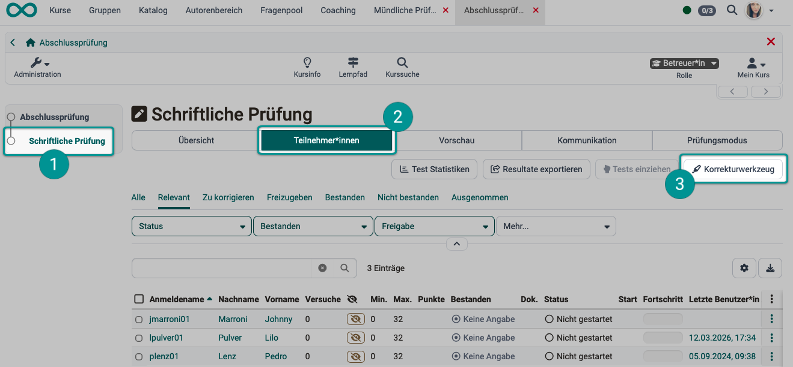{ class="shadow lightbox" }

Alternatively, you can also access the correction tool via the assessment tool: 
`Select course > Administration > Assessment tool > Select course element > Tab "Participants" > Button "Correction tool"`

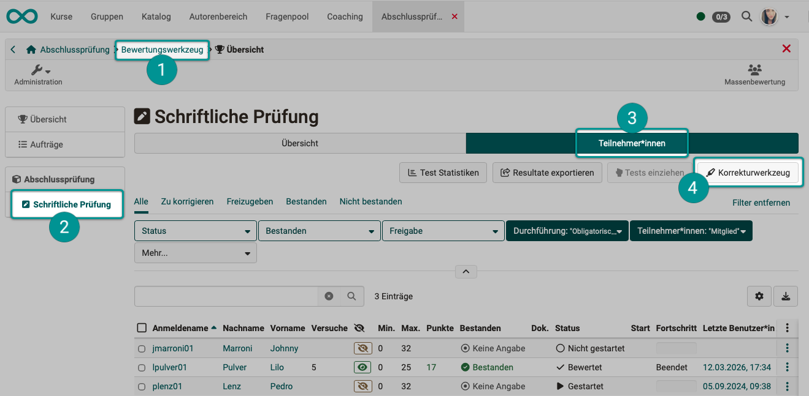{ class="shadow lightbox" }

The correction tool offers two ways to make corrections:

1. **Select a specific question** and correct that question for all participants.
2. **Select a participant** and then correct all of that participant’s questions one by one before moving on to the next participant.

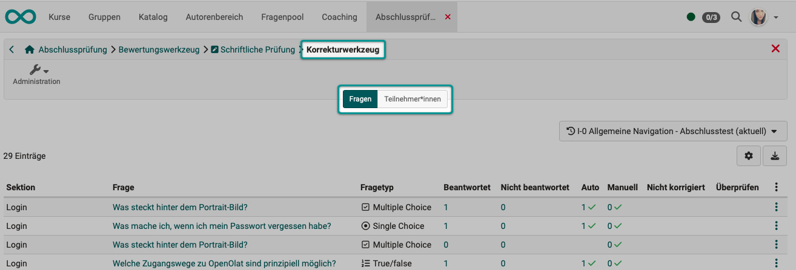{ class="shadow lightbox" }

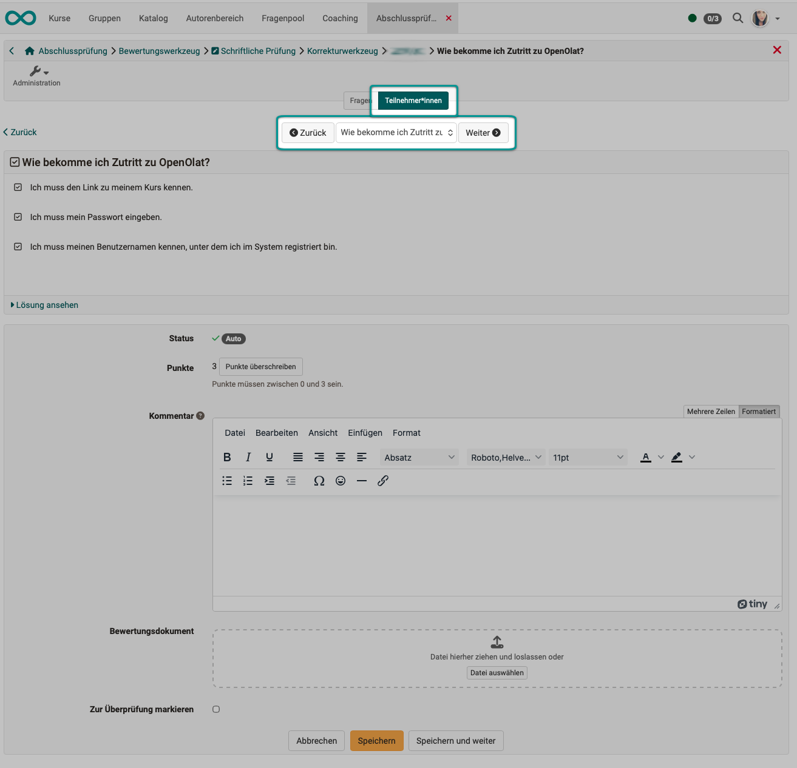{ class="shadow lightbox" }

If the "Anonymous" option described above is selected, correctors will not see names in the correction tool and correction workflow; instead, they will see only an anonymous 7-digit identifier in the format ABC-DEF.
This identifier remains constant and is displayed in several places. This allows correctors to consistently identify individual participants across different questions, while their true identities remain hidden.

**Example:**
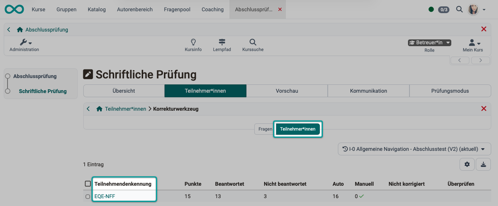{ class="shadow lightbox" }

!!! note "Note"

    For information on **cross-course** correction, see also [Coaching Tool >](../../manual_user/area_modules/Coaching.md)

[To the top of the page ^](#assessing_tests_anonymously)

---

## Check list {: #checklist}

- [x] Has the correction workflow been enabled in the test learning resource?
- [x] Has a decision been made as to whether the correctors should know the participants' names? 
    `Test > Administration > Correction workflow > Tab "Configuration"`
- [x] Has a correction period been set? 
    `Test > Administration > Correction workflow > Tab "Configuration"`
- [x] Have the various notifications to the correctors been configured?
- [x] Have all correctors been selected and added? 
    `Test > Administration > Correction workflow > Tab "Correctors"`

[To the top of the page ^](#assessing_tests_anonymously)

---

## Further information {: #further_information}

[How do I proceed when I create a test? >](../../manual_how-to/test_creation_procedure/test_creation_procedure.md) 
[How do I assess a test? >](../../manual_how-to/assessing_tests/assessing_tests.md) 
[Assessment tool >](../../manual_user/learningresources/Assessment_tool_overview.md) 
[Coaching Tool >](../../manual_user/area_modules/Coaching.md) 

[To the top of the page ^](#assessing_tests_anonymously)
