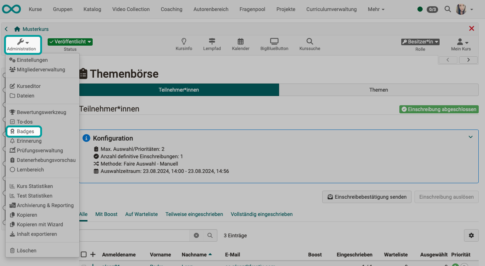
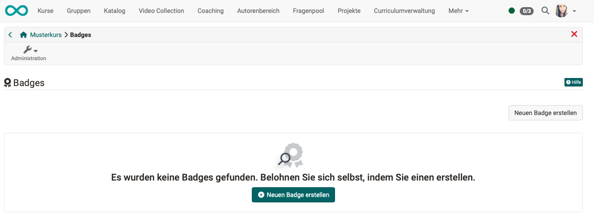
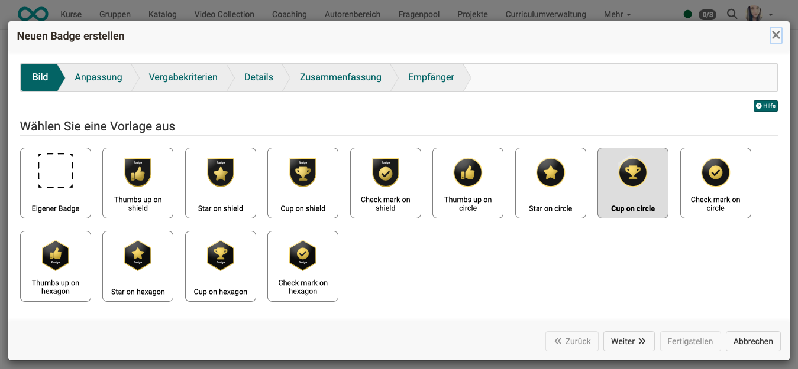
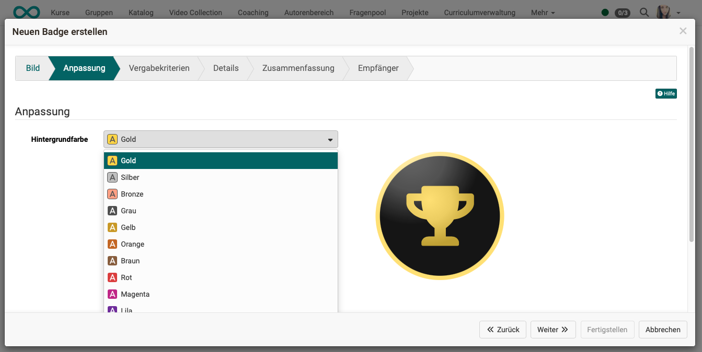
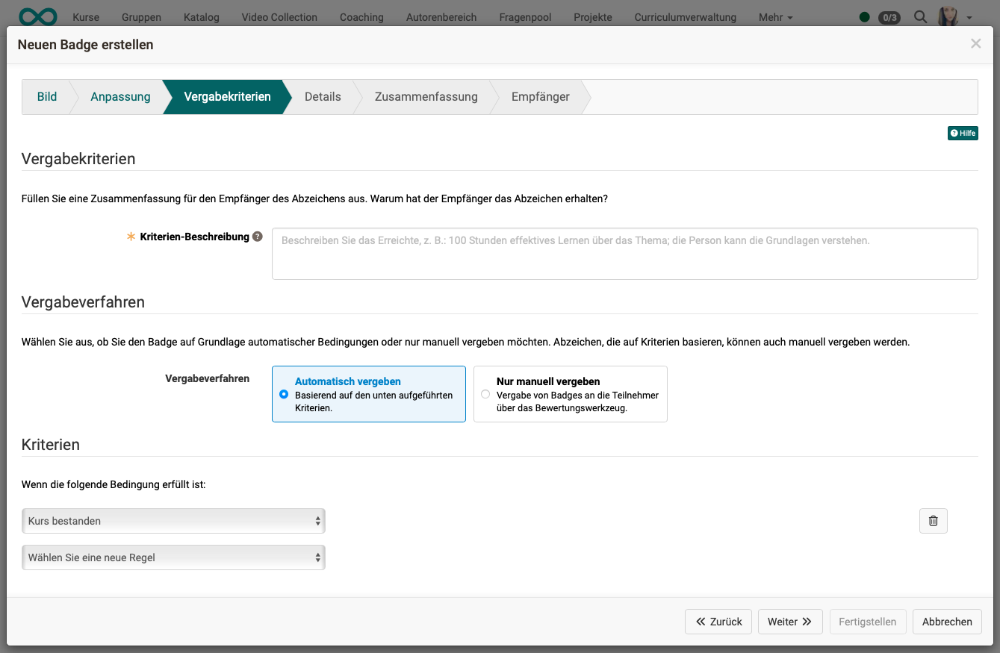
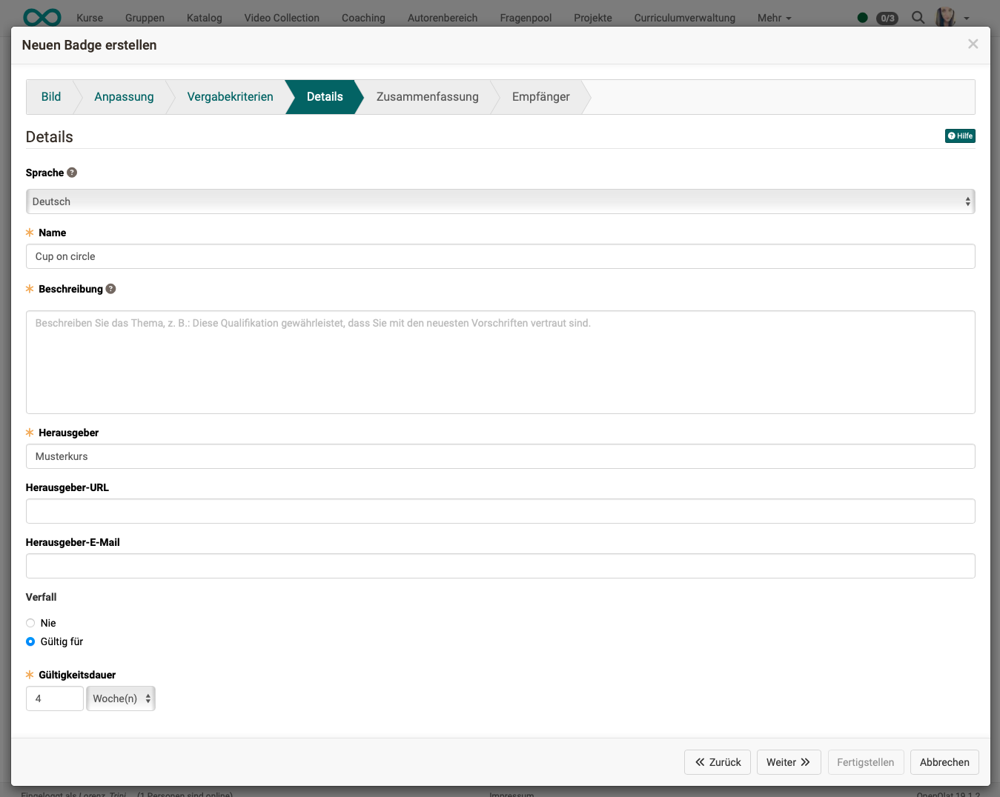
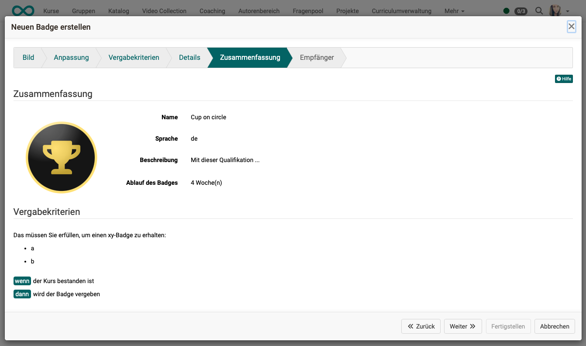
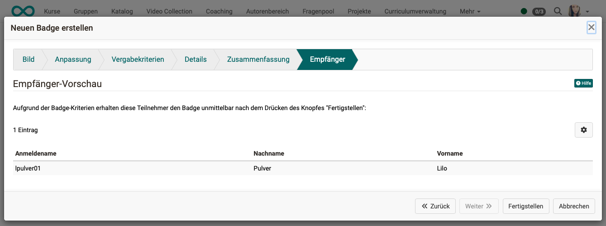
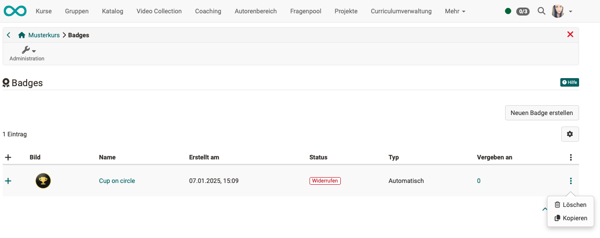
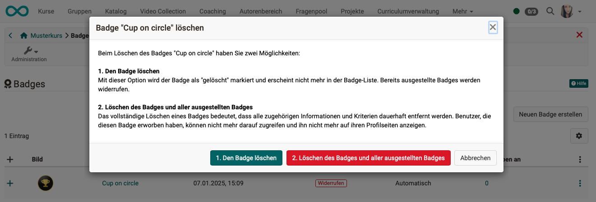

# Wie vergebe ich in meinem Kurs Badges? {: #badges}

??? abstract "Ziel und Inhalt dieser Anleitung"

    Wenn Sie bereits einen OpenOlat-Kurs erstellt haben, können Sie den Teilnehmer:innen als Belohnung für das Bestehen einen Badge vergeben. Diese Anleitung zeigt Ihnen, wie Sie dabei vorgehen.

??? abstract "Zielgruppe"

    [x] Autor:innen [x] Betreuer:innen  [ ] Teilnehmer:innen

    [ ] Anfänger:innen [x] Fortgeschrittene  [] Experten/Expertinnen

??? abstract "Erwartete Vorkenntnisse"

    * ["Wie erstelle ich meinen ersten OpenOlat-Kurs?"](../my_first_course/my_first_course.de.md) 
    * Vertrautheit mit Basiskonzepten von OO: Bulk-Actions, Filter, Tabellen (Spalten ein-/ausblenden), Wizards

    https://docs.openolat.org/de/manual_user/basic_concepts/Table_Concept/

---

## Welche Badges kann ich vergeben? {: #description}

Es können grundsätzlich 3 Kategorien von Badges vergeben werden:

* **Badges für einen Kurs**  (für das Bestehen des Kurses, bzw. das Erfüllen der dort gestellten Bedingungen)
* **Badges für einen bestimmten Kursbaustein**  (wie Kursbadges, mit einer Bedingung für einen bestimmten Kursbaustein)
* und **globale Badges**  (kursübergreifend, können nur von Administrator:innen erstellt werden) 

[Zum Seitenanfang ^](#badges)

---

## Voraussetzungen für die Vergabe von Badges {: #conditions}

### Generelle Aktivierung der Badges {: #activation_general}

Als generelle Voraussetzung für die Verfügbarkeit von Badges muss

* die Vergabemöglichkeit für die gesamte Instanz durch Administrator:innen aktiviert worden sein
* und ein [passender Badge erstellt](badges.de.md#create) worden sein.

### Aktivierung von Badges im Kurs {: #activation_course}

Die Kurs-Autor:innen können festlegen, wann und welchen Badge ihre Kursteilnehmer:innen erhalten. 

Wenn Badges generell aktiviert sind, kann in jedem Kurs unter   
**Administration > Einstellungen > Tab Bewertung > Toggle-Button "Badges vergeben"** 
die Vergabemöglichkeit von Badges kursbezogen aktiviert werden.

Es kann dort auch bestimmt werden, ob eine manuelle Vergabe durch Kursbesitzer:innen und Betreuer:innen möglich sein soll.

{ class="shadow lightbox" }  

---

## Wie erstelle ich einen Badge?  {: #create}

(Nur durch Autoren/Kursbesitzer:innen und Administrator:innen möglich.)

Grundsätzlich bestehen folgende Möglichkeit zum Erstellen eines Badges:

* Start mit eigenem neuen Bild (svg oder png mit einem externem Grafikprogramm erstellen)
* Verwenden eines vom Admin angelegte Templates (Vorlage)
* Duplizieren eines vorhandenen Badges (und anschliessendes Modifizieren des Duplikats)

Sobald die Verwendung von Badges in einem Kurs aktiviert wurde, ist in der Kursadministration ein Eintrag **"Badges"** angezeigt. Unter diesem Menüpunkt können Sie Ihrem Kurs neue Badges hinzufügen.

Es startet ein Wizard, der Sie Schritt für Schritt durch die Erstellung führt.

{ class="shadow lightbox" }  

{ class="shadow lightbox" }  

### Wizard Schritt 1: Bild hochladen oder Vorlage auswählen {: #create_1}

Der erste Schritt ist die Auswahl einer Vorlage oder das Hochladen eines eigenen Bildes. Derzeit werden das svg- und das png-Format unterstützt.

{ class="shadow lightbox" }  

### Wizard Schritt 2: Vorlage anpassen 

Wenn die Vorlage unter Berücksichtigung von Variablen erstellt wurde, können Sie Farben und Text in einer Vorlage ändern.

{ class="shadow lightbox" }  

### Wizard Schritt 3: Vergabekriterien festlegen 

Geben Sie die Kriterien und die Erklärung für die von Ihnen gewählten Regeln an. 

{ class="shadow lightbox" }  

Während der Erstellung von Badges mit dem Wizard, werden auch die Regeln für die Vergabe festgelegt. Kriterien/Bedingungen können sein

* ein Kurs ist bestanden
* ein bestimmter Kurs-Score wurde erreicht (Voraussetzung: Score ist eingeschaltet) 
* für einen bestimmten Kursbaustein wurde das Erledigungskriterium erfüllt
* ein bestimmter Fortschritt im Lernpfad wurde erreicht
* ein anderer Badge wurde bereits erworben
* ein Kursbaustein ist bestanden
* ein bestimmter Score wurde in einem bestimmten Kursbaustein erreicht

Es können mehrere Bedingungen miteinander kombiniert werden.

### Wizard Schritt 4: Details & Validierungszeitraum 

Obligatorische Details sind der Name, die Version und die Beschreibung des Badges, sowie der Aussteller. Sie können zusätzlich eine URL und einen Kontakt zu den Ausstellereigenschaften hinzufügen. Die Gültigkeitsdauer kann auch so festgelegt werden, dass sie nie abläuft oder z.B. 12 Monate beträgt.

{ class="shadow lightbox" }  

### Wizard Schritt 5: Zusammenfassung 

Zur Kontrolle erhalten Sie einen Bildschirm mit einer Zusammenfassung aller Details.

{ class="shadow lightbox" }  

### Wizard Schritt 6: Badge-Empfänger (Earners) 

Die hier sichtbare Tabelle zeigt, welche Teilnehmer:innen sich bereits gemäss der gewählten Kriterien für einen Badge qualifiziert haben.

{ class="shadow lightbox" }  

[Zum Seitenanfang ^](#badges)

---

## Wie kommen meine Kurs-Teilnehmer:innen zu einem Badge? {: #participants}

Badges können vergeben werden 
a) manuell  
b) automatisch auf Grund einer Bedingung und Berechnung 

### Manuelle Vergabe von Badges

Die manuelle Vergabe ist für Autor:innen und berechtigte Betreuer:innen möglich: 
a) **im letzten Schritt des Wizards**  (durch Autor:innen) 
b) **in Teilnehmerlisten** 
    (Vergabe von Badges als Bulk-Action: Teilnehmer:innen markieren und dann Klick auf den grünen Button) 
c) **in einer Badge-Liste**  
    (Einzelnen Badge auswählen, es erscheint unten eine Liste, wer diesen Badge schon erhalten hat. Dann den Button zum Vergeben an weitere Kursteilnehmer:innen verwenden.)

### Automatische Vergabe von Badges

Die automatische Vergabe wird von den Autor:innen beim Erstellen im Wizard eingerichtet und ist an bewertbare Kursbausteine geknüpft. Dazu werden im Wizard zur Badge-Erstellung eine oder mehrere Bedingungen definiert.

Sobald eine Veränderung in einem der bewertbaren Kursbaustein stattfindet, wird die Erfüllung der Bedingungen für die Vergabe eines Badges für alle Teilnehmer:innen erneut überprüft.

### Beispiele

**Beispiel 1:** 
Der Badge "Bronze" wird automatisch erstellt, wenn 40-60% erreicht wurden. Der Badge "Silber" wird automatisch erstellt, wenn 60-80% erreicht wurden, der Badge "Gold", wenn 80-100% erreicht wurden.

**Vorgehen:** 
Es werden 3 Badges erstellt. Für jeden Badge gilt eine Regel mit der Bedingung "Kurs-Score = ..." Dort werden die verschiedenen Prozent-Angaben eingetragen.

**Beispiel 2:**  
Der Kursbadge "Gold" wird automatisch erstellt, wenn innerhalb eines Kurses 5 Badges "Silber" in 5 Kursbausteinen erworben wurden.

**Vorgehen:** 
Es werden 5 Badges "Silber" erstellt, die jeweils die Bedingung "Kursbaustein bestanden" oder "Kursbaustein-Score" enthalten. 
Dann wird ein 6. Badge erstellt, der 5 Bedingungen enthält (alle "Silber"-Bedingungen die auch einzeln erstellt wurden).
Dazu werden im Wizard Schritt: "Vergabekriterien festlegen" 5 Bedingungen angegeben, jeweils mit dem Kriterium "Ein anderer Badge wurde bereits erworben".

### Nachträgliche Vergabe eines neuen Badges an Berechtigte

Es kann sein, dass Kursteilnehmer:innen bereits vor Erstellung eines Badges die Kriterien zur Erlangung erfüllt hatten. In diesem Fall kann für diesen Personenkreis im letzten Schritt des Wizards die nachträgliche Vergabe ausgelöst werden.

[Zum Seitenanfang ^](#badges)

---

## Wo sehen Kurs-Teilnehmer:innen ihre Badges? {: #view_participant}

Teilnehmer:innen finden ihre Badges

* oben rechts in der Toolbar unter "Mein Kurs"
* im persönlichen Menü
* Bei Qualifizierung für einen Badge wird dieser auch per Mail verschickt und kann beliebig abgespeichert oder weiter gegeben werden (z.B. Upload in LinkedIn).

[Zum Seitenanfang ^](#badges)

---

## Wo sehen Betreuer:innen/Autor:innen, wer welche Badges erhalten hat? {: #view_coach}

Betreuer:innen und Autor:innen sehen vergebene Badges

* oben rechts in der Toolbar unter "Mein Kurs"
* als Autor:in/Kursbesitzer:in oben links in der Kursadministration (**Administration > Badges**)
* im Bewertungswerkzeug  nur bei bewertbaren KB, es werden nur Badges angezeigt, die für diesen KB relevant sind (Bsp.: )
 wenn Betreuer das Recht dazu von Autor erhalten hat: kann er Badge manuell auslösen
Klick auf obersten Knoten, Kapitel 

[Zum Seitenanfang ^](#badges)

---

## Badges widerrufen

(nur für berechtigte Kursbesitzer:innen und Betreuer:innen verfügbar)

Bereits vergebene Badges (z.B. auch während dem Badge-Erstellungsprozess im Schritt "Empfänger" rückwirkend vergebene) können später unter 
**Administration > Badges > Button mit den 3 Punkten in der Zeile des betreffenden Badges** 
widerrufen werden.

[Zum Seitenanfang ^](#badges)

---

## Badges löschen

(nur für berechtigte Kursbesitzer:innen und Betreuer:innen verfügbar)

Zum Löschen eines Badges klicken Sie unter **Administration > "Badges"** auf die 3 Punkte am Ende der Zeile des gewünschten Badges.

Die Löschung kann dann auf 2 Arten erfolgen:

1. ein Löschen, bei dem ausgestellte Badges als "Widerrufen" markiert werden
2. ein vollständiges Löschen aller Daten, die zu diesem Badge gehören

{ class="shadow lightbox" }

{ class="shadow lightbox" }

[Zum Seitenanfang ^](#badges)

---

## Checkliste {: #checklist}

- [x] Sind Badges generell vom Administrator instanzweit aktiviert?
- [x] Wurde im Kurs die Badge-Vergabe aktiviert?
- [x] Soll für einen Badge ein selbst gestaltetes Bild verwendet werden? Liegt es als svg oder png bereit? 
- [x] Wurde mit dem Wizard ein Badge erstellt?
- [x] Wurde kontrolliert (und ggf. widerrufen), ob rückwirkend vergebene Badges korrekt vergeben wurden? 
- [x] Haben Sie als Kursbesitzer:in/Betreuer:in die in ihrem Kurs vergebenen Badges im Bewertungswerkzeug kontrolliert?
- [x] Wurden die Kursteilnehmer:innen darüber informiert, wo sie ihre erworbenen Badges einsehen können? 

[Zum Seitenanfang ^](#badges)

---

## Weiterführende Informationen  {: #further_information}

[Badges im Bewertungswerkzeug >](../../manual_user/learningresources/OpenBadges.de.md) 
[OpenBadges Administration >](../../manual_admin/administration/e-Assessment_openBadges.de.md) 

