# Wie vergebe ich in meinem Kurs Badges? {: #badges}

??? abstract "Ziel und Inhalt dieser Anleitung"

    Wenn Sie bereits einen OpenOlat-Kurs erstellt haben, können Sie den Teilnehmer:innen als Belohnung für das Bestehen einen Badge vergeben. Diese Anleitung zeigt Ihnen, wie Sie dabei vorgehen.

??? abstract "Zielgruppe"

    [x] Autor:innen [x] Betreuer:innen  [ ] Teilnehmer:innen

    [ ] Anfänger:innen [x] Fortgeschrittene  [ ] Expert:innen

??? abstract "Erwartete Vorkenntnisse"

    * ["Wie erstelle ich meinen ersten OpenOlat-Kurs?"](../my_first_course/my_first_course.de.md)
    * Vertrautheit mit Basiskonzepten von OpenOlat: Aktionen für mehrere markierte Einträge, Filter, [Tabellen](../../manual_user/basic_concepts/Table_Concept.de.md) (Spalten ein-/ausblenden), Wizards

---

## Welche Badges kann ich vergeben? {: #description}

Es können grundsätzlich 3 Kategorien von Badges vergeben werden:

* **Badges für einen Kurs**  (für das Bestehen des Kurses, bzw. das Erfüllen der dort gestellten Bedingungen)
* **Badges für einen bestimmten Kursbaustein**  (wie Kursbadges, mit einer Bedingung für einen bestimmten Kursbaustein)
* und **globale Badges**  (kursübergreifend, können nur von Administrator:innen erstellt werden)

[Zum Seitenanfang ^](#badges)

---

## Voraussetzungen für die Vergabe von Badges {: #conditions}

### Generelle Aktivierung der Badges {: #activation_general}

Als generelle Voraussetzung für die Verfügbarkeit von Badges muss

* die Vergabemöglichkeit für die gesamte Instanz durch Administrator:innen aktiviert worden sein, in der System-Administration unter `Administration > e-Assessment > OpenBadges` (siehe [e-Assessment Administration: OpenBadges](../../manual_admin/administration/e-Assessment_openBadges.de.md))
* und ein [passender Badge erstellt](#create) worden sein.

### Aktivierung von Badges im Kurs {: #activation_course}

Die Kursbesitzer:innen können festlegen, wann und welchen Badge ihre Kursteilnehmer:innen erhalten.

Wenn Badges generell aktiviert sind, kann in jedem Kurs unter: 
`Kurs > Administration > Einstellungen > Bewertung` 
mit dem Schalter "Badges vergeben" im Abschnitt "Badges" die Vergabemöglichkeit von Badges kursbezogen aktiviert werden. Die Einstellungen beschreibt die Seite [Kurseinstellungen - Tab Bewertung](../../manual_user/learningresources/Course_Settings_Assessment.de.md#section_badges).

Unter "Manuelle Vergabe von Badges ermöglichen" bestimmen Sie, wer Badges von Hand vergeben darf: "für Kursbesitzer" oder zusätzlich "für Betreuer".

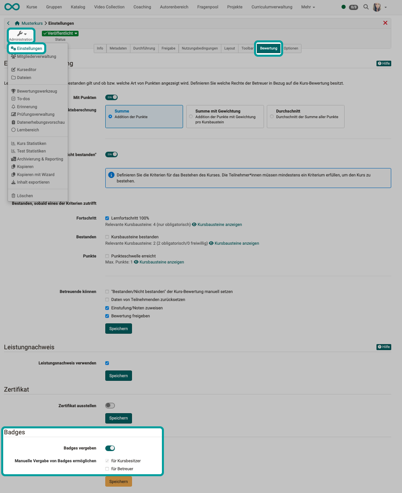{ class="shadow lightbox" title="Tab Bewertung in den Kurseinstellungen" }

---

## Wie erstelle ich einen Badge? {: #create}

(Badges eines Kurses erstellen Kursbesitzer:innen. Globale Badges erstellen Administrator:innen in der System-Administration.)

Für das Bild eines neuen Badges bestehen folgende Möglichkeiten:

* ein eigenes Bild hochladen (SVG oder PNG, mit einem externen Grafikprogramm erstellt)
* eine Vorlage verwenden, die Administrator:innen in der System-Administration bereitstellen
* einen vorhandenen Badge als Ausgangspunkt nehmen und dessen Details übernehmen. Zusätzlich kopiert die Aktion "Kopieren" in der Badge-Liste einen bestehenden Badge.

Sobald die Badge-Vergabe in einem Kurs aktiviert wurde, zeigt die Kurs-Administration den Eintrag "Badges": 
`Kurs > Administration > Badges` 
Dort fügen Sie Ihrem Kurs mit dem Button "Einen neuen Badge erstellen" neue Badges hinzu.

Es startet ein Wizard, der Sie Schritt für Schritt durch die Erstellung führt.

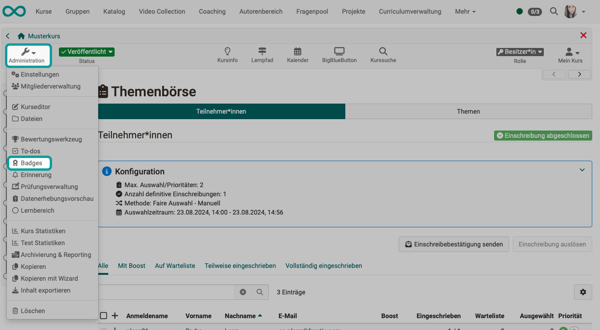{ class="shadow lightbox" title="Menü Administration im Kurs" }

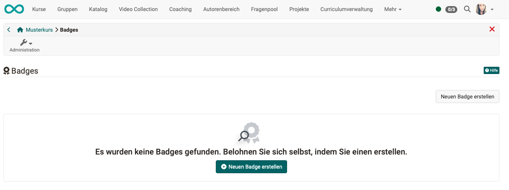{ class="shadow lightbox" title="Seite Badges in der Kurs-Administration" }

Der Wizard hat vier bis sieben Schritte. Welche Schritte erscheinen, hängt vom Ausgangspunkt, vom gewählten Bild und davon ab, ob der Kurs schon Teilnehmer:innen hat. Die folgenden Abschnitte stehen in der Reihenfolge des Wizards.

### Ausgangspunkt wählen {: #create_starting_point}

Gibt es in Kursen, die Sie besitzen, bereits Badges, beginnt der Wizard mit der Wahl des Ausgangspunkts. Mit "Einen neuen Badge erstellen" beginnen Sie mit Bild und Kriterien von vorn. Mit "Von vorhandenem Badge erstellen" wählen Sie einen vorhandenen Badge und übernehmen dessen Details, der Wizard springt danach direkt zu den Vergabekriterien. Ohne vorhandene Badges beginnt der Wizard direkt mit dem Bild.

### Bild hochladen oder Vorlage auswählen {: #create_1}

In diesem Schritt wählen Sie eine Vorlage oder laden über die Kachel "Eigener Badge" ein eigenes Bild hoch. Unterstützt werden die Formate SVG und PNG.

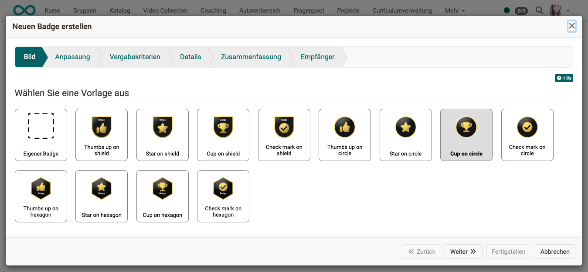{ class="shadow lightbox" title="Schritt Bild im Wizard" }

### Vorlage anpassen {: #create_customization}

Dieser Schritt erscheint nur bei einer SVG-Vorlage, die unter Berücksichtigung von Variablen erstellt wurde. Dann können Sie Farben und Text in der Vorlage ändern, zum Beispiel die Hintergrundfarbe.

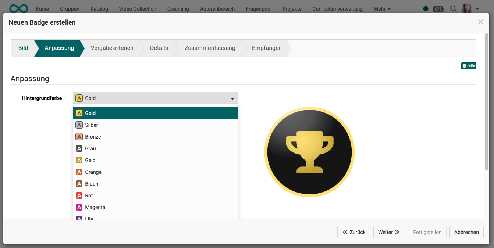{ class="shadow lightbox" title="Schritt Anpassung im Wizard" }

### Vergabekriterien festlegen {: #create_criteria}

Geben Sie unter "Kriterien-Beschreibung" an, was die Person erreicht hat. Unter "Vergabeverfahren" wählen Sie "Automatisch vergeben" oder "Nur manuell vergeben". Badges, die auf Kriterien basieren, können auch manuell vergeben werden.

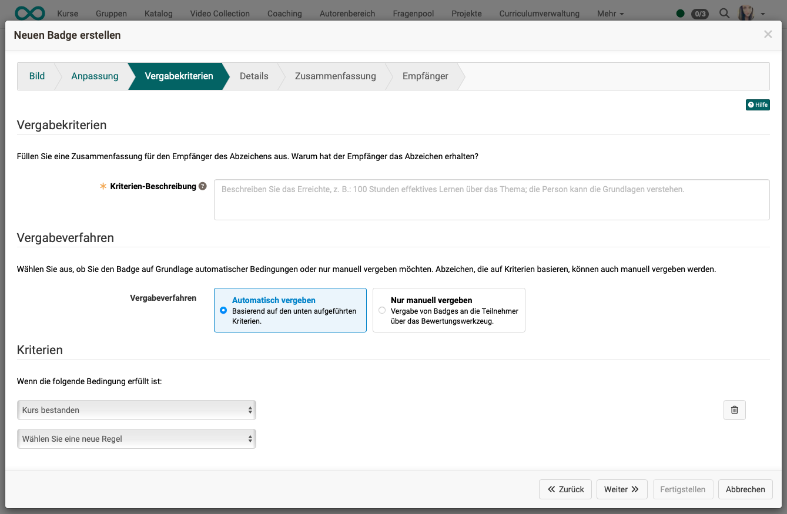{ class="shadow lightbox" title="Schritt Vergabekriterien im Wizard" }

Während der Erstellung von Badges mit dem Wizard, werden auch die Regeln für die Vergabe festgelegt. Kriterien/Bedingungen können sein

* ein Kurs ist bestanden
* ein bestimmter Kurs-Score wurde erreicht (Voraussetzung: Score ist eingeschaltet)
* für einen bestimmten Kursbaustein wurde das Erledigungskriterium erfüllt
* ein bestimmter Fortschritt im Lernpfad wurde erreicht
* ein anderer Badge wurde bereits erworben
* ein Kursbaustein ist bestanden
* ein bestimmter Score wurde in einem bestimmten Kursbaustein erreicht

Es können mehrere Bedingungen miteinander kombiniert werden.

### Details & Gültigkeitsdauer {: #create_details}

Obligatorische Details sind der Name und die Beschreibung des Badges sowie der Herausgeber. Unter "Sprache" legen Sie fest, in welcher Sprache der Badge ausgestellt wird. Zum Herausgeber können Sie zusätzlich eine Herausgeber-URL und eine Herausgeber-E-Mail angeben. Unter "Verfall" wählen Sie "Nie" oder "Gültig für" mit einer Gültigkeitsdauer, z.B. 12 Monate. Die Version des Badges vergibt OpenOlat selbst.

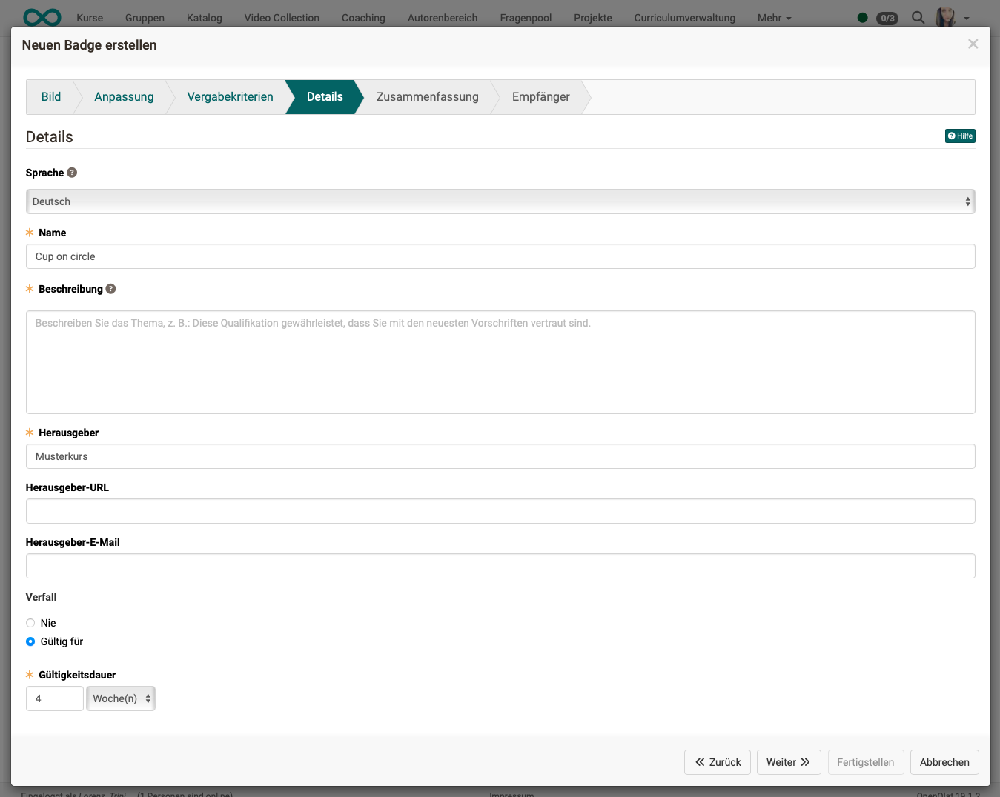{ class="shadow lightbox" title="Schritt Details im Wizard" }

### Zusammenfassung {: #create_summary}

Zur Kontrolle erhalten Sie einen Bildschirm mit einer Zusammenfassung aller Details und der Regeln für die Vergabe.

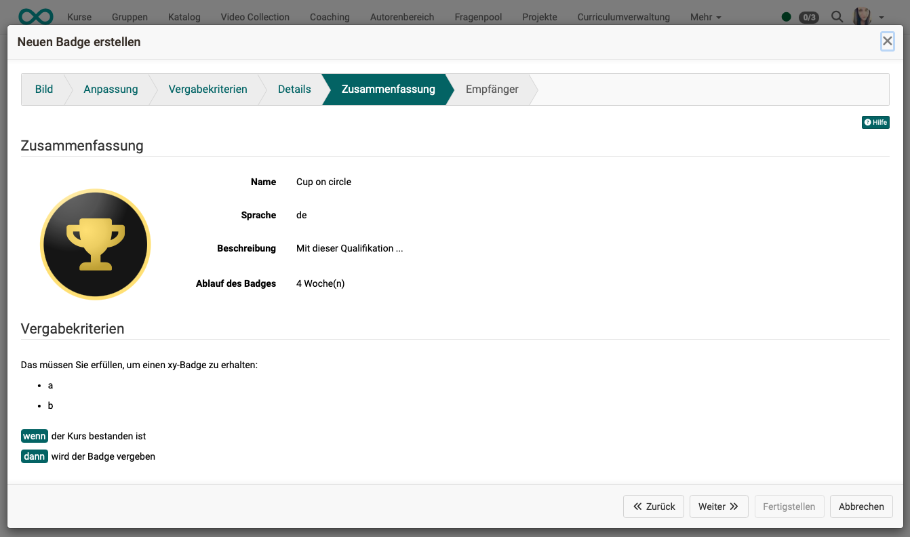{ class="shadow lightbox" title="Schritt Zusammenfassung im Wizard" }

### Empfänger {: #create_recipients}

Dieser letzte Schritt erscheint nur, wenn der Kurs bereits Teilnehmer:innen hat. Bei automatischer Vergabe zeigt die Tabelle, welche Teilnehmer:innen sich bereits gemäss der gewählten Kriterien für den Badge qualifiziert haben. Sie erhalten den Badge unmittelbar nach dem Klick auf "Fertigstellen". Bei manueller Vergabe wählen Sie hier die Teilnehmer:innen, die den Badge nach dem Klick auf "Fertigstellen" erhalten.

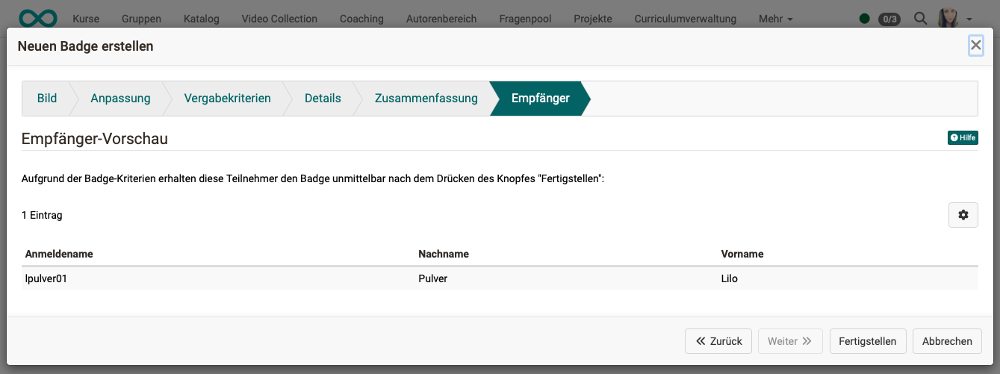{ class="shadow lightbox" title="Schritt Empfänger im Wizard" }

[Zum Seitenanfang ^](#badges)

---

## Wie kommen meine Kurs-Teilnehmer:innen zu einem Badge? {: #participants}

Badges können vergeben werden 
a) manuell  
b) automatisch auf Grund einer Bedingung und Berechnung 

### Manuelle Vergabe von Badges {: #manual_award}

Die manuelle Vergabe ist für Kursbesitzer:innen und berechtigte Betreuer:innen möglich: 
a) **im letzten Schritt des Wizards**  (durch Kursbesitzer:innen) 
b) **im [Bewertungswerkzeug](../../manual_user/learningresources/Assessment_tool_overview.de.md)** 
    (in der Teilnehmerliste Teilnehmer:innen markieren und dann auf den Button "Badge vergeben" klicken) 
c) **in der Badge-Liste** 
    (unter `Kurs > Administration > Badges` den Badge auswählen und den Button "Manuell vergeben" verwenden)

### Automatische Vergabe von Badges {: #automatic_award}

Die automatische Vergabe richten Kursbesitzer:innen beim Erstellen im Wizard ein: mit dem Vergabeverfahren "Automatisch vergeben" und einer oder mehreren Bedingungen.

Sobald eine Veränderung in einem der bewertbaren Kursbausteine stattfindet, wird die Erfüllung der Bedingungen für die Vergabe eines Badges für alle Teilnehmer:innen erneut überprüft.

### Beispiele {: #examples}

**Beispiel 1:** 
Der Badge "Bronze" wird automatisch vergeben, wenn 40 bis 60 Punkte erreicht wurden. Der Badge "Silber" wird automatisch vergeben, wenn 60 bis 80 Punkte erreicht wurden, der Badge "Gold", wenn 80 bis 100 Punkte erreicht wurden.

**Vorgehen:** 
Es werden 3 Badges erstellt. Für jeden Badge gilt eine Regel mit der Bedingung "Kurs-Score". Dort werden die verschiedenen Punktgrenzen eingetragen.

**Beispiel 2:** 
Der Kursbadge "Gold" wird automatisch vergeben, wenn innerhalb eines Kurses 5 Badges "Silber" in 5 Kursbausteinen erworben wurden.

**Vorgehen:** 
Es werden 5 Badges "Silber" erstellt, die jeweils die Bedingung "Kursbaustein bestanden" oder "Kursbaustein-Score" enthalten. 
Dann wird ein 6. Badge erstellt, der 5 Bedingungen enthält (alle "Silber"-Bedingungen die auch einzeln erstellt wurden).
Dazu werden im Wizard bei den Vergabekriterien 5 Bedingungen angegeben, jeweils mit dem Kriterium "Ein anderer Badge wurde bereits erworben".

### Nachträgliche Vergabe eines neuen Badges an Berechtigte {: #subsequent_award}

Es kann sein, dass Kursteilnehmer:innen bereits vor Erstellung eines Badges die Kriterien zur Erlangung erfüllt hatten. In diesem Fall kann für diesen Personenkreis im letzten Schritt des Wizards die nachträgliche Vergabe ausgelöst werden.

[Zum Seitenanfang ^](#badges)

---

## Wo sehen Kurs-Teilnehmer:innen ihre Badges? {: #view_participant}

Teilnehmer:innen finden ihre Badges

* im Kurs oben rechts unter `Mein Kurs > Meine Badges`
* im [persönlichen Menü unter "Badges"](../../manual_user/personal_menu/OpenBadges.de.md)
* Bei Qualifizierung für einen Badge wird dieser auch per Mail verschickt und kann beliebig abgespeichert oder weiter gegeben werden (z.B. Upload in LinkedIn).

[Zum Seitenanfang ^](#badges)

---

## Wo sehen Betreuer:innen/Autor:innen, wer welche Badges erhalten hat? {: #view_coach}

Kursbesitzer:innen sowie Betreuer:innen mit dem Recht zur manuellen Vergabe sehen vergebene Badges

* im Kurs oben rechts unter `Mein Kurs > Vergebene Badges`
* in der Kurs-Administration unter `Kurs > Administration > Badges`
* im Bewertungswerkzeug: Wählen Sie dort den obersten Knoten der Kursstruktur und dann eine Person. Ihre Ansicht zeigt die Badges dieser Person und den Button "Badge vergeben".

[Zum Seitenanfang ^](#badges)

---

## Badges widerrufen {: #revoke}

(nur für Kursbesitzer:innen verfügbar)

Bereits vergebene Badges (z.B. auch während dem Badge-Erstellungsprozess im Schritt "Empfänger" rückwirkend vergebene) können später unter: 
`Kurs > Administration > Badges` 
über das Menü mit den drei Punkten in der Zeile des betreffenden Badges und die Aktion "Widerrufen" widerrufen werden.

[Zum Seitenanfang ^](#badges)

---

## Badges löschen {: #delete}

(nur für Kursbesitzer:innen verfügbar)

Zum Löschen eines Badges klicken Sie unter `Kurs > Administration > Badges` auf die 3 Punkte am Ende der Zeile des gewünschten Badges und dann auf "Löschen".

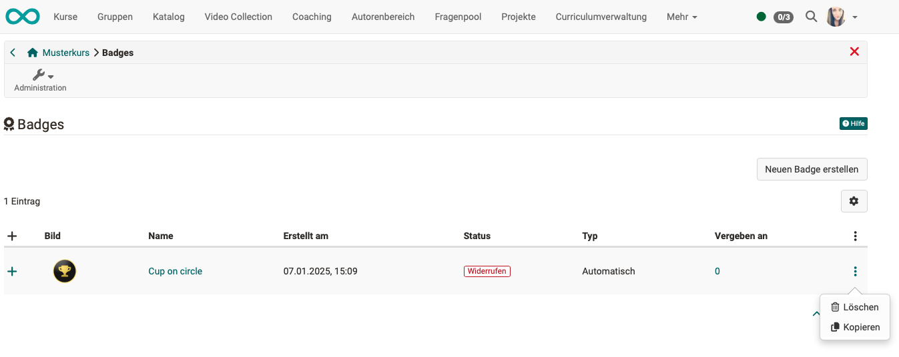{ class="shadow lightbox" title="Badge-Liste in der Kurs-Administration" }

Im Dialog bestätigen Sie mit einem Häkchen, dass Sie den Badge dauerhaft löschen wollen. Wurde der Badge bereits vergeben, wählen Sie zusätzlich, was mit den vergebenen Badges geschieht:

1. "Ausgestellte Badges widerrufen": Der Badge wird als gelöscht markiert und aus der Badge-Liste entfernt. Alle bereits ausgestellten Badges werden widerrufen.
2. "Ausgestellte Badges entfernen": Alle zugehörigen Informationen und Kriterien werden dauerhaft gelöscht, und die Empfänger:innen sehen die Badges nicht mehr.

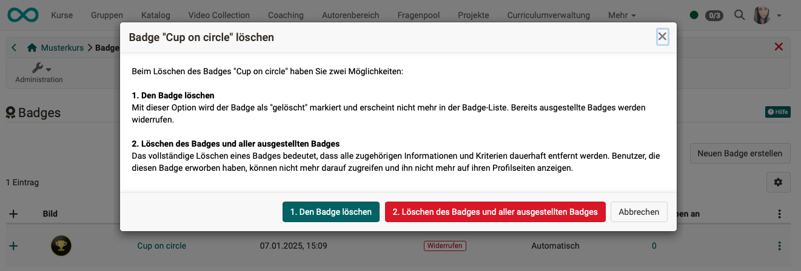{ class="shadow lightbox" title="Dialog Badge löschen" }

[Zum Seitenanfang ^](#badges)

---

## Checkliste {: #checklist}

- [x] Sind Badges generell von Administrator:innen instanzweit aktiviert?
- [x] Wurde im Kurs die Badge-Vergabe aktiviert?
- [x] Soll für einen Badge ein selbst gestaltetes Bild verwendet werden? Liegt es als SVG oder PNG bereit?
- [x] Wurde mit dem Wizard ein Badge erstellt?
- [x] Wurde kontrolliert (und ggf. widerrufen), ob rückwirkend vergebene Badges korrekt vergeben wurden?
- [x] Haben Sie als Kursbesitzer:in/Betreuer:in die in Ihrem Kurs vergebenen Badges im Bewertungswerkzeug kontrolliert?
- [x] Wurden die Kursteilnehmer:innen darüber informiert, wo sie ihre erworbenen Badges einsehen können?

[Zum Seitenanfang ^](#badges)

---

## Weiterführende Informationen {: #further_information}

[Wie erstelle ich meinen ersten OpenOlat-Kurs? >](../my_first_course/my_first_course.de.md) 
[Mit Tabellen arbeiten >](../../manual_user/basic_concepts/Table_Concept.de.md) 
[e-Assessment Administration: OpenBadges >](../../manual_admin/administration/e-Assessment_openBadges.de.md) 
[Kurseinstellungen - Tab Bewertung >](../../manual_user/learningresources/Course_Settings_Assessment.de.md) 
[Bewertungswerkzeug - Übersicht >](../../manual_user/learningresources/Assessment_tool_overview.de.md) 
[Persönliche Erfolge/Leistungen: Badges >](../../manual_user/personal_menu/OpenBadges.de.md) 
[Badges >](../../manual_user/learningresources/OpenBadges.de.md)

[Zum Seitenanfang ^](#badges)
