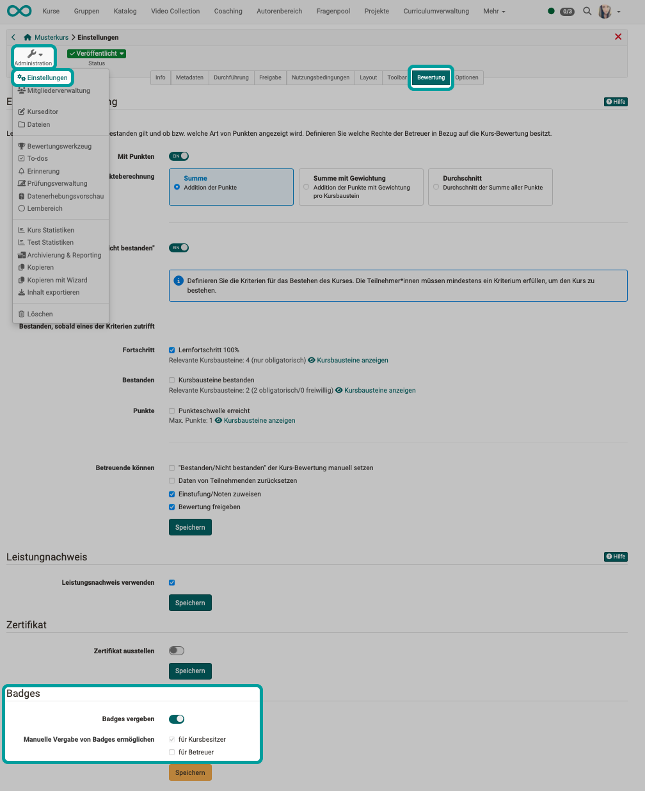

# How do I award badges in my course? {: #badges}

??? abstract "Objectives and content of this instruction"

    If you have already created an OpenOlat course, you can award participants a badge as a reward for passing the course. These instructions show you how to do this.

??? abstract "Target group"

    [x] Authors [x] Coaches  [ ] Participants

    [ ] Beginners [x] Amateurs  [ ] Experts

??? abstract "Expected previous knowledge"

    * ["How do I create my first OpenOlat course?"](../my_first_course/my_first_course.md) 
    * Familiarity with basic concepts of OO: Bulk actions, filters, tables (show/hide columns), wizards

    https://docs.openolat.org/manual_user/basic_concepts/Table_Concept/

---

## Which badges can I award? {: #description}

Basically 3 categories of badges can be awarded:

* **Badges for a course**  (for passing the course or fulfilling the conditions set there)
* **Badges for a specific course element**  (like course badges, with a condition for a specific course element)
* and **global badges**  (cross-course, can only be created by administrators)

[To the top of the page ^](#badges)

---

## Conditions for awarding badges {: #conditions}

### General activation of badges {: #activation_general}

As a general prerequisite for the availability of badges

* the assignment option for the entire instance must have been activated by administrators
* and a [matching badge created](../badges/badges.md).

### Activaton of badges in a course {: #activation_course}

Course authors can determine when and which badge their course participants receive. 

If badges are generally activated, the possibility of awarding badges can be activated for each course under 
**Administration > Settings > Tab Assessment > Toggle-Button "Award badges"** 

You can also specify whether manual allocation by course owners and supervisors should be possible.

{ class="shadow lightbox" }  

---

!!! info "Warning"

    Page is under construction. Thank you for your understanding.

