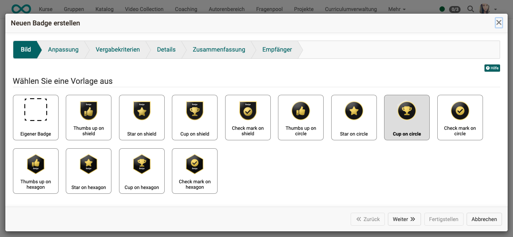
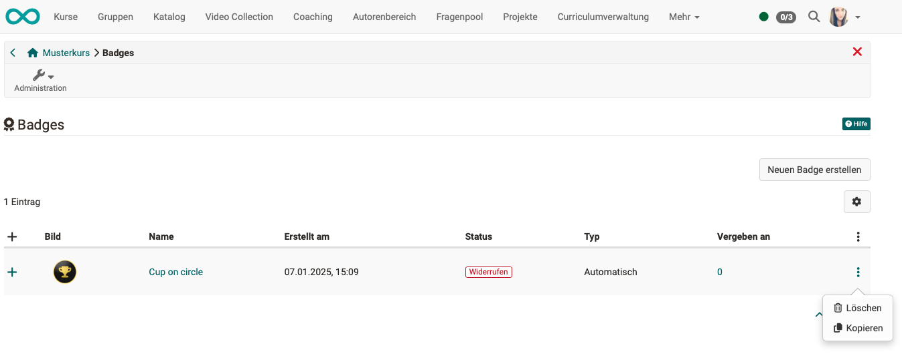

# How do I award badges in my course? {: #badges}

??? abstract "Objectives and content of this instruction"

    If you have already created an OpenOlat course, you can award participants a badge as a reward for passing the course. These instructions show you how to do this.

??? abstract "Target group"

    [x] Authors [x] Coaches  [ ] Participants

    [ ] Beginners [x] Amateurs  [ ] Experts

??? abstract "Expected previous knowledge"

    * ["How do I create my first OpenOlat course?"](../my_first_course/my_first_course.md) 
    * Familiarity with basic concepts of OO: Bulk actions, filters, tables (show/hide columns), wizards

    https://docs.openolat.org/manual_user/basic_concepts/Table_Concept/

---

## Which badges can I award? {: #description}

Basically 3 categories of badges can be awarded:

* **Badges for a course**  (for passing the course or fulfilling the conditions set there)
* **Badges for a specific course element**  (like course badges, with a condition for a specific course element)
* and **global badges**  (cross-course, can only be created by administrators)

[To the top of the page ^](#badges)

---

## Conditions for awarding badges {: #conditions}

### General activation of badges {: #activation_general}

As a general prerequisite for the availability of badges

* the assignment option for the entire instance must have been activated by administrators
* and a [matching badge created](../badges/badges.md).

### Activaton of badges in a course {: #activation_course}

Course authors can determine when and which badge their course participants receive. 

If badges are generally activated, the possibility of awarding badges can be activated for each course under 
**Administration > Settings > Tab Assessment > Toggle-Button "Award badges"** 

You can also specify whether manual allocation by course owners and supervisors should be possible.

{ class="shadow lightbox" }  

---

## How do I create a badge?  {: #create}

(Only possible by authors/course owners and administrators.)

The following options are available for creating a badge:

* Start with your own new image (create svg or png with an external graphics program)
* Use a template created by the admin (template)
* Duplicate an existing badge (and then modify the duplicate)

As soon as the use of badges has been activated in a course, an entry **"Badges"** is displayed in the course administration. You can add new badges to your course under this menu item.

A wizard will start and guide you step by step through the creation process.

{ class="shadow lightbox" }  

{ class="shadow lightbox" } 

### Wizard Step 1: Upload image or select template {: #create_1}

The first step is to select a template or upload your own image. The svg and png formats are currently supported.

{ class="shadow lightbox" }  

### Wizard step 2: Customize template 

If the template was created taking variables into account, you can change colors and text in a template.

{ class="shadow lightbox" }  

### Wizard step 3: Define award criteria 

Enter the criteria and explanation for the rules you have chosen.

{ class="shadow lightbox" }  

When badges are created with the wizard, the rules for awarding them are also defined. Criteria/conditions can be

* one course has been passed
* a certain course score has been reached (prerequisite: score is switched on) 
* the completion criterion was fulfilled for a specific course element
* a certain progress in the learning path has been achieved
* another badge has already been acquired
* one course element has been passed
* a certain score was achieved in a certain course element

Several conditions can be combined with each other.

### Wizard step 4: Details & validation period 

Mandatory details are the name, version and description of the badge, as well as the issuer. You can also add a URL and a contact to the exhibitor properties. The validity period can also be set so that it never expires or is 12 months, for example.

{ class="shadow lightbox" }  

### Wizard Step 5: Summary 

You will receive a screen with a summary of all details for checking purposes.

{ class="shadow lightbox" } 

### Wizard Step 6: Badge recipient (Earners) 

The table visible here shows which participants have already qualified for a badge according to the selected criteria.

{ class="shadow lightbox" }  

[To the top of the page ^](#badges)

---

## How do my course participants get a badge? {: #participants}

Badges can be awarded 

a) manually 
b) automatically on the basis of a condition and calculation 

### Manual assignment of badges

Manual assignment is possible for authors and authorized coaches:  (by author) 
b) **in participant lists** 
    (Awarding badges as a bulk action: mark participants and then click on the green button) 
c) **in a badge list**  
    (Select individual badge, a list will appear below showing who has already received this badge. Then use the button to award it to other course participants).

### Automatic awarding of badges

Automatic awarding is set up by the author in the wizard during creation and is linked to assessable course elements. For this purpose, one or more conditions are defined in the badge creation wizard.

As soon as a change occurs in one of the assessable course elements, the fulfillment of the conditions for awarding a badge is checked again for all participants.

### Examples

**Example 1:** 
The "Bronze" badge is created automatically when 40-60% have been achieved. The "Silver" badge is created automatically when 60-80% have been achieved and the "Gold" badge when 80-100% have been achieved.

**Procedure:** 
3 badges are created. Each badge has a rule with the condition "Course score = ..." The various percentages are entered there.

**Example 2:** 
The "Gold" course badge is created automatically when 5 "Silver" badges have been acquired in 5 course elements within a course.

**Procedure:** 
5 "Silver" badges are created, each containing the condition "Course element passed" or "Course element score". 
Then a 6th badge is created, which contains 5 conditions (all "silver" conditions that were also created individually).
To do this, 5 conditions are specified in the wizard step: "Define award criteria", each with the criterion "Another badge has already been acquired".

### Subsequent allocation of a new badge to authorized persons

It is possible that course participants have already fulfilled the criteria for obtaining a badge before it is created. In this case, subsequent awarding can be triggered for this group of people in the last step of the wizard.

[To the top of the page ^](#badges)

---

## Where do course participants see their badges? {: #view_participant}

Participants find their badges

* top right in the toolbar under "My course"
* in the personal menu
* If you qualify for a badge, it will also be sent by e-mail and can be saved or forwarded as required (e.g. upload to LinkedIn).

[To the top of the page ^](#badges)

---

## Where can coaches/authors see who has received which badges? {: #view_coach}

Coaches and authors see awarded badges

* top right in the toolbar under "My course"
* as author/course owner at the top left in the course administration (**Administration > Badges**)
* in the evaluation tool  only for KB that can be evaluated, only badges that are relevant for this KB are displayed (e.g.: )
 if the coach has received the right to do so from the author: he can trigger the badge manually
Click on top node, chapter

[To the top of the page ^](#badges)

---

## Revoke badges

(only available for authorized course owners and coaches)

Badges that have already been awarded (e.g. also those awarded retroactively during the badge creation process in the "Recipient" step) can later be revoked under 
**Administration > Badges > Button with the three points in the column of the according badge** 

[To the top of the page ^](#badges)

---

## Delete Badges

(only available for authorized course owners and coaches)

To delete a badge, click on the 3 dots at the end of the line of the desired badge under **Administration > "Badges"**.

The deletion can then be carried out in 2 ways:

1. a deletion where issued badges are marked as "Revoked"
2. ein vollständiges Löschen aller Daten, die zu diesem Badge gehören

{ class="shadow lightbox" }

{ class="shadow lightbox" }

[To the top of the page ^](#badges)

---

## Check list {: #checklist}

- [x] Are badges generally activated instance-wide by the administrator?
- [x] Has badge allocation been activated in the course?
- [x] Should a self-designed image be used for a badge? Is it available as svg or png? 
- [x] Was a badge created with the wizard?
- [x] Has it been checked (and revoked if necessary) whether retroactively awarded badges were awarded correctly?
- [x] As the course owner/coach, have you checked the badges awarded in your course in the assessment tool?
- [x] Were the course participants informed about where they can view the badges they have earned? 

[To the top of the page ^](#badges)

---

## Further information {: #further_information}

[Badges in the assessment tool >](../../manual_user/learningresources/OpenBadges.md) 
[OpenBadges Administration >](../../manual_admin/administration/e-Assessment_openBadges.md) 

