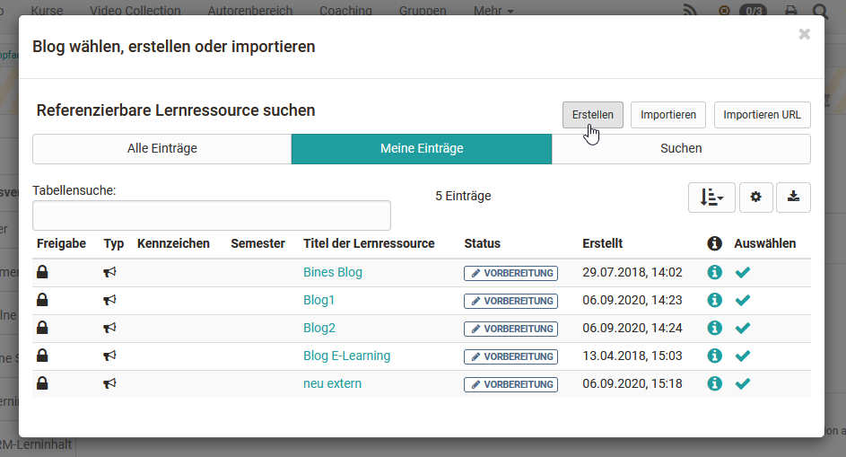
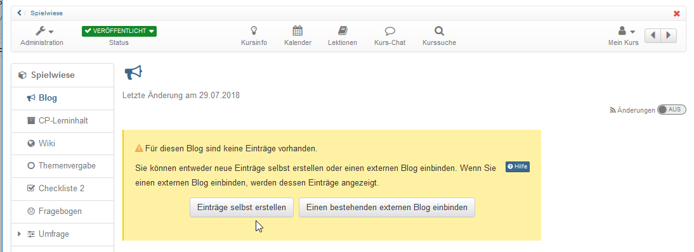

# Vier Schritte zu Ihrem Blog

Mit dieser Anleitung haben Sie in kurzer Zeit in Ihrem Kurs einen Blog
erstellt und ihn Ihren Wünschen entsprechend angepasst.

## Schritt 1: Kurseditor öffnen und Kursbaustein Blog einfügen  

a) Gehen Sie in den gewünschten Kurs und öffnen Sie den Kurseditor, der sich im Menü "Administration befindet.  

b) Wählen Sie die Stelle im Kursmenü an der der Baustein hinzugefügt werden soll. Kursbausteine werden immer unterhalb des aktuell ausgewählten Kursbausteins eingefügt. 

c) Klicken Sie auf "Kursbaustein einfügen" oder nutzen Sie die Quick-Add Funktion und wählen Sie "Blog".

Schon ist der Kursbaustein dem Kurs hinzugefügt.  

d) Vergeben Sie nun noch einen passenden Titel im Tab „Titel und Beschreibung“ und speichern Sie den Kursbaustein.  
  
## Schritt 2: Blog erstellen  

a) Gehen sie in den Tab „Blog-Lerninhalt“ und klicken sie auf „Blog wählen, erstellen oder importieren“.

  

Hier können Sie nun einen neuen Blog erstellen, einen Blog der Ihnen als Datei vorliegt (z.B. durch einen Export) hochladen oder eine URL für den Blog-Import angeben.

Wir gehen im Folgenden davon aus, dass Sie einen neuen 
_OpenOlat Blog_ verwenden möchten. 
  
* Klicken Sie auf den Button „Erstellen“ 

* Geben Sie einen Titel für Ihren Blog ein und bestätigen Sie mit "Erstellen". 

Fertig, damit ist eine neue Blog Lernressource angelegt und weitere Einstellungen sowie die konkrete Ausgestaltung können vorgenommen werden.

## Schritt 3: Benutzerberechtigungen definieren 

Im Tab **"Blog-Lerninhalt"** wird festgelegt, wer Blogbeiträge erstellen und den Blog moderieren darf. 
Differenziertere Einstellungen sind auch über die erweiterte Konfiguration möglich. 

Blog-Moderatoren verfügen zusätzlich im Kursrun über den Button "Blog bearbeiten" und können Titel, Beschreibung und Bild eines Blogs bestimmen. Auch entscheiden sie zu Beginn, ob en externer Blog oder ein OpenOlat Blog verwendet werden soll. Diese Entscheidung ist notwendig bevor Blogbeiträge z.B. von Teilnehmenden erstellt werden können. 

Abschließend muss der Kurs publiziert und der Kurseditor geschlossen werden, damit die Änderungen sichtbar werden. 

## Schritt 4: Blog Beiträge hinzufügen  

  
  
* Klicken Sie auf "**Einträge selbst erstellen**" um den ersten Initialbeitrag des Blogs zu erstellen  Dieser Schritt ist notwendig, damit Blogbeiträge von der definierten Zielgruppe anschließend ebenfalls eingestellt werden können.

* Erstellen Sie den ersten Blogbeitrag indem Sie einen Titel vergeben. Der eigentliche Blogbeitrag wird unter "Inhalt" eingefügt. Alternativ oder ergänzend können auch Audio oder Videodateien oder als eingefügt. Zusätzlich können noch hochgeladen werden. 

* Wenn Sie alle gewünschten Felder ausgefüllt haben, veröffentlichen Sie den Blogbeitrag. 

Weitere Einträge können anschließend über den Button "Neuen Eintrag erstellen" einfach im
Kursrun hinzugefügt werden.  

!!! info "Info"

    Voraussetzung dafür, dass Kursbesitzer, Betreuer oder Teilnehmende Blogbeiträge erstellen können ist die Verwendung eines OpenOlat Blogs (nicht die Einbindung eines externen Blogs). Eine Kommentierung ist jedoch grundsätzlich möglich. 

!!! info "Hinweis"

    Teilnehmer und Betreuer erstellen ihre Beiträge bei geschlossenem Editor im Kursrun. Besitzer können neue Einträge auch im Kurseditor hinzufügen.

 ### Externen Blog einbinden

 Neben OpenOlat Blogs können auch externe Blogs aus dem Internet in einen Kurs eingebunden werden. Hierfür wird der RSS-Feed des gewünschten externen Blogs benötigt. 
 
 Anstatt auf den Button "Einträge selbst erstellen" klicken Sie auf den Button **"Einen bestehenden Blog einbinden"** und fügen Sie im erscheinenden Dialog den RSS-Feed Link ein.

 Anschließend werden die Inhalte des externen Blogs im OpenOlat Kurs direkt angezeigt und können mit Sternchen bewertet und auch kommentiert werden. Diese Kommentierungen sind nur innerhalb des Kurses, nicht öffentlich im Internet, sichtbar.

!!! tip "Tipp"

    Alternativ kann ein OpenOlat Blog so wie alle anderen Lernressourcen im Autorenbereich erstellt und anschliessend im Kurseditor im Tab "Blog-Lerninhalt" in den gewünschten Kurs eingebunden werden. 
    
    Dieses Vorgehen empfiehlt sich um zu verstehen, dass Lernressourcen kursübergreifende Tools sind und die Einbindung in dem gewählten Kurs nur eine Möglichkeit darstellt. 
    
    Derselbe Blog kann in mehreren OpenOlat-Kursen eingebunden und auch kursunabhängig verwendet werden.

  

  

  

