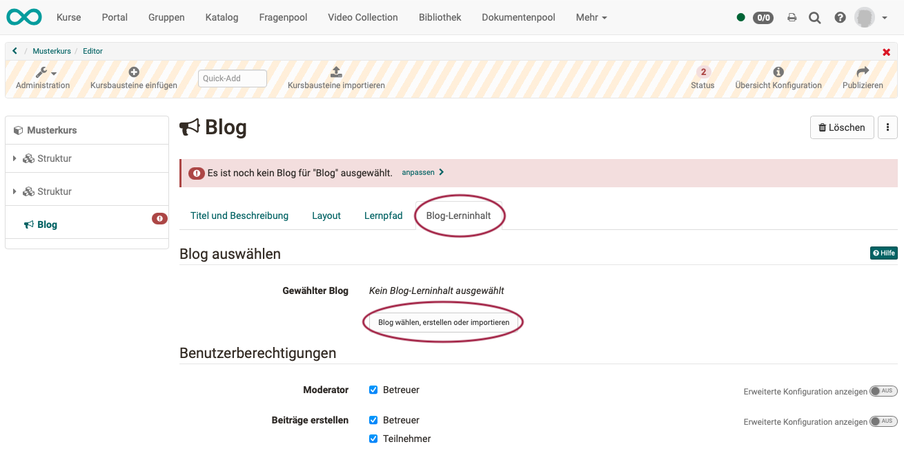
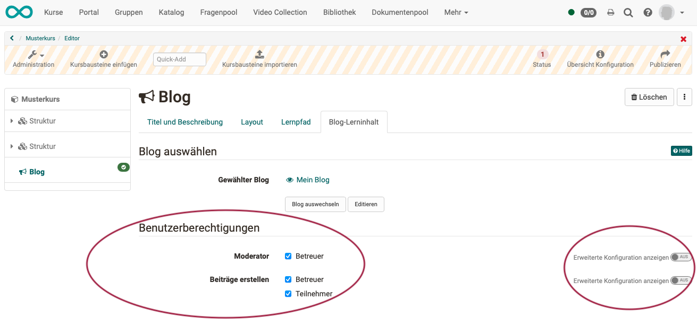
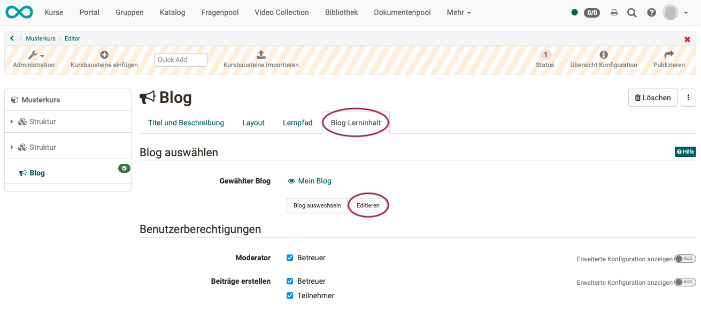
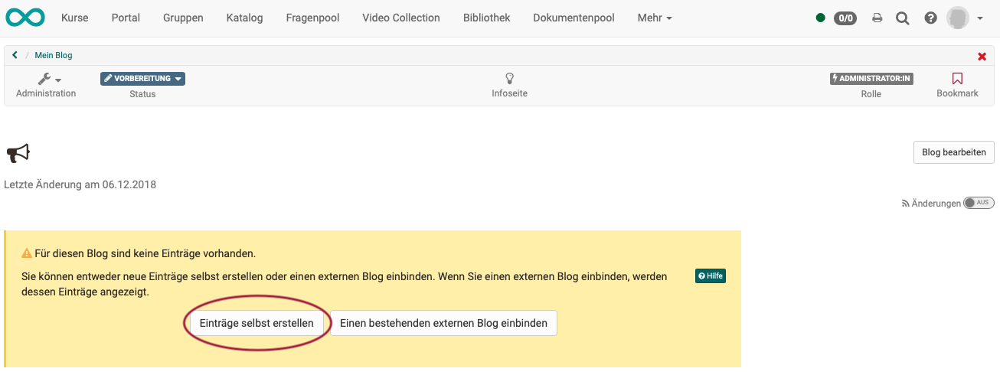
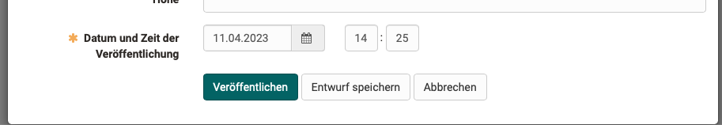

# Wie erstelle ich einen Blog?

Mit dieser Anleitung haben Sie in kurzer Zeit in Ihrem Kurs einen Blog
erstellt und ihn Ihren Wünschen entsprechend angepasst.

##  Voraussetzung

Der Blog wird innerhalb eines OpenOlat-Kurses eingebunden. Wenn Sie noch keinen Kurs erstellt haben, steht im Kapitel [„Wie erstelle ich meinen ersten OpenOlat-Kurs"](../my_first_course/my_first_course.de.md), wie Sie vorgehen müssen, bevor Sie mit Hilfe der folgenden Anleitung Ihren Blog erstellen.

---

## Schritt 1: Kurseditor öffnen und Kursbaustein "Blog" einfügen  

a) Gehen Sie in den **Autorenbereich** und suchen Sie dort den Kurs, in den der Blog eingefügt werden soll.
  
{ class="shadow lightbox" }  

b) Öffnen Sie den gewünschten Kurs im **Kurseditor**, der sich im Menü "Administration befindet.

c) Wählen Sie die Stelle im Kursmenü, an der der Baustein hinzugefügt werden soll. Kursbausteine werden immer unterhalb des aktuell ausgewählten Kursbausteins eingefügt. 

d) Klicken Sie in der Kopfzeile des Editors auf **"Kursbaustein einfügen"** oder nutzen Sie die Quick-Add Funktion und wählen Sie im Popup mit der Auswahlliste "Blog".

Damit ist der Kursbaustein schon dem Kurs hinzugefügt.

e) Vergeben Sie nun noch einen passenden **Titel** im Tab „Titel und Beschreibung“ und speichern Sie den Kursbaustein.  

!!! tip "Hinweis"

    Wenn Sie den Kurseditor bereits jetzt schliessen, wird im Menü kein Blog angezeigt, denn der Kursbaustein ist noch unvollständig. Es fehlt noch die Lernressource.

---

## Schritt 2: Blog (Lernressource) erstellen  

a) Gehen Sie in den <b>Tab „Blog-Lerninhalt“</b> und klicken Sie auf „Blog wählen, erstellen oder importieren“.

{ class="shadow lightbox" }  

b) Hier können Sie nun 

* einen **neuen** Blog erstellen, 
* einen Blog **hochladen**, der Ihnen als Datei vorliegt (z.B. durch einen Export), 
* oder eine **URL** für den Blog-Import angeben.

Wir gehen im Folgenden davon aus, dass Sie einen **neuen** Blog beginnen möchten. 
  
c) Klicken Sie auf den **Button „Erstellen“**. 

d) Geben Sie einen **Titel** für Ihre Blog-Lernressource ein und bestätigen Sie mit <b>"Erstellen"</b>. 

Fertig. Damit ist eine neue Blog-Lernressource angelegt und weitere Einstellungen sowie die konkrete Ausgestaltung können vorgenommen werden.

!!! tip "Tipp"

    Alternativ kann ein OpenOlat-Blog (so wie alle anderen Lernressourcen) auch im Autorenbereich erstellt und anschliessend im Kurseditor im Tab "Blog-Lerninhalt" in den gewünschten Kurs eingebunden werden. 
    
    Bei diesem Vorgehen wird deutlich, dass Lernressourcen kursübergreifende Elemente sind und die Einbindung im gewählten Kurs nur eine der Verwendungsmöglichkeiten darstellt. 
    
    Derselbe Blog kann in mehreren OpenOlat-Kursen eingebunden und auch kursunabhängig verwendet werden.

---  

## Schritt 3: Benutzerberechtigungen definieren 

a) Im Tab **"Blog-Lerninhalt"** wird festgelegt, wer Blogbeiträge erstellen und den Blog moderieren darf. 
Differenziertere Einstellungen sind auch über die erweiterte Konfiguration möglich. 

{ class="shadow lightbox" }  

b) **Blog-Moderatoren** verfügen zusätzlich im Kursrun* über den <b>Button "Blog bearbeiten"</b> und können Titel, Beschreibung und Bild eines Blogs bestimmen. Auch entscheiden sie zu Beginn, ob ein externer Blog oder ein OpenOlat-Blog verwendet werden soll. Diese Entscheidung ist notwendig, bevor Blogbeiträge z.B. von Teilnehmenden erstellt werden können.

(*Kursrun = Modus „aktiver Kurs“, im Unterschied zum Kurs, der im Editor geöffnet ist)

c) Abschließend muss der Kurs **publiziert** und der Kurseditor geschlossen werden, damit die Änderungen sichtbar werden. 

---

## Schritt 4: Blogbeiträge hinzufügen  

a) Öffnen Sie den Kurseditor erneut und klicken Sie im Tab "Blog Lerninhalt" auf „Editieren“.

{ class="shadow lightbox" } 

b) Beim **ersten Editieren** werden Sie nun gefragt, ob Sie einen Eintrag neu erstellen wollen oder einen bestehenden Blog einbinden möchten. Im Folgenden zeigen wir, wie Sie eine neuen Blog-Eintrag erstellen.

{ class="shadow lightbox" }  
  
Klicken Sie auf "**Einträge selbst erstellen**" um den ersten **Initialbeitrag** des Blogs zu erstellen.  Dieser Schritt ist notwendig, damit Blogbeiträge von der definierten Zielgruppe anschließend ebenfalls eingestellt werden können.

c) Erstellen Sie den ersten **Blogbeitrag**.

* Vergeben Sie einen Titel.
* Der eigentliche Blogbeitrag wird unter "Inhalt" eingefügt.
* Alternativ oder ergänzend können auch Audio oder Videodateien eingefügt werden.
* Auch Zeitpunkt und Datum der Veröffentlichung können bestimmt werden.

d) Wenn Sie alle gewünschten Felder ausgefüllt haben, veröffentlichen Sie den Blogbeitrag durch Klick auf den Button "Veröffentlichen" am unteren Rand des Fensters.

{ class="shadow lightbox" }  

Weitere Einträge können anschließend über den <b>Button "Neuen Eintrag erstellen"</b> einfach im
Kursrun (veröffentlichter Kurs) hinzugefügt werden.  

!!! info "Voraussetzung"

    Voraussetzung für die Erstellung von Blogbeiträgen durch Kursbesitzer, Betreuer oder Teilnehmende ist die Verwendung eines **in OpenOlat erstellten Blogs** (nicht die Einbindung eines externen Blogs). Eine Kommentierung ist jedoch grundsätzlich möglich. 

!!! info "Hinweis"

    **Teilnehmer und Betreuer** erstellen ihre Beiträge bei geschlossenem Editor im Kursrun. (Kursrun = Modus „aktiver Kurs“, im Unterschied zum Kurs, der im Editor geöffnet ist)  **Besitzer** können neue Einträge auch im Kurseditor hinzufügen.

---

## Schritt 5: Kurs publizieren und Kurs-Status auf "Veröffentlicht" ändern  
  
Gehen Sie dazu vor, wie in [„Wie erstelle ich meinen ersten OpenOlat-Kurs"](../my_first_course/my_first_course.de.md) beschrieben.

Der Blog ist nun eingebunden und Kursteilnehmende können die Beiträge lesen.

---

## Externen Blog einbinden

 Neben OpenOlat Blogs können auch externe Blogs aus dem Internet in einen Kurs eingebunden werden. Hierfür wird der RSS-Feed des gewünschten externen Blogs benötigt. 
 
 Anstatt auf den Button "Einträge selbst erstellen" klicken Sie auf den Button **"Einen bestehenden externen Blog einbinden"** und fügen Sie im erscheinenden Dialog den RSS-Feed Link ein.

 Anschließend werden die Inhalte des externen Blogs im OpenOlat Kurs direkt angezeigt und können mit Sternchen bewertet und auch kommentiert werden. Diese Kommentierungen sind nur innerhalb des Kurses, nicht öffentlich im Internet, sichtbar.

  

  

