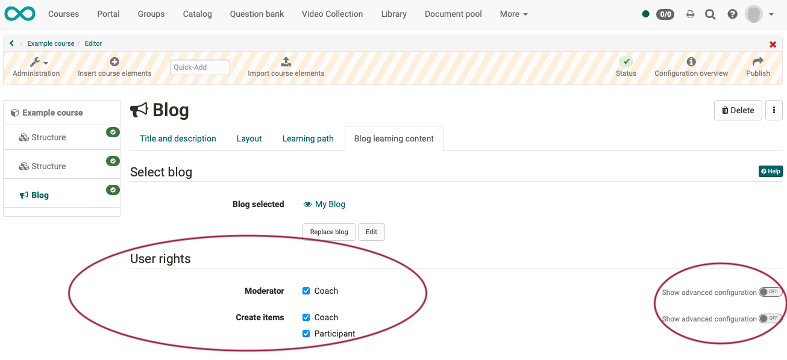

# How do I create a blog?

With the aid of the following guidelines you will create a blog for your
course in a short time and can adapt it according to your needs.

## Step 1: Open course editor and insert blog course element

a) Search in **"Authoring"** for your course, where you want to insert the blog.
  
  

b) Open the desired course in the **course editor** located in the administration menu.

c) Select the position in the course menu where the course element is to be added. Course elements are always inserted below the currently selected course element.

d) Click **"Insert course element "** in the editor header or use the quick-add function and select "blog" in the pop-up with the selection list.

The course element has already been added to the course.

e) Now assign a suitable **title** in the tab "Title and description" and save the course element.

!!! tip "Note"

    If you close the course editor already now, no blog will be displayed in the menu because the course element is still incomplete. The learning resource is still missing.

## Step 2: Create the blog (learning resource) 

a) Go to tab <b>"Blog learning content"</b> and click there "Select, create or import blog".

  

b) Here you can now 

* create a **new** blog, 
* **upload** a blog that is available to you as a file (e.g. through an export).
* or specify a **URL** for the blog import.

We will assume below that you want to start a **new** blog.
  
c) Click on the **"Create" button**.

d) Enter a **title** for your blog learning resource and confirm with <b>"Create"</b>.

Done. With this, a new blog learning resource is created and further settings as well as the concrete design can be made.

!!! tip "Hint"

    Alternatively, an OpenOlat blog (like all other learning resources) can also be created in the authoring area and then integrated into the desired course in the course editor in the tab "Blog learning content". 
    
    This procedure makes it clear that learning resources are cross-course tools and the integration in the selected course is only one of the possible uses. 
    
    The same blog can be integrated in several OpenOlat courses and can also be used independently of the course.

  

## Step 3: Define user rights

a) Im Tab **"Blog-Lerninhalt"** wird festgelegt, wer Blogbeiträge erstellen und den Blog moderieren darf. 
Differenziertere Einstellungen sind auch über die erweiterte Konfiguration möglich. 

  

b) **Blog-Moderatoren** verfügen zusätzlich im Kursrun* über den <b>Button "Blog bearbeiten"</b> und können Titel, Beschreibung und Bild eines Blogs bestimmen. Auch entscheiden sie zu Beginn, ob ein externer Blog oder ein OpenOlat-Blog verwendet werden soll. Diese Entscheidung ist notwendig, bevor Blogbeiträge z.B. von Teilnehmenden erstellt werden können.

(*Kursrun = Modus „aktiver Kurs“, im Unterschied zum Kurs, der im Editor geöffnet ist)

c) Abschließend muss der Kurs **publiziert** und der Kurseditor geschlossen werden, damit die Änderungen sichtbar werden. 

## Schritt 4: Blogbeiträge hinzufügen  

  
  
a) Klicken Sie auf "**Einträge selbst erstellen**" um den ersten **Initialbeitrag** des Blogs zu erstellen.  Dieser Schritt ist notwendig, damit Blogbeiträge von der definierten Zielgruppe anschließend ebenfalls eingestellt werden können.

b) Erstellen Sie den ersten **Blogbeitrag**.

* Vergeben Sie einen Titel.
* Der eigentliche Blogbeitrag wird unter "Inhalt" eingefügt.
* Alternativ oder ergänzend können auch Audio oder Videodateien eingefügt werden.
* Auch Zeitpunkt und Datum der Veröffentlichung können bestimmt werden.

c) Wenn Sie alle gewünschten Felder ausgefüllt haben, veröffentlichen Sie den Blogbeitrag durch Klick auf den Button "Veröffentlichen" am unteren Rand des Fensters.

  

Weitere Einträge können anschließend über den <b>Button "Neuen Eintrag erstellen"</b> einfach im
Kursrun (veröffentlichter Kurs) hinzugefügt werden.  

!!! info "Voraussetzung"

    Voraussetzung für die Erstellung von Blogbeiträgen durch Kursbesitzer, Betreuer oder Teilnehmende ist die Verwendung eines **in OpenOlat erstellten Blogs** (nicht die Einbindung eines externen Blogs). Eine Kommentierung ist jedoch grundsätzlich möglich. 

!!! info "Hinweis"

    **Teilnehmer und Betreuer** erstellen ihre Beiträge bei geschlossenem Editor im Kursrun. (Kursrun = Modus „aktiver Kurs“, im Unterschied zum Kurs, der im Editor geöffnet ist)  **Besitzer** können neue Einträge auch im Kurseditor hinzufügen.

## Externen Blog einbinden

 Neben OpenOlat Blogs können auch externe Blogs aus dem Internet in einen Kurs eingebunden werden. Hierfür wird der RSS-Feed des gewünschten externen Blogs benötigt. 
 
 Anstatt auf den Button "Einträge selbst erstellen" klicken Sie auf den Button **"Einen bestehenden Blog einbinden"** und fügen Sie im erscheinenden Dialog den RSS-Feed Link ein.

 Anschließend werden die Inhalte des externen Blogs im OpenOlat Kurs direkt angezeigt und können mit Sternchen bewertet und auch kommentiert werden. Diese Kommentierungen sind nur innerhalb des Kurses, nicht öffentlich im Internet, sichtbar.

  

  

