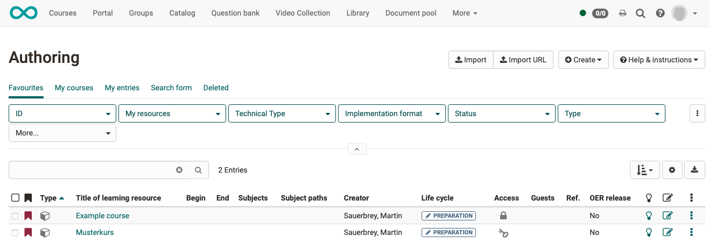

# How do I create a blog?

With the aid of the following guidelines you will create a blog for your
course in a short time and can adapt it according to your needs.

##  Requirement

The blog is included within an OpenOlat course. If you have not yet created a course, the chapter ["How do I create my first OpenOlat course"](../my_first_course/my_first_course.md) tells you how to proceed before creating your podcast using the following instructions.

---

## Step 1: Open course editor and insert blog course element

a) Search in **"Authoring"** for your course, where you want to insert the blog.
  
  

b) Open the desired course in the **course editor** located in the administration menu.

c) Select the position in the course menu where the course element is to be added. Course elements are always inserted below the currently selected course element.

d) Click **"Insert course element "** in the editor header or use the quick-add function and select "blog" in the pop-up with the selection list.

The course element has already been added to the course.

e) Now assign a suitable **title** in the tab "Title and description" and save the course element.

!!! tip "Note"

    If you close the course editor already now, no blog will be displayed in the menu because the course element is still incomplete. The learning resource is still missing.

---

## Step 2: Create the blog (learning resource) 

a) Go to tab <b>"Blog learning content"</b> and click there "Select, create or import blog".

  

b) Here you can now 

* create a **new** blog, 
* **upload** a blog that is available to you as a file (e.g. through an export).
* or specify a **URL** for the blog import.

We will assume below that you want to start a **new** blog.
  
c) Click on the **"Create" button**.

d) Enter a **title** for your blog learning resource and confirm with <b>"Create"</b>.

Done. With this, a new blog learning resource is created and further settings as well as the concrete design can be made.

!!! tip "Hint"

    Alternatively, an OpenOlat blog (like all other learning resources) can also be created in the authoring area and then integrated into the desired course in the course editor in the tab "Blog learning content". 
    
    This procedure makes it clear that learning resources are cross-course elements and the integration in the selected course is only one of the possible uses. 
    
    The same blog can be integrated in several OpenOlat courses and can also be used independently of the course.

---

## Step 3: Define user rights

a) The **Blog Learning Content** tab is used to define who can create blog posts and moderate the blog. More differentiated settings are also possible via the advanced configuration.

  

b) **Blog moderators** additionally have the <b>"Edit blog"</b> button in the course run* and can determine the title, description and image of a blog. They also decide at the beginning if an external blog or an OpenOlat blog should be used. This decision is necessary before blog posts can be created e.g. by participants.

(*course run = „active course" mode, as opposed to the course open in the editor)

c) Finally, the course must be **published** and the course editor closed so that the changes are visible.

---

## Step 4: Add blog posts 

a) Open the course editor again and click in the tab "Blog learning content" on "Edit".

 

b) When **first editing** you will now be asked if you want to create a new entry or include an existing blog. Below we show how to create a new blog entry.

  
  
Click "**Create your own entries**" to create the first **initial post** of the blog.  This step is necessary so that blog posts from the defined target group can also be posted afterwards.

c) Create the first **blog post**.

* Give a title.
* The actual blog post is inserted under "Content".
* Alternatively or supplementary audio or video files can be inserted.
* The time and date of publication can also be determined.

d) When you have filled in all the required fields, publish the blog post by clicking the "Publish" button at the bottom of the window.

  

Additional entries can then be easily added via the <b>"Create new entry"</b> button in the course run (published course) to be added.

!!! info "Precondition"

    The prerequisite for the creation of blog posts by course owners, coaches or participants is the use of a **blog created in OpenOlat** (not the integration of an external blog). However, commenting is possible in principle. 

!!! info "Note"

    **Participants and coaches** create their posts with the editor closed in course run. (Course run = "active course" mode, as opposed to the course being open in the editor.)  **Owners** can also add new entries in the course editor.

---

## Step 5: Publish course and change course status to "Published"
  
To do this, proceed as described in ["How do I create my first OpenOlat course"](../my_first_course/my_first_course.md).

The blog is now integrated and course participants can read the posts.

---

## Embed an external blog

In addition to OpenOlat blogs, external blogs from the Internet can also be integrated into a course. For this, the RSS feed of the desired external blog is required.

Instead of clicking on the "Create your own entries" button, click on the **"Embed an already existing external blog "** button and insert the RSS feed link in the dialog that appears.

Afterwards, the content of the external blog will be displayed directly in the OpenOlat course and can be star rated and also commented on. These comments are only visible within the course, not publicly on the Internet.
  