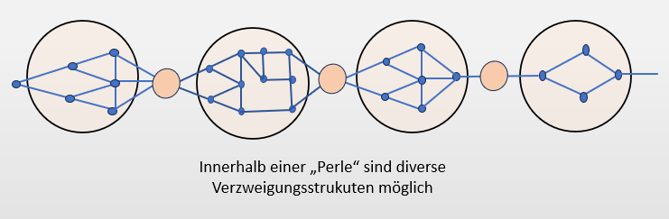
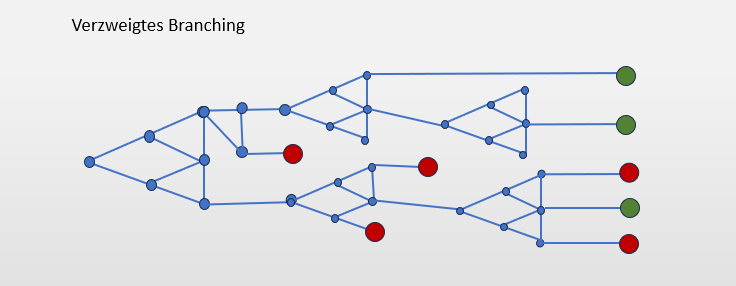
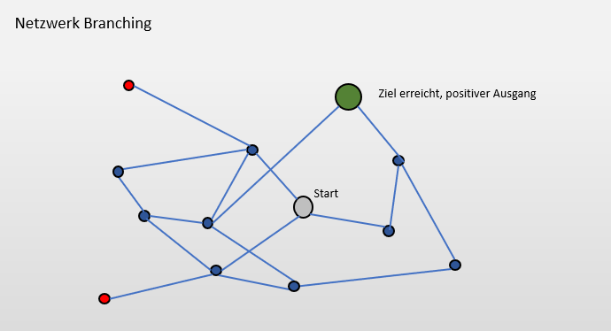
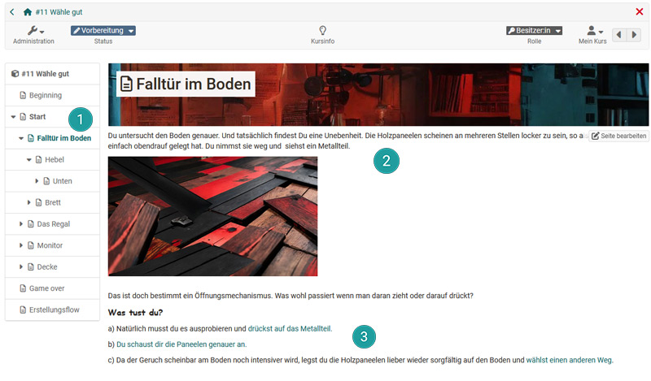
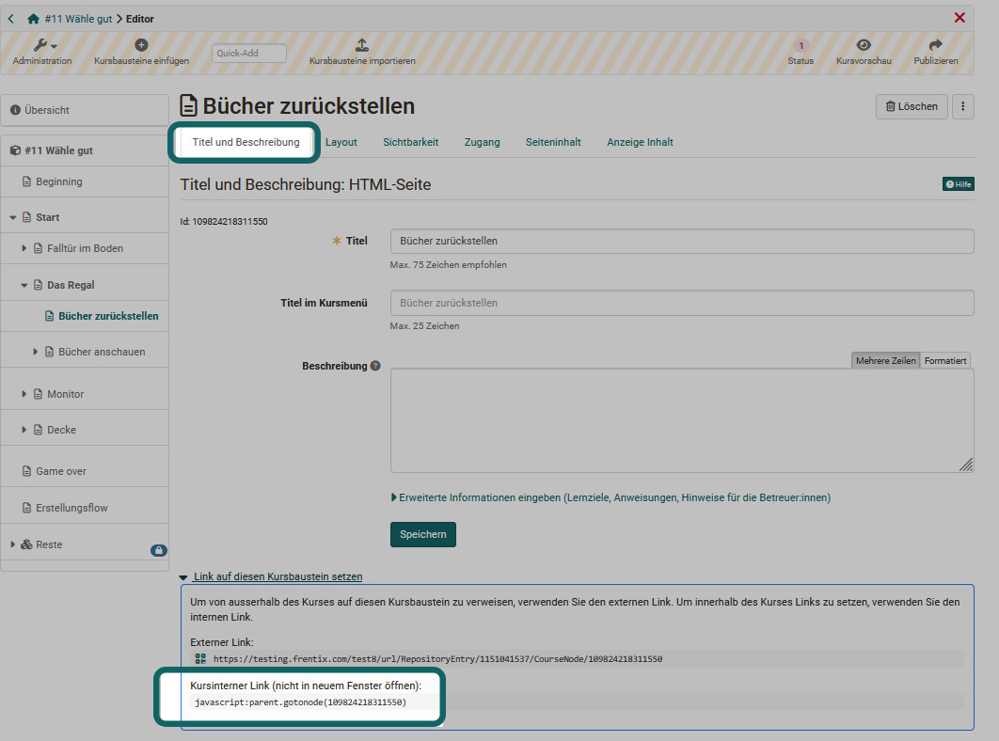
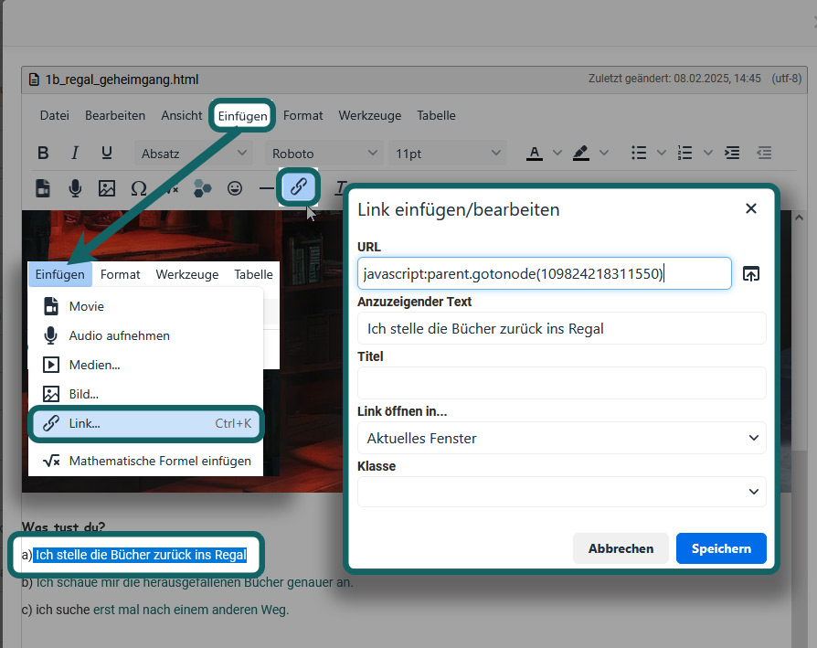
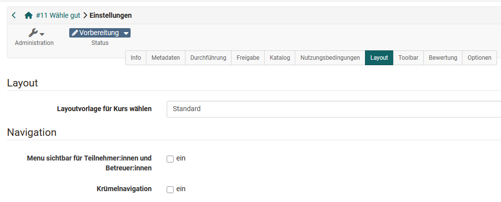
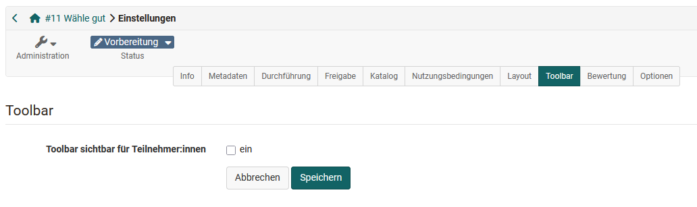

# Wie erstelle ich kursinterne Verzweigungen? (Branching) {: #branching}

??? abstract "Ziel und Inhalt dieser Anleitung"

    Verzweigte Szenarien ermöglichen die Erstellung interaktiver Lehr- und Lernumgebungen, bei denen die Lernenden aktiv Entscheidungen treffen müssen um weiterzukommen. Je nach gewählter Option werden sie dann zu unterschiedlichen Seiten, weiterführenden Informationen oder Handlungsaufforderungen weitergeleitet. Die folgende Anleitung zeigt, wie solche interaktiven Lehr-/Lernsettings mit OpenOlat umgesetzt werden können.

??? abstract "Zielgruppe"

    [x] Autor:innen [x] Betreuer:innen  [ ] Teilnehmer:innen

    [ ] Anfänger:innen [x] Fortgeschrittene  [x] Expert:innen 

??? abstract "Erwartete Vorkenntnisse"

    * Sie haben bereits einen OpenOlat Kurs erstellt und kennen sich mit dem [Hinzufügen von Kursbausteinen](https://www.youtube.com/embed/AJ76e3urdKA) aus. 
    * ["Wie erstelle ich meinen ersten OpenOlat-Kurs?"](../my_first_course/my_first_course.de.md)
    

---

## Wie können Verzweigungen in einem Kurs aufgebaut sein? {: #description}

Es gibt verschiedene Möglichkeiten, wie man die Struktur für Branching-Szenarien gestalten kann. Hier drei typische Beispiele:

a) **Lineares Branching (Perlenkettenmodell):** 
Die Hauptknoten/Seiten werden nacheinander abgearbeitet. Die Entscheidungen führen eher nur zu kleinen Einschüben/Schleifen oder stellen unterschiedliche Informationen bereit. Dabei werden die Informationen bzw. Seiten jedoch immer wieder zusammengeführt. Insgesamt ein eher einfacher Ansatz.

b) **Verzweigtes Branching** 
Bei dieser Variante gibt es verschiedene (parallele) Wege durch die einzelnen Seiten. Jede Wahl führt zu unterschiedlichen Verzweigungen, die neue Entscheidungsmöglichkeiten eröffnen aber gleichzeitig bestimmte Wege beschränken können. Mehrere Enden, auch negative sind dabei möglich. Häufig eher hierarchisch organisiert und weniger durchlässig. 

c) **Netzwerk-Branching**  
Diese Struktur erlaubt es Lernenden, zwischen verschiedenen Entscheidungspunkten nicht linear zu navigieren, eine klare vorgegebene Reihenfolge gibt es in der Regel nicht. Diese Struktur ist eher durchlässig und lässt den Lernenden den grössten Spielraum für individuelle Wege und Entdeckungen.  

[Zum Seitenanfang ^](#branching)

---

## Wie plane ich ein Branching-Szenario? {: #plan}

Die Gestaltung von Branching-Szenarien erfordert eine sorgfältige Planung: Lehrende sollten klare Lernziele definieren und nachvollziehbare, logische Handlungswege entwickeln. 

Ein Branching-Szenario ist narrativ und besteht aus einer **Gesamt-Story**, die auch das Lernziel widerspiegelt. 

### Finden Sie Ihr Thema, Ihre Story
* Definieren Sie Ihr Thema, Ihren Inhalt
* Stellen Sie eine Verbindung zur Zielgruppe her 
* Definieren Sie die Lernziele
* Welche Wahlentscheidungen wären thematisch gut und wichtig? Wofür wollen Sie sensibilisieren?
* Bauen Sie Spannung und Dramaturgie ein.
* Überlegen Sie auch wie Sie das Branching-Szenario konkret einsetzen wollen z.B. Dozentengeleitet im Plenum oder als selbstgesteuerten individuellen Kurs; als Wettbewerb, wer als erstes den Zielknoten erreicht? Usw.
* Ist das Branching-Szenario Teil eines komplexeren Settings? Soll es noch mit anderen OpenOlat Elementen wie Quiz, Evaluation, Reflexion u.ä. kombiniert werden? 

Die Gesamt-Story verteilt sich auf mehrere Seiten, auch Knoten genannt, die über die jeweiligen Wahlmöglichkeiten miteinander verbunden sind.  

Eine einzelne Seite bzw. Knoten besteht aus mindestens folgenden Elementen:

* Einem eindeutigen Namen bzw. **Titel**. Dieser wird auch für die Verknüpfung benötigt. (1)
* Einem **Story-Element**, meist ein Text aber auch Bilder, Videos oder Kombinationen verschiedener Multimedia-Elemente sind möglich. (2)
* Zwei bis fünf **Wahlmöglichkeiten**, die aus der Story abgeleitet werden. Jede Wahlmöglichkeit führt dann jeweils zu einer neuen Seite bzw. einem neuen Knoten. Diese neuen Seiten bilden gleichzeitig auch das Feedback bezüglich der getroffenen Wahl für die Lernenden. (3)

Planen Sie jeden dieser Knoten  und behalten Sie die gesamte Story und Struktur im Blick. 

### Herangehensweise
Es gibt mehrere Möglichkeiten, wie man konkret vorgehen kann um ein Branching-Szenario für und mit OpenOlat zu erstellen.

**a)	Erst Struktur dann Inhalte umsetzen**

Dabei liegt der Fokus auf der Planung der Verzweigungen und Entscheidungswege. Die konkrete Ausgestaltung der Knoten mit der Story erfolgt dann im zweiten Schritt. Zunächst wird also die gesamte Verzweigungsstruktur geplant, in OpenOlat übertragen und mit HTML-Seiten umgesetzt. Ein Knoten entspricht dabei einem Kursbaustein [HTML-Seite](../../../manual_user/docs/learningresources/Course_Element_HTML_Page.de.md). Im nächsten Schritt werden die erstellten Seiten mit den konkreten Inhalten bzw. Story-Elementen und Wahlbschreibungen gefüllt. 
Dieses Vorgehen eignet sich besonders gut für verzweigtes Branching und Netzwerk-Branching.

**b)	Sukzessiver Aufbau**

Sie haben eine spannende Idee, aber noch keine konkrete Verzweigungsstruktur und möchten Ihr Szenario nach und nach entwickeln? Dann gehen Sie so vor: Starten Sie mit der Story der Startseite (Kursbaustein HTML-Seite) und den ersten Wahlmöglichkeiten. Gestalten Sie nun nach und nach die unterschiedlichen Wahlmöglichkeiten aus. Achten Sie aber darauf die Teile wieder gut zusammenzuführen. 
Dieses Vorgehen ist gut geeignet für hierarchische Strukturen und verzweigtes Branching.

**c) Aus linear mach verzweigt**

Sie verfügen bereits über eine geeignete lineare Story? Dann ergänzen Sie diese mit passenden Verzweigungen an bestimmten Stellen. Diese Wahlmöglichkeiten können zu einer unterschiedlichen Fokussierung oder Vertiefung führen, leiten aber letztendlich immer wieder zum nächsten "Kapitel". Teilen Sie hierfür ihre Story in passende Kapitel und verzweigen Sie bei jedem Kapitel. Dieses Vorgehen passt gut zum Perlenkettenmodell. Ein Kapitel könnte eine Perle darstellen.

[Zum Seitenanfang ^](#branching)

---

## Ein geplantes Branching Szeanrio mit OpenOlat umsetzen  {: #create}

Sie benötigen: 
* einen klassischen bzw. **herkömmlichen Kurs**
* viele **Kursbausteine "[HTML-Seite](../../../manual_user/docs/learningresources/Course_Element_HTML_Page.de.md)"**. Die Bearbeitung erfolgt dann im OpenOlat HTML-Editor. Alternativ kann auch der [Kursbaustein Seite](../../../manual_user/docs/learningresources/Course_Element_Page.de.md) verwendet werden.
* OpenOlat interne **JavaScript Links** der Kursbausteine. Diese können im [Kurseditor](../../../manual_user/docs/learningresources/General_Configuration_of_Course_Elements.de.md) ausgelesen werden.
* Passende Konfiguration in den [Kurs "Einstellungen"](../../../manual_user/docs/learningresources/Course_Settings.de.md) zum ausblenden der Navigation

Je nach Ausgestaltung benötigen Sie eventuell noch weitere Kursbausteine wie [Test](../../../manual_user/docs/learningresources/Course_Element_Test.de.md), Webcam-Aufnahmen, [Formulare](../../../manual_user/docs/learningresources/Course_Element_Form.de.md) usw. In den meisten Fällen werden Sie auch Grafiken für die Visualisierung benötigen. 

Im Folgenden wird das Vorgehen bei Verwendung des Kursbausteins ["HTML-Seite"](../../../manual_user/docs/learningresources/Course_Element_HTML_Page.de.md) beschrieben. 

### Schritt 1: Kurs erstellen

Erstellen Sie einen neuen klassischen (herkömmlichen) OpenOlat Kurs.

!!! info „Hinweis“

    Warum kein Lernpfad-Kurs? Der Kurs-Typ Lernpfad bringt für dieses Szenario keinen Mehrwert und schränkt auch die Nutzung für Gäste ein. Ferner sind die Wege durch den Kurs je nach Entscheidungen der User unterschiedlich. Ziel ist es also in der Regel gar nicht 100% Fortschritt zu erreichen. 

### Schritt 2: Startseite anlegen

Gehen Sie in den [Kurseditor](../../../manual_user/docs/learningresources/General_Configuration_of_Course_Elements.de.md) und fügen Sie einen Kursbaustein ["HTML-Seite"](../../../manual_user/docs/learningresources/Course_Element_HTML_Page.de.md) hinzu. Vergeben Sie als Titel im Tab „Titel und Beschreibung“ einen sinnvollen Titel z.B. „Startseite.“ Achten Sie auch im Weiteren auf eine möglichst eindeutige Bezeichnung von allen weiteren zu erstellenden Kursbausteinen. Das hilft Ihnen bei der Orientierung im Szenario.

Gehen Sie in den Tab „Seiteninhalt“ und erstellen Sie eine neue Datei HTML-Seite. Es ist sinnvoll hierfür denselben Titel wie im Tab Titel und Beschreibung zu verwenden. Erlauben Sie sofern notwendig auch den Link im gesamten Ablageordner. 

### Schritt 3: Startseite ausgestalten und Verzweigungen einbauen

Nun können Sie die angelegte HTML-Seite über den Link „Seite bearbeiten“ ausgestalten und mit Inhalten/Story und Wahlmöglichkeiten füllen.  
Damit ist die erste Seite fertig. 

### Schritt 4: Wahl-Seiten anlegen und ausgestalten 

Legen Sie nun im Kurseditor für jede der auf der Startseite genannten Wahloptionen eine neue HTML-Seite an. Gehen Sie dabei ähnlich wie in Schritt 2 vor. Vergeben Sie wieder einen kurzen, eindeutigen Titel, der die Wahloption deutlich macht. Ergänzen Sie zur Orientierung eventuell noch eine Nummer. 

Anschliessend müssen die neuen HTML-Seiten mit der jeweiligen Story-Fortsetzung und den nächsten Wahlmöglichkeiten ausgestaltet werden. Das Vorgehen erfolgt dabei in Anlehnung an Schritt 3. 

Gehen Sie nun für jeden Knoten in derselben Weise vor:  

* Kursbaustein „HTML-Seite“ einfügen 
* -> Titel vergeben 
* -> HTML-Seite erstellen 
* -> Seite inhaltlich ausgestalten 
* -> Wahloptionen einfügen.

!!! info „Tipp“

    Nutzen Sie am besten drei Wahloptionen für ein interessantes, aber noch überschaubares Szenario. In Ausnahmefällen können Sie im Verlauf des Szenarios auch nur einen weiterführenden Link verwenden, wenn Sie den Usern keine wirkliche Wahl lassen wollen. Es ist auch möglich eine Wahloption einzubauen, die zum Start oder einer bestimmten Seite zurückführt.  

### Schritt 5: Verlinkungen auslesen 

Damit die diversen erstellten (HTML-)Seiten miteinander verbunden werden, müssen Sie noch die jeweils passenden kurbausteininternen Links auslesen und diese bmit den Wahloptionen verknüpfen. 

#### Wo findet man die benötigten Links?

Hierfür werwird die internen Verlinkungsmöglichkeit, die generell für alle OpenOlat Kursbausteine zur Verfügung steht, verwendet.
Gehen Sie im Kurseditor zur gewünschten *Zielseite* einer Wahloption. Scrollen Sie im Tab "Titel und Beschreibung" nach unten und wählen Sie -> Link auf diesen Kursbaustein setzen. -> Kursinterner Link (JavaScript). 

Der Link könnte z.B. so ähnlich aussehen: 
"javascript:parent.gotonode(111293110549156)"
Kopieren Sie den bei Ihnen angezeigten Link. 

!!! info „Tipp“

    Dieses Vorgehen funktioniert nicht nur für Branching-Szenarien, sondern generell für Kursbaustein-Verlinkungen innerhalb eines Kurses und bietet viel Potenzial! 

### Schritt 6: Verlinkungen setzen

Navigieren Sie nun zu der HTML-Seite auf der die zuvor aufgerufene Seite als Wahl-Option hinterlegt ist. Gehen Sie wieder in den HTML-Editor (Siehe Schritt 3). Markieren Sie die entsprechende Wahloption, wählen Sie „Einfügen“ -> Link bzw. nutzen direkt das entsprechend Symbol im HTML-Editor. 

Beispiel: Sie haben den JavaScript Link für Option 1 der Startseite ausgewählt, dann rufen Sie anschliessend die Startseite auf, gehen in den HTML-Editor und fügen die Verlinkung für Wahloption 1 dort ein. 

Gehen Sie in gleicher Weise für die anderen Wahloptionen bzw. Zielseiten vor.

!!! info „Tipp“

    Sie können auch im Kurseditor nacheinander alle internen Links für eine Wahlseite kopieren und erst dann in den HTML-Seite Editor des Wahlknotens wechseln. Das geht meist schneller.

### Schritt 7: Testen und optimieren

Um ein gutes, stimmiges Branching-Scenario zu kreieren sollten Sie die einzelnen Wege und Möglichkeiten auch gut testen. Funktioniert alles? Ist der Aktionsfluss passend? Gibt es vielleicht Unstimmigkeiten, Unlogik oder Linkfehler? Wechseln Sie in die Teilnehmenden-Rolle und folgen Sie unterschiedlichen Wegen. Korrigieren und optimieren Sie wenn nötig.

Gestalten Sie nun Ihre Szenarien auch noch etwas plastischer aus. Ergänzen Sie für jede HTML-Seite z.B. eine passende Visualisierung. 

!!! info „Tipp“

    Experimentieren Sie auch mit Videos. Im einfachsten Fall könnten OpenOlat interne Webcam Aufnahmen verwendet werden. Besonders spannend für die Lehre ist auch die Kombination mit weiteren Aktionselementen. Hierfür stellt OpenOlat ja eine Menge Potenzial bereit. 

### Schritt 8: Finalisieren

Bevor Sie Ihr Branched-Scenario Ihren Lernenden zugänglich machen können, müssen Sie den Kurs noch publizieren, den [Zugang einrichten](../../../manual_user/docs/learningresources/Access_configuration.de.md) und ein paar Dinge ausblenden. Schliesslich sollen sich die Lernenden ja gerade nicht durch die linke Navigation steuern, sondern wirklich den vorbereiteten und selbst gewählten Wegen folgen.

#### Kurs Navigation und Toolbar ausblenden

Gehen Sie in die Kursadministration und wählen Sie die [Einstellungen](../../../manual_user/docs/learningresources/Course_Settings.de.md).
* im **Tab „Layout“** kann nun die Navigation ausgeblendet werden:  
Kurs Administration -> Einstellungen -> Tab "Layout" -> Im Bereich Navigation alle Haken entfernen, keine Menü Navigation und keine Krümelnavigation

* im **Tab „Toolbar“** kann ferner die Toolbar für Teilnehmende ausgeblendet werden. 
Kurs Administration -> Einstellungen -> Tab "Toolbar" -> „Toolbar sichtbar für Teilnehmende“ Haken entfernen

!!! warning „Wichtig“

    Machen Sie diesen Schritt wirklich erst zum Schluss.

[Zum Seitenanfang ^](#branching)

---
## Generelle Tipps
* Nutzen Sie den Kursbaustein [Test](../../../manual_user/docs/learningresources/Course_Element_Test.de.md) um  "Geheimcodes" abzufragen die im Verlauf gesammelt werden konnten. Vielleicht brauchen die User ja den Code um zur finalen Seite zu gelangen. 
* Nutzen Sie QR-Codes und hinterlegen Sie dort wichtige Informationen oder zusätzliche Infos, Rätsel oder Belohnungen. Das macht es spannender.
* KI kann generell sehr bei der Entwicklung von Branching-Szenarien unterstützen, z.B. um eine zum Ziel passende Handlung, Wahlmöglichkeiten und sogar eine sinnvolle Verzweigungsstruktur für Ihr Vorhaben zu entwickeln und auch um passende Grafiken zu erstellen. 
* Wer sich schwer tut die Struktur mit OpenOlat aufzubauen kann für die Strukturentwicklung auch zunächst spezifische Tools wie [Twine](https://twinery.org/) verwenden und anschliessend die Struktur in OpenOlat übertragen. 
* Wenn Sie mit dem Kursbaustein [„Seite“](../../../manual_user/docs/learningresources/Course_Element_Page.de.md) arbeiten: Nutzen Sie doch für die Wahloptionen die „Hinweis-Box“ Typ, Benutzerdefiniert. So können die Wahlmöglichkeiten durchgehend einheitlich hervorgehoben werden. 

[Zum Seitenanfang ^](#branching)

## Weiterführende Informationen und Links zu passenden Handbuch-Seiten   {: #further_information}

* [Ein branching Beispiel-Kurs: "Wähle gut"](https://olat.vcrp.de/url/RepositoryEntry/4575461519?guest=true&lang=de)  

* Kursbaustein ["HTML-Seite"](../../../manual_user/docs/learningresources/Course_Element_HTML_Page.de.md) 
* Kursbaustein [„Seite“](../../../manual_user/docs/learningresources/Course_Element_Page.de.md)
* Administration -> [Einstellungen](../../../manual_user/docs/learningresources/Course_Settings.de.md)
* [Kurseditor](../../../manual_user/docs/learningresources/General_Configuration_of_Course_Elements.de.md)
* [Video Nutzung](../../../manual_user/docs/learningresources/Video.de.md)
* Quiz bzw. [Test](../../../manual_user/docs/learningresources/Test_editor_QTI_2.1.de.md)
